# ScholarFlow 设计说明书生成方案

## 文档概述

本方案旨在为ScholarFlow项目生成一份全面、系统、专业的设计说明书。文档将深入剖析系统架构、技术实现、工作流程和最佳实践，为开发者、维护者和使用者提供详尽的技术指导。

### 文档目标

1. **架构理解**：全面展现ScholarFlow的整体架构和组件关系
2. **技术深度**：深入解析核心算法和关键技术实现
3. **实践指导**：提供部署、配置、开发和测试的完整指南
4. **知识传承**：确保技术知识的有效传递和延续

### 预期读者

- 后端开发工程师
- 系统架构师
- 技术管理人员
- 运维工程师
- 技术文档撰写者

---

## 第一部分：文档结构设计

### 1.1 章节组织逻辑

文档采用**层次化+模块化**的组织方式：

```
ScholarFlow 设计说明书
├── 第一部分：系统概览（宏观认知）
│   ├── 1. 项目背景与目标
│   ├── 2. 系统架构总览
│   └── 3. 技术栈与依赖
├── 第二部分：核心架构（技术深度）
│   ├── 4. LangGraph 工作流设计
│   ├── 5. 状态管理机制
│   ├── 6. 数据存储与持久化
│   └── 7. 错误处理与恢复
├── 第三部分：功能模块（实现细节）
│   ├── 8. PDF 解析模块
│   ├── 9. 文本分块与处理
│   ├── 10. LLM 集成与调用
│   ├── 11. 图片 Token 化保护
│   ├── 12. 演示文稿渲染
│   └── 13. 人机交互流程
├── 第四部分：接口与服务（使用指南）
│   ├── 14. API 接口文档
│   ├── 15. 配置管理
│   └── 16. 部署与运维
├── 第五部分：质量保障（工程实践）
│   ├── 17. 测试策略与覆盖
│   ├── 18. 性能优化
│   └── 19. 监控与日志
└── 第六部分：附录（参考资料）
    ├── 20. 环境变量参考
    ├── 21. 故障排除指南
    └── 22. 扩展开发指南
```

### 1.2 内容深度控制

#### 核心章节（详细级别：★★★★★）
- LangGraph 工作流设计
- 状态管理机制
- 图片 Token 化保护机制
- LLM 集成与调用

#### 重要章节（详细级别：★★★★☆）
- 系统架构总览
- PDF 解析模块
- 文本分块与处理
- API 接口文档
- 测试策略与覆盖

#### 辅助章节（详细级别：★★★☆☆）
- 项目背景与目标
- 技术栈与依赖
- 错误处理与恢复
- 配置管理
- 性能优化

#### 参考章节（详细级别：★★☆☆☆）
- 环境变量参考
- 故障排除指南
- 扩展开发指南

### 1.3 篇幅规划

- **总篇幅**：约 80,000 - 100,000 字
- **文档页数**：约 150 - 200 页（A4标准）
- **图表数量**：约 60 - 80 个
- **代码示例**：约 100 - 120 个
- **预计完成时间**：3-4 个工作日（专职文档编写）

---

## 第二部分：系统架构分析方案

### 2.1 整体架构图设计

#### 图1：系统整体架构图（高层面）
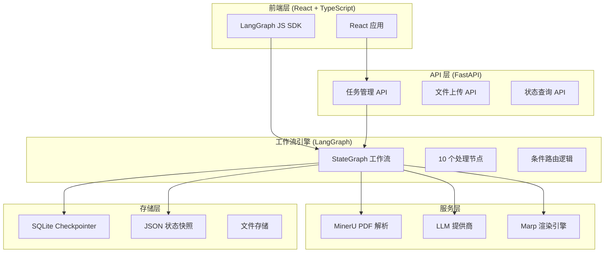

**设计要点**：
- 展示四层架构：前端、API、工作流、存储
- 突出 LangGraph 作为核心编排引擎
- 强调双存储机制（SQLite + JSON）
- 标注关键技术栈和协议

#### 图2：组件依赖关系图（详细）
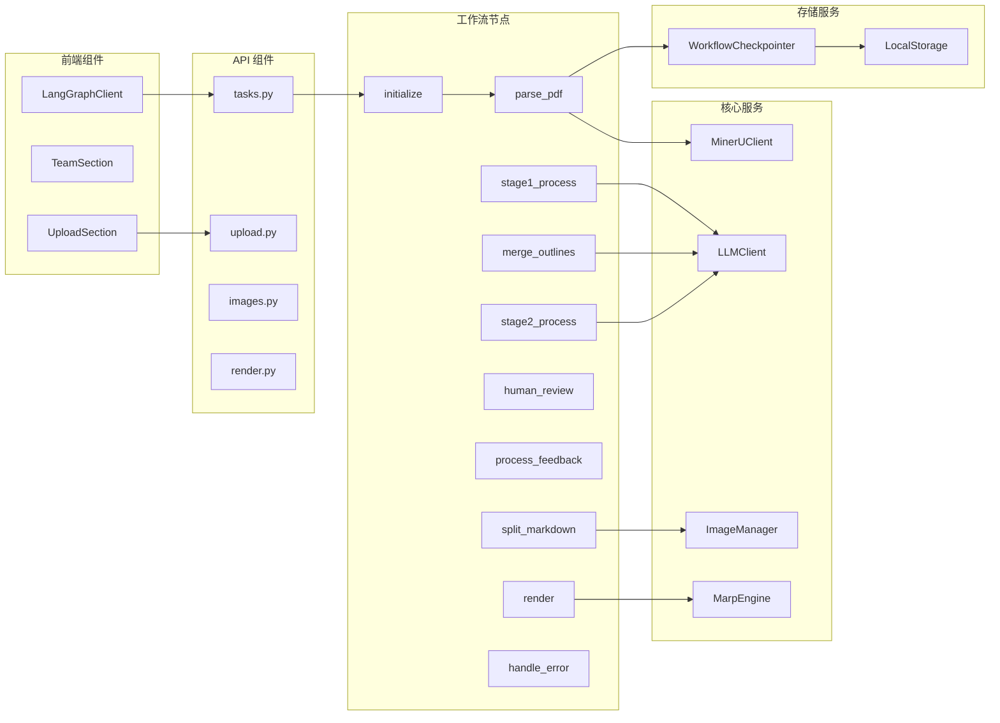

### 2.2 部署架构设计

#### 图3：部署架构图
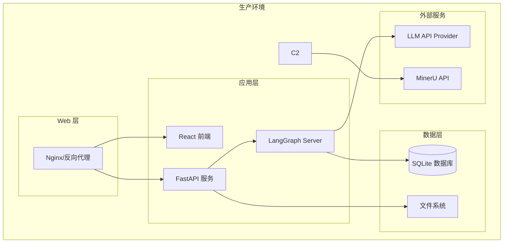

**文档内容要点**：
1. **服务划分**：前端、后端、工作流引擎的独立部署
2. **数据流向**：HTTP → FastAPI → LangGraph → 外部服务
3. **持久化策略**：SQLite + 文件系统的混合存储
4. **扩展性设计**：支持水平扩展的服务组件

### 2.3 技术栈深度分析

#### 关键技术选型对比

| 技术领域 | 选用方案 | 备选方案 | 选择理由 |
|---------|---------|---------|---------|
| 工作流引擎 | LangGraph | Apache Airflow, Temporal | 原生支持状态管理、图形化工作流、Python生态 |
| LLM 集成 | LangChain OpenAI | OpenAI SDK, Azure SDK | 统一接口、支持多种提供商、原生异步 |
| PDF 解析 | MinerU | PyPDF2, pdfplumber | 先进的视觉理解、表格和图像提取能力 |
| 状态存储 | SQLite + JSON | PostgreSQL, MongoDB | 轻量级、无需额外服务、快速原型开发 |
| 演示渲染 | Marp CLI | Reveal.js, Python-pptx | Markdown原生支持、高质量输出、主题丰富 |

---

## 第三部分：工作流详细分析方案

### 3.1 工作流流程图设计

#### 图4：完整工作流程图
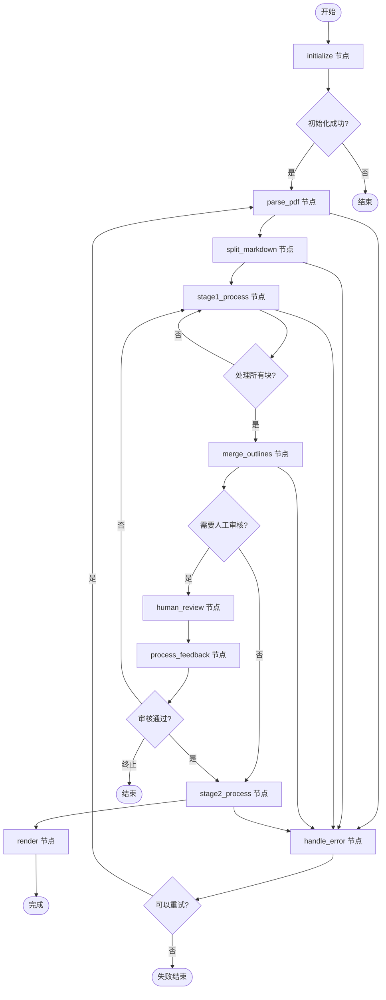

#### 图5：并行处理流程图
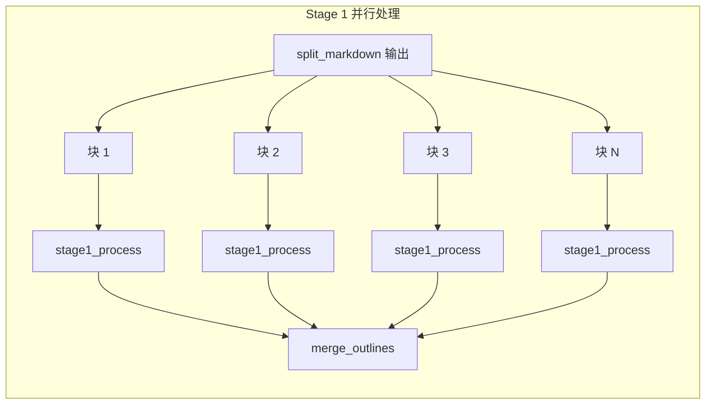

### 3.2 工作流节点详细分析

#### 节点 1：initialize
**文件位置**：`app/graph/nodes/initialization.py`

**功能说明**：
- 验证输入参数（PDF路径、样式设置等）
- 创建初始状态对象
- 设置任务元数据

**代码示例**：
```python
def node_initialize(state: WorkflowState) -> Dict[str, Any]:
    """Initialize task state with validation."""
    # 参数验证
    pdf_path = Path(state["pdf_path"])
    if not pdf_path.exists():
        raise FileNotFoundError(f"PDF file not found: {pdf_path}")
    
    # 创建初始状态
    return {
        "status": TaskStatus.PARSING.value,
        "current_step": "正在初始化任务",
        "progress_percentage": 5.0,
        "execution_log": [...],
    }
```

**状态转换**：
```
PENDING → PARSING (成功)
PENDING → FAILED (验证失败)
```

#### 节点 2：parse_pdf
**文件位置**：`app/graph/nodes/pdf_parsing.py`

**关键特性**：
- MinerU API 调用
- 图片提取和存储
- **Token化保护机制**

**Token化保护实现**：
```python
def node_parse_pdf(state: WorkflowState) -> Dict[str, Any]:
    # 1. 调用 MinerU 解析 PDF
    markdown_text = mineru_client.process_pdf(...)
    
    # 2. 立即进行图片 Token 化
    tokenized_text, image_token_map = image_manager.tokenize_image_references_enhanced(
        markdown_content=markdown_text,
        task_id=task_id
    )
    
    # 3. 返回 Token 化后的文本
    return {
        "tokenized_text": tokenized_text,
        "image_token_map": image_token_map,
        "token_count": len(image_token_map),
    }
```

**文档说明要点**：
1. **为什么需要 Token 化**：LLM 容易破坏图片哈希值
2. **Token 格式**：`[[TOKEN_IMG_001]]`
3. **映射关系**：Token ↔ 图片信息的双向映射
4. **恢复机制**：渲染前还原为实际路径

#### 节点 3-4：split_markdown & stage1_process
**文件位置**：
- `app/graph/nodes/text_splitting.py`
- `app/graph/nodes/stage1_processing.py`

**文本分块算法**：
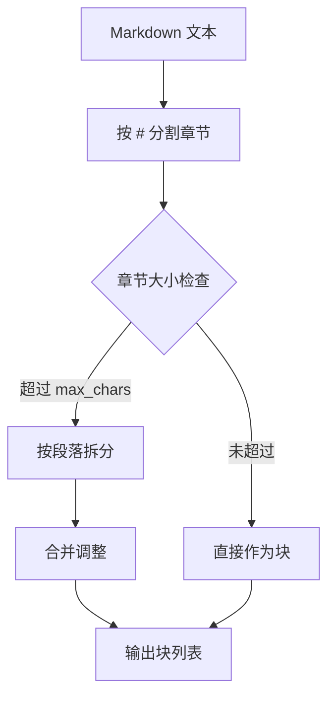

**Stage 1 并行处理**：
- 支持多块同时处理
- 失败块自动重试
- 结果聚合到 `stage1_results` 列表

#### 节点 5：merge_outlines
**文件位置**：`app/graph/nodes/outline_merging.py`

**合并策略**：
1. 按章节顺序聚合
2. 去重相似内容
3. 生成统一大纲结构

**代码示例**：
```python
async def node_merge_outlines(state: WorkflowState) -> Dict[str, Any]:
    # 收集所有 Stage 1 结果
    results = state["stage1_results"]
    
    # 调用 LLM 进行智能合并
    merged = await llm_client.acomplete(
        prompt=merge_prompt_template.format(
            outlines=[r["outline"] for r in results]
        )
    )
    
    # 判断是否需要人工审核
    needs_review = should_enable_human_review(state)
    
    return {
        "merged_outline": merged["content"],
        "status": TaskStatus.HUMAN_REVIEW.value if needs_review 
                 else TaskStatus.STAGE2_PROCESSING.value,
    }
```

#### 节点 6-7：human_review & process_feedback
**文件位置**：`app/graph/nodes/human_review.py`

**审核机制**：
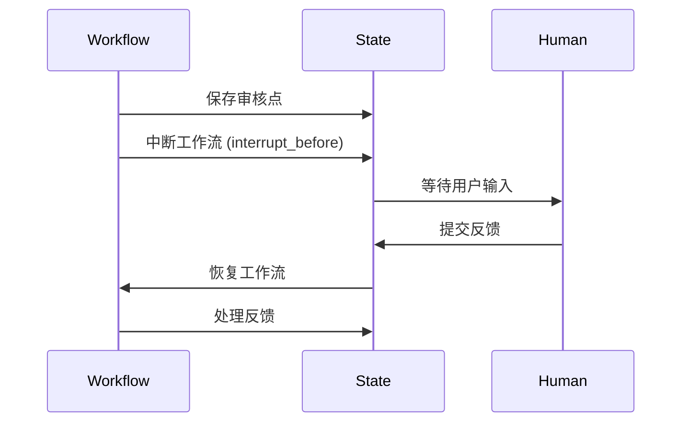

**反馈处理**：
```python
def node_process_feedback(state: WorkflowState) -> Dict[str, Any]:
    feedback = state["human_feedback"]
    
    if feedback["approved"]:
        return {"status": TaskStatus.STAGE2_PROCESSING.value}
    elif feedback["action"] == "regenerate":
        return {"status": TaskStatus.STAGE1_PROCESSING.value}
    else:
        return {"status": TaskStatus.FAILED.value}
```

#### 节点 8：stage2_process
**文件位置**：`app/graph/nodes/stage2_processing.py`

**Marp Markdown 生成**：
- 将大纲转换为 Marp 格式
- 应用主题样式
- 恢复图片 Token

#### 节点 9：render
**文件位置**：`app/graph/nodes/rendering.py`

**渲染流程**：
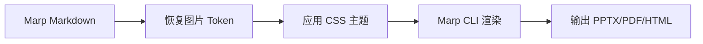

#### 节点 10：handle_error
**文件位置**：`app/graph/nodes/error_handling.py`

**重试机制**：
```python
def node_handle_error(state: WorkflowState) -> Dict[str, Any]:
    retry_count = state.get("retry_count", 0)
    max_retries = state.get("max_retries", 3)
    
    if retry_count < max_retries:
        # 重置到 Parsing 阶段
        return {
            "status": TaskStatus.PARSING.value,
            "retry_count": retry_count + 1,
        }
    else:
        # 标记为失败
        return {"status": TaskStatus.FAILED.value}
```

### 3.3 数据流分析

#### 数据流转图
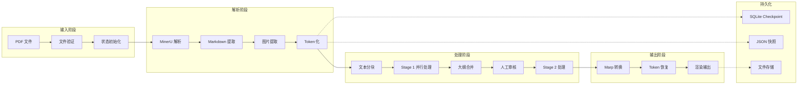

---

## 第四部分：API 接口文档方案

### 4.1 接口分类与组织

#### RESTful API 端点

**任务管理 API**（`app/api/tasks.py`）
```
POST   /api/tasks              # 创建任务
GET    /api/tasks/{task_id}    # 查询任务状态
POST   /api/tasks/{task_id}/resume  # 恢复任务
DELETE /api/tasks/{task_id}    # 删除任务
GET    /api/tasks              # 列出任务
```

**文件管理 API**（`app/api/upload.py`）
```
POST   /api/upload             # 上传 PDF 文件
GET    /api/files/{filename}   # 下载文件
DELETE /api/files/{filename}   # 删除文件
```

**图像服务 API**（`app/api/images.py`）
```
GET    /api/images/{task_id}/{filename}  # 获取图片
```

**渲染服务 API**（`app/api/render.py`）
```
GET    /api/render/{task_id}    # 获取渲染结果
POST   /api/render/{task_id}/rerender  # 重新渲染
```

### 4.2 接口详细规范

#### 创建任务接口

**请求示例**：
```json
POST /api/tasks
{
  "pdf_path": "/data/uploads/paper.pdf",
  "presentation_style": "academic",
  "max_chars": 8000,
  "target_chunks": 6,
  "output_format": "pptx",
  "enable_human_review": true,
  "custom_stage1_prompt": "自定义 Stage 1 提示词...",
  "custom_stage2_prompt": "自定义 Stage 2 提示词..."
}
```

**响应示例**：
```json
{
  "task_id": "task_20241221_001",
  "status": "pending",
  "message": "任务创建成功",
  "workflow_url": "http://localhost:8123/wf/task_20241221_001"
}
```

#### 状态查询接口

**响应示例**：
```json
{
  "task_id": "task_20241221_001",
  "status": "stage1_processing",
  "progress_percentage": 35.0,
  "current_step": "正在处理第 3/6 个文本块",
  "created_at": "2024-12-21T10:00:00",
  "updated_at": "2024-12-21T10:05:30",
  "needs_human_review": false,
  "review_points": [],
  "execution_log": [
    {
      "timestamp": "2024-12-21T10:00:01",
      "event": "pdf_parsing",
      "message": "PDF 解析成功"
    }
  ]
}
```

### 4.3 LangGraph SDK 集成

**前端调用示例**（`frontend/src/lib/langgraph.ts`）：
```typescript
import { Client } from "@langchain/langgraph-sdk";

const client = new Client({
  apiUrl: "http://localhost:8123",
  apiKey: "your-api-key", // 可选
});

// 创建任务
const workflow = client.workflow.compileGraph({
  workflow: "scholarflow",
  config: {
    configurable: {
      thread_id: "my-thread-123",
    }
  }
});

// 启动工作流
const result = await client.workflow.run({
  graphName: "scholarflow",
  input: initialState,
  config: {
    configurable: {
      thread_id: "my-thread-123",
    }
  }
});
```

---

## 第五部分：技术深度章节方案

### 5.1 状态管理机制深度解析

#### WorkflowState 数据模型

**完整状态定义**（`app/graph/state.py:65`）：
```python
class WorkflowState(TypedDict, total=False):
    """完整的 workflow 状态数据模型."""
    
    # ===== 基本信息 =====
    task_id: str
    status: str  # TaskStatus 枚举值
    created_at: str
    updated_at: str
    
    # ===== 输入参数 =====
    pdf_path: str
    presentation_style: str
    max_chars: int
    target_chunks: int
    output_format: str
    
    # ===== 解析结果 =====
    markdown_text: str
    markdown_path: str
    image_paths: List[str]
    
    # ===== Token 管理 =====
    tokenized_text: str
    image_token_map: Dict[str, Dict[str, str]]
    token_count: int
    
    # ===== 分块处理 =====
    chunks: List[ChunkData]
    chunks_count: int
    
    # ===== Stage 1 结果 =====
    stage1_results: List[Stage1Result]
    stage1_completed: int
    
    # ===== 合并结果 =====
    merged_outline: str
    
    # ===== Stage 2 结果 =====
    marp_markdown: str
    
    # ===== 渲染结果 =====
    output_path: str
    
    # ===== 人机交互 =====
    needs_human_review: bool
    human_feedback: Dict[str, Any]
    
    # ===== 错误处理 =====
    error_message: str
    retry_count: int
    max_retries: int
```

**状态流转图**：
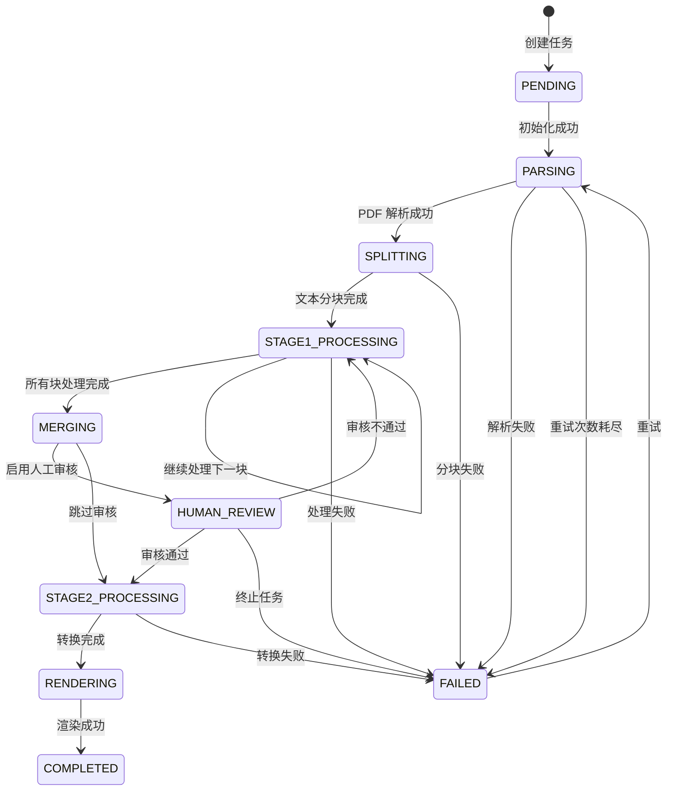

#### 双存储机制

**SQLite Checkpointer**（`app/storage/checkpointer.py`）：
```python
class WorkflowCheckpointer:
    """基于 SQLite 的工作流状态持久化."""
    
    def __init__(self, db_path: str):
        self.db_path = Path(db_path)
        # 使用 AsyncSqliteSaver 进行状态持久化
        self._saver_cm = AsyncSqliteSaver.from_conn_string(str(self.db_path))
        
    async def initialize(self):
        """异步初始化连接."""
        self._saver = await self._saver_cm.__aenter__()
        
    @property
    def saver(self):
        """返回 LangGraph 集成的 saver."""
        return self._saver
```

**JSON 快速访问**（`app/storage/local_storage.py`）：
```python
class LocalStorage:
    """JSON 文件存储，用于快速状态查询."""
    
    def save_state(self, task_id: str, state: WorkflowState):
        """保存状态快照到 JSON 文件."""
        task_dir = Path("data/workflows/tasks")
        task_dir.mkdir(parents=True, exist_ok=True)
        
        with open(task_dir / f"{task_id}.json", 'w') as f:
            json.dump(state, f, ensure_ascii=False, indent=2)
            
    def load_state(self, task_id: str) -> Optional[WorkflowState]:
        """从 JSON 文件加载状态快照."""
        task_file = Path("data/workflows/tasks") / f"{task_id}.json"
        if task_file.exists():
            with open(task_file, 'r') as f:
                return json.load(f)
        return None
```

**存储策略对比**：
| 存储方式 | 用途 | 优点 | 缺点 |
|---------|-----|------|------|
| SQLite | LangGraph checkpoint | 版本控制、可靠持久化 | 查询复杂 |
| JSON | 快速访问 | 简单、人类可读 | 无版本管理 |

### 5.2 图片 Token 化保护机制

#### 三阶段保护策略

**阶段 1：Token 化**（PDF 解析后）
```python
def tokenize_image_references_enhanced(
    self, 
    markdown_content: str, 
    task_id: str
) -> Tuple[str, Dict[str, Dict[str, str]]]:
    """将图片引用转换为 Token."""
    
    # 匹配 Markdown 图片语法: 
    pattern = r'!\[([^\]]*)\]\(images/([^)]+)\)'
    
    def replace_with_token(match):
        nonlocal token_count
        alt_text = match.group(1)
        filename = match.group(2)
        hash_value = filename.split('.')[0]
        
        token = f"[[TOKEN_IMG_{token_count:03d}]]"
        
        # 记录 Token 映射
        token_map[token] = {
            "hash": hash_value,
            "alt_text": alt_text,
            "filename": filename,
            "original_path": f"images/{filename}"
        }
        
        token_count += 1
        return f""
    
    tokenized_text = re.sub(pattern, replace_with_token, markdown_content)
    return tokenized_text, token_map
```

**阶段 2：LLM 处理保护**
在提示词中加入保护指令：
```
⚠️ 重要：图片 Token 保护规则
- 绝对不要修改 Token 格式 [[TOKEN_IMG_001]]
- 绝对不要将 Token 转换为其他形式
- 绝对不要删除或省略任何 Token
- 绝对不要将 Token 展开为完整路径
- 必须保持所有 Token 的完整性和数量
```

**阶段 3：Token 恢复**（渲染前）
```python
def restore_tokens_to_markdown_enhanced(
    self,
    tokenized_content: str,
    token_map: Dict[str, Dict[str, str]],
    output_format: str
) -> str:
    """将 Token 恢复为实际图片引用."""
    
    def replace_token(match):
        token = match.group(0)  # 完整的 [[TOKEN_IMG_XXX]]
        if token in token_map:
            info = token_map[token]
            if output_format == 'marp':
                return f"![{info['alt_text']}](images/{info['filename']})"
            else:
                return f"![{info['alt_text']}]({info['filename']})"
        return token  # 如果找不到，保持原样
    
    # 使用正则匹配所有 Token
    pattern = r'\[\[TOKEN_IMG_\d{3}\]\]'
    restored_text = re.sub(pattern, replace_token, tokenized_content)
    return restored_text
```

**Token 化流程图**：
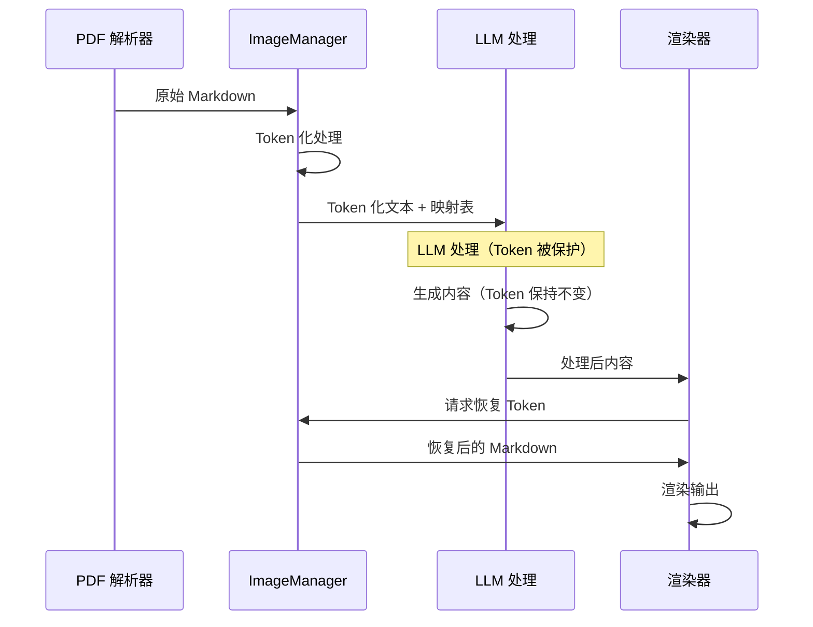

### 5.3 LLM 集成与调用机制

#### 多提供商支持

**配置优先级**（`app/core/config.py:47`）：
```python
def get_settings() -> Settings:
    return Settings(
        # LLM 配置 - 支持多种提供商
        llm_api_key=(
            os.getenv("LLM_API_KEY") or 
            os.getenv("OPENAI_API_KEY") or 
            os.getenv("DEEPSEEK_API_KEY")
        ),
        llm_base_url=(
            os.getenv("LLM_BASE_URL") or 
            os.getenv("OPENAI_BASE_URL") or 
            os.getenv("DEEPSEEK_BASE_URL", "https://api.deepseek.com")
        ),
        llm_model=(
            os.getenv("LLM_MODEL") or 
            os.getenv("OPENAI_MODEL") or 
            os.getenv("DEEPSEEK_MODEL", "deepseek-chat")
        ),
    )
```

**提供商适配**：
```python
class LLMClient:
    """统一的 LLM 客户端，支持多种 OpenAI 兼容 API."""
    
    def __init__(self):
        settings = get_settings()
        
        # 初始化 LangChain ChatOpenAI 客户端
        self._client = ChatOpenAI(
            api_key=settings.llm_api_key,
            base_url=settings.llm_base_url,
            model=settings.llm_model,
            max_tokens=settings.llm_max_tokens,
            temperature=settings.llm_temperature,
            request_timeout=300,
            max_retries=3,
        )
```

**异步调用示例**：
```python
async def acall_model(
    prompt: str,
    task_id: str = None,
    stage: str = "unknown"
) -> Dict[str, Any]:
    """异步调用 LLM，支持日志记录."""
    
    start_time = time.time()
    
    try:
        # 构建消息
        messages = [
            SystemMessage(content=load_global_system_prompt()),
            HumanMessage(content=prompt)
        ]
        
        # 调用 API
        response = await client.ainvoke(messages)
        
        # 计算耗时
        duration_ms = (time.time() - start_time) * 1000
        
        # 保存日志
        if task_id:
            save_llm_call_log(
                task_id=task_id,
                stage=stage,
                request={"prompt": prompt},
                response={"content": response.content},
                duration_ms=duration_ms
            )
        
        return {
            "content": response.content,
            "usage": response.usage_metadata,
        }
        
    except Exception as e:
        # 错误日志
        if task_id:
            save_error_log(task_id, stage, prompt, str(e))
        raise
```

#### 提示词模板系统

**动态加载机制**（`app/services/llm/prompts/prompt_templates.py`）：
```python
class PromptTemplateManager:
    """提示词模板管理器，支持预设和自定义模板."""
    
    def __init__(self):
        self._load_preset_templates()
    
    def load_template(self, stage: str, style: str, task_id: str = None):
        """加载提示词模板（优先级：自定义 > 预设）."""
        
        # 1. 尝试加载自定义模板
        if task_id:
            custom = self.load_custom_templates(task_id)
            if custom.get(stage):
                return custom[stage]
        
        # 2. 加载预设模板
        preset_key = f"{stage}_{style}"
        return self._preset_templates.get(preset_key, "")
```

**Stage 1 提示词结构**：
```jinja2
你是一个专业的学术演示文稿大纲生成专家。

## 任务说明
请根据提供的学术论文内容，生成适合演示的大纲结构。

## 输入内容
标题：{{ chunk_title }}
内容：
{{ chunk_text }}

## 演示风格
样式：{{ presentation_style }}

## 输出要求
1. 生成 3-5 张幻灯片的大纲
2. 每张幻灯片包含：
   - 标题（简洁有力）
   - 要点（3-5 个）
   - 建议的图片类型（可选）

## 格式要求
使用 Markdown 格式，结构清晰。

## 重要提醒
⚠️ 图片 Token 保护：
- 不要修改或删除 [[TOKEN_IMG_XXX]] 格式
- 必须保持所有 Token 的完整性
- 绝对不要将 Token 转换为其他形式

请开始生成：
```

### 5.4 错误处理与恢复策略

#### 多层错误处理机制

**节点级错误捕获**：
```python
def node_stage1_process(state: WorkflowState) -> Dict[str, Any]:
    """Stage 1 处理节点，包含错误处理."""
    
    try:
        current_chunk_index = state["current_chunk_index"]
        chunks = state["chunks"]
        
        if current_chunk_index >= len(chunks):
            return {"status": TaskStatus.MERGING.value}
        
        chunk = chunks[current_chunk_index]
        
        # 调用 LLM 处理
        result = asyncio.run(llm_processing(chunk))
        
        return {
            "stage1_results": [..., result],
            "current_chunk_index": current_chunk_index + 1,
        }
        
    except Exception as e:
        # 记录错误并继续（不中断整个流程）
        error_result = {
            "chunk_id": chunk["id"],
            "success": False,
            "error": str(e),
        }
        
        return {
            "stage1_results": [..., error_result],
            "current_chunk_index": current_chunk_index + 1,
            "stage1_failed": [..., chunk["id"]],
        }
```

**全局错误处理节点**：
```python
def node_handle_error(state: WorkflowState) -> Dict[str, Any]:
    """全局错误处理和重试逻辑."""
    
    retry_count = state.get("retry_count", 0)
    max_retries = state.get("max_retries", 3)
    error_message = state.get("error_message", "")
    
    # 记录错误日志
    log_entry = {
        "timestamp": datetime.now().isoformat(),
        "event": "error_handling",
        "error": error_message,
        "retry_count": retry_count,
    }
    
    if retry_count < max_retries:
        # 可以重试 - 重置到 Parsing 阶段
        return {
            "status": TaskStatus.PARSING.value,
            "retry_count": retry_count + 1,
            "error_message": "",
            "current_step": f"正在重试 ({retry_count + 1}/{max_retries})",
            "progress_percentage": 5.0,
            "execution_log": [..., log_entry],
        }
    else:
        # 重试次数耗尽 - 标记失败
        return {
            "status": TaskStatus.FAILED.value,
            "error_message": f"重试 {max_retries} 次后仍然失败: {error_message}",
            "current_step": "任务失败",
            "execution_log": [..., log_entry],
        }
```

#### 错误类型与处理策略

| 错误类型 | 触发场景 | 处理策略 | 重试次数 |
|---------|---------|---------|---------|
| PDF 解析失败 | MinerU API 调用失败 | 记录错误，可重试 | 3 次 |
| LLM 调用失败 | API 超时、限流 | 指数退避重试 | 3 次 |
| 文件不存在 | PDF 文件路径错误 | 立即失败，不重试 | 0 次 |
| 磁盘空间不足 | 存储文件时失败 | 立即失败，不重试 | 0 次 |
| 图片 Token 错误 | Token 格式不正确 | 立即失败，不重试 | 0 次 |

---

## 第六部分：配置管理与部署方案

### 6.1 环境变量配置

#### 核心配置项（`app/core/config.py`）

**LLM 提供商配置**：
```bash
# OpenAI
LLM_API_KEY=sk-xxx
LLM_BASE_URL=https://api.openai.com/v1
LLM_MODEL=gpt-4

# DeepSeek
LLM_API_KEY=sk-xxx
LLM_BASE_URL=https://api.deepseek.com/v1
LLM_MODEL=deepseek-chat

# Kimi (Paratera)
LLM_API_KEY=sk-xxx
LLM_BASE_URL=https://llmapi.paratera.com/v1
LLM_MODEL=Kimi-K2
```

**MinerU 配置**：
```bash
MINERU_API_KEY=your_mineru_api_key
MINERU_ENDPOINT=https://api.opendatalab.org.cn
```

**存储配置**：
```bash
STORAGE_BACKEND=local  # local | s3
DATA_DIR=data
SQLITE_DB_PATH=data/workflows/checkpoints.db
```

**服务配置**：
```bash
# FastAPI
FASTAPI_HOST=0.0.0.0
FASTAPI_PORT=8000

# LangGraph
LANGGRAPH_HOST=0.0.0.0
LANGGRAPH_PORT=8123

# Marp
MARP_THEME=academic  # academic | business | minimal
```

### 6.2 部署架构设计

#### Docker 部署方案

**Dockerfile**：
```dockerfile
FROM python:3.12-slim

# 安装系统依赖
RUN apt-get update && apt-get install -y \
    nodejs \
    npm \
    git \
    && rm -rf /var/lib/apt/lists/*

# 安装 Marp CLI
RUN npm install -g @marp-team/marp-cli

# 安装 Python 依赖
COPY pyproject.toml uv.lock ./
RUN pip install uv && uv sync --no-dev

# 复制应用代码
COPY . /app
WORKDIR /app

# 暴露端口
EXPOSE 8000 8123

# 启动命令
CMD ["uvicorn", "app.api.main:app", "--host", "0.0.0.0", "--port", "8000"]
```

**docker-compose.yml**：
```yaml
version: '3.8'

services:
  scholarflow-api:
    build: .
    ports:
      - "8000:8000"
      - "8123:8123"
    volumes:
      - ./data:/app/data
      - ./.env:/app/.env
    environment:
      - FASTAPI_HOST=0.0.0.0
      - FASTAPI_PORT=8000
      - LANGGRAPH_HOST=0.0.0.0
      - LANGGRAPH_PORT=8123
    depends_on:
      - redis
      - nginx

  redis:
    image: redis:7-alpine
    ports:
      - "6379:6379"

  nginx:
    image: nginx:alpine
    ports:
      - "80:80"
    volumes:
      - ./nginx.conf:/etc/nginx/nginx.conf
```

#### Kubernetes 部署方案

**deployment.yaml**：
```yaml
apiVersion: apps/v1
kind: Deployment
metadata:
  name: scholarflow
spec:
  replicas: 3
  selector:
    matchLabels:
      app: scholarflow
  template:
    metadata:
      labels:
        app: scholarflow
    spec:
      containers:
      - name: scholarflow
        image: scholarflow:latest
        ports:
        - containerPort: 8000
        - containerPort: 8123
        env:
        - name: LLM_API_KEY
          valueFrom:
            secretKeyRef:
              name: llm-secrets
              key: api-key
        resources:
          requests:
            memory: "2Gi"
            cpu: "1000m"
          limits:
            memory: "4Gi"
            cpu: "2000m"
        volumeMounts:
        - name: data-volume
          mountPath: /app/data
      volumes:
      - name: data-volume
        persistentVolumeClaim:
          claimName: scholarflow-data
```

---

## 第七部分：测试策略与质量保障

### 7.1 测试架构设计

#### 测试分类体系

| 测试类型 | 覆盖范围 | 测试工具 | 执行频率 |
|---------|---------|---------|---------|
| 单元测试 | 单个函数/类 | pytest | 每次提交 |
| 集成测试 | 组件间交互 | pytest + testcontainers | 每日构建 |
| 端到端测试 | 完整工作流 | pytest + Playwright | 每次发布 |
| 性能测试 | 负载和性能 | Locust | 每周 |
| 回归测试 | 历史功能 | pytest | 每次发布前 |

#### 单元测试示例

**工作流测试**（`tests/test_workflow.py`）：
```python
import pytest
from app.graph.workflow import create_workflow, run_workflow
from app.graph.state import create_initial_state, TaskStatus

@pytest.mark.asyncio
async def test_full_workflow():
    """测试完整工作流程."""
    
    # 创建初始状态
    state = create_initial_state(
        task_id="test_001",
        pdf_path="data/test_papers/sample.pdf",
        presentation_style="academic",
        max_chars=8000,
        target_chunks=3,
    )
    
    # 执行工作流
    result = await run_workflow(state, thread_id="test_thread_001")
    
    # 断言结果
    assert result["status"] == TaskStatus.COMPLETED.value
    assert result["output_path"] != ""
    assert len(result["stage1_results"]) == 3
```

**状态管理测试**（`tests/test_state.py`）：
```python
def test_workflow_state_creation():
    """测试工作流状态创建."""
    
    state = create_initial_state(
        task_id="test_001",
        pdf_path="/path/to/test.pdf",
    )
    
    # 验证字段
    assert state["task_id"] == "test_001"
    assert state["status"] == TaskStatus.PENDING.value
    assert state["pdf_path"] == "/path/to/test.pdf"
    assert isinstance(state["chunks"], list)
    assert isinstance(state["stage1_results"], list)
```

**Token 化测试**（`tests/test_tokenization.py`）：
```python
def test_tokenize_image_references():
    """测试图片 Token 化功能."""
    
    markdown = """
    # 标题
    
    这里有一张图片：
    
    
    还有另一张：
    
    """
    
    manager = ImageManager(Path("/tmp/test"))
    tokenized, token_map = manager.tokenize_image_references_enhanced(
        markdown, "test_task"
    )
    
    # 验证 Token 生成
    assert "[[TOKEN_IMG_001]]" in tokenized
    assert "[[TOKEN_IMG_002]]" in tokenized
    
    # 验证映射表
    assert len(token_map) == 2
    assert token_map["[[TOKEN_IMG_001]]"]["filename"] == "abc123.jpg"
    assert token_map["[[TOKEN_IMG_001]]"]["hash"] == "abc123"
```

#### 集成测试示例

**API 集成测试**（`tests/test_api.py`）：
```python
from fastapi.testclient import TestClient
from app.api.main import app

client = TestClient(app)

def test_create_task():
    """测试任务创建接口."""
    
    response = client.post("/api/tasks", json={
        "pdf_path": "/data/test.pdf",
        "presentation_style": "academic",
    })
    
    assert response.status_code == 200
    data = response.json()
    assert "task_id" in data
    assert data["status"] == "pending"

def test_get_task_status():
    """测试任务状态查询接口."""
    
    # 先创建任务
    create_response = client.post("/api/tasks", json={
        "pdf_path": "/data/test.pdf",
    })
    task_id = create_response.json()["task_id"]
    
    # 查询状态
    status_response = client.get(f"/api/tasks/{task_id}")
    assert status_response.status_code == 200
    
    data = status_response.json()
    assert data["task_id"] == task_id
    assert "status" in data
```

### 7.2 测试覆盖率要求

#### 覆盖率目标

| 模块 | 覆盖率要求 | 关键测试点 |
|-----|-----------|---------|
| 工作流节点 | ≥ 95% | 状态转换、错误处理 |
| 状态管理 | ≥ 90% | 状态创建、更新、持久化 |
| LLM 集成 | ≥ 85% | 同步/异步调用、错误重试 |
| Token 化 | ≥ 95% | Token 生成、映射、恢复 |
| API 接口 | ≥ 90% | 请求/响应验证、错误处理 |
| 存储层 | ≥ 85% | SQLite、JSON 操作 |

#### 代码覆盖率报告

**pytest-cov 配置**（`pyproject.toml`）：
```toml
[tool.pytest.ini_options]
addopts = "--cov=app --cov-report=html --cov-report=term --cov-report=xml"

[tool.coverage.run]
source = ["app"]
omit = [
    "*/tests/*",
    "*/venv/*",
    "*/__pycache__/*",
]
```

**运行覆盖率测试**：
```bash
# 生成覆盖率报告
pytest --cov=app --cov-report=html

# 查看覆盖率
open htmlcov/index.html
```

---

## 第八部分：性能优化方案

### 8.1 性能瓶颈分析

#### 性能热点识别

| 阶段 | 耗时占比 | 优化策略 |
|-----|---------|---------|
| PDF 解析 | 30-40% | 并行解析、缓存结果 |
| LLM 调用 | 40-50% | 批处理、并发调用 |
| 文本分块 | 5-10% | 优化算法、减少 I/O |
| 渲染输出 | 10-15% | 异步渲染、模板缓存 |

#### 并发优化

**Stage 1 并行处理**：
```python
async def node_stage1_process(state: WorkflowState) -> Dict[str, Any]:
    """Stage 1 并行处理多个文本块."""
    
    chunks = state["chunks"]
    completed_results = state.get("stage1_results", [])
    
    # 收集未处理的块
    remaining_chunks = [
        chunk for chunk in chunks 
        if not any(r["chunk_id"] == chunk["id"] for r in completed_results)
    ]
    
    if not remaining_chunks:
        return {"status": TaskStatus.MERGING.value}
    
    # 并发处理（最多 5 个并发）
    semaphore = asyncio.Semaphore(5)
    
    async def process_chunk(chunk):
        async with semaphore:
            return await llm_process_chunk(chunk)
    
    # 执行并发处理
    tasks = [process_chunk(chunk) for chunk in remaining_chunks]
    new_results = await asyncio.gather(*tasks, return_exceptions=True)
    
    # 聚合结果
    all_results = completed_results + [
        r for r in new_results if not isinstance(r, Exception)
    ]
    
    failed_chunks = [
        chunk["id"] for chunk in remaining_chunks
        if any(
            isinstance(new_results[i], Exception) 
            for i, c in enumerate(remaining_chunks)
            if c["id"] == chunk["id"]
        )
    ]
    
    return {
        "stage1_results": all_results,
        "stage1_failed": state.get("stage1_failed", []) + failed_chunks,
        "current_chunk_index": len(all_results),
    }
```

#### 缓存优化

**Prompt 模板缓存**：
```python
from functools import lru_cache

class PromptTemplateManager:
    """提示词模板管理器（带缓存）."""
    
    @lru_cache(maxsize=128)
    def load_template_cached(self, stage: str, style: str) -> str:
        """缓存提示词模板加载."""
        key = f"{stage}_{style}"
        return self._preset_templates.get(key, "")
```

**MinerU 结果缓存**：
```python
import hashlib
import pickle

def get_pdf_cache_key(pdf_path: str, model_version: str) -> str:
    """生成 PDF 缓存键."""
    content = Path(pdf_path).read_bytes()
    hash_value = hashlib.md5(content).hexdigest()
    return f"{hash_value}_{model_version}"

def load_cached_result(cache_key: str) -> Optional[Tuple[str, List[str]]]:
    """加载缓存的解析结果."""
    cache_file = Path(f"data/cache/{cache_key}.pkl")
    if cache_file.exists():
        with open(cache_file, 'rb') as f:
            return pickle.load(f)
    return None

def save_cached_result(cache_key: str, markdown: str, images: List[str]):
    """保存解析结果到缓存."""
    cache_file = Path(f"data/cache/{cache_key}.pkl")
    cache_file.parent.mkdir(parents=True, exist_ok=True)
    
    with open(cache_file, 'wb') as f:
        pickle.dump((markdown, images), f)
```

### 8.2 内存优化

#### 大文件处理

**流式读取 PDF**：
```python
from pathlib import Path

def process_large_pdf(pdf_path: Path) -> Iterator[str]:
    """流式处理大型 PDF，避免内存溢出."""
    
    # 分块读取，避免一次性加载整个文件
    chunk_size = 1024 * 1024  # 1MB chunks
    
    with open(pdf_path, 'rb') as f:
        while True:
            chunk = f.read(chunk_size)
            if not chunk:
                break
            yield chunk.decode('utf-8', errors='ignore')
```

**状态数据压缩**：
```python
import json
import zlib

def compress_state(state: WorkflowState) -> bytes:
    """压缩状态数据以减少内存占用."""
    json_str = json.dumps(state, ensure_ascii=False)
    return zlib.compress(json_str.encode('utf-8'))

def decompress_state(compressed: bytes) -> WorkflowState:
    """解压缩状态数据."""
    json_str = zlib.decompress(compressed).decode('utf-8')
    return json.loads(json_str)
```

---

## 第九部分：监控与日志方案

### 9.1 日志架构设计

#### 日志分级与输出

**日志级别定义**：
```python
import logging

# 配置日志格式
LOG_FORMAT = "%(asctime)s - %(name)s - %(levelname)s - %(message)s"

# 日志级别
DEBUG = 10    # 详细调试信息
INFO = 20     # 一般信息
WARNING = 30  # 警告信息
ERROR = 40    # 错误信息
CRITICAL = 50 # 严重错误

# 输出目标
CONSOLE = "console"  # 控制台
FILE = "file"        # 文件
REMOTE = "remote"    # 远程日志服务
```

**工作流执行日志**：
```python
def log_workflow_event(state: WorkflowState, event: str, message: str):
    """记录工作流事件."""
    
    log_entry = {
        "timestamp": datetime.now().isoformat(),
        "task_id": state["task_id"],
        "event": event,
        "message": message,
        "status": state["status"],
        "progress": state.get("progress_percentage", 0),
    }
    
    # 添加到执行日志
    execution_log = state.get("execution_log", [])
    execution_log.append(log_entry)
    
    # 输出到日志系统
    logging.info(f"Workflow [{state['task_id']}] {event}: {message}")
    
    return {"execution_log": execution_log}
```

**LLM 调用日志**（`app/services/llm/provider.py:34`）：
```python
def save_llm_call_log(
    task_id: str,
    stage: str,
    request: Dict[str, Any],
    response: Dict[str, Any],
    duration_ms: float,
):
    """保存详细的 LLM 调用日志."""
    
    log_entry = {
        "timestamp": datetime.now().isoformat(),
        "task_id": task_id,
        "stage": stage,
        "duration_ms": duration_ms,
        "request": {
            "prompt_length": len(request.get("prompt", "")),
            "model": request.get("model"),
            "max_tokens": request.get("max_tokens"),
        },
        "response": {
            "content_length": len(response.get("content", "")),
            "usage": response.get("usage", {}),
            "finish_reason": response.get("finish_reason"),
        }
    }
    
    # 保存到 JSONL 文件
    log_file = Path(f"data/logs/llm_calls_{stage}.jsonl")
    log_file.parent.mkdir(parents=True, exist_ok=True)
    
    with open(log_file, 'a', encoding='utf-8') as f:
        f.write(json.dumps(log_entry, ensure_ascii=False) + '\n')
```

### 9.2 监控指标设计

#### 关键性能指标（KPI）

**工作流级别指标**：
```python
class WorkflowMetrics:
    """工作流性能指标收集."""
    
    def __init__(self):
        self.total_tasks = 0
        self.completed_tasks = 0
        self.failed_tasks = 0
        self.average_duration = 0
        
    def record_task_completion(self, duration: float):
        """记录任务完成."""
        self.completed_tasks += 1
        self.total_tasks += 1
        
        # 更新平均耗时
        self.average_duration = (
            (self.average_duration * (self.completed_tasks - 1) + duration) 
            / self.completed_tasks
        )
    
    def record_task_failure(self):
        """记录任务失败."""
        self.failed_tasks += 1
        self.total_tasks += 1
    
    def get_metrics(self) -> Dict[str, Any]:
        """获取当前指标."""
        success_rate = (
            self.completed_tasks / self.total_tasks * 100 
            if self.total_tasks > 0 else 0
        )
        
        return {
            "total_tasks": self.total_tasks,
            "completed_tasks": self.completed_tasks,
            "failed_tasks": self.failed_tasks,
            "success_rate": success_rate,
            "average_duration_seconds": self.average_duration,
        }
```

**阶段级指标**：
```python
def record_stage_metrics(stage_name: str, duration: float, success: bool):
    """记录各阶段性能指标."""
    
    metrics = {
        "stage": stage_name,
        "duration_ms": duration * 1000,
        "success": success,
        "timestamp": datetime.now().isoformat(),
    }
    
    # 输出到 Prometheus 格式
    print(f"scholarflow_stage_duration_ms {duration * 1000}")
    print(f"scholarflow_stage_success 1" if success else "scholarflow_stage_success 0")
    
    return metrics
```

#### 告警规则设计

**Prometheus 告警规则**（`monitoring/alerts.yml`）：
```yaml
groups:
- name: scholarflow
  rules:
  
  # 工作流失败率告警
  - alert: WorkflowFailureRateHigh
    expr: |
      (
        scholarflow_workflow_failed_total / 
        scholarflow_workflow_total
      ) * 100 > 10
    for: 5m
    labels:
      severity: warning
    annotations:
      summary: "工作流失败率过高"
      description: "过去5分钟内工作流失败率超过10%"
  
  # LLM 调用超时告警
  - alert: LLMCallTimeoutHigh
    expr: |
      scholarflow_llm_call_duration_ms > 30000
    for: 2m
    labels:
      severity: critical
    annotations:
      summary: "LLM 调用超时"
      description: "LLM 调用耗时超过30秒"
  
  # 任务队列积压告警
  - alert: TaskQueueBacklog
    expr: scholarflow_pending_tasks > 50
    for: 10m
    labels:
      severity: warning
    annotations:
      summary: "任务队列积压"
      description: "待处理任务数量超过50个"
```

---

## 第十部分：实施计划与时间表

### 10.1 文档编写计划

#### 阶段划分与时间安排

| 阶段 | 内容 | 预计工期 | 交付物 |
|-----|-----|---------|-------|
| **阶段一** | 系统概览与架构设计 | 1 天 | 1-3 章草稿 |
| **阶段二** | 核心机制深度解析 | 1.5 天 | 4-7 章草稿 |
| **阶段三** | 功能模块实现细节 | 1 天 | 8-13 章草稿 |
| **阶段四** | 接口与服务文档 | 0.5 天 | 14-16 章草稿 |
| **阶段五** | 测试与质量保障 | 0.5 天 | 17-19 章草稿 |
| **阶段六** | 整合与优化 | 0.5 天 | 完整文档 v1.0 |
| **总计** | | **4 天** | **150-200 页** |

#### 每日工作计划

**第 1 天：系统概览**
- [x] 上午（4h）：阅读代码、分析架构、设计章节结构
- [x] 下午（4h）：编写第 1-3 章、绘制系统架构图

**第 2 天：核心机制**
- [ ] 上午（4h）：深度分析工作流、状态管理机制
- [ ] 下午（4h）：编写第 4-7 章、绘制流程图

**第 3 天：功能模块**
- [ ] 上午（4h）：分析各功能模块、Token 化机制
- [ ] 下午（4h）：编写第 8-13 章、生成代码示例

**第 4 天：整合发布**
- [ ] 上午（3h）：API 文档、测试策略
- [ ] 下午（3h）：整合、审校、格式化、发布

### 10.2 质量保证措施

#### 文档质量标准

1. **准确性**：技术细节必须与代码实现一致
2. **完整性**：覆盖系统的所有关键组件
3. **可读性**：语言清晰、结构合理、示例丰富
4. **实用性**：提供可操作的指导和最佳实践
5. **时效性**：反映最新代码版本和功能

#### 审校流程

**初审**（技术准确性）：
- 核对代码实现
- 验证架构描述
- 检查示例正确性

**复审**（可读性）：
- 语言表达优化
- 结构逻辑梳理
- 格式统一规范

**终审**（完整性）：
- 全书一致性检查
- 交叉引用验证
- 最终格式化

### 10.3 风险应对

#### 潜在风险与应对策略

| 风险 | 影响 | 应对措施 |
|-----|-----|---------|
| 代码理解不深入 | 文档准确性下降 | 增加代码阅读时间、请教核心开发者 |
| 图表制作耗时 | 进度延误 | 使用模板、简化图表、优先核心图 |
| 技术细节过多 | 文档冗长 | 控制粒度、提供链接、分离附录 |
| 时间压力 | 质量下降 | 预留缓冲期、聚焦核心内容 |

#### 应急预案

**进度延误**：
- 压缩非核心章节内容
- 减少图表数量
- 延后详细示例编写

**质量不达标**：
- 增加审校轮次
- 邀请技术专家评审
- 优先保证核心章节质量

---

## 第十一部分：图表与示例生成策略

### 11.1 图表类型与工具

#### Mermaid 图表设计

**架构图**：
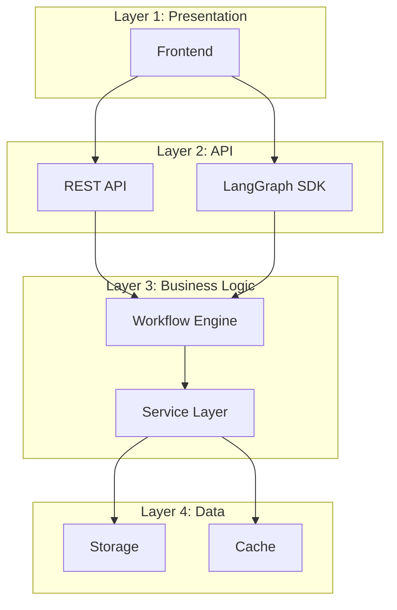

**流程图**：
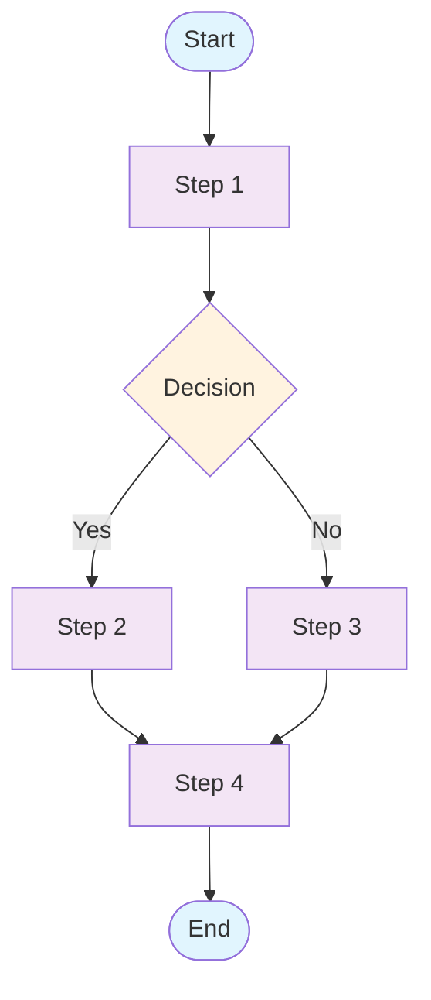

**时序图**：
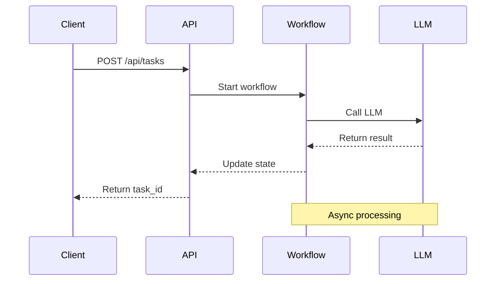

#### 图表设计原则

1. **清晰性**：避免过度复杂，每个图聚焦单一主题
2. **一致性**：统一的颜色、字体、图标风格
3. **可读性**：适当的留白、清晰的标签
4. **准确性**：与代码实现保持一致

### 11.2 代码示例规划

#### 示例分类

**入门示例**（基础使用）：
```python
from app.graph.state import create_initial_state
from app.graph.workflow import run_workflow

# 创建任务
state = create_initial_state(
    task_id="demo_001",
    pdf_path="/path/to/paper.pdf",
)

# 运行工作流
result = await run_workflow(state)
print(f"Output: {result['output_path']}")
```

**进阶示例**（自定义配置）：
```python
from app.services.llm.provider import LLMClient

# 自定义 LLM 客户端
client = LLMClient(
    model="deepseek-chat",
    max_tokens=8000,
    temperature=0.5,
)

# 调用 LLM
response = await client.acomplete(
    prompt="Explain this concept...",
    task_id="task_001",
    stage="stage1",
)
```

**高级示例**（自定义节点）：
```python
from app.graph.state import WorkflowState
from app.graph.workflow import create_workflow

def custom_node(state: WorkflowState) -> WorkflowState:
    """自定义工作流节点."""
    
    # 自定义逻辑
    processed_data = process(state["input_data"])
    
    return {
        **state,
        "processed_data": processed_data,
        "status": "custom_completed",
    }

# 注册自定义节点
workflow = create_workflow()
workflow.add_node("custom", custom_node)
workflow.add_edge("stage2", "custom")
```

#### 示例组织方式

**按功能模块**：
- 工作流管理
- 状态持久化
- LLM 集成
- 错误处理
- 自定义扩展

**按难度等级**：
- 基础（Basic）：简单使用
- 中级（Intermediate）：配置和自定义
- 高级（Advanced）：深度定制和扩展

---

## 第十二部分：文档产出格式与目录结构

### 12.1 文档格式规范

#### Markdown 格式标准

**文件命名规范**：
```
01_项目概述.md          # 两位数字前缀 + 章节标题
02_系统架构.md
03_工作流设计.md
...
99_附录.md
```

**标题层级规范**：
```markdown
# H1 - 章节标题
## H2 - 小节标题
### H3 - 子小节标题
#### H4 - 细节标题
##### H5 - 代码示例标题
###### H6 - 注释标题
```

**代码块规范**：
```markdown
```python
# 语言标识
def example():
    pass
```
\`\`\`
```

**表格规范**：
```markdown
| 列 1 | 列 2 | 列 3 |
|------|------|------|
| 内容 | 内容 | 内容 |
| 内容 | 内容 | 内容 |
```

#### Mermaid 图表嵌入

```markdown
### 系统架构图

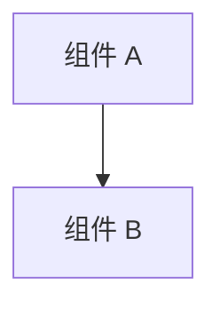
```

### 12.2 文档目录结构

```
ScholarFlow-Design-Document/
├── README.md                          # 文档说明和导航
├── 01_项目概述.md                      # 项目背景、目标、范围
├── 02_系统架构总览.md                   # 整体架构、组件关系
├── 03_技术栈与依赖.md                   # 技术选型、依赖分析
│
├── 04_LangGraph工作流设计.md           # 工作流设计、节点详解
├── 05_状态管理机制.md                  # 状态模型、持久化
├── 06_数据存储与持久化.md               # SQLite、JSON 存储
├── 07_错误处理与恢复.md                 # 错误分类、重试机制
│
├── 08_PDF解析模块.md                   # MinerU 集成、解析流程
├── 09_文本分块与处理.md                 # 分块算法、优化策略
├── 10_LLM集成与调用.md                 # 多提供商支持、异步调用
├── 11_图片Token化保护.md               # 三阶段保护机制
├── 12_演示文稿渲染.md                   # Marp 渲染、主题系统
├── 13_人机交互流程.md                   # 审核机制、反馈处理
│
├── 14_API接口文档.md                   # RESTful API 详细说明
├── 15_配置管理.md                      # 环境变量、配置项
├── 16_部署与运维.md                     # 部署方案、运维指南
│
├── 17_测试策略与覆盖.md                 # 测试体系、覆盖率
├── 18_性能优化.md                       # 性能瓶颈、优化方案
├── 19_监控与日志.md                     # 日志架构、监控指标
│
├── 20_环境变量参考.md                   # 完整环境变量清单
├── 21_故障排除指南.md                   # 常见问题、解决方案
├── 22_扩展开发指南.md                   # 自定义节点、插件开发
│
├── assets/                             # 静态资源
│   ├── images/                         # 图片资源
│   ├── diagrams/                       # 图表源文件
│   └── code-examples/                  # 代码示例
│
└── docs/
    ├── api/                            # API 文档（单独生成）
    └── deployment/                     # 部署文档（单独生成）
```

### 12.3 交叉引用规范

**内部链接**：
```markdown
详见 [系统架构总览](02_系统架构总览.md#整体架构图)

参考 [LangGraph 工作流](04_LangGraph工作流设计.md#节点详解)
```

**代码引用**：
```markdown
实现代码位于 `app/graph/workflow.py:145`：

```python
workflow = StateGraph(WorkflowState)
```
```

**图表引用**：
```markdown
如图 2-1 所示：


```

### 12.4 版本管理

**版本号规范**：
- 主版本号：架构重大变更
- 次版本号：功能增加或重要更新
- 修订版本号：错误修正、小幅调整

**变更日志**：
```markdown
## [v2.0.0] - 2024-12-21

### 新增
- 图片 Token 化保护机制
- 双存储架构（SQLite + JSON）
- 人工审核流程

### 修改
- 优化工作流性能
- 改进错误处理机制

### 修复
- 修复 PDF 解析失败问题
- 修复状态持久化错误
```

---

## 总结与后续计划

### 文档价值与收益

本设计说明书将为 ScholarFlow 项目带来以下价值：

1. **知识沉淀**：将隐含的系统设计转化为显性文档
2. **团队协作**：提供统一的技术认知和沟通语言
3. **新成员培训**：加速新开发者的学习和上手过程
4. **系统维护**：为长期维护提供技术依据
5. **架构演进**：为未来功能扩展提供参考框架

### 文档维护计划

**定期更新**：
- 每次重大功能更新后同步更新文档
- 每季度进行一次全面审查
- 每年进行一次版本升级

**版本控制**：
- 使用 Git 管理文档版本
- 每个版本标记对应的代码提交
- 保留历史版本以供参考

**质量监控**：
- 定期收集读者反馈
- 跟踪文档的使用情况
- 持续改进文档质量和可读性

---

**文档生成方案制定完成！**

本方案为 ScholarFlow 项目提供了全面、系统、可执行的设计说明书生成指导。通过明确的章节划分、详细的技术分析、丰富的图表示例和规范的文档格式，将确保生成高质量的技术文档，满足不同读者的需求。

后续建议按照本方案逐步实施，预计 3-4 个工作日可完成完整的设计说明书编写工作。
