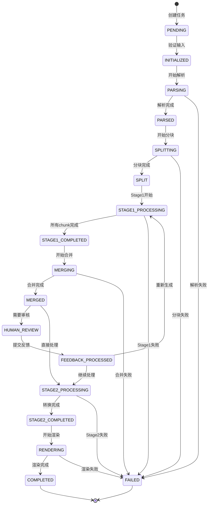

# 第6章 状态管理机制

## 6.1 状态管理概述

### 6.1.1 什么是状态管理

在LangGraph工作流中，**状态（State）**是整个系统的核心。所有节点通过共享状态对象传递数据，工作流的执行完全由状态控制。ScholarFlow定义了包含30+字段的WorkflowState，追踪从PDF上传到演示文稿生成的完整流程。

**状态的作用**:
- **数据传递**: 节点间通过状态传递数据
- **流程控制**: 状态决定下一步执行路径
- **进度跟踪**: 实时反映工作流执行进度
- **错误诊断**: 记录详细的执行历史
- **断点续传**: 支持工作流暂停和恢复

### 6.1.2 状态管理特性

| 特性 | 说明 | 优势 |
|------|------|------|
| **类型安全** | 使用TypedDict定义结构 | 编译时检查，减少错误 |
| **不可变性** | 节点返回新状态而非修改 | 易于追踪变化，易于调试 |
| **持久化** | 自动保存到SQLite和JSON | 断点续传，数据安全 |
| **版本化** | 保存多个版本的历史状态 | 审计追踪，问题定位 |
| **可观测性** | 完整的执行日志 | 监控和调试 |

## 6.2 WorkflowState设计

### 6.2.1 状态结构

**文件位置**: `app/graph/state.py`

```python
class WorkflowState(TypedDict, total=False):
    """
    工作流状态 - 包含30+字段追踪完整处理流程
    """

    # === 任务基本信息 ===
    task_id: str                          # 任务唯一标识
    status: str                          # 任务状态
    created_at: str                      # 创建时间
    updated_at: str                      # 更新时间

    # === 输入数据 ===
    pdf_path: str                        # PDF文件路径
    presentation_style: str              # 演示风格 (academic/popular/business)
    max_chars: int                       # 最大字符数 (默认6000)
    target_chunks: int                   # 目标分块数 (默认6)

    # === PDF解析结果 ===
    markdown_text: str                   # 原始Markdown文本
    image_paths: List[str]               # 提取的图片路径列表
    tokenized_text: str                  # Token化后的文本
    image_token_map: dict                # 图片token映射表
    token_count: int                     # token数量

    # === 文本分块 ===
    chunks: List[str]                    # 分块结果
    chunks_count: int                    # 分块数量
    current_chunk_index: int             # 当前处理的chunk索引 (0开始)

    # === Stage1处理结果 ===
    stage1_results: List[dict]           # Stage1输出结果列表
    stage1_completed: bool               # Stage1是否完成

    # === 合并结果 ===
    merged_outline: str                  # 合并后的大纲
    outlines_count: int                  # 合并的大纲数量

    # === 人工审核 ===
    needs_human_review: bool             # 是否需要人工审核
    human_feedback: dict                 # 人工反馈
    review_points: List[str]             # 审核意见
    approved: bool                       # 审核是否通过

    # === Stage2处理结果 ===
    marp_markdown: str                   # Marp格式的Markdown
    marp_theme: str                      # Marp主题

    # === 渲染结果 ===
    output_path: str                     # 输出文件路径
    output_format: str                   # 输出格式 (pptx/pdf/html)
    output_size: int                     # 输出文件大小

    # === 错误处理 ===
    error_message: str                   # 错误信息
    error_details: dict                  # 错误详情
    retry_count: int                     # 当前重试次数
    max_retries: int                     # 最大重试次数

    # === 进度跟踪 ===
    progress_percentage: int             # 完成百分比 (0-100)
    current_node: str                    # 当前执行的节点
    estimated_time_remaining: int        # 预计剩余时间(秒)

    # === 执行历史 ===
    execution_log: List[dict]            # 执行日志
    execution_time: float                # 总执行时间(秒)
    node_execution_times: dict           # 每个节点的执行时间

    # === 配置与选项 ===
    enable_human_review: bool            # 是否启用人工审核
    enable_parallel_processing: bool     # 是否启用并行处理
    max_parallel_chunks: int             # 最大并行chunk数

    # === 元数据 ===
    version: str                         # 工作流版本
    metadata: dict                       # 额外元数据
    source_info: dict                    # 源文件信息
```

### 6.2.2 状态分类

**按功能分类**:

| 类别 | 字段 | 说明 |
|------|------|------|
| **基本信息** | task_id, status, created_at | 任务元数据 |
| **输入数据** | pdf_path, presentation_style | 用户输入参数 |
| **处理结果** | chunks, stage1_results | 中间处理结果 |
| **审核信息** | human_feedback, approved | HITL审核数据 |
| **输出结果** | output_path, marp_markdown | 最终输出 |
| **错误处理** | error_message, retry_count | 错误和重试 |
| **进度跟踪** | progress_percentage, current_node | 进度信息 |
| **执行历史** | execution_log, execution_time | 执行记录 |

## 6.3 状态创建与初始化

### 6.3.1 创建初始状态

**函数位置**: `app/graph/state.py`

```python
def create_initial_state(
    task_id: str,
    pdf_path: str,
    presentation_style: str = "academic",
    max_chars: int = 6000,
    target_chunks: int = 6,
    **kwargs
) -> WorkflowState:
    """创建工作流初始状态"""

    now = datetime.now().isoformat()

    initial_state = WorkflowState(
        # 基本信息
        task_id=task_id,
        status=TaskStatus.PENDING.value,
        created_at=now,
        updated_at=now,

        # 输入数据
        pdf_path=pdf_path,
        presentation_style=presentation_style,
        max_chars=max_chars,
        target_chunks=target_chunks,

        # 处理选项
        enable_human_review=kwargs.get("enable_human_review", True),
        enable_parallel_processing=kwargs.get("enable_parallel_processing", True),
        max_parallel_chunks=kwargs.get("max_parallel_chunks", 5),

        # 错误处理
        retry_count=0,
        max_retries=kwargs.get("max_retries", 3),

        # 进度
        progress_percentage=0,

        # 历史
        execution_log=[],
        node_execution_times={},

        # 元数据
        version="1.0.0",
        metadata={},
        source_info={
            "file_name": Path(pdf_path).name,
            "file_size": Path(pdf_path).stat().st_size,
            "created_by": kwargs.get("user_id", "system")
        }
    )

    return initial_state
```

### 6.3.2 演示风格枚举

```python
class PresentationStyle(Enum):
    """演示风格枚举"""
    ACADEMIC = "academic"
    POPULAR = "popular"
    BUSINESS = "business"

    @classmethod
    def get_all(cls) -> List[str]:
        return [style.value for style in cls]
```

### 6.3.3 任务状态枚举

```python
class TaskStatus(Enum):
    """任务状态枚举"""
    PENDING = "pending"
    INITIALIZED = "initialized"
    PARSING = "parsing"
    PARSED = "parsed"
    SPLITTING = "splitting"
    SPLIT = "split"
    STAGE1_PROCESSING = "stage1_processing"
    STAGE1_COMPLETED = "stage1_completed"
    MERGING = "merging"
    MERGED = "merged"
    HUMAN_REVIEW = "human_review"
    FEEDBACK_PROCESSED = "feedback_processed"
    STAGE2_PROCESSING = "stage2_processing"
    STAGE2_COMPLETED = "stage2_completed"
    RENDERING = "rendering"
    COMPLETED = "completed"
    FAILED = "failed"
    CANCELLED = "cancelled"

    def get_progress(self) -> int:
        """获取状态对应的进度百分比"""
        progress_map = {
            TaskStatus.PENDING: 0,
            TaskStatus.INITIALIZED: 5,
            TaskStatus.PARSING: 10,
            TaskStatus.PARSED: 20,
            TaskStatus.SPLITTING: 25,
            TaskStatus.SPLIT: 30,
            TaskStatus.STAGE1_PROCESSING: 50,
            TaskStatus.STAGE1_COMPLETED: 60,
            TaskStatus.MERGING: 65,
            TaskStatus.MERGED: 70,
            TaskStatus.HUMAN_REVIEW: 70,
            TaskStatus.FEEDBACK_PROCESSED: 75,
            TaskStatus.STAGE2_PROCESSING: 80,
            TaskStatus.STAGE2_COMPLETED: 85,
            TaskStatus.RENDERING: 90,
            TaskStatus.COMPLETED: 100,
            TaskStatus.FAILED: 0,
            TaskStatus.CANCELLED: 0,
        }
        return progress_map.get(self, 0)

    def is_finished(self) -> bool:
        """检查是否已完成（成功或失败）"""
        return self in [TaskStatus.COMPLETED, TaskStatus.FAILED, TaskStatus.CANCELLED]

    def is_success(self) -> bool:
        """检查是否成功完成"""
        return self == TaskStatus.COMPLETED
```

## 6.4 状态更新模式

### 6.4.1 节点更新状态

**模式**: 节点接收状态，返回更新的状态字典

```python
def node_function(state: WorkflowState) -> WorkflowState:
    """
    节点函数标准模式
    1. 读取状态
    2. 处理数据
    3. 返回更新
    """
    # 1. 读取状态
    current_data = state.get("some_field", default_value)

    # 2. 处理数据
    result = process(current_data)

    # 3. 返回更新
    return {
        "status": "next_status",
        "some_field": result,
        "progress_percentage": state.get("progress_percentage", 0) + 10,
        "updated_at": datetime.now().isoformat()
    }
```

**示例**:
```python
def node_parse_pdf(state: WorkflowState) -> WorkflowState:
    """PDF解析节点"""
    # 处理PDF...
    markdown_text = "解析结果..."
    image_paths = ["img1.jpg", "img2.jpg"]

    return {
        "status": "parsed",
        "markdown_text": markdown_text,
        "image_paths": image_paths,
        "progress_percentage": 20,
        "updated_at": datetime.now().isoformat()
    }
```

### 6.4.2 批量更新

```python
def node_merge_outlines(state: WorkflowState) -> WorkflowState:
    """合并大纲节点"""
    # 多个字段同时更新
    return {
        "status": "merged",
        "merged_outline": merged_outline,
        "outlines_count": len(stage1_results),
        "needs_human_review": should_review,
        "progress_percentage": 70,
        "updated_at": datetime.now().isoformat()
    }
```

### 6.4.3 条件更新

```python
def node_process_feedback(state: WorkflowState) -> WorkflowState:
    """处理反馈节点"""
    feedback = state.get("human_feedback", {})

    # 根据反馈更新状态
    if feedback.get("approved"):
        return {
            "status": "feedback_processed",
            "approved": True,
            "progress_percentage": 75
        }
    else:
        return {
            "status": "feedback_processed",
            "approved": False,
            "needs_regeneration": True,
            "progress_percentage": 65  # 回退进度
        }
```

## 6.5 状态流转

### 6.5.1 正常流程状态图



### 6.5.2 状态流转表

| 当前状态 | 触发事件 | 下个状态 | 进度 |
|----------|----------|----------|------|
| PENDING | 验证通过 | INITIALIZED | 5% |
| INITIALIZED | 开始解析 | PARSING | 10% |
| PARSING | 解析完成 | PARSED | 20% |
| PARSED | 开始分块 | SPLITTING | 25% |
| SPLITTING | 分块完成 | SPLIT | 30% |
| SPLIT | Stage1开始 | STAGE1_PROCESSING | 40% |
| STAGE1_PROCESSING | 所有chunk完成 | STAGE1_COMPLETED | 60% |
| STAGE1_COMPLETED | 开始合并 | MERGING | 65% |
| MERGING | 合并完成 | MERGED | 70% |
| MERGED | 需要审核 | HUMAN_REVIEW | 70% |
| MERGED | 无需审核 | STAGE2_PROCESSING | 75% |
| HUMAN_REVIEW | 审核通过 | STAGE2_PROCESSING | 75% |
| HUMAN_REVIEW | 审核不通过 | STAGE1_PROCESSING | 50% |
| FEEDBACK_PROCESSED | 继续处理 | STAGE2_PROCESSING | 75% |
| FEEDBACK_PROCESSED | 重新生成 | STAGE1_PROCESSING | 50% |
| STAGE2_PROCESSING | 转换完成 | STAGE2_COMPLETED | 85% |
| STAGE2_COMPLETED | 开始渲染 | RENDERING | 90% |
| RENDERING | 渲染完成 | COMPLETED | 100% |

### 6.5.3 状态验证

```python
def validate_state_transition(current_status: str, next_status: str) -> bool:
    """验证状态转换是否合法"""
    valid_transitions = {
        "pending": ["initialized"],
        "initialized": ["parsing"],
        "parsing": ["parsed", "failed"],
        "parsed": ["splitting"],
        "splitting": ["split", "failed"],
        "split": ["stage1_processing"],
        "stage1_processing": ["stage1_completed", "failed"],
        "stage1_completed": ["merging"],
        "merging": ["merged", "failed"],
        "merged": ["human_review", "stage2_processing"],
        "human_review": ["feedback_processed"],
        "feedback_processed": ["stage1_processing", "stage2_processing"],
        "stage2_processing": ["stage2_completed", "failed"],
        "stage2_completed": ["rendering"],
        "rendering": ["completed", "failed"],
        "completed": [],
        "failed": [],
        "cancelled": []
    }

    return next_status in valid_transitions.get(current_status, [])
```

## 6.6 状态持久化

### 6.6.1 自动保存

**时机**: 每个节点执行完成后自动保存

```python
# LangGraph checkpointer自动调用
async def save_checkpoint(state: WorkflowState, node_name: str):
    """保存检查点"""
    # 记录执行日志
    log_entry = {
        "timestamp": datetime.now().isoformat(),
        "node": node_name,
        "status": state.get("status"),
        "progress": state.get("progress_percentage")
    }
    state.setdefault("execution_log", []).append(log_entry)

    # 保存到SQLite (LangGraph自动)
    # 保存到JSON (手动)
    await save_to_json(state["task_id"], state)
```

### 6.6.2 JSON快速访问层

```python
async def save_to_json(task_id: str, state: WorkflowState):
    """保存状态到JSON文件"""
    file_path = Path(f"data/workflows/intermediate/{task_id}/{task_id}.json")
    file_path.parent.mkdir(parents=True, exist_ok=True)

    async with aiofiles.open(file_path, 'w', encoding='utf-8') as f:
        await f.write(json.dumps(state, indent=2, ensure_ascii=False))

async def load_from_json(task_id: str) -> Optional[WorkflowState]:
    """从JSON文件加载状态"""
    file_path = Path(f"data/workflows/intermediate/{task_id}/{task_id}.json")

    if not file_path.exists():
        return None

    async with aiofiles.open(file_path, 'r', encoding='utf-8') as f:
        content = await f.read()
        return json.loads(content)
```

## 6.7 执行日志

### 6.7.1 日志记录

```python
def log_execution(state: WorkflowState, node_name: str, start_time: float):
    """记录执行日志"""
    execution_time = time.time() - start_time

    log_entry = {
        "timestamp": datetime.now().isoformat(),
        "node": node_name,
        "status": state.get("status"),
        "progress": state.get("progress_percentage"),
        "execution_time": execution_time,
        "memory_usage": psutil.Process().memory_info().rss / 1024 / 1024  # MB
    }

    # 添加到执行日志
    state.setdefault("execution_log", []).append(log_entry)

    # 记录节点执行时间
    state.setdefault("node_execution_times", {})[node_name] = execution_time

    # 更新总执行时间
    state["execution_time"] = state.get("execution_time", 0) + execution_time
```

### 6.7.2 日志格式

```json
{
  "task_id": "demo-001",
  "execution_log": [
    {
      "timestamp": "2025-01-01T10:00:00",
      "node": "initialize",
      "status": "initialized",
      "progress": 10,
      "execution_time": 0.05,
      "memory_usage": 45.2
    },
    {
      "timestamp": "2025-01-01T10:00:01",
      "node": "parse_pdf",
      "status": "parsed",
      "progress": 20,
      "execution_time": 1.23,
      "memory_usage": 52.8
    }
  ],
  "node_execution_times": {
    "initialize": 0.05,
    "parse_pdf": 1.23
  },
  "execution_time": 1.28
}
```

## 6.8 进度跟踪

### 6.8.1 进度计算

```python
def calculate_progress(state: WorkflowState) -> int:
    """计算当前进度百分比"""
    status = state.get("status", "pending")

    # 根据状态计算进度
    status_progress_map = {
        "pending": 0,
        "initialized": 5,
        "parsing": 15,
        "parsed": 25,
        "splitting": 30,
        "split": 35,
        "stage1_processing": 50,
        "stage1_completed": 60,
        "merging": 65,
        "merged": 70,
        "human_review": 70,
        "feedback_processed": 75,
        "stage2_processing": 80,
        "stage2_completed": 85,
        "rendering": 90,
        "completed": 100,
        "failed": 0,
        "cancelled": 0
    }

    base_progress = status_progress_map.get(status, 0)

    # Stage1进度细化
    if status == "stage1_processing":
        current_index = state.get("current_chunk_index", 0)
        total_chunks = state.get("chunks_count", 1)
        chunk_progress = (current_index / total_chunks) * 20  # Stage1占20%
        base_progress = 50 + chunk_progress

    return min(base_progress, 100)
```

### 6.8.2 进度更新

```python
def update_progress(state: WorkflowState, node_name: str) -> WorkflowState:
    """更新进度"""
    # 计算新进度
    new_progress = calculate_progress(state)

    # 更新状态
    return {
        "progress_percentage": new_progress,
        "current_node": node_name,
        "updated_at": datetime.now().isoformat()
    }
```

## 6.9 状态查询

### 6.9.1 快速状态查询

```python
async def get_task_status(task_id: str) -> Optional[dict]:
    """快速查询任务状态"""
    # 从JSON加载
    state = await load_from_json(task_id)

    if not state:
        return None

    # 返回关键字段
    return {
        "task_id": state["task_id"],
        "status": state["status"],
        "progress": state.get("progress_percentage", 0),
        "current_node": state.get("current_node"),
        "created_at": state["created_at"],
        "updated_at": state.get("updated_at"),
        "error_message": state.get("error_message"),
        "output_path": state.get("output_path")
    }
```

### 6.9.2 详细状态查询

```python
async def get_task_details(task_id: str) -> Optional[dict]:
    """获取任务详细信息"""
    state = await load_from_json(task_id)

    if not state:
        return None

    # 返回完整状态
    return state
```

## 6.10 状态比较

### 6.10.1 状态差异

```python
def compare_states(state1: WorkflowState, state2: WorkflowState) -> dict:
    """比较两个状态的差异"""
    differences = {}

    all_keys = set(state1.keys()) | set(state2.keys())

    for key in all_keys:
        val1 = state1.get(key)
        val2 = state2.get(key)

        if val1 != val2:
            differences[key] = {
                "old": val1,
                "new": val2
            }

    return differences
```

### 6.10.2 状态历史

```python
def get_state_history(checkpoints: List[dict]) -> List[dict]:
    """获取状态变化历史"""
    history = []

    for checkpoint in checkpoints:
        state = checkpoint["state"]
        history.append({
            "timestamp": checkpoint["timestamp"],
            "status": state.get("status"),
            "progress": state.get("progress_percentage"),
            "node": state.get("current_node")
        })

    return history
```

## 6.11 最佳实践

### 6.11.1 状态设计原则

1. **最小化状态**: 只存储必要的数据
2. **避免大对象**: 不在状态中存储大文件或大量数据
3. **使用引用**: 存储文件路径而非文件内容
4. **版本控制**: 记录状态版本便于追踪
5. **类型安全**: 使用TypedDict确保类型正确

### 6.11.2 状态更新原则

1. **不可变性**: 节点返回新状态，不修改原状态
2. **原子性**: 每次更新是原子的
3. **一致性**: 状态字段之间保持一致
4. **可追溯**: 记录状态变化历史
5. **验证**: 更新前验证状态合法性

### 6.11.3 性能优化

1. **懒加载**: 按需加载状态字段
2. **缓存**: 缓存频繁访问的状态
3. **压缩**: 压缩存储的状态数据
4. **索引**: 为常用查询字段建立索引
5. **分区**: 按时间或任务ID分区存储

## 6.12 章节导航

- **上一章**: [第5章 - LangGraph工作流设计](05_LangGraph工作流设计.md) - 了解工作流
- **下一章**: [第7章 - 数据存储与持久化](07_数据存储与持久化.md) - 深入存储
- **代码示例**: [状态管理示例](code-examples/basic/12-basic-state.py) - 学习使用
- **深入理解**: [第5章 - LangGraph工作流设计](05_LangGraph工作流设计.md) - 工作流详解

---

**本章要点**:
- ✅ WorkflowState包含30+字段追踪完整流程
- ✅ 状态不可变，节点返回更新而非修改
- ✅ 完整的状态流转和验证机制
- ✅ 自动持久化到SQLite和JSON
- ✅ 详细的执行日志和进度跟踪
