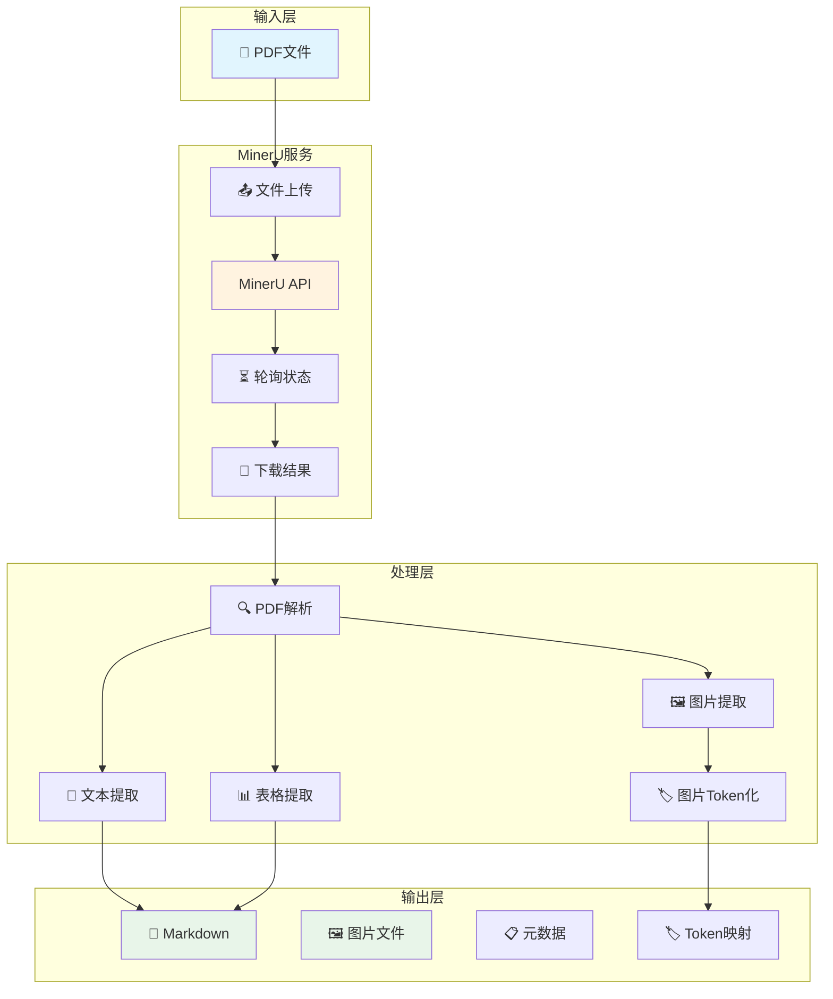

# 第8章 PDF解析模块

## 8.1 PDF解析概述

### 8.1.1 为什么需要专门的PDF解析

学术论文通常包含复杂的格式：
- **文本内容**：标题、段落、脚注
- **图片和图表**：嵌入式图像、流程图、数据图表
- **表格数据**：结构化数据展示
- **数学公式**：LaTeX格式或图像格式
- **引用文献**：参考文献列表

传统的文本提取工具难以完整保留这些结构化信息，而ScholarFlow需要**完整保留论文的结构和视觉元素**，以生成高质量的演示文稿。

### 8.1.2 MinerU选择

**为什么选择MinerU**：
- ✅ **高精度提取**：专为学术论文优化
- ✅ **结构化输出**：保持原有结构
- ✅ **图片处理**：自动提取和分类图片
- ✅ **多语言支持**：支持中英文混合
- ✅ **表格识别**：准确识别表格结构
- ✅ **公式解析**：支持LaTeX和图像公式

**替代方案对比**：

| 方案 | 优势 | 劣势 |
|------|------|------|
| **MinerU** | 学术优化、结构保留 | 需要API调用、有成本 |
| **PyPDF2** | 纯Python、无需外部服务 | 提取质量低、无法处理图片 |
| **pdfplumber** | 表格提取好 | 整体精度一般 |
| **Tesseract** | OCR能力强 | 需要额外OCR处理、速度慢 |

## 8.2 MinerU集成架构

### 8.2.1 整体架构图



### 8.2.2 处理流程

```
1. 上传PDF → 获取上传URL
2. 上传文件 → 获取任务ID
3. 轮询状态 → 等待处理完成
4. 下载结果 → 获取Markdown + 图片
5. 后处理 → Token化图片引用
```

## 8.3 MinerUClient实现

### 8.3.1 客户端类设计

**文件位置**: `app/services/parser/mineru_client.py`

```python
import asyncio
import aiohttp
import aiofiles
from pathlib import Path
from typing import Dict, List, Optional
from urllib.parse import urlparse


class MinerUClient:
    """MinerU API客户端"""

    def __init__(self, api_key: str, endpoint: str):
        self.api_key = api_key
        self.endpoint = endpoint.rstrip('/')
        self.session: Optional[aiohttp.ClientSession] = None

    async def __aenter__(self):
        """异步上下文管理器入口"""
        self.session = aiohttp.ClientSession()
        return self

    async def __aexit__(self, exc_type, exc_val, exc_tb):
        """异步上下文管理器出口"""
        if self.session:
            await self.session.close()

    async def parse_pdf(self, pdf_path: str) -> Dict:
        """
        解析PDF文件

        Args:
            pdf_path: PDF文件路径

        Returns:
            解析结果字典
        """
        # 1. 获取上传URL
        upload_url = await self._get_upload_url()

        # 2. 上传文件
        task_id = await self._upload_file(upload_url, pdf_path)

        # 3. 轮询等待完成
        await self._wait_for_completion(task_id)

        # 4. 下载结果
        result = await self._download_result(task_id)

        return result

    async def _get_upload_url(self) -> str:
        """获取文件上传URL"""
        url = f"{self.endpoint}/upload"

        async with self.session.post(
            url,
            headers={"Authorization": f"Bearer {self.api_key}"}
        ) as response:
            if response.status == 200:
                data = await response.json()
                return data["upload_url"]
            else:
                raise Exception(f"获取上传URL失败: {response.status}")

    async def _upload_file(self, upload_url: str, file_path: str) -> str:
        """上传文件到获取的URL"""
        async with aiofiles.open(file_path, 'rb') as f:
            file_content = await f.read()

        data = aiohttp.FormData()
        data.add_field('file', file_content, filename=Path(file_path).name)

        async with self.session.post(upload_url, data=data) as response:
            if response.status == 200:
                result = await response.json()
                return result["task_id"]
            else:
                raise Exception(f"文件上传失败: {response.status}")

    async def _wait_for_completion(self, task_id: str, timeout: int = 300):
        """轮询等待任务完成"""
        url = f"{self.endpoint}/task/{task_id}"
        start_time = asyncio.get_event_loop().time()

        while True:
            async with self.session.get(
                url,
                headers={"Authorization": f"Bearer {self.api_key}"}
            ) as response:
                if response.status == 200:
                    result = await response.json()
                    status = result["status"]

                    if status == "completed":
                        print(f"✅ 解析完成: {task_id}")
                        return
                    elif status == "failed":
                        raise Exception(f"解析失败: {result.get('error', 'Unknown error')}")
                    elif status == "processing":
                        elapsed = asyncio.get_event_loop().time() - start_time
                        print(f"⏳ 解析中... ({elapsed:.0f}s)")
                    else:
                        raise Exception(f"未知状态: {status}")

            # 检查超时
            if asyncio.get_event_loop().time() - start_time > timeout:
                raise Exception(f"解析超时: {timeout}秒")

            # 等待5秒后再次查询
            await asyncio.sleep(5)

    async def _download_result(self, task_id: str) -> Dict:
        """下载解析结果"""
        url = f"{self.endpoint}/result/{task_id}"

        async with self.session.get(
            url,
            headers={"Authorization": f"Bearer {self.api_key}"}
        ) as response:
            if response.status == 200:
                # 下载ZIP文件
                zip_data = await response.read()

                # 解压并处理
                result = await self._process_result_zip(zip_data, task_id)
                return result
            else:
                raise Exception(f"下载结果失败: {response.status}")

    async def _process_result_zip(self, zip_data: bytes, task_id: str) -> Dict:
        """处理下载的ZIP文件"""
        import zipfile
        import io

        # 创建临时目录
        temp_dir = Path(f"data/intermediate/{task_id}")
        temp_dir.mkdir(parents=True, exist_ok=True)

        # 解压ZIP
        with zipfile.ZipFile(io.BytesIO(zip_data)) as zip_ref:
            zip_ref.extractall(temp_dir)

        # 读取Markdown文件
        markdown_files = list(temp_dir.glob("*.md"))
        if not markdown_files:
            raise Exception("未找到Markdown文件")

        markdown_path = markdown_files[0]
        async with aiofiles.open(markdown_path, 'r', encoding='utf-8') as f:
            markdown_content = await f.read()

        # 提取图片文件
        image_dir = temp_dir / "images"
        image_paths = []
        if image_dir.exists():
            for img_file in image_dir.iterdir():
                if img_file.suffix.lower() in ['.png', '.jpg', '.jpeg', '.gif']:
                    image_paths.append(str(img_file))

        # 返回结果
        return {
            "markdown": markdown_content,
            "images": image_paths,
            "temp_dir": str(temp_dir)
        }
```

### 8.3.2 错误处理

```python
class MinerUError(Exception):
    """MinerU相关错误基类"""
    pass


class UploadError(MinerUError):
    """文件上传错误"""
    pass


class ProcessingError(MinerUError):
    """处理错误"""
    pass


class DownloadError(MinerUError):
    """结果下载错误"""
    pass


# 在客户端中使用
async def parse_pdf_with_retry(self, pdf_path: str, max_retries: int = 3) -> Dict:
    """带重试的PDF解析"""
    for attempt in range(max_retries):
        try:
            return await self.parse_pdf(pdf_path)
        except UploadError as e:
            if attempt == max_retries - 1:
                raise
            await asyncio.sleep(2 ** attempt)  # 指数退避
        except Exception as e:
            raise  # 其他错误不重试
```

## 8.4 PDF解析工作流

### 8.4.1 parse_pdf节点实现

**文件位置**: `app/graph/nodes/pdf_parsing.py`

```python
from app.services.parser.mineru_client import MinerUClient
from app.services.parser.image_manager import ImageManager
from app.core.config import get_settings


async def node_parse_pdf(state: WorkflowState) -> WorkflowState:
    """
    PDF解析节点

    职责:
    1. 调用MinerU解析PDF
    2. 提取Markdown和图片
    3. Token化图片引用
    4. 更新状态
    """
    settings = get_settings()

    try:
        # 1. 验证PDF文件
        pdf_path = state["pdf_path"]
        if not Path(pdf_path).exists():
            raise FileNotFoundError(f"PDF文件不存在: {pdf_path}")

        # 2. 调用MinerU解析
        async with MinerUClient(
            api_key=settings.mineru_api_key,
            endpoint=settings.mineru_endpoint
        ) as client:
            result = await client.parse_pdf(pdf_path)

        # 3. 获取解析结果
        markdown_text = result["markdown"]
        image_paths = result["images"]

        # 4. Token化图片引用
        image_manager = ImageManager(Path("data/intermediate"))
        tokenized_text, image_token_map = image_manager.tokenize_image_references_enhanced(
            markdown_content=markdown_text,
            task_id=state["task_id"]
        )

        # 5. 更新状态
        return {
            "status": "pdf_parsed",
            "markdown_text": markdown_text,
            "image_paths": image_paths,
            "tokenized_text": tokenized_text,
            "image_token_map": image_token_map,
            "token_count": len(image_token_map),
            "parsing_metadata": {
                "total_images": len(image_paths),
                "markdown_size": len(markdown_text),
                "parsed_at": datetime.now().isoformat()
            },
            "progress_percentage": 25,
            "updated_at": datetime.now().isoformat()
        }

    except Exception as e:
        logger.error(f"PDF解析失败: {e}")
        return {
            "status": "parsing_failed",
            "error_message": str(e),
            "progress_percentage": 0,
            "updated_at": datetime.now().isoformat()
        }
```

### 8.4.2 解析进度跟踪

```python
class ParsingProgress:
    """解析进度跟踪器"""

    def __init__(self, task_id: str):
        self.task_id = task_id
        self.steps = [
            "验证文件",
            "获取上传URL",
            "上传文件",
            "等待解析",
            "下载结果",
            "后处理"
        ]
        self.current_step = 0

    def update_step(self, step_index: int):
        """更新当前步骤"""
        if 0 <= step_index < len(self.steps):
            self.current_step = step_index
            logger.info(f"解析进度: {self.steps[step_index]}")

    def get_progress(self) -> int:
        """获取进度百分比"""
        return int((self.current_step / len(self.steps)) * 100)
```

## 8.5 解析结果处理

### 8.5.1 Markdown后处理

```python
def post_process_markdown(markdown: str, task_id: str) -> str:
    """
    Markdown后处理

    1. 清理无效字符
    2. 标准化标题层级
    3. 处理特殊字符
    4. 添加元数据注释
    """
    # 1. 清理控制字符
    import re
    markdown = re.sub(r'[\x00-\x08\x0B\x0C\x0E-\x1F\x7F]', '', markdown)

    # 2. 标准化标题（确保从一级标题开始）
    lines = markdown.split('\n')
    processed_lines = []
    title_level = 0

    for line in lines:
        if line.strip().startswith('#'):
            # 统计#的数量
            level = len(line) - len(line.lstrip('#'))
            if title_level == 0 and level > 1:
                # 第一个标题如果不是一级，调整为一级
                line = '#' + line.lstrip('#')
            title_level = level
        processed_lines.append(line)

    markdown = '\n'.join(processed_lines)

    # 3. 添加元数据注释
    header = f"""<!--
Parsed by ScholarFlow
Task ID: {task_id}
Timestamp: {datetime.now().isoformat()}
-->
"""

    return header + markdown
```

### 8.5.2 图片分类处理

```python
def classify_images(image_paths: List[str]) -> Dict[str, List[str]]:
    """
    对提取的图片进行分类

    分类:
    - figures: 图表、图形
    - tables: 表格截图
    - formulas: 公式
    - photos: 照片
    - other: 其他
    """
    classifications = {
        "figures": [],
        "tables": [],
        "formulas": [],
        "photos": [],
        "other": []
    }

    for img_path in image_paths:
        img_name = Path(img_path).stem.lower()

        # 基于文件名分类
        if any(keyword in img_name for keyword in ['fig', 'figure', 'chart', 'graph']):
            classifications["figures"].append(img_path)
        elif any(keyword in in ['table', img_name for keyword 'tab']):
            classifications["tables"].append(img_path)
        elif any(keyword in img_name for keyword in ['formula', 'equation', 'math']):
            classifications["formulas"].append(img_path)
        elif any(keyword in img_name for keyword in ['photo', 'image', 'pic']):
            classifications["photos"].append(img_path)
        else:
            classifications["other"].append(img_path)

    return classifications
```

## 8.6 性能优化

### 8.6.1 并发上传

```python
async def upload_multiple_pdfs(pdf_paths: List[str]) -> List[Dict]:
    """并发上传多个PDF"""
    semaphore = asyncio.Semaphore(3)  # 限制并发数

    async def upload_single(pdf_path):
        async with semaphore:
            async with MinerUClient(...) as client:
                return await client.parse_pdf(pdf_path)

    tasks = [upload_single(pdf) for pdf in pdf_paths]
    results = await asyncio.gather(*tasks, return_exceptions=True)

    return [r for r in results if not isinstance(r, Exception)]
```

### 8.6.2 结果缓存

```python
import hashlib
import json

def get_file_hash(file_path: str) -> str:
    """计算文件MD5哈希"""
    hasher = hashlib.md5()
    with open(file_path, 'rb') as f:
        hasher.update(f.read())
    return hasher.hexdigest()

async def parse_pdf_with_cache(pdf_path: str) -> Optional[Dict]:
    """带缓存的PDF解析"""
    # 计算文件哈希
    file_hash = get_file_hash(pdf_path)
    cache_file = Path(f"cache/{file_hash}.json")

    # 检查缓存
    if cache_file.exists():
        async with aiofiles.open(cache_file, 'r') as f:
            cached_data = json.loads(await f.read())
            logger.info(f"使用缓存结果: {pdf_path}")
            return cached_data

    # 解析并缓存
    result = await parse_pdf(pdf_path)

    # 保存缓存
    cache_file.parent.mkdir(exist_ok=True)
    async with aiofiles.open(cache_file, 'w') as f:
        await f.write(json.dumps(result, indent=2))

    return result
```

## 8.7 测试与验证

### 8.7.1 单元测试

```python
import pytest

@pytest.mark.asyncio
async def test_mineru_client_upload():
    """测试文件上传"""
    client = MinerUClient("test_key", "https://test.com")

    async with client:
        # 模拟测试
        assert client.session is not None

@pytest.mark.asyncio
async def test_pdf_parsing_node():
    """测试PDF解析节点"""
    state = {
        "task_id": "test-001",
        "pdf_path": "test.pdf",
        "status": "initialized"
    }

    result = await node_parse_pdf(state)

    assert result["status"] == "pdf_parsed"
    assert "markdown_text" in result
    assert "tokenized_text" in result
```

### 8.7.2 集成测试

```python
@pytest.mark.integration
async def test_end_to_end_parsing():
    """端到端解析测试"""
    # 准备测试PDF
    test_pdf = "tests/fixtures/sample_paper.pdf"

    # 执行解析
    async with MinerUClient(...) as client:
        result = await client.parse_pdf(test_pdf)

    # 验证结果
    assert result["markdown"] is not None
    assert len(result["images"]) > 0

    # 验证Markdown结构
    markdown = result["markdown"]
    assert markdown.startswith("#")  # 有标题
    assert len(markdown) > 100  # 有内容
```

## 8.8 最佳实践

### 8.8.1 使用建议

1. **文件大小限制**: 建议PDF < 50MB，避免解析超时
2. **并发控制**: 同时解析的PDF不超过5个，避免API限流
3. **错误重试**: 实现指数退避重试机制
4. **结果缓存**: 相同文件使用缓存避免重复解析
5. **进度监控**: 实时显示解析进度，提升用户体验

### 8.8.2 故障排除

**常见问题**：

| 问题 | 可能原因 | 解决方案 |
|------|----------|----------|
| 解析失败 | PDF格式损坏 | 使用PDF检查工具验证 |
| 上传超时 | 网络问题 | 检查网络连接，增加超时时间 |
| 内存不足 | PDF过大 | 分块处理或降低并发 |
| API限流 | 请求过多 | 实现请求速率限制 |
| 结果为空 | 解析异常 | 查看错误日志，联系支持 |

**调试技巧**：
```python
# 启用详细日志
import logging
logging.basicConfig(level=logging.DEBUG)

# 保存中间结果
async def debug_parse(pdf_path: str):
    try:
        result = await parse_pdf(pdf_path)

        # 保存原始结果
        with open("debug_raw_result.json", "w") as f:
            json.dump(result, f, indent=2)

        return result
    except Exception as e:
        logger.error(f"解析失败: {e}")
        raise
```

## 8.9 章节导航

- **上一章**: [第7章 - 数据存储与持久化](07_数据存储与持久化.md) - 了解存储机制
- **下一章**: [第9章 - 文本分块与处理](09_文本分块与处理.md) - 了解文本处理
- **代码示例**: [PDF解析示例](code-examples/basic/08-basic-pdf-parse.py) - 学习使用
- **深入理解**: [第4章 - 核心概念与术语](04_核心概念与术语.md) - Token化详解

---

**本章要点**:
- ✅ MinerU提供高精度PDF解析
- ✅ 完整的上传-解析-下载流程
- ✅ 自动提取文本、图片和表格
- ✅ Token化图片引用保护
- ✅ 完善的错误处理和重试机制
- ✅ 并发优化和结果缓存
