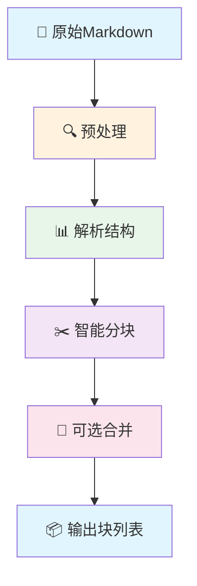

# 第9章 文本分块与处理

## 9.1 文本分块概述

### 9.1.1 为什么需要文本分块

**挑战**：
- 学术论文通常很长（数万字）
- LLM有上下文长度限制（通常4K-32K tokens）
- 单次处理整篇论文成本高、速度慢
- 难以保证每部分的质量

**解决方案**：
- 将长文档分割成可处理的块
- 每个块独立处理，保证质量
- 并行处理提高速度
- 最后合并所有结果

### 9.1.2 分块策略对比

| 策略 | 描述 | 优点 | 缺点 |
|------|------|------|------|
| **固定长度** | 按字符/词数固定分块 | 简单、快速 | 可能切断语义 |
| **语义分块** | 按章节、段落分块 | 保持语义完整 | 实现复杂 |
| **标题分块** | 按标题层级分块 | 结构清晰 | 依赖文档格式 |
| **滑动窗口** | 有重叠的分块 | 保持上下文 | 可能重复 |

## 9.2 分块算法设计

### 9.2.1 整体流程



### 9.2.2 核心实现

**文件位置**: `app/services/llm/split.py`

```python
import re
from typing import List, Tuple
from pathlib import Path


class MarkdownSplitter:
    """Markdown文本分块器"""

    def __init__(self, max_chars: int = 6000, chunk_overlap: int = 200):
        self.max_chars = max_chars
        self.chunk_overlap = chunk_overlap

    def split_markdown(self, markdown: str) -> List[str]:
        """
        分割Markdown文本

        策略：
        1. 按标题分块
        2. 大块按段落二次分割
        3. 添加重叠保持上下文
        """
        # 1. 解析结构
        sections = self._parse_sections(markdown)

        # 2. 初步分块
        chunks = []
        for section in sections:
            if len(section) <= self.max_chars:
                chunks.append(section)
            else:
                # 大块二次分割
                sub_chunks = self._split_large_section(section)
                chunks.extend(sub_chunks)

        # 3. 添加重叠
        chunks = self._add_overlap(chunks)

        return chunks

    def _parse_sections(self, markdown: str) -> List[str]:
        """解析Markdown结构，按标题分块"""
        lines = markdown.split('\n')
        sections = []
        current_section = []
        current_level = 0

        for line in lines:
            # 检测标题
            header_match = re.match(r'^(#{1,6})\s+(.+)$', line.strip())

            if header_match:
                # 保存上一个section
                if current_section:
                    sections.append('\n'.join(current_section))
                    current_section = []

                # 开始新section
                current_level = len(header_match.group(1))
                current_section.append(line)
            else:
                # 添加到当前section
                current_section.append(line)

        # 添加最后一个section
        if current_section:
            sections.append('\n'.join(current_section))

        return [s for s in sections if s.strip()]

    def _split_large_section(self, section: str) -> List[str]:
        """分割大块文本"""
        # 按段落分割
        paragraphs = re.split(r'\n\s*\n', section)
        chunks = []
        current_chunk = ""

        for paragraph in paragraphs:
            # 检查添加这个段落是否会超限
            if len(current_chunk) + len(paragraph) + 2 > self.max_chars:
                # 保存当前块
                if current_chunk:
                    chunks.append(current_chunk.strip())

                # 开始新块
                current_chunk = paragraph
            else:
                # 添加到当前块
                if current_chunk:
                    current_chunk += '\n\n' + paragraph
                else:
                    current_chunk = paragraph

        # 添加最后一个块
        if current_chunk:
            chunks.append(current_chunk.strip())

        return chunks

    def _add_overlap(self, chunks: List[str]) -> List[str]:
        """为相邻块添加重叠"""
        if not chunks or self.chunk_overlap <= 0:
            return chunks

        overlapped_chunks = [chunks[0]]  # 第一个块不需要重叠

        for i in range(1, len(chunks)):
            prev_chunk = overlapped_chunks[-1]
            current_chunk = chunks[i]

            # 从前一个块提取重叠内容
            prev_words = prev_chunk.split()
            overlap_words = prev_words[-self.chunk_overlap//5:]  # 约5个词作为重叠

            # 在当前块前添加重叠
            overlapped_chunk = ' '.join(overlap_words) + '\n\n' + current_chunk
            overlapped_chunks.append(overlapped_chunk)

        return overlapped_chunks


def split_markdown(markdown: str, max_chars: int = 6000) -> List[str]:
    """
    便捷函数：分割Markdown

    Args:
        markdown: Markdown文本
        max_chars: 最大字符数

    Returns:
        分割后的文本块列表
    """
    splitter = MarkdownSplitter(max_chars=max_chars)
    return splitter.split_markdown(markdown)
```

## 9.3 智能合并策略

### 9.3.1 为什么需要合并

**问题**：
- 固定分块可能导致块过多
- 每个块太短，LLM处理效率低
- 增加合并成本

**解决方案**：
- 先分小块保证语义完整
- 再合并小块达到目标数量
- 智能选择合并点

### 9.3.2 合并实现

**文件位置**: `app/services/llm/split.py`

```python
def merge_chunks(chunks: List[str], target_count: int) -> List[str]:
    """
    合并文本块达到目标数量

    策略：
    1. 计算需要合并多少次
    2. 优先合并相邻的短块
    3. 保持语义连贯性
    """
    if len(chunks) <= target_count:
        return chunks

    merged_chunks = chunks.copy()
    merge_count = len(chunks) - target_count

    for _ in range(merge_count):
        # 找到最短的相邻块
        min_size = float('inf')
        merge_index = -1

        for i in range(len(merged_chunks) - 1):
            combined_size = len(merged_chunks[i]) + len(merged_chunks[i + 1])

            if combined_size < min_size:
                min_size = combined_size
                merge_index = i

        # 合并这两个块
        if merge_index >= 0:
            merged_chunk = merged_chunks[merge_index] + '\n\n' + merged_chunks[merge_index + 1]
            merged_chunks.pop(merge_index + 1)
            merged_chunks[merge_index] = merged_chunk
        else:
            break

    return merged_chunks


def smart_merge(chunks: List[str], target_count: int) -> List[str]:
    """
    智能合并算法

    考虑因素：
    1. 语义连贯性
    2. 标题层级
    3. 内容长度
    """
    if len(chunks) <= target_count:
        return chunks

    # 分析每个块的特征
    chunk_features = []
    for i, chunk in enumerate(chunks):
        features = {
            'index': i,
            'content': chunk,
            'length': len(chunk),
            'has_header': bool(re.search(r'^#{1,6}\s+', chunk.strip())),
            'word_count': len(chunk.split())
        }
        chunk_features.append(features)

    # 按优先级排序合并
    # 优先级：短块 > 无标题 > 相邻
    chunk_features.sort(key=lambda x: (x['length'], not x['has_header']))

    merged = []
    used = set()

    for feature in chunk_features:
        if feature['index'] in used:
            continue

        current = feature['content']
        current_index = feature['index']

        # 尝试与相邻块合并
        while len(merged) + len(chunks) - len(used) - 1 > target_count:
            # 找到相邻的未使用块
            next_index = current_index + 1
            prev_index = current_index - 1

            merged_with = None
            merge_dir = None

            if next_index < len(chunks) and next_index not in used:
                # 检查向后合并
                combined = current + '\n\n' + chunks[next_index]
                if len(combined) <= 8000:  # 合并后不超过限制
                    merged_with = combined
                    merge_dir = 'next'
            elif prev_index >= 0 and prev_index not in used:
                # 检查向前合并
                combined = chunks[prev_index] + '\n\n' + current
                if len(combined) <= 8000:
                    merged_with = combined
                    merge_dir = 'prev'

            if merged_with:
                used.add(current_index)
                if merge_dir == 'next':
                    used.add(next_index)
                else:
                    used.add(prev_index)

                current = merged_with
                current_index = merge_dir

                # 更新当前索引
                if merge_dir == 'next':
                    current_index = next_index
            else:
                # 无法继续合并
                break

        used.add(current_index)
        merged.append(current)

    # 按原始顺序排序
    final_chunks = []
    for i, chunk in enumerate(chunks):
        if i not in used:
            final_chunks.append(chunk)

    final_chunks.extend(merged)
    final_chunks.sort(key=lambda x: chunks.index(x))

    return final_chunks[:target_count]
```

## 9.4 分块质量评估

### 9.4.1 评估指标

```python
class ChunkQuality:
    """分块质量评估"""

    @staticmethod
    def evaluate_chunks(chunks: List[str]) -> dict:
        """评估分块质量"""
        metrics = {
            'total_chunks': len(chunks),
            'avg_length': 0,
            'min_length': float('inf'),
            'max_length': 0,
            'length_std': 0,
            'semantic_coherence': 0,
            'header_preservation': 0
        }

        if not chunks:
            return metrics

        # 基本统计
        lengths = [len(chunk) for chunk in chunks]
        metrics['avg_length'] = sum(lengths) / len(lengths)
        metrics['min_length'] = min(lengths)
        metrics['max_length'] = max(lengths)

        # 标准差
        import statistics
        metrics['length_std'] = statistics.stdev(lengths)

        # 标题保留率
        headers_preserved = sum(1 for chunk in chunks if re.search(r'^#{1,6}\s+', chunk.strip()))
        metrics['header_preservation'] = headers_preserved / len(chunks)

        # 语义连贯性（简化指标）
        # 实际应使用更复杂的NLP技术
        coherence_score = 0
        for i in range(len(chunks) - 1):
            # 检查相邻块是否有连接词
            current = chunks[i].lower()
            next_chunk = chunks[i + 1].lower()

            connectors = ['therefore', 'however', 'moreover', 'furthermore', 'in addition']
            has_connector = any(conn in current or conn in next_chunk for conn in connectors)
            if has_connector:
                coherence_score += 1

        metrics['semantic_coherence'] = coherence_score / max(1, len(chunks) - 1)

        return metrics

    @staticmethod
    def suggest_optimization(chunks: List[str], max_chars: int) -> List[str]:
        """基于评估结果建议优化"""
        metrics = evaluate_chunks(chunks)
        suggestions = []

        # 建议1: 调整过大的块
        if metrics['max_length'] > max_chars * 1.5:
            suggestions.append("存在过大块，建议减小max_chars")

        # 建议2: 调整过小的块
        if metrics['min_length'] < max_chars * 0.1:
            suggestions.append("存在过小块，建议增加max_chars或减少target_chunks")

        # 建议3: 长度不均匀
        if metrics['length_std'] > metrics['avg_length'] * 0.5:
            suggestions.append("块长度不均匀，建议调整分块策略")

        # 建议4: 标题保留率低
        if metrics['header_preservation'] < 0.5:
            suggestions.append("标题保留率低，建议使用标题分块策略")

        return suggestions
```

## 9.5 特殊内容处理

### 9.5.1 代码块处理

```python
def preserve_code_blocks(markdown: str) -> List[dict]:
    """保留代码块完整性"""
    code_blocks = []

    # 查找所有代码块
    pattern = r'```(\w*)\n([\s\S]*?)```'
    matches = re.finditer(pattern, markdown)

    for match in matches:
        code_blocks.append({
            'language': match.group(1) or 'text',
            'code': match.group(2),
            'start': match.start(),
            'end': match.end()
        })

    # 替换为标记
    marked_markdown = markdown
    for i, block in enumerate(reversed(code_blocks)):
        placeholder = f'__CODE_BLOCK_{i}__'
        marked_markdown = marked_markdown[:block['start']] + placeholder + marked_markdown[block['end']:]

    return marked_markdown, code_blocks


def restore_code_blocks(markdown: str, code_blocks: List[dict]) -> str:
    """恢复代码块"""
    for i, block in enumerate(code_blocks):
        placeholder = f'__CODE_BLOCK_{i}__'
        code_text = f"```{block['language']}\n{block['code']}\n```"
        markdown = markdown.replace(placeholder, code_text)

    return markdown
```

### 9.5.2 表格处理

```python
def handle_tables(markdown: str) -> Tuple[str, List[dict]]:
    """处理Markdown表格"""
    tables = []

    # 查找表格
    table_pattern = r'(\|.*\|\n(?:\|[\s\S]*?\n)*)'
    matches = re.finditer(table_pattern, markdown)

    for match in matches:
        tables.append({
            'table': match.group(1),
            'start': match.start(),
            'end': match.end()
        })

    # 替换为标记
    marked_markdown = markdown
    for i, table in enumerate(reversed(tables)):
        placeholder = f'__TABLE_{i}__'
        marked_markdown = marked_markdown[:table['start']] + placeholder + marked_markdown[table['end']:]

    return marked_markdown, tables
```

## 9.6 split_markdown节点实现

### 9.6.1 节点函数

**文件位置**: `app/graph/nodes/text_splitting.py`

```python
from app.services.llm.split import split_markdown, merge_chunks, smart_merge


async def node_split_markdown(state: WorkflowState) -> WorkflowState:
    """
    文本分块节点

    职责:
    1. 获取Token化后的文本
    2. 执行智能分块
    3. 可选合并到目标数量
    4. 评估分块质量
    5. 更新状态
    """
    try:
        # 1. 获取输入
        tokenized_text = state.get("tokenized_text", "")
        max_chars = state.get("max_chars", 6000)
        target_chunks = state.get("target_chunks", 6)

        if not tokenized_text:
            raise ValueError("没有可分块的文本")

        # 2. 执行分块
        print(f"✂️ 开始分块 (max_chars={max_chars})")
        chunks = split_markdown(tokenized_text, max_chars=max_chars)

        print(f"  初步分块完成: {len(chunks)} 个块")

        # 3. 可选合并
        if target_chunks > 0 and len(chunks) > target_chunks:
            print(f"🔗 合并到目标数量: {target_chunks}")
            chunks = smart_merge(chunks, target_chunks)

        # 4. 质量评估
        from app.services.llm.split import ChunkQuality
        quality_metrics = ChunkQuality.evaluate_chunks(chunks)

        print(f"📊 分块质量评估:")
        print(f"  平均长度: {quality_metrics['avg_length']:.0f} 字符")
        print(f"  长度范围: {quality_metrics['min_length']:.0f} - {quality_metrics['max_length']:.0f}")
        print(f"  标题保留率: {quality_metrics['header_preservation']:.1%}")

        # 5. 更新状态
        return {
            "status": "text_split",
            "chunks": chunks,
            "chunks_count": len(chunks),
            "split_metadata": {
                "max_chars": max_chars,
                "target_chunks": target_chunks,
                "quality_metrics": quality_metrics,
                "split_at": datetime.now().isoformat()
            },
            "progress_percentage": 40,
            "updated_at": datetime.now().isoformat()
        }

    except Exception as e:
        logger.error(f"文本分块失败: {e}")
        return {
            "status": "splitting_failed",
            "error_message": str(e),
            "progress_percentage": 25,
            "updated_at": datetime.now().isoformat()
        }
```

## 9.7 性能优化

### 9.7.1 并行分块

```python
import asyncio
from concurrent.futures import ThreadPoolExecutor


async def parallel_split(markdown: str, max_chars: int, num_workers: int = 4) -> List[str]:
    """并行分块（适用于超长文档）"""
    # 将文档分成大段，并行处理
    sections = split_into_large_sections(markdown, num_workers * 2)

    def split_section(section):
        return split_markdown(section, max_chars=max_chars)

    # 并行处理
    with ThreadPoolExecutor(max_workers=num_workers) as executor:
        loop = asyncio.get_event_loop()
        tasks = [loop.run_in_executor(executor, split_section, section) for section in sections]
        results = await asyncio.gather(*tasks)

    # 合并结果
    all_chunks = []
    for chunks in results:
        all_chunks.extend(chunks)

    return all_chunks
```

### 9.7.2 缓存分块结果

```python
import hashlib
import json


def get_text_hash(text: str) -> str:
    """计算文本哈希"""
    return hashlib.md5(text.encode()).hexdigest()


async def cached_split_markdown(markdown: str, max_chars: int, target_chunks: int) -> List[str]:
    """带缓存的分块"""
    # 生成缓存键
    text_hash = get_text_hash(markdown)
    cache_key = f"{text_hash}_{max_chars}_{target_chunks}"
    cache_file = Path(f"cache/splits/{cache_key}.json")

    # 检查缓存
    if cache_file.exists():
        async with aiofiles.open(cache_file, 'r') as f:
            cached_data = json.loads(await f.read())
            logger.info("使用缓存的分块结果")
            return cached_data["chunks"]

    # 执行分块
    chunks = split_markdown(markdown, max_chars=max_chars)
    if target_chunks > 0:
        chunks = smart_merge(chunks, target_chunks)

    # 保存缓存
    cache_file.parent.mkdir(parents=True, exist_ok=True)
    async with aiofiles.open(cache_file, 'w') as f:
        await f.write(json.dumps({
            "chunks": chunks,
            "max_chars": max_chars,
            "target_chunks": target_chunks
        }, indent=2))

    return chunks
```

## 9.8 最佳实践

### 9.8.1 参数调优

**max_chars选择**：
- 3000-6000: 适合大多数场景
- <3000: 更好的并行性，但可能丢失上下文
- >6000: 保留更多上下文，但处理速度慢

**target_chunks选择**：
- 论文长度 / target_chunks ≈ 2000-4000字符
- 10-20页论文: 5-8个块
- 20-40页论文: 8-12个块

### 9.8.2 场景适配

```python
def get_optimal_params(paper_length: int, has_complex_structure: bool) -> dict:
    """根据论文特征获取最优参数"""
    if paper_length < 5000:  # 短论文
        return {
            "max_chars": 3000,
            "target_chunks": 3,
            "use_overlap": False
        }
    elif has_complex_structure:  # 复杂结构
        return {
            "max_chars": 4000,
            "target_chunks": 6,
            "use_overlap": True,
            "chunk_overlap": 300
        }
    else:  # 标准场景
        return {
            "max_chars": 6000,
            "target_chunks": 6,
            "use_overlap": True,
            "chunk_overlap": 200
        }
```

## 9.9 章节导航

- **上一章**: [第8章 - PDF解析模块](08_PDF解析模块.md) - 了解PDF处理
- **下一章**: [第10章 - LLM集成与调用](10_LLM集成与调用.md) - 了解LLM使用
- **代码示例**: [文本分块示例](code-examples/basic/09-text-splitting.py) - 学习使用
- **深入理解**: [第5章 - LangGraph工作流设计](05_LangGraph工作流设计.md) - 工作流中的分块

---

**本章要点**:
- ✅ 智能分块保持语义完整
- ✅ 标题感知分块算法
- ✅ 可选合并优化块数量
- ✅ 质量评估和优化建议
- ✅ 代码块和表格特殊处理
- ✅ 并行处理和结果缓存
