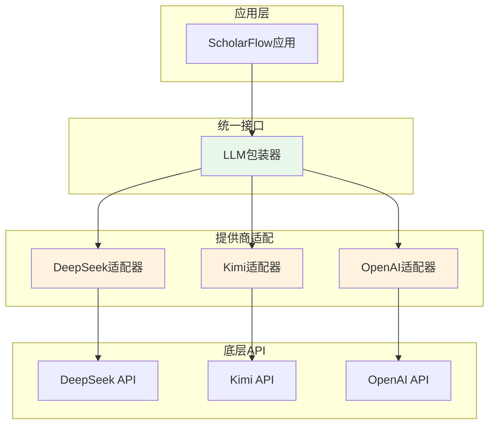

# 第10章 LLM集成与调用

## 10.1 LLM集成概述

### 10.1.1 为什么需要LLM

ScholarFlow的核心是将学术论文转化为演示文稿，这需要：

1. **理解论文内容**：
   - 提取核心观点
   - 理解研究方法
   - 总结实验结果

2. **生成结构化大纲**：
   - 转换为幻灯片格式
   - 保持逻辑连贯性
   - 突出重点内容

3. **格式转换**：
   - Markdown → Marp格式
   - 应用演示风格
   - 优化视觉呈现

### 10.1.2 LLM选择

**支持提供商**：

| 提供商 | 模型 | 优势 | 适用场景 |
|--------|------|------|----------|
| **DeepSeek** | deepseek-chat | 高性价比、中文好 | 生产环境首选 |
| **Kimi** | moonshot-v1-8k | 长文本处理强 | 处理长论文 |
| **OpenAI** | gpt-4-turbo | 稳定性高、生态成熟 | 预算充足 |
| **本地模型** | Llama/Qwen | 数据隐私、可控 | 敏感数据 |

## 10.2 统一LLM接口

### 10.2.1 设计架构



### 10.2.2 统一客户端实现

**文件位置**: `app/services/llm/provider.py`

```python
import asyncio
from typing import Dict, List, Optional, AsyncGenerator
from langchain_openai import ChatOpenAI
from langchain_core.messages import HumanMessage, SystemMessage, AIMessage


class LLMProvider:
    """统一的LLM提供商接口"""

    def __init__(
        self,
        api_key: str,
        base_url: str,
        model: str,
        max_tokens: int = 4000,
        temperature: float = 0.7
    ):
        self.api_key = api_key
        self.base_url = base_url
        self.model = model
        self.max_tokens = max_tokens
        self.temperature = temperature

        # 初始化客户端
        self.client = ChatOpenAI(
            model=model,
            openai_api_key=api_key,
            openai_api_base=base_url,
            max_tokens=max_tokens,
            temperature=temperature
        )

    async def generate(
        self,
        prompt: str,
        system_prompt: Optional[str] = None,
        **kwargs
    ) -> str:
        """
        生成文本

        Args:
            prompt: 用户提示
            system_prompt: 系统提示
            **kwargs: 额外参数

        Returns:
            生成的文本
        """
        messages = []

        if system_prompt:
            messages.append(SystemMessage(content=system_prompt))

        messages.append(HumanMessage(content=prompt))

        try:
            response = await self.client.ainvoke(messages, **kwargs)
            return response.content
        except Exception as e:
            logger.error(f"LLM生成失败: {e}")
            raise

    async def batch_generate(
        self,
        prompts: List[str],
        system_prompt: Optional[str] = None,
        max_concurrent: int = 5,
        **kwargs
    ) -> List[str]:
        """
        批量生成

        Args:
            prompts: 提示列表
            system_prompt: 系统提示
            max_concurrent: 最大并发数
            **kwargs: 额外参数

        Returns:
            生成结果列表
        """
        semaphore = asyncio.Semaphore(max_concurrent)

        async def generate_single(prompt):
            async with semaphore:
                return await self.generate(prompt, system_prompt, **kwargs)

        tasks = [generate_single(prompt) for prompt in prompts]
        results = await asyncio.gather(*tasks, return_exceptions=True)

        # 处理异常
        processed_results = []
        for i, result in enumerate(results):
            if isinstance(result, Exception):
                logger.error(f"批量生成第{i}个失败: {result}")
                processed_results.append(f"生成失败: {str(result)}")
            else:
                processed_results.append(result)

        return processed_results

    async def stream_generate(
        self,
        prompt: str,
        system_prompt: Optional[str] = None,
        **kwargs
    ) -> AsyncGenerator[str, None]:
        """
        流式生成

        Args:
            prompt: 用户提示
            system_prompt: 系统提示
            **kwargs: 额外参数

        Yields:
            生成的文本片段
        """
        messages = []

        if system_prompt:
            messages.append(SystemMessage(content=system_prompt))

        messages.append(HumanMessage(content=prompt))

        try:
            async for chunk in self.client.astream(messages, **kwargs):
                yield chunk.content
        except Exception as e:
            logger.error(f"LLM流式生成失败: {e}")
            raise


class LLMManager:
    """LLM管理器"""

    def __init__(self):
        self.providers: Dict[str, LLMProvider] = {}
        self.default_provider: Optional[str] = None

    def register_provider(self, name: str, provider: LLMProvider, set_default: bool = False):
        """注册提供商"""
        self.providers[name] = provider
        if set_default or self.default_provider is None:
            self.default_provider = name
        logger.info(f"注册LLM提供商: {name}")

    def get_provider(self, name: Optional[str] = None) -> LLMProvider:
        """获取提供商"""
        provider_name = name or self.default_provider
        if provider_name not in self.providers:
            raise ValueError(f"LLM提供商未注册: {provider_name}")
        return self.providers[provider_name]

    async def generate_with_fallback(
        self,
        prompt: str,
        system_prompt: Optional[str] = None,
        providers: Optional[List[str]] = None,
        **kwargs
    ) -> tuple[str, str]:
        """
        失败转移生成

        Args:
            prompt: 用户提示
            system_prompt: 系统提示
            providers: 尝试的提供商列表
            **kwargs: 额外参数

        Returns:
            (结果, 使用的提供商)
        """
        providers_to_try = providers or list(self.providers.keys())

        last_error = None
        for provider_name in providers_to_try:
            try:
                provider = self.get_provider(provider_name)
                result = await provider.generate(prompt, system_prompt, **kwargs)
                return result, provider_name
            except Exception as e:
                logger.warning(f"提供商 {provider_name} 失败: {e}")
                last_error = e
                continue

        # 所有提供商都失败
        raise Exception(f"所有LLM提供商都失败: {last_error}")
```

### 10.2.3 配置管理

```python
from app.core.config import get_settings


def create_llm_manager() -> LLMManager:
    """创建LLM管理器"""
    settings = get_settings()
    manager = LLMManager()

    # 注册DeepSeek
    if settings.llm_api_key:
        deepseek_provider = LLMProvider(
            api_key=settings.llm_api_key,
            base_url=settings.llm_base_url or "https://api.deepseek.com",
            model=settings.llm_model or "deepseek-chat",
            max_tokens=settings.llm_max_tokens or 4000,
            temperature=settings.llm_temperature or 0.7
        )
        manager.register_provider("deepseek", deepseek_provider, set_default=True)

    # 注册其他提供商...
    # (类似地注册Kimi、OpenAI等)

    return manager
```

## 10.3 LLM调用工作流

### 10.3.1 Stage1处理

**职责**: 为每个文本块生成幻灯片大纲

**文件位置**: `app/graph/nodes/stage1_processing.py`

```python
from app.services.llm.provider import LLMManager
from app.services.llm.prompts import get_stage1_prompt


async def node_stage1_process(state: WorkflowState) -> WorkflowState:
    """
    Stage1处理节点

    职责:
    1. 获取当前chunk
    2. 生成幻灯片大纲
    3. 累积结果
    4. 更新进度
    """
    try:
        # 1. 获取输入
        current_index = state.get("current_chunk_index", 0)
        chunks = state.get("chunks", [])
        style = state.get("presentation_style", "academic")

        if current_index >= len(chunks):
            logger.warning(f"chunk索引超出范围: {current_index}")
            return state

        chunk = chunks[current_index]

        # 2. 准备提示词
        system_prompt, user_prompt = get_stage1_prompt(style, chunk)

        # 3. 调用LLM
        llm_manager = get_llm_manager()
        result, provider_name = await llm_manager.generate_with_fallback(
            prompt=user_prompt,
            system_prompt=system_prompt
        )

        logger.info(f"Stage1 chunk {current_index} 生成完成 (提供商: {provider_name})")

        # 4. 累积结果
        stage1_results = state.get("stage1_results", [])
        stage1_results.append({
            "chunk_index": current_index,
            "outline": result,
            "provider": provider_name,
            "generated_at": datetime.now().isoformat()
        })

        # 5. 更新状态
        progress = int((current_index + 1) / len(chunks) * 20) + 40  # Stage1占40-60%
        return {
            "current_chunk_index": current_index + 1,
            "stage1_results": stage1_results,
            "status": "stage1_processing" if current_index + 1 < len(chunks) else "stage1_completed",
            "progress_percentage": progress,
            "updated_at": datetime.now().isoformat()
        }

    except Exception as e:
        logger.error(f"Stage1处理失败: {e}")
        return {
            "status": "stage1_failed",
            "error_message": str(e),
            "progress_percentage": 40,
            "updated_at": datetime.now().isoformat()
        }
```

### 10.3.2 Stage2处理

**职责**: 将大纲转换为Marp格式

**文件位置**: `app/graph/nodes/stage2_processing.py`

```python
async def node_stage2_process(state: WorkflowState) -> WorkflowState:
    """
    Stage2处理节点

    职责:
    1. 获取合并后的大纲
    2. 转换为Marp格式
    3. 恢复图片token
    4. 更新状态
    """
    try:
        # 1. 获取输入
        merged_outline = state.get("merged_outline", "")
        style = state.get("presentation_style", "academic")

        if not merged_outline:
            raise ValueError("没有可转换的大纲")

        # 2. 准备提示词
        system_prompt, user_prompt = get_stage2_prompt(style, merged_outline)

        # 3. 调用LLM
        llm_manager = get_llm_manager()
        marp_markdown, provider_name = await llm_manager.generate_with_fallback(
            prompt=user_prompt,
            system_prompt=system_prompt
        )

        logger.info(f"Stage2转换完成 (提供商: {provider_name})")

        # 4. 恢复图片token
        image_manager = ImageManager(Path("data/intermediate"))
        final_markdown = image_manager.restore_tokens_to_markdown_enhanced(
            tokenized_content=marp_markdown,
            token_map=state.get("image_token_map", {}),
            output_format="marp"
        )

        # 5. 更新状态
        return {
            "status": "stage2_completed",
            "marp_markdown": final_markdown,
            "stage2_provider": provider_name,
            "progress_percentage": 90,
            "updated_at": datetime.now().isoformat()
        }

    except Exception as e:
        logger.error(f"Stage2处理失败: {e}")
        return {
            "status": "stage2_failed",
            "error_message": str(e),
            "progress_percentage": 75,
            "updated_at": datetime.now().isoformat()
        }
```

## 10.4 提示词工程

### 10.4.1 提示词模板

**文件位置**: `app/services/llm/prompts/prompt_templates.py`

```python
from enum import Enum


class PresentationStyle(Enum):
    """演示风格"""
    ACADEMIC = "academic"
    POPULAR = "popular"
    BUSINESS = "business"


# Stage1 提示词
STAGE1_PROMPTS = {
    PresentationStyle.ACADEMIC: {
        "system": """你是一个专业的学术演示文稿助手。
你的任务是将学术论文的文本块转换为结构化的幻灯片大纲。

要求：
1. 保持学术严谨性
2. 突出研究方法和结果
3. 包含必要的数据和图表说明
4. 遵循学术演示格式

输出格式：
- 使用markdown格式
- 每个幻灯片用 ## 标题
- 列出3-5个要点
- 简洁明了，重点突出""",

        "user": """请为以下学术论文片段生成幻灯片大纲：

{chunk}

要求：
- 提取核心观点
- 保持逻辑连贯
- 适合学术演讲
- 每个幻灯片3-5个要点"""
    },

    PresentationStyle.POPULAR: {
        "system": """你是一个专业的科普演示文稿助手。
你的任务是将学术内容转换为通俗易懂的幻灯片大纲。

要求：
1. 简化专业术语
2. 使用生动的例子
3. 强调实际应用
4. 吸引观众注意

输出格式：
- 使用markdown格式
- 每个幻灯片用 ## 标题
- 列出3-5个要点
- 语言生动有趣""",

        "user": """请为以下内容生成通俗易懂的幻灯片大纲：

{chunk}

要求：
- 简化专业术语
- 用通俗语言解释
- 强调实际意义
- 适合大众理解"""
    },

    PresentationStyle.BUSINESS: {
        "system": """你是一个专业的商业演示文稿助手。
你的任务是将学术或技术内容转换为商业演示大纲。

要求：
1. 突出商业价值
2. 强调ROI和收益
3. 包含行动建议
4. 符合商业演示标准

输出格式：
- 使用markdown格式
- 每个幻灯片用 ## 标题
- 列出3-5个要点
- 强调价值主张""",

        "user": """请为以下内容生成商业演示大纲：

{chunk}

要求：
- 突出商业价值
- 强调收益和影响
- 包含实施建议
- 适合商业决策"""
    }
}


# Stage2 提示词
STAGE2_PROMPTS = {
    PresentationStyle.ACADEMIC: {
        "system": """你是一个专业的Marp演示文稿格式专家。
你的任务是将幻灯片大纲转换为完整的Marp Markdown格式。

要求：
1. 正确的Marp语法
2. 学术演示风格
3. 保持内容完整
4. 优化视觉效果

注意：
- 使用 --- 分割幻灯片
- 添加 marp: true 和 theme: academic
- 合理使用标题层级
- 保持格式整洁""",

        "user": """请将以下幻灯片大纲转换为Marp格式：

{outline}

要求：
- 完整的Marp Markdown
- 学术演示主题
- 正确的幻灯片结构
- 保持内容准确性"""
    }
}


def get_stage1_prompt(style: str, chunk: str) -> tuple[str, str]:
    """获取Stage1提示词"""
    prompt_set = STAGE1_PROMPTS.get(PresentationStyle(style), STAGE1_PROMPTS[PresentationStyle.ACADEMIC])
    user_prompt = prompt_set["user"].format(chunk=chunk)
    return prompt_set["system"], user_prompt


def get_stage2_prompt(style: str, outline: str) -> tuple[str, str]:
    """获取Stage2提示词"""
    prompt_set = STAGE2_PROMPTS.get(PresentationStyle(style), STAGE2_PROMPTS[PresentationStyle.ACADEMIC])
    user_prompt = prompt_set["user"].format(outline=outline)
    return prompt_set["system"], user_prompt
```

### 10.4.2 动态提示词优化

```python
def optimize_prompt_for_chunk(chunk: str, style: str) -> dict:
    """根据chunk特征优化提示词"""
    word_count = len(chunk.split())
    has_code = '```' in chunk
    has_table = '|' in chunk

    optimizations = {
        "max_tokens": 4000,
        "temperature": 0.7
    }

    # 根据内容调整参数
    if word_count > 1000:  # 长文本
        optimizations["temperature"] = 0.5  # 更稳定
    elif word_count < 200:  # 短文本
        optimizations["temperature"] = 0.9  # 更有创造性

    if has_code:
        optimizations["system_prompt"] += "\n注意：内容包含代码，请保持代码格式完整。"

    if has_table:
        optimizations["system_prompt"] += "\n注意：内容包含表格，请保持表格结构清晰。"

    return optimizations
```

## 10.5 错误处理与重试

### 10.5.1 重试机制

```python
import asyncio
from typing import Callable


async def retry_with_backoff(
    func: Callable,
    max_retries: int = 3,
    base_delay: float = 1.0,
    max_delay: float = 60.0,
    exponential_base: float = 2.0,
    **kwargs
):
    """
    带指数退避的重试机制

    Args:
        func: 要重试的异步函数
        max_retries: 最大重试次数
        base_delay: 基础延迟时间
        max_delay: 最大延迟时间
        exponential_base: 指数底数
        **kwargs: 传递给func的参数
    """
    last_exception = None

    for attempt in range(max_retries + 1):
        try:
            return await func(**kwargs)
        except Exception as e:
            last_exception = e

            if attempt == max_retries:
                # 最后一次尝试失败
                logger.error(f"所有重试失败，已达到最大重试次数: {max_retries}")
                raise

            # 计算延迟时间（指数退避）
            delay = min(
                base_delay * (exponential_base ** attempt),
                max_delay
            )

            logger.warning(f"第 {attempt + 1} 次尝试失败: {e}，{delay:.1f}秒后重试")
            await asyncio.sleep(delay)

    raise last_exception


# 使用示例
async def generate_with_retry(prompt: str):
    return await retry_with_backoff(
        llm_manager.generate,
        max_retries=3,
        prompt=prompt
    )
```

### 10.5.2 错误分类处理

```python
class LLMError(Exception):
    """LLM相关错误基类"""
    pass


class RateLimitError(LLMError):
    """API限流错误"""
    pass


class AuthenticationError(LLMError):
    """认证错误"""
    pass


class ModelError(LLMError):
    """模型错误"""
    pass


async def handle_llm_error(error: Exception, retry_count: int):
    """处理LLM错误"""
    error_type = type(error).__name__

    if "rate limit" in str(error).lower():
        raise RateLimitError(f"API限流: {error}")
    elif "authentication" in str(error).lower():
        raise AuthenticationError(f"认证失败: {error}")
    elif "model" in str(error).lower():
        raise ModelError(f"模型错误: {error}")
    else:
        # 其他错误，可能是临时问题，可以重试
        logger.warning(f"未知LLM错误: {error_type} - {error}")
        raise
```

## 10.6 性能优化

### 10.6.1 并发控制

```python
class LLMPool:
    """LLM连接池"""

    def __init__(self, providers: List[LLMProvider], max_concurrent: int = 5):
        self.providers = providers
        self.max_concurrent = max_concurrent
        self.semaphore = asyncio.Semaphore(max_concurrent)

    async def generate_batch(self, prompts: List[str]) -> List[str]:
        """批量生成（限制并发）"""
        async def generate_with_limit(provider: LLMProvider, prompt: str):
            async with self.semaphore:
                return await provider.generate(prompt)

        # 轮询选择提供商
        tasks = []
        for i, prompt in enumerate(prompts):
            provider = self.providers[i % len(self.providers)]
            task = generate_with_limit(provider, prompt)
            tasks.append(task)

        return await asyncio.gather(*tasks, return_exceptions=True)
```

### 10.6.2 结果缓存

```python
import hashlib
import json
from functools import lru_cache


def get_prompt_hash(prompt: str, system_prompt: str, model: str) -> str:
    """计算提示词哈希"""
    content = f"{system_prompt}:{prompt}:{model}"
    return hashlib.md5(content.encode()).hexdigest()


async def cached_generate(
    llm_provider: LLMProvider,
    prompt: str,
    system_prompt: Optional[str] = None,
    cache_ttl: int = 3600  # 1小时
) -> str:
    """带缓存的生成"""
    # 生成缓存键
    cache_key = get_prompt_hash(prompt, system_prompt or "", llm_provider.model)
    cache_file = Path(f"cache/llm/{cache_key}.json")

    # 检查缓存
    if cache_file.exists():
        try:
            async with aiofiles.open(cache_file, 'r') as f:
                cached_data = json.loads(await f.read())

            # 检查是否过期
            import time
            if time.time() - cached_data['timestamp'] < cache_ttl:
                logger.info("使用缓存的LLM结果")
                return cached_data['result']
        except Exception as e:
            logger.warning(f"读取缓存失败: {e}")

    # 生成新结果
    result = await llm_provider.generate(prompt, system_prompt)

    # 保存缓存
    cache_file.parent.mkdir(parents=True, exist_ok=True)
    async with aiofiles.open(cache_file, 'w') as f:
        await f.write(json.dumps({
            "result": result,
            "timestamp": time.time(),
            "model": llm_provider.model
        }, indent=2))

    return result
```

## 10.7 监控与日志

### 10.7.1 调用日志

```python
import time
from contextlib import asynccontextmanager


@asynccontextmanager
async def log_llm_call(provider_name: str, model: str, prompt_length: int):
    """LLM调用日志上下文管理器"""
    start_time = time.time()
    logger.info(f"开始LLM调用 - 提供商: {provider_name}, 模型: {model}, 提示长度: {prompt_length}")

    try:
        yield
    finally:
        elapsed = time.time() - start_time
        logger.info(f"LLM调用完成 - 提供商: {provider_name}, 耗时: {elapsed:.2f}s")


async def generate_with_logging(llm_provider: LLMProvider, prompt: str):
    """带日志的生成"""
    async with log_llm_call(
        provider_name=llm_provider.model,
        model=llm_provider.model,
        prompt_length=len(prompt)
    ):
        return await llm_provider.generate(prompt)
```

### 10.7.2 性能统计

```python
class LLMMetrics:
    """LLM性能指标"""

    def __init__(self):
        self.calls = []
        self.errors = []

    def record_call(self, provider: str, model: str, duration: float, tokens: int, success: bool):
        """记录调用"""
        self.calls.append({
            "timestamp": time.time(),
            "provider": provider,
            "model": model,
            "duration": duration,
            "tokens": tokens,
            "success": success
        })

        if not success:
            self.errors.append({
                "timestamp": time.time(),
                "provider": provider,
                "model": model
            })

    def get_stats(self) -> dict:
        """获取统计信息"""
        if not self.calls:
            return {}

        total_calls = len(self.calls)
        total_errors = len(self.errors)
        success_rate = (total_calls - total_errors) / total_calls

        durations = [c["duration"] for c in self.calls]
        tokens = [c["tokens"] for c in self.calls]

        return {
            "total_calls": total_calls,
            "success_rate": success_rate,
            "avg_duration": sum(durations) / len(durations),
            "min_duration": min(durations),
            "max_duration": max(durations),
            "total_tokens": sum(tokens),
            "avg_tokens_per_call": sum(tokens) / len(tokens)
        }


# 全局指标实例
llm_metrics = LLMMetrics()
```

## 10.8 最佳实践

### 10.8.1 提示词优化

1. **明确角色**：开头定义LLM的角色和能力
2. **结构化输出**：明确指定输出格式
3. **提供示例**：给出期望的输出示例
4. **约束条件**：明确不要做什么
5. **分步思考**：复杂任务分解为步骤

### 10.8.2 错误处理

1. **重试机制**：实现指数退避重试
2. **失败转移**：多提供商备份
3. **降级策略**：失败时使用简化提示词
4. **监控告警**：记录和分析错误
5. **用户反馈**：向用户报告错误

### 10.8.3 性能优化

1. **并发控制**：限制同时请求数
2. **结果缓存**：避免重复调用
3. **批处理**：合并相似请求
4. **流式输出**：实时显示结果
5. **资源监控**：跟踪API使用情况

## 10.9 章节导航

- **上一章**: [第9章 - 文本分块与处理](09_文本分块与处理.md) - 了解文本处理
- **下一章**: [第11章 - 图片Token化保护](11_图片Token化保护.md) - 了解图片保护
- **代码示例**: [LLM调用示例](code-examples/basic/07-simple-llm-call.py) - 学习使用
- **深入理解**: [第4章 - 核心概念与术语](04_核心概念与术语.md) - Token化机制

---

**本章要点**:
- ✅ 统一LLM接口，支持多提供商
- ✅ Stage1/Stage2双阶段处理
- ✅ 智能提示词工程
- ✅ 完善的错误处理和重试
- ✅ 性能优化和监控
- ✅ 失败转移和缓存机制
