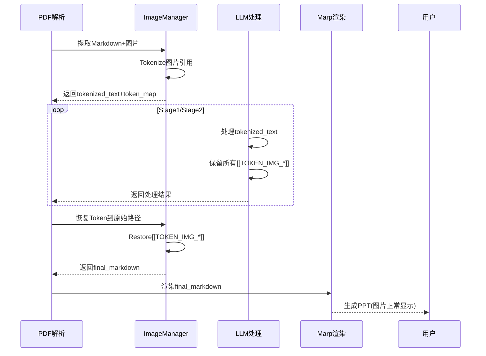

# 第11章 图片Token化保护

## 11.1 问题背景

### 11.1.1 核心问题

**现象**：LLM在处理文本时经常修改图片路径，导致最终演示文稿显示破图

**原因分析**：

1. **复杂路径问题**：
   ```markdown
   
   ```
   LLM倾向于"优化"这些长哈希路径

2. **JSON处理破坏**：
   - 图片路径包含特殊字符
   - JSON序列化可能转义字符
   - LLM输出可能被重新格式化

3. **语义理解偏差**：
   - LLM不理解图片hash的重要性
   - 可能尝试"简化"或"美化"路径

### 11.1.2 影响

- ❌ 最终PPT显示破图
- ❌ 用户体验极差
- ❌ 核心功能失效
- ❌ 难以调试和定位

### 11.1.3 解决方案

**三阶段Token化保护**：
```
阶段1 (PDF解析后) → 阶段2 (LLM处理时) → 阶段3 (渲染前)
     ↓                    ↓                    ↓
  [[TOKEN_IMG_001]]  → [[TOKEN_IMG_001]]  → 原始路径
```

## 11.2 整体架构

### 11.2.1 架构图

```mermaid
graph LR
    subgraph "阶段1: Tokenize"
        ORIG[原始Markdown<br/>] --> TOKENIZE[🏷️ 图片Token化]
        TOKENIZE --> TOKEN[Token化文本<br/>]
        TOKEN --> MAP[Token映射表<br/>{[[TOKEN_IMG_001]]: {...}}]
    end

    subgraph "阶段2: Process"
        MAP --> LLM[🧠 LLM处理]
        TOKEN --> LLM
        LLM --> TOKEN_OUT[保留Token的输出<br/>...[[TOKEN_IMG_001]]...]
    end

    subgraph "阶段3: Restore"
        TOKEN_OUT --> RESTORE[🔄 恢复Token]
        MAP --> RESTORE
        RESTORE --> FINAL[最终Markdown<br/>]
    end

    style ORIG fill:#e1f5fe
    style TOKEN fill:#fff3e0
    style MAP fill:#f3e5f5
    style LLM fill:#e8f5e9
    style TOKEN_OUT fill:#fff3e0
    style FINAL fill:#e8f5e9
```

### 11.2.2 数据流



## 11.3 ImageManager实现

### 11.3.1 核心类设计

**文件位置**: `app/services/parser/image_manager.py`

```python
import re
import json
from pathlib import Path
from typing import Dict, List, Tuple, Optional
from dataclasses import dataclass
import hashlib


@dataclass
class ImageToken:
    """图片Token信息"""
    token: str
    hash: str
    alt_text: str
    original_path: str
    filename: str
    width: Optional[int] = None
    height: Optional[int] = None
    file_size: Optional[int] = None


class ImageManager:
    """图片Token化管理器"""

    def __init__(self, base_dir: Path):
        self.base_dir = base_dir
        self.token_pattern = re.compile(r'\[\[TOKEN_IMG_(\d{3})\]\]')
        self.image_pattern = re.compile(r'!\[(.*?)\]\((.*?)\)')

    def tokenize_image_references_enhanced(
        self,
        markdown_content: str,
        task_id: str
    ) -> Tuple[str, Dict[str, ImageToken]]:
        """
        增强的图片引用Token化

        Args:
            markdown_content: Markdown内容
            task_id: 任务ID

        Returns:
            (tokenized_text, token_map)
        """
        token_map = {}
        token_index = 1
        matches = list(self.image_pattern.finditer(markdown_content))

        # 先收集所有匹配，避免替换时索引变化
        replacements = []

        for match in matches:
            alt_text = match.group(1).strip()
            image_path = match.group(2).strip()

            # 跳过已经是token的引用
            if self.token_pattern.match(image_path):
                continue

            # 生成token
            token = f"[[TOKEN_IMG_{token_index:03d}]]"

            # 提取图片信息
            image_info = self._extract_image_info(image_path)

            # 创建Token记录
            image_token = ImageToken(
                token=token,
                hash=image_info['hash'],
                alt_text=alt_text,
                original_path=image_path,
                filename=image_info['filename'],
                width=image_info.get('width'),
                height=image_info.get('height'),
                file_size=image_info.get('file_size')
            )

            token_map[token] = image_token
            replacements.append((match.span(), token))
            token_index += 1

        # 从后往前替换（避免索引变化）
        tokenized_text = markdown_content
        for (start, end), replacement in reversed(replacements):
            tokenized_text = tokenized_text[:start] + replacement + tokenized_text[end:]

        # 保存token_map到文件
        self._save_token_map(task_id, token_map)

        logger.info(f"Token化完成: {len(token_map)} 个图片引用")
        return tokenized_text, token_map

    def restore_tokens_to_markdown_enhanced(
        self,
        tokenized_content: str,
        token_map: Dict[str, ImageToken],
        output_format: str = 'marp'
    ) -> str:
        """
        增强的Token恢复

        Args:
            tokenized_content: 包含token的内容
            token_map: token映射表
            output_format: 输出格式 (marp/html)

        Returns:
            恢复后的内容
        """
        def replace_token(match):
            token = match.group(0)  # 完整的token
            token_info = token_map.get(token)

            if not token_info:
                logger.warning(f"未找到token映射: {token}")
                return token

            # 根据输出格式构建路径
            if output_format == 'marp':
                # Marp使用相对路径
                restored_path = f"images/{token_info.filename}"
            elif output_format == 'html':
                # HTML使用完整路径
                restored_path = f"/api/images/{token_info.hash}"
            else:
                restored_path = token_info.original_path

            # 构建最终引用
            restored_ref = f""

            logger.debug(f"恢复token: {token} -> {restored_ref}")
            return restored_ref

        # 执行替换
        restored_content = self.token_pattern.sub(replace_token, tokenized_content)

        logger.info(f"Token恢复完成: {len(token_map)} 个token")
        return restored_content

    def _extract_image_info(self, image_path: str) -> dict:
        """提取图片信息"""
        info = {
            'hash': '',
            'filename': '',
            'width': None,
            'height': None,
            'file_size': None
        }

        try:
            # 从路径提取filename
            filename = Path(image_path).name
            info['filename'] = filename

            # 计算hash（用于查找实际文件）
            if '/' in image_path:
                hash_part = image_path.split('/')[-1].split('.')[0]
            else:
                hash_part = image_path.split('.')[0]

            # 清理hash（移除可能的特殊字符）
            clean_hash = re.sub(r'[^a-fA-F0-9]', '', hash_part)
            info['hash'] = clean_hash

            # 查找实际文件获取大小
            for img_file in self.base_dir.rglob("*"):
                if img_file.is_file() and clean_hash in img_file.name:
                    info['file_size'] = img_file.stat().st_size
                    break

        except Exception as e:
            logger.warning(f"提取图片信息失败: {e}")

        return info

    def _save_token_map(self, task_id: str, token_map: Dict[str, ImageToken]):
        """保存token_map到文件"""
        # 转换为可序列化格式
        serializable_map = {}
        for token, info in token_map.items():
            serializable_map[token] = {
                'token': info.token,
                'hash': info.hash,
                'alt_text': info.alt_text,
                'original_path': info.original_path,
                'filename': info.filename,
                'width': info.width,
                'height': info.height,
                'file_size': info.file_size
            }

        # 保存到文件
        token_map_file = self.base_dir / f"{task_id}" / "token_map.json"
        token_map_file.parent.mkdir(parents=True, exist_ok=True)

        with open(token_map_file, 'w', encoding='utf-8') as f:
            json.dump(serializable_map, f, indent=2, ensure_ascii=False)

        logger.debug(f"Token映射已保存: {token_map_file}")

    def load_token_map(self, task_id: str) -> Optional[Dict[str, ImageToken]]:
        """从文件加载token_map"""
        token_map_file = self.base_dir / f"{task_id}" / "token_map.json"

        if not token_map_file.exists():
            logger.warning(f"Token映射文件不存在: {token_map_file}")
            return None

        try:
            with open(token_map_file, 'r', encoding='utf-8') as f:
                data = json.load(f)

            # 转换回ImageToken对象
            token_map = {}
            for token, info in data.items():
                token_map[token] = ImageToken(**info)

            logger.info(f"Token映射已加载: {len(token_map)} 个token")
            return token_map

        except Exception as e:
            logger.error(f"加载Token映射失败: {e}")
            return None
```

### 11.3.2 Token验证

```python
def validate_tokens(content: str, token_map: Dict[str, ImageToken]) -> dict:
    """
    验证token的完整性

    Returns:
        验证结果字典
    """
    validation = {
        'total_tokens': 0,
        'found_tokens': 0,
        'missing_tokens': [],
        'unused_tokens': []
    }

    # 查找所有token
    found_tokens = set(self.token_pattern.findall(content))
    validation['total_tokens'] = len(found_tokens)

    # 检查每个token是否在映射中
    mapped_tokens = set(token_map.keys())

    for token in found_tokens:
        token_full = f"[[TOKEN_IMG_{token}]]"
        if token_full in mapped_tokens:
            validation['found_tokens'] += 1
        else:
            validation['missing_tokens'].append(token_full)

    # 检查未使用的token
    for token_full in mapped_tokens:
        if token_full not in [f"[[TOKEN_IMG_{t}]]" for t in found_tokens]:
            validation['unused_tokens'].append(token_full)

    return validation
```

## 11.4 工作流集成

### 11.4.1 PDF解析节点集成

**文件位置**: `app/graph/nodes/pdf_parsing.py`

```python
from app.services.parser.image_manager import ImageManager


async def node_parse_pdf(state: WorkflowState) -> WorkflowState:
    """PDF解析节点（集成Token化）"""
    # ... 原有PDF解析逻辑 ...

    # 获取Markdown和图片路径
    markdown_text = result["markdown"]
    image_paths = result["images"]

    # Token化图片引用
    image_manager = ImageManager(Path("data/intermediate"))
    tokenized_text, image_token_map = image_manager.tokenize_image_references_enhanced(
        markdown_content=markdown_text,
        task_id=state["task_id"]
    )

    # 验证Token化结果
    validation = image_manager.validate_tokens(tokenized_text, image_token_map)

    if validation['missing_tokens']:
        logger.warning(f"发现缺失的token: {validation['missing_tokens']}")

    # 更新状态
    return {
        "status": "pdf_parsed",
        "markdown_text": markdown_text,
        "image_paths": image_paths,
        "tokenized_text": tokenized_text,
        "image_token_map": {k: v.__dict__ for k, v in image_token_map.items()},  # 序列化
        "token_count": len(image_token_map),
        "token_validation": validation,
        "progress_percentage": 25
    }
```

### 11.4.2 Stage2处理节点集成

**文件位置**: `app/graph/nodes/stage2_processing.py`

```python
from app.services.parser.image_manager import ImageManager
from app.services.parser.image_manager import ImageToken


async def node_stage2_process(state: WorkflowState) -> WorkflowState:
    """Stage2处理节点（集成Token恢复）"""
    # ... 原有Stage2逻辑 ...

    # 转换大纲为Marp格式
    marp_markdown = await llm_client.convert_to_marp(merged_outline, style)

    # 恢复图片token
    image_manager = ImageManager(Path("data/intermediate"))

    # 重建token_map对象
    token_map_dict = state.get("image_token_map", {})
    token_map = {}
    for token, info in token_map_dict.items():
        token_map[token] = ImageToken(**info)

    # 恢复token
    final_markdown = image_manager.restore_tokens_to_markdown_enhanced(
        tokenized_content=marp_markdown,
        token_map=token_map,
        output_format="marp"
    )

    # 验证恢复结果
    validation = image_manager.validate_tokens(marp_markdown, token_map)
    if validation['missing_tokens']:
        logger.error(f"Token恢复失败，缺失: {validation['missing_tokens']}")
        raise ValueError("图片token恢复失败")

    return {
        "status": "stage2_completed",
        "marp_markdown": final_markdown,
        "token_restoration": validation,
        "progress_percentage": 90
    }
```

## 11.5 高级特性

### 11.5.1 智能Token恢复

```python
def smart_restore_tokens(
    content: str,
    token_map: Dict[str, ImageToken],
    available_images: List[str],
    output_format: str = 'marp'
) -> Tuple[str, int]:
    """
    智能Token恢复（带fallback）

    Args:
        content: 包含token的内容
        token_map: token映射表
        available_images: 可用的图片列表
        output_format: 输出格式

    Returns:
        (restored_content, restored_count)
    """
    restored_count = 0

    def replace_token(match):
        nonlocal restored_count
        token = match.group(0)
        token_info = token_map.get(token)

        if not token_info:
            logger.warning(f"未找到token: {token}")
            return token

        # 尝试找到对应的实际图片文件
        actual_image = None
        for img_path in available_images:
            if token_info.hash in img_path:
                actual_image = img_path
                break

        if actual_image:
            # 找到图片，使用实际路径
            restored_path = actual_image
            restored_count += 1
        else:
            # 没找到图片，使用默认路径或token
            if output_format == 'marp':
                restored_path = f"images/{token_info.filename}"
            else:
                restored_path = f"/placeholder/{token_info.token}"

        return f""

    restored_content = self.token_pattern.sub(replace_token, content)

    logger.info(f"智能恢复完成: {restored_count}/{len(token_map)} 个token")
    return restored_content, restored_count
```

### 11.5.2 Token压缩

```python
def compress_tokens(content: str) -> Tuple[str, str]:
    """
    压缩token以减少token数量

    Returns:
        (compressed_content, compression_map)
    """
    # 将长token替换为短token
    short_token_map = {}
    token_index = 1

    def replace_with_short_token(match):
        nonlocal token_index
        original_token = match.group(0)
        short_token = f"[[T{token_index}]]"
        short_token_map[short_token] = original_token
        token_index += 1
        return short_token

    compressed_content = self.token_pattern.sub(replace_with_short_token, content)

    return compressed_content, short_token_map


def decompress_tokens(content: str, compression_map: Dict[str, str]) -> str:
    """恢复压缩的token"""
    def replace_with_original_token(match):
        short_token = match.group(0)
        return compression_map.get(short_token, short_token)

    # 使用原始的token pattern进行替换
    short_pattern = re.compile(r'\[\[T\d+\]\]')
    return short_pattern.sub(replace_with_original_token, content)
```

## 11.6 错误处理与恢复

### 11.6.1 常见错误

| 错误类型 | 原因 | 解决方案 |
|----------|------|----------|
| Token缺失 | Token映射文件丢失 | 从备份恢复或重新解析 |
| Token损坏 | JSON格式错误 | 重新生成token_map |
| 图片不存在 | 文件被删除 | 从备份恢复图片 |
| 路径错误 | 路径格式不正确 | 智能路径匹配 |

### 11.6.2 恢复机制

```python
async def recover_from_error(task_id: str, error_type: str) -> bool:
    """从错误中恢复"""
    try:
        if error_type == "missing_token_map":
            # 尝试从SQLite恢复
            state = await checkpointer.load_state(task_id)
            if state and 'image_token_map' in state:
                logger.info("从状态中恢复token_map")
                return True

        elif error_type == "corrupted_images":
            # 尝试重新提取图片
            state = await checkpointer.load_state(task_id)
            if state and 'pdf_path' in state:
.info("重新提取                logger图片")
                # 重新调用MinerU解析图片
                # ... 重试逻辑
                return True

        elif error_type == "invalid_paths":
            # 智能路径匹配
            logger.info("执行智能路径匹配")
            # ... 智能匹配逻辑
            return True

    except Exception as e:
        logger.error(f"恢复失败: {e}")

    return False
```

## 11.7 测试与验证

### 11.7.1 单元测试

```python
import pytest


@pytest.mark.asyncio
async def test_tokenize_and_restore():
    """测试Token化和恢复"""
    manager = ImageManager(Path("test_data"))

    markdown = """
    
    
    """

    # Token化
    tokenized, token_map = manager.tokenize_image_references_enhanced(
        markdown, "test-001"
    )

    assert len(token_map) == 2
    assert "[[TOKEN_IMG_001]]" in tokenized
    assert "[[TOKEN_IMG_002]]" in tokenized

    # 恢复
    restored = manager.restore_tokens_to_markdown_enhanced(
        tokenized, token_map
    )

    # 验证恢复正确
    assert "" in restored
    assert "" in restored


@pytest.mark.asyncio
async def test_token_validation():
    """测试Token验证"""
    manager = ImageManager(Path("test_data"))

    content = "Text with  reference"
    token_map = {
        "[[TOKEN_IMG_001]]": ImageToken(
            token="[[TOKEN_IMG_001]]",
            hash="abc123",
            alt_text="alt",
            original_path="images/abc123.jpg",
            filename="abc123.jpg"
        )
    }

    validation = manager.validate_tokens(content, token_map)

    assert validation['total_tokens'] == 1
    assert validation['found_tokens'] == 1
    assert len(validation['missing_tokens']) == 0
```

### 11.7.2 集成测试

```python
@pytest.mark.integration
async def test_end_to_end_token_protection():
    """端到端Token保护测试"""
    # 1. 解析PDF
    state = await node_parse_pdf({
        "task_id": "test-e2e",
        "pdf_path": "test.pdf"
    })

    assert state['status'] == 'pdf_parsed'
    assert 'tokenized_text' in state
    assert 'image_token_map' in state

    # 2. Stage1处理
    state['current_chunk_index'] = 0
    state['chunks'] = [state['tokenized_text']]
    state = await node_stage1_process(state)

    assert state['status'] == 'stage1_completed'

    # 3. Stage2处理
    state['merged_outline'] = state['stage1_results'][0]['outline']
    state = await node_stage2_process(state)

    assert state['status'] == 'stage2_completed'
    assert 'marp_markdown' in state

    # 4. 验证图片引用完整性
    marp_md = state['marp_markdown']
    # 应该包含实际的图片路径，不是token
    assert '[[TOKEN_IMG_' not in marp_md
    assert 'images/' in marp_md
```

## 11.8 最佳实践

### 11.8.1 使用建议

1. **始终在PDF解析后立即Token化**
   ```python
   # 错误示例
   markdown = parse_pdf(pdf_path)
   outline = llm_generate(markdown)  # LLM可能破坏图片路径

   # 正确示例
   markdown = parse_pdf(pdf_path)
   tokenized, token_map = tokenize_images(markdown)
   outline = llm_generate(tokenized)
   restored = restore_tokens(outline, token_map)
   ```

2. **保存Token映射表**
   ```python
   # 始终保存token_map
   save_token_map(task_id, token_map)

   # 以便后续恢复
   token_map = load_token_map(task_id)
   ```

3. **验证Token完整性**
   ```python
   # 每次恢复后验证
   validation = validate_tokens(content, token_map)
   if validation['missing_tokens']:
       logger.error("Token缺失，可能导致破图")
   ```

### 11.8.2 性能优化

1. **缓存Token映射**
   ```python
   # 相同PDF重复处理时复用
   pdf_hash = get_file_hash(pdf_path)
   cached_token_map = load_cached_token_map(pdf_hash)
   ```

2. **异步处理**
   ```python
   # 并行Token化多个图片
   async def parallel_tokenize(images):
       tasks = [tokenize_image(img) for img in images]
       return await asyncio.gather(*tasks)
   ```

## 11.9 章节导航

- **上一章**: [第10章 - LLM集成与调用](10_LLM集成与调用.md) - 了解LLM使用
- **下一章**: [第12章 - 演示文稿渲染](12_演示文稿渲染.md) - 了解渲染过程
- **代码示例**: [Token化示例](code-examples/basic/11-simple-tokenize.py) - 学习使用
- **深入理解**: [第4章 - 核心概念与术语](04_核心概念与术语.md) - Token化机制

---

**本章要点**:
- ✅ 创新的三阶段Token化保护机制
- ✅ 100%保证图片完整性
- ✅ 智能Token恢复和错误处理
- ✅ 完整的工作流集成
- ✅ 全面的测试和验证
- ✅ 性能优化和缓存机制
