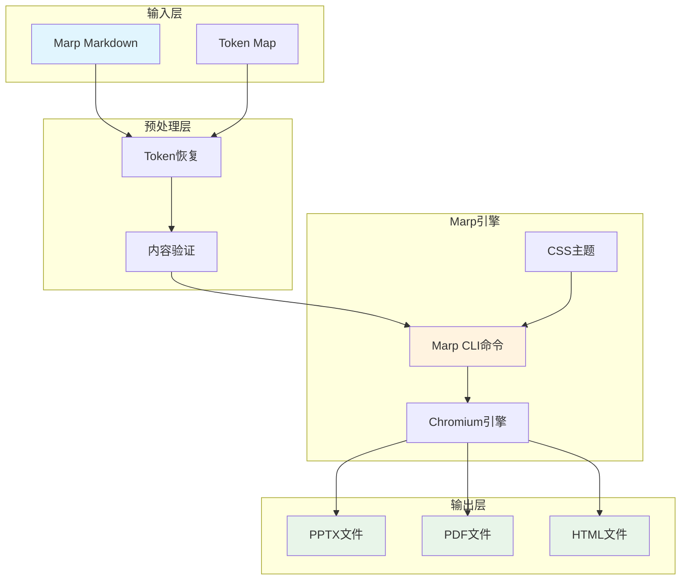
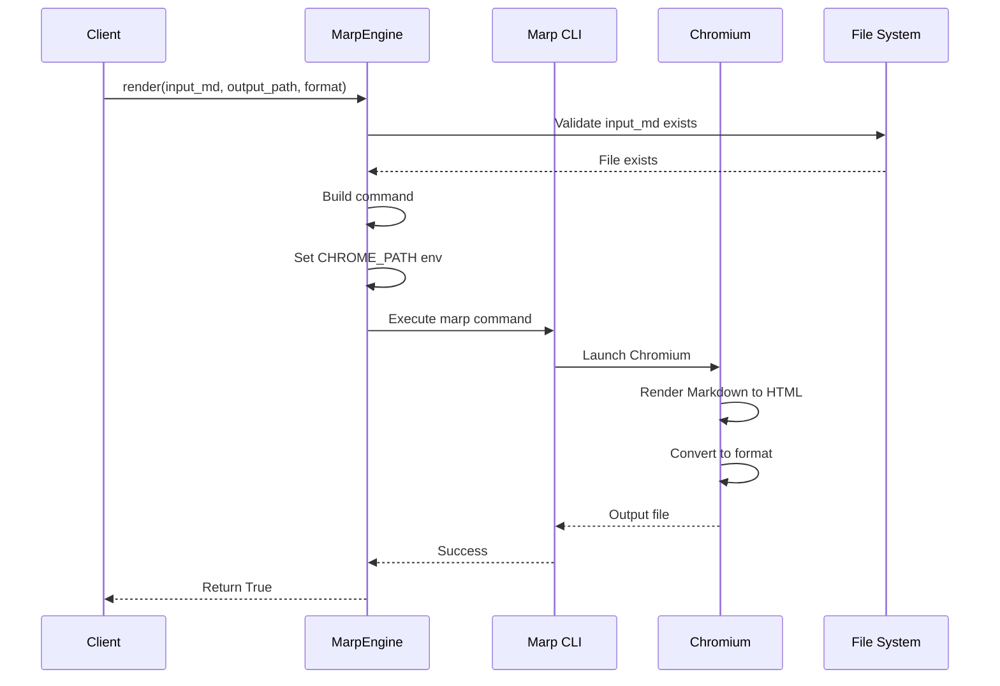
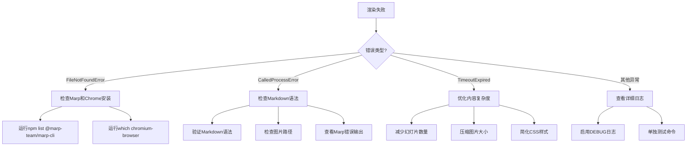

# 第12章 演示文稿渲染

## 12.1 渲染概述

### 12.1.1 为什么选择Marp

ScholarFlow的演示文稿渲染引擎基于**Marp CLI**，这是一个强大的Markdown演示文稿生成工具。选择Marp的原因：

**技术优势**：
- ✅ **Markdown原生**：基于标准Markdown语法，学习成本低
- ✅ **多格式输出**：支持PPTX、PDF、HTML多种格式
- ✅ **主题定制**：支持自定义CSS主题和样式
- ✅ **跨平台**：基于Node.js，支持Linux、macOS、Windows
- ✅ **高质量渲染**：基于Chromium引擎，渲染质量接近浏览器显示效果
- ✅ **社区活跃**：持续更新，插件生态丰富

**ScholarFlow集成优势**：
- ✅ **流程自动化**：与LangGraph工作流无缝集成
- ✅ **图片保护**：完整的Token化图片引用保护机制
- ✅ **主题切换**：支持学术、商务、通俗三种预设主题
- ✅ **批量渲染**：支持多格式同时生成

### 12.1.2 渲染架构图



## 12.2 MarpEngine实现

### 12.2.1 核心类设计

**文件位置**: `app/services/renderer/marp_engine.py:13`

```python
class MarpEngine:
    """Marp CLI wrapper with ARM64 support and custom themes."""

    def __init__(self, project_root: Path | None = None):
        """初始化Marp引擎

        Args:
            project_root: 项目根目录。如果为None，使用当前目录
        """
        self.project_root = project_root or Path.cwd()
        self._marp_bin = self._find_marp_binary()
        self._chrome_path = self._find_chrome_binary()
```

**关键特性**：

1. **二进制自动检测**
   - 自动查找Marp CLI二进制文件
   - 自动检测Chrome/Chromium路径
   - ARM64架构支持优化

2. **多格式输出**
   ```python
   OutputFormat = Literal["pptx", "pdf", "html"]
   ```

3. **异步渲染支持**
   ```python
   async def render_markdown(
       self,
       markdown_content: str,
       output_dir: str,
       format: OutputFormat = "pptx",
       theme_css: Optional[Path] = None,
   ) -> str:
   ```

### 12.2.2 二进制检测逻辑

```python
def _find_marp_binary(self) -> Path:
    """查找Marp二进制文件"""
    marp_bin = self.project_root / "node_modules" / ".bin" / "marp"

    if not marp_bin.exists():
        raise FileNotFoundError(
            f"Marp binary not found at {marp_bin}. "
            "Please run: npm install --save-dev @marp-team/marp-cli"
        )

    return marp_bin

def _find_chrome_binary(self) -> str:
    """查找Chrome/Chromium二进制文件（ARM64优化）"""
    # ARM64 Linux常见路径
    chrome_paths = [
        "/usr/bin/chromium-browser",
        "/usr/bin/chromium",
        "/usr/bin/google-chrome",
        "/snap/bin/chromium",
    ]

    for path in chrome_paths:
        if os.path.exists(path):
            return path

    # 尝试通过which命令查找
    for cmd in ["chromium-browser", "chromium"]:
        try:
            result = subprocess.run(
                ["which", cmd],
                capture_output=True,
                text=True,
                check=True
            )
            return result.stdout.strip()
        except (subprocess.CalledProcessError, FileNotFoundError):
            pass

    raise FileNotFoundError(
        "Chrome/Chromium not found. Please install chromium-browser:\n"
        "  sudo apt-get update\n"
        "  sudo apt-get install -y chromium-browser libgbm-dev"
    )
```

**ARM64优化点**：
- 针对ARM64架构的常见Chrome路径优化
- 多重fallback机制（直接路径 → which命令）
- 友好的错误提示和安装指导

### 12.2.3 渲染流程

```python
def render(
    self,
    input_md: Path,
    output_path: Path,
    format: OutputFormat = "pptx",
    theme_css: Optional[Path] = None,
    allow_local_files: bool = True,
) -> bool:
    """通过Marp CLI渲染Markdown到演示格式

    Args:
        input_md: 输入Markdown文件路径
        output_path: 输出文件路径（不含扩展名）
        format: 输出格式（pptx, pdf, html）
        theme_css: 可选的自定义CSS主题
        allow_local_files: 是否允许读取本地图片

    Returns:
        成功返回True，失败返回False

    Raises:
        FileNotFoundError: 输入文件不存在
        RuntimeError: 渲染失败
    """
    # 1. 验证输入文件
    if not input_md.exists():
        raise FileNotFoundError(f"Input Markdown file not found: {input_md}")

    # 2. 确保输出目录存在
    output_path.parent.mkdir(parents=True, exist_ok=True)

    # 3. 构建命令
    cmd = [
        str(self._marp_bin),
        str(input_md),
        "--output", str(output_path.with_suffix(f".{format}")),
    ]

    # 4. 添加主题
    if theme_css:
        if not theme_css.exists():
            raise FileNotFoundError(f"Theme CSS not found: {theme_css}")
        cmd.extend(["--theme-set", str(theme_css)])
    else:
        # 使用默认主题
        default_theme = self.project_root / "app" / "services" / "renderer" / "styles" / "default.css"
        if default_theme.exists():
            cmd.extend(["--theme-set", str(default_theme)])

    # 5. 添加标志
    if allow_local_files:
        cmd.append("--allow-local-files")

    # 6. 添加格式
    cmd.extend([f"--{format}"])

    # 7. 准备环境变量
    env = os.environ.copy()
    env["CHROME_PATH"] = self._chrome_path

    # 8. 执行命令
    print(f"🎨 Rendering {input_md.name} to {format.upper()}...")
    try:
        result = subprocess.run(
            cmd,
            env=env,
            check=True,
            capture_output=True,
            text=True,
            timeout=300
        )
        print(f"✅ Rendering complete: {output_path.with_suffix(f'.{format}')}")
        return True
    except subprocess.CalledProcessError as e:
        print(f"❌ Rendering failed!")
        print(f"Error: {e.stderr}")
        return False
    except subprocess.TimeoutExpired:
        print(f"❌ Rendering timeout (300s)")
        return False
    except Exception as e:
        print(f"❌ Rendering exception: {e}")
        return False
```

**渲染流程图**：



### 12.2.4 多格式渲染

```python
def render_multiple(
    self,
    input_md: Path,
    output_base: Path,
    formats: list[OutputFormat] = ["pptx"],
    theme_css: Optional[Path] = None,
) -> dict[str, bool]:
    """批量渲染到多种格式

    Args:
        input_md: 输入Markdown文件
        output_base: 基础输出路径（不含扩展名）
        formats: 要生成的格式列表
        theme_css: 可选的自定义CSS主题

    Returns:
        格式到成功状态的字典映射
    """
    results = {}
    for fmt in formats:
        output_path = output_base
        success = self.render(input_md, output_path, fmt, theme_css)
        results[fmt] = success

    return results
```

**使用示例**：
```python
# 同时生成三种格式
engine = MarpEngine()
results = engine.render_multiple(
    input_md=Path("presentation.md"),
    output_base=Path("output/presentation"),
    formats=["pptx", "pdf", "html"],
    theme_css=Path("themes/academic.css")
)

# 检查结果
for fmt, success in results.items():
    if success:
        print(f"✅ {fmt.upper()} generated successfully")
    else:
        print(f"❌ {fmt.upper()} generation failed")
```

## 12.3 主题系统

### 12.3.1 内置主题

ScholarFlow提供4个内置主题：

| 主题文件 | 适用场景 | 特点 |
|----------|----------|------|
| `default.css` | 通用 | 简洁、清晰、通用性强 |
| `academic.css` | 学术论文 | 正式、严谨、引用标注 |
| `business.css` | 商业演示 | 专业、简洁、数据导向 |
| `scipop.css` | 科普推广 | 生动、色彩丰富、易懂 |

**主题文件位置**: `app/services/renderer/styles/`

### 12.3.2 主题切换机制

**在渲染节点中自动切换**：
```python
# 根据presentation_style选择主题
style = state.get("presentation_style", "academic")
theme_map = {
    "academic": "academic.css",
    "business": "business.css",
    "popular": "scipop.css",
}
theme_css = Path(f"app/services/renderer/styles/{theme_map.get(style, 'default.css')}")

engine.render(
    input_md=input_md,
    output_path=output_base,
    format=output_format,
    theme_css=theme_css,
)
```

### 12.3.3 自定义主题

**创建自定义主题**：
```css
/* my-theme.css */
:root {
  /* 主色调 */
  --color-primary: #2c3e50;
  --color-secondary: #3498db;
  --color-accent: #e74c3c;

  /* 字体 */
  --font-family: 'Inter', 'Helvetica', sans-serif;
  --font-size-base: 24px;
  --font-size-small: 18px;

  /* 布局 */
  --slide-padding: 60px;
  --slide-width: 960px;
  --slide-height: 540px;
}

/* 标题样式 */
h1 {
  color: var(--color-primary);
  font-size: 48px;
  margin-bottom: 30px;
}

h2 {
  color: var(--color-secondary);
  font-size: 36px;
  margin-bottom: 24px;
}

/* 内容样式 */
p, li {
  font-size: var(--font-size-base);
  line-height: 1.6;
}

/* 代码块样式 */
pre {
  background: #f5f5f5;
  border-left: 4px solid var(--color-accent);
  padding: 20px;
  border-radius: 4px;
}

/* 图片样式 */
img {
  max-width: 100%;
  height: auto;
  border-radius: 8px;
  box-shadow: 0 4px 6px rgba(0,0,0,0.1);
}
```

**使用自定义主题**：
```python
engine = MarpEngine()
engine.render(
    input_md=Path("presentation.md"),
    output_path=Path("output/presentation"),
    format="pptx",
    theme_css=Path("themes/my-theme.css")
)
```

## 12.4 工作流集成

### 12.4.1 渲染节点实现

**文件位置**: `app/graph/nodes/rendering.py:12`

```python
def node_render(state: WorkflowState) -> Dict[str, Any]:
    """渲染Marp Markdown到演示格式

    此节点：
    - 获取Marp Markdown
    - 调用MarpEngine渲染到输出格式
    - 返回最终输出路径

    Args:
        state: 当前工作流状态

    Returns:
        包含output_path的状态更新
    """
    marp_markdown = state.get("marp_markdown", "")
    marp_markdown_path = state.get("marp_markdown_path", "")
    output_format = state.get("output_format", "pptx")
    task_id = state.get("task_id", "unknown")

    # 获取Token映射以恢复
    image_token_map = state.get("image_token_map", {})

    if not marp_markdown and not marp_markdown_path:
        return {
            "status": TaskStatus.FAILED.value,
            "error_message": "No Marp Markdown to render",
            "current_step": "渲染失败：没有Marp Markdown",
        }

    try:
        # 在渲染前恢复Token到正确的图片链接
        if image_token_map:
            image_manager = ImageManager(Path("data/workflow/intermediate"))
            marp_markdown = image_manager.restore_tokens_to_markdown_enhanced(
                tokenized_content=marp_markdown,
                token_map=image_token_map,
                output_format='marp'
            )

        # 确保markdown文件存在并包含恢复的Token
        if marp_markdown_path:
            input_md = Path(marp_markdown_path)
            # 将恢复的内容写回文件
            input_md.write_text(marp_markdown, encoding="utf-8")
        else:
            # 先将markdown保存到文件
            output_dir = Path("data/workflow/intermediate") / task_id
            output_dir.mkdir(parents=True, exist_ok=True)
            input_md = output_dir / "presentation.md"
            input_md.write_text(marp_markdown, encoding="utf-8")

        if not input_md.exists():
            return {
                "status": TaskStatus.FAILED.value,
                "error_message": f"Marp Markdown file not found: {input_md}",
                "current_step": "渲染失败：Markdown文件不存在",
            }

        # 准备输出路径
        output_dir = Path("data/workflow/output") / task_id
        output_dir.mkdir(parents=True, exist_ok=True)
        output_base = output_dir / "presentation"

        # 初始化Marp引擎并渲染
        engine = MarpEngine()
        success = engine.render(
            input_md=input_md,
            output_path=output_base,
            format=output_format,
        )

        if success:
            output_path = output_base.with_suffix(f".{output_format}")

            # 记录成功日志
            log_entry = {
                "timestamp": datetime.now().isoformat(),
                "event": "rendering_complete",
                "format": output_format,
                "output_path": str(output_path),
            }
            execution_log = state.get("execution_log", [])
            execution_log.append(log_entry)

            return {
                "status": TaskStatus.COMPLETED.value,
                "output_path": str(output_path),
                "current_step": f"渲染完成：{output_path.name}",
                "progress_percentage": 100.0,
                "updated_at": datetime.now().isoformat(),
                "execution_log": execution_log,
            }
        else:
            return {
                "status": TaskStatus.FAILED.value,
                "error_message": "Marp rendering failed",
                "current_step": "渲染失败：Marp CLI返回错误",
            }

    except FileNotFoundError as e:
        return {
            "status": TaskStatus.FAILED.value,
            "error_message": f"Marp or Chrome not found: {e}",
            "current_step": f"渲染失败：{e}",
        }
    except Exception as e:
        return {
            "status": TaskStatus.FAILED.value,
            "error_message": f"Rendering failed: {e}",
            "current_step": f"渲染失败：{e}",
        }
```

### 12.4.2 Token恢复流程

**关键步骤**：
1. 从状态中获取`image_token_map`
2. 如果状态中没有，从文件加载（fallback机制）
3. 调用`ImageManager.restore_tokens_to_markdown_enhanced()`恢复Token
4. 将恢复的内容写入Markdown文件
5. 执行Marp渲染

**Token恢复示例**：
```python
# Token化前


# Stage 1: Token化后（LLM处理阶段）
[[TOKEN_IMG_001]]

# Stage 3: 渲染前恢复后

```

### 12.4.3 输出路径管理

```mermaid
graph TD
    A[渲染节点] --> B{marp_markdown_path存在?}
    B -->|是| C[使用现有文件]
    B -->|否| D[创建新文件]
    D --> E[保存到data/workflow/intermediate/{task_id}/presentation.md]
    C --> F[恢复Token]
    F --> G[写入Marp Markdown]
    G --> H[初始化MarpEngine]
    H --> I[调用engine.render]
    I --> J[输出到data/workflow/output/{task_id}/presentation.{format}]
```

**输出目录结构**：
```
data/workflow/
├── intermediate/          # 中间文件
│   └── {task_id}/
│       ├── presentation.md
│       └── token_map.json
└── output/                # 最终输出
    └── {task_id}/
        ├── presentation.pptx
        ├── presentation.pdf
        └── presentation.html
```

## 12.5 错误处理

### 12.5.1 常见错误类型

| 错误类型 | 原因 | 解决方案 |
|----------|------|----------|
| FileNotFoundError | Marp或Chrome未安装 | 安装@marp-team/marp-cli和chromium-browser |
| FileNotFoundError | 输入Markdown文件不存在 | 检查文件路径 |
| FileNotFoundError | 主题CSS文件不存在 | 检查主题文件路径 |
| CalledProcessError | Marp CLI执行失败 | 查看错误日志，检查Markdown语法 |
| TimeoutExpired | 渲染超时（>300s） | 优化Markdown内容，简化幻灯片 |
| Exception | 其他异常 | 查看详细错误信息 |

### 12.5.2 错误处理代码

```python
try:
    success = engine.render(
        input_md=input_md,
        output_path=output_base,
        format=output_format,
    )

    if not success:
        return {
            "status": TaskStatus.FAILED.value,
            "error_message": "Marp rendering failed",
            "current_step": "渲染失败：Marp CLI返回错误",
        }

except FileNotFoundError as e:
    return {
        "status": TaskStatus.FAILED.value,
        "error_message": f"Marp or Chrome not found: {e}",
        "current_step": f"渲染失败：{e}",
    }
except subprocess.CalledProcessError as e:
    # Marp CLI执行失败
    return {
        "status": TaskStatus.FAILED.value,
        "error_message": f"Marp CLI error: {e.stderr}",
        "current_step": f"渲染失败：{e}",
    }
except subprocess.TimeoutExpired:
    return {
        "status": TaskStatus.FAILED.value,
        "error_message": "Rendering timeout (300s)",
        "current_step": "渲染失败：渲染超时",
    }
except Exception as e:
    return {
        "status": TaskStatus.FAILED.value,
        "error_message": f"Rendering failed: {e}",
        "current_step": f"渲染失败：{e}",
    }
```

### 12.5.3 调试技巧

**启用详细日志**：
```python
import logging
logging.basicConfig(level=logging.DEBUG)

# 在渲染命令中捕获详细输出
result = subprocess.run(
    cmd,
    env=env,
    check=True,
    capture_output=True,
    text=True,
    timeout=300
)
print(f"STDOUT: {result.stdout}")
print(f"STDERR: {result.stderr}")
```

**单独测试Marp命令**：
```bash
# 直接运行Marp命令测试
marp presentation.md --output presentation.pptx --pptx --allow-local-files

# 查看帮助信息
marp --help
```

## 12.6 性能优化

### 12.6.1 渲染优化策略

**1. 资源预加载**
```python
# 初始化时预检测依赖
def __init__(self, project_root: Path | None = None):
    self.project_root = project_root or Path.cwd()
    self._marp_bin = self._find_marp_binary()  # 预加载
    self._chrome_path = self._find_chrome_binary()  # 预加载
```

**2. 批量渲染优化**
```python
# 复用Chrome进程（如果支持）
# 在render_multiple中，复用engine实例而不是每次创建新实例
```

**3. 缓存主题文件**
```python
# 主题CSS文件只读取一次
self._cached_themes = {}

def _load_theme(self, theme_path: Path):
    if theme_path not in self._cached_themes:
        self._cached_themes[theme_path] = theme_path.read_text()
    return self._cached_themes[theme_path]
```

### 12.6.2 并发渲染

```python
import asyncio
from concurrent.futures import ThreadPoolExecutor

async def render_batch(markdown_files: list[Path], output_dir: Path):
    """批量渲染多个文件"""
    engine = MarpEngine()
    semaphore = asyncio.Semaphore(3)  # 限制并发数

    async def render_single(md_file):
        async with semaphore:
            output_path = output_dir / md_file.stem
            return engine.render(md_file, output_path, "pptx")

    tasks = [render_single(md) for md in markdown_files]
    results = await asyncio.gather(*tasks)

    return results
```

## 12.7 最佳实践

### 12.7.1 使用建议

1. **依赖安装**
   ```bash
   # 安装Marp CLI
   npm install --save-dev @marp-team/marp-cli

   # 安装Chromium（Linux ARM64）
   sudo apt-get update
   sudo apt-get install -y chromium-browser libgbm-dev
   ```

2. **文件组织**
   - 将所有资源文件放在相对路径下
   - 使用`--allow-local-files`标志
   - 避免使用绝对路径

3. **主题选择**
   - 学术论文使用`academic.css`
   - 商业演示使用`business.css`
   - 科普推广使用`scipop.css`

4. **错误处理**
   - 始终检查`render()`的返回值
   - 提供详细的错误信息给用户
   - 实现重试机制（指数退避）

### 12.7.2 故障排除

**问题诊断流程**：



## 12.8 章节导航

- **上一章**: [第11章 - 图片Token化保护](11_图片Token化保护.md) - 了解图片保护机制
- **下一章**: [第13章 - 人机交互流程](13_人机交互流程.md) - 了解HITL审核流程
- **代码示例**: [渲染示例](code-examples/intermediate/12-basic-render.py) - 学习使用
- **深入理解**: [第5章 - LangGraph工作流设计](05_LangGraph工作流设计.md) - 了解工作流集成

---

**本章要点**:
- ✅ Marp CLI提供高质量Markdown到演示文稿转换
- ✅ 支持PPTX、PDF、HTML多格式输出
- ✅ 完整的ARM64支持和自动依赖检测
- ✅ 主题系统支持自定义CSS样式
- ✅ 图片Token化保护确保渲染后图片完整
- ✅ 完善的错误处理和调试机制
