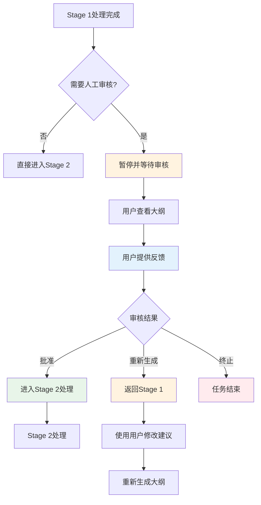
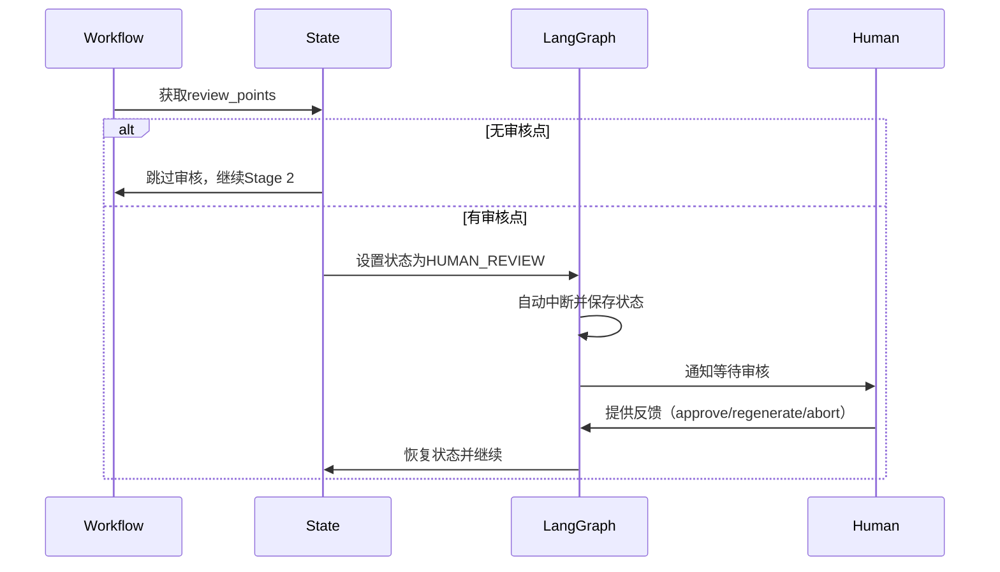
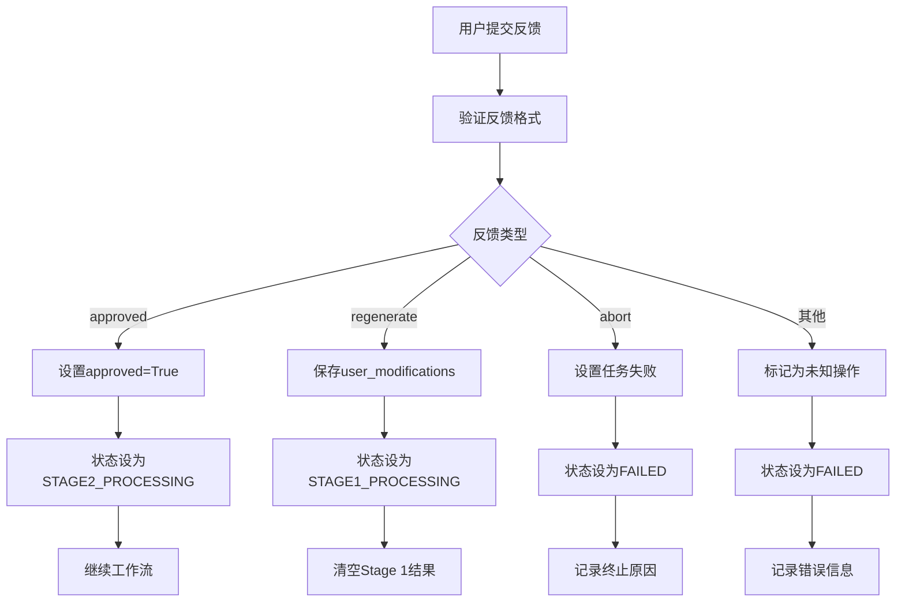
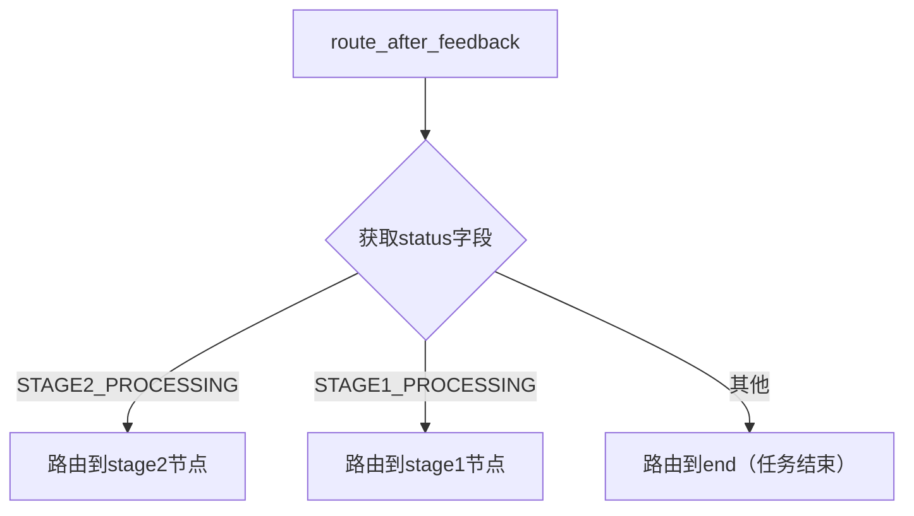
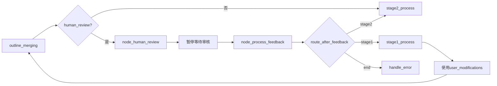
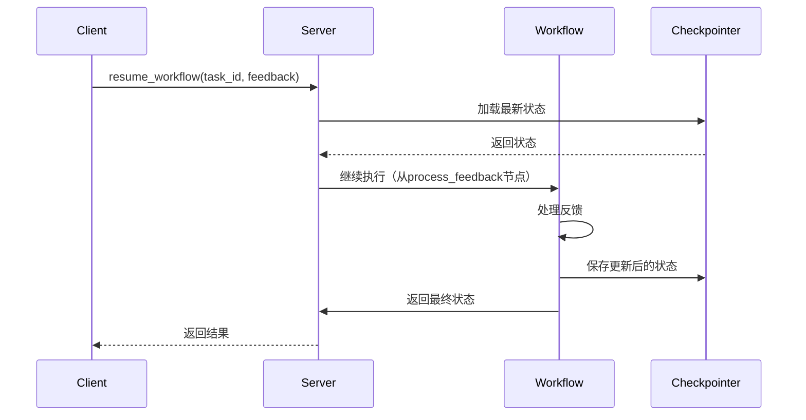

# 第13章 人机交互流程

## 13.1 HITL概述

### 13.1.1 什么是HITL

**Human-in-the-Loop (HITL)** 是一种人工智能系统设计模式，在关键决策点引入人类干预。ScholarFlow采用HITL机制，确保生成的演示文稿质量和准确性。

**HITL的价值**：
- ✅ **质量保证**：人工审核确保输出符合预期
- ✅ **错误纠正**：及时发现并修正LLM生成错误
- ✅ **个性化定制**：用户可调整内容以满足特定需求
- ✅ **可控性**：用户掌握最终决定权
- ✅ **透明度**：清晰展示每个处理步骤

**ScholarFlow中的HITL应用**：
- Stage 1完成后的大纲审核
- 用户可选择批准、重新生成或终止
- 保留用户修改建议用于重新生成
- 支持多轮审核和迭代改进

### 13.1.2 HITL工作流图



## 13.2 审核数据结构

### 13.2.1 ReviewPoint结构

**文件位置**: `app/graph/state.py:55`

```python
class ReviewPoint(TypedDict):
    """审核点数据结构"""

    type: str          # 审核类型（如"outline", "content"）
    node: str          # 触发审核的节点名称
    content: str       # 需要审核的内容
    prompt: Optional[str]  # 审核提示或问题
    timestamp: str     # 审核点创建时间
```

**使用示例**：
```python
review_point = ReviewPoint(
    type="outline",
    node="outline_merging",
    content="# 机器学习概述\n\n## 监督学习\n...",
    prompt="请审核这个大纲结构是否合理",
    timestamp=datetime.now().isoformat()
)
```

### 13.2.2 WorkflowState中的审核字段

**文件位置**: `app/graph/state.py:117`

```python
class WorkflowState(TypedDict, total=False):
    # ...

    # ===== Human-in-the-loop =====
    needs_human_review: bool
    review_points: List[ReviewPoint]
    human_feedback: Dict[str, Any]
    approved: bool
    user_modifications: str  # 用户修改建议
```

**字段说明**：

| 字段名 | 类型 | 说明 |
|--------|------|------|
| `needs_human_review` | bool | 是否需要人工审核 |
| `review_points` | List[ReviewPoint] | 审核点列表 |
| `human_feedback` | Dict[str, Any] | 用户反馈数据 |
| `approved` | bool | 审核是否通过 |
| `user_modifications` | str | 用户修改建议（用于重新生成） |

### 13.2.3 审核初始化

**在create_initial_state中设置**：
```python
# Human-in-the-loop
needs_human_review=enable_human_review,
review_points=[],
human_feedback={},
approved=False,
user_modifications="",
```

**enable_human_review参数**：
```python
def create_initial_state(
    task_id: str,
    pdf_path: str,
    presentation_style: str = PresentationStyle.ACADEMIC.value,
    max_chars: int = 8000,
    target_chunks: int = 3,
    output_format: str = "pptx",
    enable_human_review: bool = True,  # 默认启用HITL
    max_retries: int = 3,
) -> WorkflowState:
```

## 13.3 审核节点实现

### 13.3.1 人工审核节点

**文件位置**: `app/graph/nodes/human_review.py:11`

```python
def node_human_review(state: WorkflowState) -> Dict[str, Any]:
    """准备人工审核状态

    此节点在需要人工审核时触发。
    它设置审核上下文并暂停等待人工输入。

    Args:
        state: 当前工作流状态

    Returns:
        包含审核设置的状态更新
    """
    # 审核点应由前一个节点设置
    review_points = state.get("review_points", [])

    if not review_points:
        # 无需审核，继续
        return {
            "status": TaskStatus.STAGE2_PROCESSING.value,
            "needs_human_review": False,
            "approved": True,
            "current_step": "无需审核，继续处理",
        }

    # 更新审核状态
    log_entry = {
        "timestamp": datetime.now().isoformat(),
        "event": "human_review_requested",
        "review_type": review_points[0].get("type", "unknown"),
    }
    execution_log = state.get("execution_log", [])
    execution_log.append(log_entry)

    # 注意：LangGraph会在中断前自动保存状态
    # 无需手动持久化
    result = {
        "status": TaskStatus.HUMAN_REVIEW.value,
        "needs_human_review": True,
        "current_step": "等待人工审核",
        "updated_at": datetime.now().isoformat(),
        "execution_log": execution_log,
    }
    # LangGraph会在到达process_feedback前自动中断并保存状态，无需手动保存
    return result
```

**审核流程图**：



### 13.3.2 审核点设置

**在outline_merging节点中添加审核点**：
```python
# 检查是否需要人工审核
if state.get("needs_human_review", False):
    review_points = [
        ReviewPoint(
            type="outline",
            node="outline_merging",
            content=merged_outline,
            prompt="请审核这个大纲结构是否合理，内容是否完整？",
            timestamp=datetime.now().isoformat()
        )
    ]

    return {
        "status": TaskStatus.HUMAN_REVIEW.value,
        "review_points": review_points,
        "needs_human_review": True,
        "current_step": "等待人工审核大纲",
    }
```

### 13.3.3 自动中断机制

**LangGraph中断流程**：

1. **节点返回暂停状态**：
   ```python
   return {
       "status": TaskStatus.HUMAN_REVIEW.value,
       "needs_human_review": True,
       # ...
   }
   ```

2. **LangGraph检测到暂停状态**：
   - 自动保存当前状态到Checkpointer
   - 中断工作流执行
   - 等待外部resume信号

3. **等待人工输入**：
   - 前端显示审核界面
   - 用户查看审核点
   - 用户提交反馈（approve/reject/modify）

## 13.4 反馈处理

### 13.4.1 反馈处理节点

**文件位置**: `app/graph/nodes/human_review.py:57`

```python
def node_process_feedback(state: WorkflowState) -> Dict[str, Any]:
    """处理人工反馈并确定下一步操作

    此节点在人工提供反馈后调用。
    它根据反馈路由到适当的下一步。

    Args:
        state: 包含human_feedback的当前工作流状态

    Returns:
        基于反馈的状态更新
    """
    # 处理Command(resume=...)中的resume值
    feedback_data = state.get("human_feedback", {})
    # 如果使用Command且resume值直接是反馈字典
    if not feedback_data and isinstance(state.get("input"), dict):
        potential_feedback = state.get("input", {})
        if isinstance(potential_feedback, dict) and "action" in potential_feedback:
            feedback_data = potential_feedback
    # Fallback：也检查input本身就是反馈
    if not feedback_data and isinstance(state.get("input"), dict):
        input_data = state.get("input", {})
        if isinstance(input_data, dict) and any(k in input_data for k in ["action", "approved", "comments"]):
            feedback_data = input_data

    approved = feedback_data.get("approved", False)
    action = feedback_data.get("action", "")
    comments = feedback_data.get("comments", "")

    # 记录反馈
    log_entry = {
        "timestamp": datetime.now().isoformat(),
        "event": "human_feedback_received",
        "approved": approved,
        "action": action,
        "has_comments": bool(comments),
    }
    execution_log = state.get("execution_log", [])
    execution_log.append(log_entry)

    if approved:
        # 审核通过 - 继续Stage 2
        result = {
            "status": TaskStatus.STAGE2_PROCESSING.value,
            "approved": True,
            "needs_human_review": False,
            "review_points": [],
            "current_step": "审核通过，进入Stage 2",
            "progress_percentage": 60.0,
            "updated_at": datetime.now().isoformat(),
            "execution_log": execution_log,
        }
        return result
    elif action == "regenerate":
        # 请求重新生成 - 返回Stage 1
        # 保存用户修改建议
        result = {
            "status": TaskStatus.STAGE1_PROCESSING.value,
            "approved": False,
            "needs_human_review": False,
            "review_points": [],
            "current_chunk_index": 0,
            "stage1_results": [],
            "stage1_completed": 0,
            "merged_outline": "",
            "user_modifications": comments,  # 保存用户修改建议供Stage 1使用
            "current_step": "根据反馈重新生成大纲",
            "progress_percentage": 20.0,
            "updated_at": datetime.now().isoformat(),
            "execution_log": execution_log,
        }
        return result
    elif action == "abort":
        # 终止任务
        result = {
            "status": TaskStatus.FAILED.value,
            "approved": False,
            "error_message": f"Task aborted by user. Reason: {comments}",
            "current_step": "任务被用户终止",
            "updated_at": datetime.now().isoformat(),
            "execution_log": execution_log,
        }
        return result
    else:
        # 未定义的操作，结束任务
        result = {
            "status": TaskStatus.FAILED.value,
            "approved": False,
            "error_message": f"未知的反馈操作: {action}",
            "current_step": "任务因未知操作而结束",
            "updated_at": datetime.now().isoformat(),
            "execution_log": execution_log,
        }
        return result
```

### 13.4.2 反馈数据结构

**标准反馈格式**：
```python
feedback = {
    "approved": True,           # 审核是否通过
    "action": "approve",        # 操作类型（approve/regenerate/abort）
    "comments": "看起来不错",    # 用户评论或修改建议
}
```

**三种反馈类型**：

1. **approved (批准)**：
   ```python
   {
       "approved": True,
       "action": "approve",
       "comments": "内容很好，可以继续"
   }
   ```

2. **regenerate (重新生成)**：
   ```python
   {
       "approved": False,
       "action": "regenerate",
       "comments": "请增加更多关于深度学习的内容，减少传统机器学习部分"
   }
   ```

3. **abort (终止)**：
   ```python
   {
       "approved": False,
       "action": "abort",
       "comments": "这个论文不适合做演示文稿"
   }
   ```

### 13.4.3 反馈处理流程



## 13.5 路由逻辑

### 13.5.1 反馈后路由

**文件位置**: `app/graph/nodes/human_review.py:155`

```python
def route_after_feedback(state: WorkflowState) -> Literal["stage1", "stage2", "end"]:
    """基于人工反馈结果路由

    Args:
        state: 当前工作流状态

    Returns:
        下一个要执行的节点
    """
    status = state.get("status", "")

    if status == TaskStatus.STAGE2_PROCESSING.value:
        return "stage2"
    elif status == TaskStatus.STAGE1_PROCESSING.value:
        return "stage1"
    else:
        return "end"
```

**路由决策树**：



### 13.5.2 工作流中的路由配置

**在workflow.py中配置**：
```python
# 审核反馈后路由
workflow.add_conditional_edges(
    "process_feedback",
    route_after_feedback,
    {
        "stage1": "stage1_process",
        "stage2": "stage2_process",
        "end": "handle_error",
    }
)
```

**完整HITL工作流**：



## 13.6 状态管理

### 13.6.1 审核状态流转

**状态字段变化**：

| 阶段 | status | needs_human_review | approved | 备注 |
|------|--------|-------------------|----------|------|
| 初始 | PENDING | True/False | False | 根据enable_human_review设置 |
| 审核请求 | HUMAN_REVIEW | True | False | 等待用户输入 |
| 审核通过 | STAGE2_PROCESSING | False | True | 继续Stage 2 |
| 重新生成 | STAGE1_PROCESSING | False | False | 返回Stage 1 |
| 任务终止 | FAILED | False | False | 记录终止原因 |

### 13.6.2 状态持久化

**LangGraph自动持久化**：
- 在每次节点执行后自动保存状态
- 在中断时保存完整状态
- 在恢复时加载最新状态

**Checkpointer存储**：
```python
# SQLite数据库中存储
data/workflows/checkpoints.db
```

**JSON快照**：
```python
# 快速访问的JSON文件
data/workflows/tasks/{task_id}.json
```

### 13.6.3 恢复机制

**工作流恢复示例**：
```python
from app.graph.workflow import resume_workflow

# 恢复被中断的工作流
final_state = await resume_workflow(
    task_id="task_123",
    human_feedback={
        "approved": True,
        "action": "approve",
        "comments": "大纲结构很好，继续处理"
    }
)
```

**恢复流程**：


## 13.7 最佳实践

### 13.7.1 审核点设计

**有效审核点的原则**：
1. **具体明确**：审核内容应具体，避免模糊描述
2. **可操作**：用户能够理解和给出反馈
3. **关键节点**：在关键决策点设置审核
4. **及时反馈**：快速响应用户操作

**示例：Outline审核点**
```python
review_point = ReviewPoint(
    type="outline",
    node="outline_merging",
    content=merged_outline,
    prompt="""请审核这个大纲：
    1. 结构是否清晰合理？
    2. 内容是否完整？
    3. 是否符合演示需求？

    您可以：
    - 点击"批准"继续
    - 点击"重新生成"并提供修改建议
    - 点击"终止"结束任务
    """,
    timestamp=datetime.now().isoformat()
)
```

### 13.7.2 用户体验优化

**前端审核界面建议**：
1. **清晰展示**：突出显示审核内容
2. **操作简单**：提供明确的按钮操作
3. **实时反馈**：显示处理进度
4. **可编辑**：允许用户直接修改内容

**审核界面设计**：
```html
<div class="review-panel">
  <h3>审核大纲</h3>
  <div class="outline-preview">
    {{ review_points[0].content }}
  </div>

  <div class="review-prompt">
    {{ review_points[0].prompt }}
  </div>

  <div class="feedback-form">
    <textarea
      v-model="comments"
      placeholder="请提供修改建议或意见（可选）"
    ></textarea>

    <div class="action-buttons">
      <button @click="submitFeedback('approve')">✅ 批准</button>
      <button @click="submitFeedback('regenerate')">🔄 重新生成</button>
      <button @click="submitFeedback('abort')">⏹️ 终止</button>
    </div>
  </div>
</div>
```

### 13.7.3 错误处理

**常见问题及解决**：

1. **审核超时**：
   ```python
   # 设置审核超时（如30分钟）
   # 超时后自动继续或终止
   ```

2. **反馈格式错误**：
   ```python
   # 验证反馈格式
   if not isinstance(feedback_data, dict):
       raise ValueError("Invalid feedback format")
   ```

3. **状态不一致**：
   ```python
   # 检查状态一致性
   if state.get("status") != TaskStatus.HUMAN_REVIEW.value:
       logger.warning("Unexpected state during review")
   ```

## 13.8 集成示例

### 13.8.1 启用HITL的任务创建

```python
from app.graph.state import create_initial_state

# 创建启用HITL的任务
state = create_initial_state(
    task_id="task_001",
    pdf_path="/path/to/paper.pdf",
    presentation_style="academic",
    enable_human_review=True  # 启用HITL
)

# 启动工作流
from app.graph.workflow import run_workflow
final_state = await run_workflow(state)
```

### 13.8.2 手动恢复工作流

```python
from app.graph.workflow import resume_workflow

# 模拟用户审核通过
feedback = {
    "approved": True,
    "action": "approve",
    "comments": "大纲结构很好，可以继续"
}

# 恢复工作流
final_state = await resume_workflow(
    task_id="task_001",
    human_feedback=feedback
)

print(f"任务状态: {final_state['status']}")
print(f"输出文件: {final_state.get('output_path')}")
```

### 13.8.3 自定义审核点

```python
# 在自定义节点中添加审核点
def my_custom_node(state: WorkflowState) -> WorkflowState:
    # 处理业务逻辑
    result = process_data(state)

    # 添加审核点
    review_point = ReviewPoint(
        type="custom_review",
        node="my_custom_node",
        content=result,
        prompt="请审核处理结果",
        timestamp=datetime.now().isoformat()
    )

    return {
        "status": TaskStatus.HUMAN_REVIEW.value,
        "review_points": [review_point],
        "needs_human_review": True,
    }
```

## 13.9 章节导航

- **上一章**: [第12章 - 演示文稿渲染](12_演示文稿渲染.md) - 了解渲染机制
- **下一章**: [第14章 - API接口文档](14_API接口文档.md) - 了解API设计
- **代码示例**: [HITL示例](code-examples/intermediate/13-human-in-the-loop.py) - 学习使用
- **深入理解**: [第5章 - LangGraph工作流设计](05_LangGraph工作流设计.md) - 了解工作流集成

---

**本章要点**:
- ✅ HITL提供人工质量保证机制
- ✅ 审核点在关键决策点暂停工作流
- ✅ 支持批准、重新生成、终止三种操作
- ✅ LangGraph自动处理状态中断和恢复
- ✅ 完整的反馈处理和路由逻辑
- ✅ 用户修改建议用于改进生成质量
