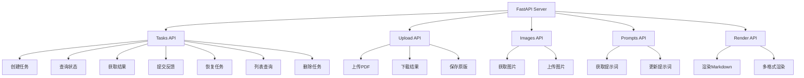

# 第14章 API接口文档

## 14.1 API概述

### 14.1.1 API架构

ScholarFlow采用**RESTful API**设计，遵循标准HTTP协议，提供完整的学术论文演示文稿生成服务。

**API特性**：
- ✅ **RESTful设计**：遵循REST架构原则
- ✅ **异步处理**：后台任务处理，不阻塞请求
- ✅ **状态查询**：实时获取任务进度和状态
- ✅ **人机交互**：支持HITL审核流程
- ✅ **文件上传下载**：完整的PDF上传和演示文稿下载
- ✅ **错误处理**：统一的错误响应格式

**API基础信息**：
- **Base URL**: `http://localhost:8000/api`
- **Content-Type**: `application/json`
- **认证方式**: 无（开发环境）/ JWT Token（生产环境）

### 14.1.2 API模块结构



## 14.2 数据模型

### 14.2.1 请求模型

**CreateTaskRequest** - 创建任务请求
```python
class CreateTaskRequest(BaseModel):
    pdf_path: str = Field(..., description="PDF文件路径")
    presentation_style: str = Field(
        default="academic",
        description="演示风格：academic, popular, business, computational_thinking"
    )
    max_chars: int = Field(default=8000, description="每个分块最大字符数")
    target_chunks: int = Field(default=3, description="目标分块数量")
    output_format: str = Field(default="pptx", description="输出格式：pptx, pdf, html")
    enable_human_review: bool = Field(default=True, description="启用人工审核")
    custom_stage1_prompt: Optional[str] = Field(None, description="自定义Stage 1提示词")
    custom_stage2_prompt: Optional[str] = Field(None, description="自定义Stage 2提示词")
```

**HumanFeedbackRequest** - 人工反馈请求
```python
class HumanFeedbackRequest(BaseModel):
    approved: bool = Field(..., description="内容是否批准")
    action: Optional[str] = Field(
        None,
        description="操作：'regenerate'重新生成, 'abort'终止"
    )
    comments: Optional[str] = Field(None, description="可选评论")
    modifications: Optional[Dict[str, Any]] = Field(
        None,
        description="可选修改"
    )
```

**SaveMarkdownRequest** - 保存Markdown请求
```python
class SaveMarkdownRequest(BaseModel):
    content: str = Field(..., description="Markdown内容")
    stage: str = Field(default="marp_markdown", description="阶段：merged_outline或marp_markdown")
```

### 14.2.2 响应模型

**TaskStatusResponse** - 任务状态响应
```python
class TaskStatusResponse(BaseModel):
    task_id: str
    status: str  # pending, parsing, splitting, stage1_processing, merging, human_review, stage2_processing, rendering, completed, failed
    progress_percentage: float
    current_step: str
    created_at: str
    updated_at: str
    error_message: Optional[str] = None
    needs_human_review: bool = False
    review_points: List[Dict[str, Any]] = []
    user_modifications: str = ""
```

**TaskResultResponse** - 任务结果响应
```python
class TaskResultResponse(BaseModel):
    task_id: str
    status: str
    pdf_path: str
    output_path: Optional[str] = None
    markdown_path: Optional[str] = None
    chunks_count: int = 0
    stage1_completed: int = 0
    presentation_style: str
    created_at: str
    updated_at: str
```

**TaskListResponse** - 任务列表响应
```python
class TaskListResponse(BaseModel):
    tasks: List[Dict[str, Any]]
    total: int
```

## 14.3 任务管理API

### 14.3.1 创建任务

**端点**: `POST /api/tasks`

**功能**: 创建新的处理任务，异步启动工作流

**请求示例**:
```bash
curl -X POST "http://localhost:8000/api/tasks" \
  -H "Content-Type: application/json" \
  -d '{
    "pdf_path": "data/upload/20241221_a1b2c3d4_paper.pdf",
    "presentation_style": "academic",
    "max_chars": 8000,
    "target_chunks": 5,
    "output_format": "pptx",
    "enable_human_review": true
  }'
```

**响应示例**:
```json
{
  "task_id": "a1b2c3d4",
  "status": "pending",
  "progress_percentage": 0.0,
  "current_step": "任务已创建",
  "created_at": "2024-12-21T10:30:00",
  "updated_at": "2024-12-21T10:30:00",
  "needs_human_review": true
}
```

**错误响应**:
```json
{
  "detail": "Invalid presentation style: invalid_style. Use: academic, popular, business, or computational_thinking"
}
```

### 14.3.2 查询任务状态

**端点**: `GET /api/tasks/{task_id}/status`

**功能**: 获取任务的实时状态和进度

**请求示例**:
```bash
curl -X GET "http://localhost:8000/api/tasks/a1b2c3d4/status"
```

**响应示例** (处理中):
```json
{
  "task_id": "a1b2c3d4",
  "status": "stage1_processing",
  "progress_percentage": 45.0,
  "current_step": "正在处理第2/5个分块",
  "created_at": "2024-12-21T10:30:00",
  "updated_at": "2024-12-21T10:35:00",
  "needs_human_review": false,
  "review_points": []
}
```

**响应示例** (等待审核):
```json
{
  "task_id": "a1b2c3d4",
  "status": "human_review",
  "progress_percentage": 50.0,
  "current_step": "等待人工审核",
  "created_at": "2024-12-21T10:30:00",
  "updated_at": "2024-12-21T10:40:00",
  "needs_human_review": true,
  "review_points": [
    {
      "type": "outline",
      "node": "outline_merging",
      "content": "# 机器学习概述\n\n## 监督学习\n...",
      "prompt": "请审核这个大纲结构是否合理",
      "timestamp": "2024-12-21T10:40:00"
    }
  ]
}
```

**错误响应**:
```json
{
  "detail": "Task not found: invalid_id"
}
```

### 14.3.3 获取任务结果

**端点**: `GET /api/tasks/{task_id}/result`

**功能**: 获取任务完成后的结果文件信息

**请求示例**:
```bash
curl -X GET "http://localhost:8000/api/tasks/a1b2c3d4/result"
```

**响应示例** (已完成):
```json
{
  "task_id": "a1b2c3d4",
  "status": "completed",
  "pdf_path": "data/upload/20241221_a1b2c3d4_paper.pdf",
  "output_path": "data/workflow/output/a1b2c3d4/presentation.pptx",
  "markdown_path": "data/workflow/intermediate/a1b2c3d4/presentation.md",
  "chunks_count": 5,
  "stage1_completed": 5,
  "presentation_style": "academic",
  "created_at": "2024-12-21T10:30:00",
  "updated_at": "2024-12-21T10:50:00"
}
```

### 14.3.4 提交人工反馈

**端点**: `POST /api/tasks/{task_id}/human-feedback`

**功能**: 提交人工审核反馈，继续工作流

**请求示例** (批准):
```bash
curl -X POST "http://localhost:8000/api/tasks/a1b2c3d4/human-feedback" \
  -H "Content-Type: application/json" \
  -d '{
    "approved": true,
    "action": "approve",
    "comments": "大纲结构很好，可以继续"
  }'
```

**请求示例** (重新生成):
```bash
curl -X POST "http://localhost:8000/api/tasks/a1b2c3d4/human-feedback" \
  -H "Content-Type: application/json" \
  -d '{
    "approved": false,
    "action": "regenerate",
    "comments": "请增加更多关于深度学习的内容，减少传统机器学习部分"
  }'
```

**请求示例** (终止):
```bash
curl -X POST "http://localhost:8000/api/tasks/a1b2c3d4/human-feedback" \
  -H "Content-Type: application/json" \
  -d '{
    "approved": false,
    "action": "abort",
    "comments": "这个论文不适合做演示文稿"
  }'
```

**响应示例**:
```json
{
  "status": "success",
  "message": "Feedback submitted, workflow resuming",
  "task_id": "a1b2c3d4"
}
```

### 14.3.5 恢复任务

**端点**: `POST /api/tasks/{task_id}/resume`

**功能**: 恢复被暂停的任务

**请求示例**:
```bash
curl -X POST "http://localhost:8000/api/tasks/a1b2c3d4/resume"
```

**响应示例**:
```json
{
  "status": "success",
  "message": "Task resuming",
  "task_id": "a1b2c3d4"
}
```

### 14.3.6 列出任务

**端点**: `GET /api/tasks`

**功能**: 列出所有任务，支持状态筛选

**请求示例** (所有任务):
```bash
curl -X GET "http://localhost:8000/api/tasks"
```

**请求示例** (筛选状态):
```bash
curl -X GET "http://localhost:8000/api/tasks?status=completed&limit=10"
```

**响应示例**:
```json
{
  "tasks": [
    {
      "task_id": "a1b2c3d4",
      "status": "completed",
      "progress_percentage": 100.0,
      "current_step": "渲染完成",
      "created_at": "2024-12-21T10:30:00",
      "updated_at": "2024-12-21T10:50:00"
    },
    {
      "task_id": "e5f6g7h8",
      "status": "processing",
      "progress_percentage": 45.0,
      "current_step": "正在处理",
      "created_at": "2024-12-21T11:00:00",
      "updated_at": "2024-12-21T11:15:00"
    }
  ],
  "total": 2
}
```

### 14.3.7 删除任务

**端点**: `DELETE /api/tasks/{task_id}`

**功能**: 删除已完成或失败的任务

**请求示例**:
```bash
curl -X DELETE "http://localhost:8000/api/tasks/a1b2c3d4"
```

**响应示例**:
```json
{
  "status": "success",
  "message": "Task a1b2c3d4 deleted"
}
```

**错误响应**:
```json
{
  "detail": "Cannot delete task with status: processing. Cancel it first."
}
```

### 14.3.8 取消任务

**端点**: `POST /api/tasks/{task_id}/cancel`

**功能**: 取消正在运行的任务

**请求示例**:
```bash
curl -X POST "http://localhost:8000/api/tasks/a1b2c3d4/cancel"
```

**响应示例**:
```json
{
  "status": "success",
  "message": "Task a1b2c3d4 cancelled"
}
```

## 14.4 文件上传下载API

### 14.4.1 上传PDF

**端点**: `POST /api/upload`

**功能**: 上传PDF文件并获取任务ID

**请求示例**:
```bash
curl -X POST "http://localhost:8000/api/upload" \
  -F "file=@/path/to/paper.pdf"
```

**响应示例**:
```json
{
  "task_id": "a1b2c3d4",
  "pdf_path": "data/upload/20241221_a1b2c3d4_paper.pdf",
  "message": "PDF uploaded successfully",
  "timestamp": "2024-12-21T10:30:00"
}
```

### 14.4.2 下载结果

**端点**: `GET /api/download/{task_id}`

**功能**: 下载生成的演示文稿文件

**请求示例**:
```bash
curl -X GET "http://localhost:8000/api/download/a1b2c3d4" \
  -o "presentation.pptx"
```

**响应**: 二进制文件流（PPTX/PDF/HTML格式）

### 14.4.3 保存原版

**端点**: `POST /api/save-original/{task_id}`

**功能**: 保存原版演示文稿（用于编辑器对比）

**请求示例**:
```bash
curl -X POST "http://localhost:8000/api/save-original/a1b2c3d4"
```

**响应示例**:
```json
{
  "status": "success",
  "message": "Original version saved",
  "output_path": "data/workflow/output/a1b2c3d4/original.pptx",
  "markdown_path": "data/workflow/intermediate/a1b2c3d4/original.md"
}
```

## 14.5 Markdown内容API

### 14.5.1 获取Markdown内容

**端点**: `GET /api/tasks/{task_id}/markdown`

**功能**: 获取任务的Markdown内容

**请求示例**:
```bash
# 获取最新Markdown
curl -X GET "http://localhost:8000/api/tasks/a1b2c3d4/markdown"

# 获取特定阶段
curl -X GET "http://localhost:8000/api/tasks/a1b2c3d4/markdown?stage=merged_outline"
```

**响应示例**:
```json
{
  "task_id": "a1b2c3d4",
  "content": "# 机器学习概述\n\n## 监督学习\n...",
  "stage": "marp_markdown",
  "updated_at": "2024-12-21T10:45:00"
}
```

### 14.5.2 保存Markdown内容

**端点**: `POST /api/tasks/{task_id}/markdown`

**功能**: 保存编辑后的Markdown内容

**请求示例**:
```bash
curl -X POST "http://localhost:8000/api/tasks/a1b2c3d4/markdown" \
  -H "Content-Type: application/json" \
  -d '{
    "content": "# 修改后的大纲\n...",
    "stage": "merged_outline"
  }'
```

**响应示例**:
```json
{
  "status": "success",
  "message": "Markdown saved",
  "task_id": "a1b2c3d4"
}
```

## 14.6 错误处理

### 14.6.1 错误响应格式

**标准错误响应**:
```json
{
  "detail": "错误描述信息"
}
```

### 14.6.2 HTTP状态码

| 状态码 | 说明 | 场景 |
|--------|------|------|
| 200 | 成功 | 请求成功处理 |
| 201 | 已创建 | 资源创建成功 |
| 400 | 客户端错误 | 请求参数无效 |
| 404 | 未找到 | 任务不存在 |
| 409 | 冲突 | 任务状态冲突 |
| 500 | 服务器错误 | 内部处理错误 |

### 14.6.3 常见错误

**任务不存在**:
```json
{
  "detail": "Task not found: invalid_id"
}
```

**任务状态错误**:
```json
{
  "detail": "Task is not in review state. Current status: processing"
}
```

**文件类型错误**:
```json
{
  "detail": "Only PDF files are allowed"
}
```

**演示风格无效**:
```json
{
  "detail": "Invalid presentation style: invalid_style. Use: academic, popular, business, or computational_thinking"
}
```

**无法删除运行中的任务**:
```json
{
  "detail": "Cannot delete task with status: processing. Cancel it first."
}
```

## 14.7 使用示例

### 14.7.1 完整工作流示例

**Python示例**:
```python
import requests
import time

BASE_URL = "http://localhost:8000/api"

# 1. 上传PDF
with open("paper.pdf", "rb") as f:
    upload_response = requests.post(
        f"{BASE_URL}/upload",
        files={"file": f}
    ).json()

task_id = upload_response["task_id"]
print(f"Task ID: {task_id}")

# 2. 创建任务
task_response = requests.post(
    f"{BASE_URL}/tasks",
    json={
        "pdf_path": upload_response["pdf_path"],
        "presentation_style": "academic",
        "max_chars": 8000,
        "target_chunks": 5,
        "output_format": "pptx",
        "enable_human_review": True
    }
).json()

print(f"Task created: {task_response}")

# 3. 轮询状态
while True:
    status_response = requests.get(f"{BASE_URL}/tasks/{task_id}/status").json()
    print(f"Status: {status_response['status']}, Progress: {status_response['progress_percentage']}%")

    if status_response["status"] == "human_review":
        print("需要人工审核...")
        # 提交审核反馈
        feedback_response = requests.post(
            f"{BASE_URL}/tasks/{task_id}/human-feedback",
            json={
                "approved": True,
                "action": "approve",
                "comments": "审核通过"
            }
        ).json()
        print(f"Feedback submitted: {feedback_response}")

    elif status_response["status"] == "completed":
        print("任务完成!")
        # 4. 下载结果
        download_response = requests.get(f"{BASE_URL}/download/{task_id}")
        with open(f"presentation_{task_id}.pptx", "wb") as f:
            f.write(download_response.content)
        print("演示文稿已下载")
        break

    elif status_response["status"] == "failed":
        print(f"任务失败: {status_response['error_message']}")
        break

    time.sleep(5)
```

**JavaScript示例**:
```javascript
const BASE_URL = 'http://localhost:8000/api';

async function runWorkflow(pdfFile) {
    // 1. 上传PDF
    const uploadForm = new FormData();
    uploadForm.append('file', pdfFile);

    const uploadResponse = await fetch(`${BASE_URL}/upload`, {
        method: 'POST',
        body: uploadForm
    }).then(r => r.json());

    const taskId = uploadResponse.task_id;
    console.log('Task ID:', taskId);

    // 2. 创建任务
    const taskResponse = await fetch(`${BASE_URL}/tasks`, {
        method: 'POST',
        headers: { 'Content-Type': 'application/json' },
        body: JSON.stringify({
            pdf_path: uploadResponse.pdf_path,
            presentation_style: 'academic',
            max_chars: 8000,
            target_chunks: 5,
            output_format: 'pptx',
            enable_human_review: true
        })
    }).then(r => r.json());

    console.log('Task created:', taskResponse);

    // 3. 轮询状态
    while (true) {
        const statusResponse = await fetch(`${BASE_URL}/tasks/${taskId}/status`)
            .then(r => r.json());

        console.log(`Status: ${statusResponse.status}, Progress: ${statusResponse.progress_percentage}%`);

        if (statusResponse.status === 'human_review') {
            console.log('需要人工审核...');

            // 提交审核反馈
            const feedbackResponse = await fetch(`${BASE_URL}/tasks/${taskId}/human-feedback`, {
                method: 'POST',
                headers: { 'Content-Type': 'application/json' },
                body: JSON.stringify({
                    approved: true,
                    action: 'approve',
                    comments: '审核通过'
                })
            }).then(r => r.json());

            console.log('Feedback submitted:', feedbackResponse);

        } else if (statusResponse.status === 'completed') {
            console.log('任务完成!');

            // 4. 下载结果
            const downloadResponse = await fetch(`${BASE_URL}/download/${taskId}`);
            const blob = await downloadResponse.blob();
            const url = window.URL.createObjectURL(blob);
            const a = document.createElement('a');
            a.href = url;
            a.download = `presentation_${taskId}.pptx`;
            a.click();

            break;

        } else if (statusResponse.status === 'failed') {
            console.error('任务失败:', statusResponse.error_message);
            break;
        }

        await new Promise(resolve => setTimeout(resolve, 5000));
    }
}
```

## 14.8 OpenAPI文档

### 14.8.1 Swagger UI

ScholarFlow自动生成OpenAPI 3.0文档，可以通过Swagger UI访问：

- **开发环境**: `http://localhost:8000/docs`
- **生产环境**: `http://your-domain.com/docs`

### 14.8.2 OpenAPI JSON

获取完整的OpenAPI规范：

```bash
curl -X GET "http://localhost:8000/openapi.json" > openapi.json
```

### 14.8.3 API测试

使用Swagger UI可以：
- 查看所有API端点
- 查看请求/响应示例
- 在线测试API
- 生成客户端代码

## 14.9 最佳实践

### 14.9.1 客户端建议

1. **异步处理**：所有创建任务的请求都是异步的，需要轮询状态
2. **状态轮询**：建议每5秒轮询一次状态，避免过于频繁
3. **错误处理**：妥善处理HTTP错误和业务错误
4. **超时设置**：设置合理的请求超时时间（建议30秒）
5. **重试机制**：对网络错误实现指数退避重试

### 14.9.2 性能优化

1. **批量查询**：使用`GET /api/tasks`批量查询任务状态
2. **分页**：使用`limit`参数限制返回结果数量
3. **状态筛选**：使用`status`参数筛选特定状态的任务
4. **文件下载**：下载完成后及时清理临时文件

## 14.10 章节导航

- **上一章**: [第13章 - 人机交互流程](13_人机交互流程.md) - 了解HITL机制
- **下一章**: [第15章 - 配置管理](15_配置管理.md) - 了解环境配置
- **代码示例**: [API调用示例](code-examples/basic/01_simple-api-call.py) - 学习使用
- **深入理解**: [第6章 - 状态管理机制](06_状态管理机制.md) - 了解状态流转

---

**本章要点**:
- ✅ RESTful API设计，遵循标准HTTP协议
- ✅ 完整的任务生命周期管理API
- ✅ 文件上传下载和内容编辑API
- ✅ 人机交互审核流程API支持
- ✅ 统一的错误处理和响应格式
- ✅ 自动生成OpenAPI 3.0文档
- ✅ 支持多种编程语言的客户端调用
