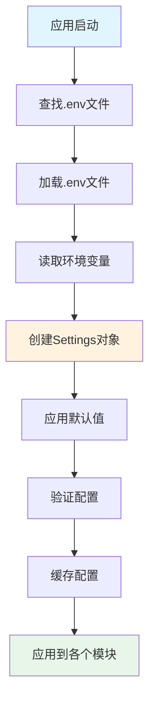
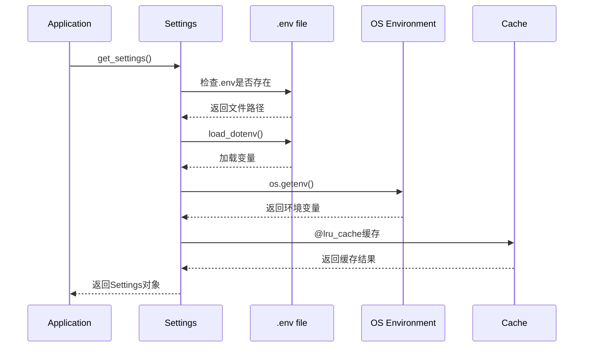

# 第15章 配置管理

## 15.1 配置概述

### 15.1.1 配置系统设计

ScholarFlow采用**集中式配置管理**系统，基于Python的`dataclass`和`os.environ`，实现环境变量优先的配置加载机制。

**设计原则**：
- ✅ **环境变量优先**：生产环境使用环境变量，开发环境使用.env文件
- ✅ **类型安全**：使用Python类型注解确保配置类型正确
- ✅ **默认值支持**：为非关键配置提供合理默认值
- ✅ **缓存优化**：使用`@lru_cache`缓存配置对象
- ✅ **向后兼容**：支持多种环境变量命名格式
- ✅ **灵活性**：支持多LLM提供商和存储后端

**配置层次结构**：
```
1. 环境变量 (最高优先级)
2. .env 文件
3. 代码默认值 (最低优先级)
```

### 15.1.2 配置流程图



## 15.2 Settings类设计

### 15.2.1 核心类定义

**文件位置**: `app/core/config.py:26`

```python
@dataclass
class Settings:
    # LLM Provider Configuration (OpenAI-compatible)
    llm_api_key: str | None = None
    llm_base_url: str | None = None
    llm_model: str | None = None
    llm_max_tokens: int = 4000
    llm_temperature: float = 0.7

    # MinerU Configuration
    mineru_api_key: str | None = None
    mineru_endpoint: str | None = None

    # Storage Configuration
    storage_backend: str = "local"  # 'local', 's3', etc.

    # Data Directory
    data_dir: Path | None = None
```

**设计特点**：
1. **使用dataclass**：简洁的语法，自动生成`__init__`等方法
2. **类型注解**：明确每个字段的类型
3. **可空字段**：使用`|`和`None`表示可选字段
4. **默认值**：为常见配置提供合理默认值

### 15.2.2 配置获取函数

**文件位置**: `app/core/config.py:46`

```python
@lru_cache(maxsize=1)
def get_settings() -> Settings:
    return Settings(
        # LLM Configuration - supports any OpenAI-compatible API
        llm_api_key=os.getenv("LLM_API_KEY") or os.getenv("OPENAI_API_KEY") or os.getenv("DEEPSEEK_API_KEY"),
        llm_base_url=os.getenv("LLM_BASE_URL") or os.getenv("OPENAI_BASE_URL") or os.getenv("DEEPSEEK_BASE_URL", "https://api.deepseek.com"),
        llm_model=os.getenv("LLM_MODEL") or os.getenv("OPENAI_MODEL") or os.getenv("DEEPSEEK_MODEL", "deepseek-chat"),
        llm_max_tokens=int(os.getenv("LLM_MAX_TOKENS", "4000")),
        llm_temperature=float(os.getenv("LLM_TEMPERATURE", "0.7")),

        # MinerU Configuration
        mineru_api_key=os.getenv("MINERU_API_KEY"),
        mineru_endpoint=os.getenv("MINERU_ENDPOINT"),

        # Storage Configuration
        storage_backend=os.getenv("STORAGE_BACKEND", "local"),

        # Data Directory
        data_dir=Path(os.getenv("DATA_DIR", "data")) if os.getenv("DATA_DIR") else None,
    )
```

**关键特性**：
1. **@lru_cache装饰器**：确保配置对象只创建一次，提高性能
2. **多提供商支持**：支持LLM_API_KEY、OPENAI_API_KEY、DEEPSEEK_API_KEY等多种格式
3. **向后兼容**：支持新旧环境变量命名格式
4. **默认值处理**：使用`or`操作符提供后备值

## 15.3 环境变量

### 15.3.1 LLM配置

**LLM API密钥**：
```bash
# 推荐：通用格式
LLM_API_KEY=sk-xxxxx

# 兼容：OpenAI格式
OPENAI_API_KEY=sk-xxxxx

# 兼容：DeepSeek格式
DEEPSEEK_API_KEY=sk-xxxxx
```

**LLM API地址**：
```bash
# 推荐：通用格式
LLM_BASE_URL=https://api.example.com/v1

# 兼容：OpenAI格式
OPENAI_BASE_URL=https://api.openai.com/v1

# 兼容：DeepSeek格式
DEEPSEEK_BASE_URL=https://api.deepseek.com

# 默认值：如果未设置，使用 https://api.deepseek.com
```

**LLM模型**：
```bash
# 推荐：通用格式
LLM_MODEL=deepseek-chat

# 兼容：OpenAI格式
OPENAI_MODEL=gpt-4

# 兼容：DeepSeek格式
DEEPSEEK_MODEL=deepseek-chat

# 默认值：deepseek-chat
```

**LLM参数**：
```bash
# 最大token数
LLM_MAX_TOKENS=4000
# 默认值：4000

# 温度参数（0.0-1.0）
LLM_TEMPERATURE=0.7
# 默认值：0.7
```

### 15.3.2 MinerU配置

**API密钥**：
```bash
MINERU_API_KEY=eyJ0eXBlIjoiSldUIi...
```

**API端点**：
```bash
MINERU_ENDPOINT=https://api.opendatalab.org.cn
```

### 15.3.3 存储配置

**存储后端**：
```bash
STORAGE_BACKEND=local
# 可选值：local, s3
```

**数据目录**：
```bash
DATA_DIR=data
# 默认值：data
```

### 15.3.4 服务器配置

**FastAPI服务器**：
```bash
FASTAPI_HOST=0.0.0.0
FASTAPI_PORT=8000
```

**LangGraph服务器**：
```bash
LANGGRAPH_HOST=0.0.0.0
LANGGRAPH_PORT=8123
```

### 15.3.5 前端配置

**API地址**：
```bash
VITE_API_URL=http://localhost:8000
VITE_LANGGRAPH_URL=http://localhost:8123
```

### 15.3.6 监控配置

**LangSmith配置**：
```bash
LANGSMITH_API_KEY=lsv2_xxxxx
LANGCHAIN_TRACING_V2=true
```

## 15.4 .env文件管理

### 15.4.1 .env文件结构

**文件位置**: `项目根目录/.env`

**示例文件**:
```bash
# MinerU Configuration
MINERU_API_KEY=eyJ0eXBlIjoiSldUIi...

# LLM Configuration
LLM_API_KEY=sk-89alOLRJDtps121ENQ94JA
LLM_BASE_URL=https://llmapi.paratera.com/v1
LLM_MODEL=Qwen3-235B-A22B-Instruct-2507

# Server Configuration
FASTAPI_HOST=0.0.0.0
FASTAPI_PORT=8000
LANGGRAPH_HOST=0.0.0.0
LANGGRAPH_PORT=8123

# Frontend Configuration
VITE_API_URL=http://localhost:8000
VITE_LANGGRAPH_URL=http://localhost:8123

# LangSmith Configuration
LANGSMITH_API_KEY=lsv2_pt_xxxxx
LANGCHAIN_TRACING_V2=true
```

### 15.4.2 .env加载机制

**文件位置**: `app/core/config.py:12`

```python
# Try to load .env file if python-dotenv is available
try:
    from dotenv import load_dotenv
    # Load .env from project root
    project_root = Path(__file__).resolve().parent.parent.parent
    env_file = project_root / ".env"
    if env_file.exists():
        load_dotenv(env_file)
except ImportError:
    # python-dotenv not installed, skip
    raise ImportError("python-dotenv is not installed. Please install it to load environment variables from a .env file.")
```

**加载流程**：
1. 尝试导入`dotenv`模块
2. 计算项目根目录路径
3. 检查`.env`文件是否存在
4. 如果存在，加载环境变量
5. 如果模块未安装，抛出异常提示安装

### 15.4.3 .env最佳实践

**1. 安全性**：
```bash
# ❌ 错误：提交敏感信息到Git
LLM_API_KEY=sk-xxxxx

# ✅ 正确：添加到.gitignore
echo ".env" >> .gitignore

# ✅ 正确：使用占位符
LLM_API_KEY=your_api_key_here
```

**2. 环境隔离**：
```bash
# .env.development - 开发环境
LLM_API_KEY=sk-dev-xxxxx
LLM_BASE_URL=https://api.dev.example.com

# .env.production - 生产环境
LLM_API_KEY=sk-prod-xxxxx
LLM_BASE_URL=https://api.production.example.com
```

**3. 注释规范**：
```bash
# LLM Configuration
LLM_API_KEY=sk-xxxxx
LLM_BASE_URL=https://llmapi.paratera.com/v1

# Server Configuration
FASTAPI_HOST=0.0.0.0
FASTAPI_PORT=8000
```

## 15.5 配置加载流程

### 15.5.1 初始化流程



### 15.5.2 配置获取示例

**在代码中使用**：
```python
from app.core.config import get_settings

# 获取配置实例（只创建一次）
settings = get_settings()

# 使用配置
print(f"LLM API Key: {settings.llm_api_key}")
print(f"LLM Base URL: {settings.llm_base_url}")
print(f"LLM Model: {settings.llm_model}")

# 在LLM服务中使用
from app.services.llm.provider import call_model

settings = get_settings()
response = await call_model(
    prompt="Hello",
    api_key=settings.llm_api_key,
    base_url=settings.llm_base_url,
    model=settings.llm_model
)
```

## 15.6 默认值策略

### 15.6.1 关键配置（无默认值）

**必须手动配置**：
- `MINERU_API_KEY` - MinerU服务密钥
- `LLM_API_KEY` / `OPENAI_API_KEY` / `DEEPSEEK_API_KEY` - LLM服务密钥

**验证示例**：
```python
def validate_config(settings: Settings):
    """验证关键配置是否存在"""
    if not settings.mineru_api_key:
        raise ValueError("MINERU_API_KEY is required")

    if not settings.llm_api_key:
        raise ValueError("LLM_API_KEY is required (or OPENAI_API_KEY, DEEPSEEK_API_KEY)")
```

### 15.6.2 非关键配置（有默认值）

**合理默认值**：
```python
llm_max_tokens: int = 4000          # 默认4096tokens
llm_temperature: float = 0.7        # 默认0.7（平衡创造性和准确性）
storage_backend: str = "local"      # 默认本地存储
data_dir: Path = Path("data")       # 默认data目录
llm_base_url: str = "https://api.deepseek.com"  # 默认DeepSeek
llm_model: str = "deepseek-chat"    # 默认模型
```

### 15.6.3 环境特定默认值

**开发环境**：
```bash
# .env.development
FASTAPI_PORT=8000
LANGGRAPH_PORT=8123
LLM_TEMPERATURE=0.7  # 更高创造性
```

**生产环境**：
```bash
# .env.production
FASTAPI_PORT=80
LANGGRAPH_PORT=8080
LLM_TEMPERATURE=0.3  # 更高一致性
```

## 15.7 配置验证

### 15.7.1 启动时验证

**在main.py中添加**：
```python
from app.core.config import get_settings

def validate_environment():
    """启动时验证环境配置"""
    settings = get_settings()

    # 验证必需的配置
    errors = []

    if not settings.mineru_api_key:
        errors.append("MINERU_API_KEY is not set")

    if not settings.llm_api_key:
        errors.append("LLM_API_KEY is not set (or OPENAI_API_KEY, DEEPSEEK_API_KEY)")

    if errors:
        print("❌ Configuration errors:")
        for error in errors:
            print(f"  - {error}")
        print("\nPlease check your .env file or environment variables.")
        sys.exit(1)

    print("✅ Configuration validated successfully")

# 在应用启动时调用
validate_environment()
```

### 15.7.2 运行时验证

**在服务中使用时验证**：
```python
def validate_llm_config(settings: Settings):
    """验证LLM配置"""
    if not settings.llm_api_key:
        raise ValueError(
            "LLM API key not configured. "
            "Set LLM_API_KEY, OPENAI_API_KEY, or DEEPSEEK_API_KEY"
        )

    if settings.llm_temperature < 0 or settings.llm_temperature > 1:
        raise ValueError(
            f"LLM temperature must be between 0 and 1, got {settings.llm_temperature}"
        )

    if settings.llm_max_tokens <= 0:
        raise ValueError(
            f"LLM max_tokens must be positive, got {settings.llm_max_tokens}"
        )
```

## 15.8 多环境支持

### 15.8.1 环境变量文件

**开发环境** (`.env.development`)：
```bash
# 开发环境配置
NODE_ENV=development
DEBUG=true
FASTAPI_PORT=8000
LLM_TEMPERATURE=0.8
```

**生产环境** (`.env.production`)：
```bash
# 生产环境配置
NODE_ENV=production
DEBUG=false
FASTAPI_PORT=80
LLM_TEMPERATURE=0.3
```

### 15.8.2 动态配置加载

```python
from functools import lru_cache
from typing import Literal

Environment = Literal["development", "production", "testing"]

@lru_cache(maxsize=1)
def get_settings(env: Environment = "development") -> Settings:
    """根据环境加载配置"""
    # 加载特定环境的.env文件
    env_file = f".env.{env}"
    if Path(env_file).exists():
        load_dotenv(env_file, override=True)  # override=True 允许覆盖

    # 读取环境变量
    return Settings(...)
```

## 15.9 最佳实践

### 15.9.1 配置管理建议

**1. 敏感信息管理**：
```bash
# .env文件永远不要提交到Git
echo ".env" >> .gitignore

# 使用密钥管理服务（生产环境）
# AWS Secrets Manager, Azure Key Vault, etc.
```

**2. 配置文档化**：
```bash
# .env.example - 模板文件（可以提交）
LLM_API_KEY=your_api_key_here
LLM_BASE_URL=https://api.example.com/v1
LLM_MODEL=your_model_name
MINERU_API_KEY=your_mineru_key_here
```

**3. 配置验证**：
```python
# 启动时自动验证
if __name__ == "__main__":
    validate_config()
    uvicorn.run(...)
```

**4. 环境隔离**：
```bash
# 使用不同的配置文件
cp .env.development .env  # 开发
cp .env.production .env   # 生产
```

### 15.9.2 常见问题

**问题1：配置不生效**：
```bash
# 原因：.env文件未加载
# 解决：确保python-dotenv已安装
pip install python-dotenv
```

**问题2：环境变量优先级**：
```bash
# 环境变量 > .env文件 > 代码默认值
export LLM_API_KEY=env_value  # 最高优先级
```

**问题3：缓存问题**：
```python
# 配置已缓存，修改.env后需要重启应用
# 解决：开发时可以使用reload
get_settings.cache_clear()
```

## 15.10 配置示例

### 15.10.1 DeepSeek配置

```bash
# DeepSeek API
LLM_API_KEY=sk-xxxxx
LLM_BASE_URL=https://api.deepseek.com
LLM_MODEL=deepseek-chat
```

### 15.10.2 OpenAI配置

```bash
# OpenAI API
OPENAI_API_KEY=sk-xxxxx
OPENAI_BASE_URL=https://api.openai.com/v1
OPENAI_MODEL=gpt-4
```

### 15.10.3 Kimi配置

```bash
# Kimi (Paratera) API
LLM_API_KEY=sk-xxxxx
LLM_BASE_URL=https://llmapi.paratera.com/v1
LLM_MODEL=Kimi-K2
```

### 15.10.4 完整配置示例

```bash
# .env
# ================================
# LLM Configuration
# ================================
LLM_API_KEY=sk-xxxxx
LLM_BASE_URL=https://api.deepseek.com
LLM_MODEL=deepseek-chat
LLM_MAX_TOKENS=4000
LLM_TEMPERATURE=0.7

# ================================
# MinerU Configuration
# ================================
MINERU_API_KEY=eyJ0eXBlIjoiSldUIi...
MINERU_ENDPOINT=https://api.opendatalab.org.cn

# ================================
# Server Configuration
# ================================
FASTAPI_HOST=0.0.0.0
FASTAPI_PORT=8000
LANGGRAPH_HOST=0.0.0.0
LANGGRAPH_PORT=8123

# ================================
# Storage Configuration
# ================================
STORAGE_BACKEND=local
DATA_DIR=data

# ================================
# Frontend Configuration
# ================================
VITE_API_URL=http://localhost:8000
VITE_LANGGRAPH_URL=http://localhost:8123

# ================================
# Monitoring Configuration
# ================================
LANGSMITH_API_KEY=lsv2_xxxxx
LANGCHAIN_TRACING_V2=true
```

## 15.11 章节导航

- **上一章**: [第14章 - API接口文档](14_API接口文档.md) - 了解API设计
- **下一章**: [第16章 - 部署与运维](16_部署与运维.md) - 了解部署配置
- **代码示例**: [配置管理示例](code-examples/basic/02_basic-config.py) - 学习使用
- **深入理解**: [第18章 - 环境变量参考](18_环境变量参考.md) - 完整变量清单

---

**本章要点**:
- ✅ 集中式配置管理，基于环境变量
- ✅ 支持多LLM提供商的统一配置
- ✅ .env文件与系统环境变量双支持
- ✅ 类型安全和默认值机制
- ✅ 缓存优化避免重复加载
- ✅ 完整的配置验证和错误提示
- ✅ 支持多环境配置（开发/生产）
