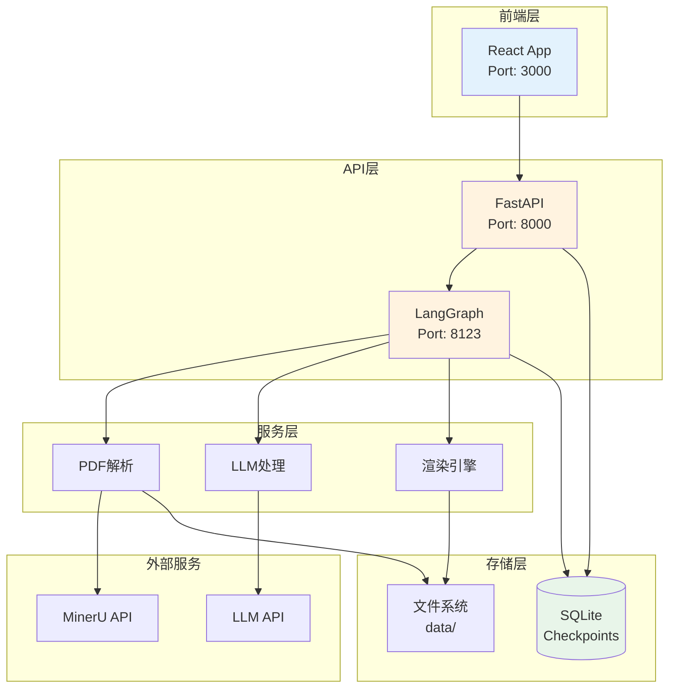

# 第16章 部署与运维

## 16.1 部署概述

### 16.1.1 部署架构

ScholarFlow采用**微服务架构**，包含多个独立运行的服务组件，支持容器化部署和本地部署两种方式。

**服务组件**：
- ✅ **FastAPI服务**：文件上传、任务管理、结果下载
- ✅ **LangGraph服务**：工作流编排、状态管理
- ✅ **React前端**：用户界面、状态展示
- ✅ **SQLite数据库**：状态持久化、任务追踪
- ✅ **本地文件系统**：PDF存储、中间文件、输出结果

**部署方式**：
- 🐳 **Docker容器化**：生产环境推荐
- 💻 **本地部署**：开发测试环境
- ☁️ **云部署**：支持主流云平台

### 16.1.2 部署架构图



## 16.2 环境要求

### 16.2.1 系统要求

**最低配置**：
- **CPU**: 2核心
- **内存**: 4GB RAM
- **磁盘**: 10GB 可用空间
- **操作系统**: Linux, macOS, Windows 10+

**推荐配置**：
- **CPU**: 4核心或以上
- **内存**: 8GB RAM或以上
- **磁盘**: 50GB SSD
- **操作系统**: Ubuntu 20.04+, CentOS 8+, macOS 12+

### 16.2.2 软件依赖

**必需软件**：

| 软件 | 版本 | 说明 |
|------|------|------|
| Python | 3.12+ | 后端运行环境 |
| Node.js | 18+ | 前端构建工具 |
| npm/yarn | 9+ | 包管理器 |
| uv | 最新 | Python包管理器 |

**可选软件**：

| 软件 | 版本 | 说明 |
|------|------|------|
| Docker | 24+ | 容器化部署 |
| Chromium | 最新 | Marp渲染引擎依赖 |
| PostgreSQL | 14+ | 替代SQLite（可选） |
| Redis | 7+ | 缓存和队列（可选） |

## 16.3 本地部署

### 16.3.1 快速开始

**步骤1：克隆项目**
```bash
git clone https://github.com/your-org/scholarflow.git
cd scholarflow
```

**步骤2：安装Python依赖**
```bash
# 使用uv（推荐）
curl -LsSf https://astral.sh/uv/install.sh | sh
uv sync

# 或使用pip
pip install -r requirements.txt
```

**步骤3：安装前端依赖**
```bash
cd frontend
npm install
cd ..
```

**步骤4：配置环境变量**
```bash
# 复制环境变量模板
cp .env.example .env

# 编辑.env文件，设置API密钥
vim .env
```

**步骤5：启动服务**
```bash
# 启动LangGraph服务
python langgraph_server.py --host 0.0.0.0 --port 8123 &

# 启动FastAPI服务
uvicorn app.api.main:app --host 0.0.0.0 --port 8000 &

# 启动前端服务
cd frontend && npm run dev
```

### 16.3.2 手动安装步骤

**安装Python 3.12**：
```bash
# Ubuntu/Debian
sudo apt-get update
sudo apt-get install -y python3.12 python3.12-venv python3.12-dev

# macOS (使用Homebrew)
brew install python@3.12

# Windows
# 从 https://python.org 下载安装包
```

**安装Node.js 18+**：
```bash
# Ubuntu/Debian
curl -fsSL https://deb.nodesource.com/setup_18.x | sudo -E bash -
sudo apt-get install -y nodejs

# macOS
brew install node

# Windows
# 从 https://nodejs.org 下载安装包
```

**安装uv包管理器**：
```bash
# Linux/macOS
curl -LsSf https://astral.sh/uv/install.sh | sh

# Windows
# 从 https://github.com/astral-sh/uv/releases 下载
```

**安装Chromium**（用于Marp渲染）：
```bash
# Ubuntu/Debian
sudo apt-get update
sudo apt-get install -y chromium-browser libgbm-dev

# macOS
brew install chromium

# 或者安装Chrome
# 从 https://google.com/chrome 下载
```

### 16.3.3 目录结构

**部署后的目录结构**：
```
scholarflow/
├── app/                    # 后端应用代码
│   ├── api/               # FastAPI路由
│   ├── core/              # 核心配置
│   ├── graph/             # LangGraph工作流
│   └── services/          # 业务服务
├── frontend/              # 前端应用
│   ├── src/              # 源代码
│   ├── public/           # 静态资源
│   └── package.json      # 依赖配置
├── data/                 # 数据目录
│   ├── upload/           # 上传的PDF
│   ├── intermediate/     # 中间文件
│   ├── output/           # 生成的演示文稿
│   └── workflows/        # 工作流状态
├── tests/                # 测试代码
├── .env                  # 环境变量
├── pyproject.toml        # Python项目配置
└── README.md             # 项目说明
```

## 16.4 容器化部署

### 16.4.1 Docker部署

**创建Dockerfile**：
```dockerfile
# Dockerfile
FROM python:3.12-slim

# 安装系统依赖
RUN apt-get update && apt-get install -y \
    chromium \
    chromium-driver \
    libgbm1 \
    nodejs \
    npm \
    && rm -rf /var/lib/apt/lists/*

# 设置工作目录
WORKDIR /app

# 安装uv
RUN pip install uv

# 复制依赖文件
COPY pyproject.toml ./
COPY uv.lock ./

# 安装Python依赖
RUN uv sync --no-dev

# 复制应用代码
COPY app/ ./app/
COPY *.py ./

# 安装Marp CLI
RUN npm install -g @marp-team/marp-cli

# 创建数据目录
RUN mkdir -p data/{upload,intermediate,output,workflows}

# 暴露端口
EXPOSE 8000 8123

# 启动命令
CMD ["uvicorn", "app.api.main:app", "--host", "0.0.0.0", "--port", "8000"]
```

**创建docker-compose.yml**：
```yaml
version: '3.8'

services:
  scholarflow-api:
    build: .
    ports:
      - "8000:8000"
      - "8123:8123"
    volumes:
      - ./data:/app/data
      - ./.env:/app/.env
    environment:
      - PYTHONPATH=/app
    restart: unless-stopped

  scholarflow-frontend:
    build:
      context: ./frontend
      dockerfile: Dockerfile
    ports:
      - "3000:3000"
    environment:
      - VITE_API_URL=http://localhost:8000
      - VITE_LANGGRAPH_URL=http://localhost:8123
    depends_on:
      - scholarflow-api
    restart: unless-stopped
```

**构建和启动**：
```bash
# 构建镜像
docker-compose build

# 启动服务
docker-compose up -d

# 查看日志
docker-compose logs -f

# 停止服务
docker-compose down
```

### 16.4.2 多阶段构建优化

**优化的Dockerfile**：
```dockerfile
# 多阶段构建，减小最终镜像大小

# 阶段1: 构建前端
FROM node:18-alpine AS frontend-builder
WORKDIR /app/frontend
COPY frontend/package*.json ./
RUN npm ci
COPY frontend/ ./
RUN npm run build

# 阶段2: 构建后端
FROM python:3.12-slim AS backend-builder
WORKDIR /app
RUN pip install uv
COPY pyproject.toml uv.lock ./
RUN uv sync --no-dev

# 阶段3: 最终镜像
FROM python:3.12-slim
WORKDIR /app

# 安装运行时依赖
RUN apt-get update && apt-get install -y \
    chromium \
    libgbm1 \
    && rm -rf /var/lib/apt/lists/*

# 复制后端代码和依赖
COPY --from=backend-builder /app /app
COPY app/ ./app/

# 复制前端构建结果
COPY --from=frontend-builder /app/frontend/dist ./frontend/dist

# 安装Marp CLI
RUN npm install -g @marp-team/marp-cli

# 创建数据目录
RUN mkdir -p data/{upload,intermediate,output,workflows}

# 暴露端口
EXPOSE 8000

CMD ["uvicorn", "app.api.main:app", "--host", "0.0.0.0", "--port", "8000"]
```

### 16.4.3 生产环境部署

**生产环境docker-compose.yml**：
```yaml
version: '3.8'

services:
  scholarflow:
    image: scholarflow:latest
    ports:
      - "80:8000"
      - "8123:8123"
    volumes:
      - scholarflow_data:/app/data
      - /etc/localtime:/etc/localtime:ro
    environment:
      - PYTHONPATH=/app
      - WORKERS=4
    restart: unless-stopped
    healthcheck:
      test: ["CMD", "curl", "-f", "http://localhost:8000/health"]
      interval: 30s
      timeout: 10s
      retries: 3

  nginx:
    image: nginx:alpine
    ports:
      - "443:443"
      - "80:80"
    volumes:
      - ./nginx.conf:/etc/nginx/nginx.conf:ro
      - ./ssl:/etc/ssl:ro
    depends_on:
      - scholarflow
    restart: unless-stopped

volumes:
  scholarflow_data:
    driver: local
```

## 16.5 云部署

### 16.5.1 AWS部署

**使用ECS部署**：
```json
{
  "family": "scholarflow",
  "networkMode": "awsvpc",
  "requiresCompatibilities": ["FARGATE"],
  "cpu": "1024",
  "memory": "2048",
  "executionRoleArn": "arn:aws:iam::account:role/ecsTaskExecutionRole",
  "containerDefinitions": [
    {
      "name": "scholarflow",
      "image": "your-account.dkr.ecr.region.amazonaws.com/scholarflow:latest",
      "portMappings": [
        {
          "containerPort": 8000,
          "protocol": "tcp"
        }
      ],
      "environment": [
        {
          "name": "FASTAPI_HOST",
          "value": "0.0.0.0"
        }
      ],
      "logConfiguration": {
        "logDriver": "awslogs",
        "options": {
          "awslogs-group": "/ecs/scholarflow",
          "awslogs-region": "us-west-2",
          "awslogs-stream-prefix": "ecs"
        }
      }
    }
  ]
}
```

**使用EC2部署**：
```bash
# 1. 启动EC2实例 (t3.medium或以上)
# 2. 安装Docker和Docker Compose
sudo yum update -y
sudo yum install -y docker
sudo service docker start
sudo usermod -a -G docker ec2-user
sudo curl -L "https://github.com/docker/compose/releases/latest/download/docker-compose-$(uname -s)-$(uname -m)" -o /usr/local/bin/docker-compose
sudo chmod +x /usr/local/bin/docker-compose

# 3. 克隆项目并部署
git clone https://github.com/your-org/scholarflow.git
cd scholarflow
docker-compose up -d
```

### 16.5.2 阿里云部署

**使用ECS部署**：
```bash
# 1. 购买ECS实例（推荐配置：4核8G）
# 2. 安装Docker
sudo apt-get update
sudo apt-get install -y docker.io docker-compose

# 3. 部署应用
git clone https://github.com/your-org/scholarflow.git
cd scholarflow
docker-compose up -d
```

### 16.5.3 腾讯云部署

**使用CVM部署**：
```bash
# 类似阿里云ECS部署步骤
# 购买CVM实例 -> 安装Docker -> 部署应用
```

## 16.6 监控与日志

### 16.6.1 日志管理

**配置日志**：
```python
# app/core/logger.py
import logging
from datetime import datetime

def setup_logging(log_level: str = "INFO"):
    """配置日志系统"""
    logging.basicConfig(
        level=getattr(logging, log_level.upper()),
        format='%(asctime)s - %(name)s - %(levelname)s - %(message)s',
        handlers=[
            logging.FileHandler(f'logs/scholarflow_{datetime.now().strftime("%Y%m%d")}.log'),
            logging.StreamHandler()
        ]
    )
```

**日志结构**：
```json
{
  "timestamp": "2024-12-21T10:30:00",
  "level": "INFO",
  "service": "fastapi",
  "task_id": "a1b2c3d4",
  "message": "Task created successfully",
  "metadata": {
    "user_id": "user123",
    "pdf_size": "2.5MB"
  }
}
```

### 16.6.2 性能监控

**关键指标**：
- **CPU使用率**：< 80%
- **内存使用率**：< 85%
- **磁盘使用率**：< 90%
- **任务处理时间**：平均 < 3分钟
- **并发任务数**：5-10个

**监控脚本**：
```bash
#!/bin/bash
# monitor.sh - 监控系统资源

while true; do
    echo "=== $(date) ==="
    echo "CPU: $(top -bn1 | grep "Cpu(s)" | awk '{print $2}' | cut -d'%' -f1)%"
    echo "Memory: $(free | grep Mem | awk '{printf("%.2f%%"), $3/$2 * 100.0}')"
    echo "Disk: $(df -h / | awk 'NR==2{printf "%s", $5}')"
    echo "Tasks: $(ls data/workflows/tasks/*.json 2>/dev/null | wc -l)"
    echo ""
    sleep 60
done
```

### 16.6.3 健康检查

**FastAPI健康检查端点**：
```python
# app/api/health.py
from fastapi import APIRouter

router = APIRouter(tags=["health"])

@router.get("/health")
async def health_check():
    """健康检查端点"""
    return {
        "status": "healthy",
        "timestamp": datetime.now().isoformat(),
        "services": {
            "fastapi": "up",
            "langgraph": "up",
            "storage": "up"
        }
    }
```

**Docker健康检查**：
```yaml
services:
  scholarflow:
    healthcheck:
      test: ["CMD", "curl", "-f", "http://localhost:8000/health"]
      interval: 30s
      timeout: 10s
      retries: 3
      start_period: 40s
```

## 16.7 备份与恢复

### 16.7.1 数据备份

**备份SQLite数据库**：
```bash
#!/bin/bash
# backup_db.sh - 备份SQLite数据库

BACKUP_DIR="/backup/scholarflow"
DATE=$(date +%Y%m%d_%H%M%S)

# 创建备份目录
mkdir -p $BACKUP_DIR

# 备份数据库
cp data/workflows/checkpoints.db $BACKUP_DIR/checkpoints_${DATE}.db

# 备份任务文件
tar -czf $BACKUP_DIR/tasks_${DATE}.tar.gz data/workflows/tasks/

# 清理7天前的备份
find $BACKUP_DIR -name "*.db" -mtime +7 -delete
find $BACKUP_DIR -name "*.tar.gz" -mtime +7 -delete

echo "Backup completed: $DATE"
```

**备份脚本（定时任务）**：
```bash
# 添加到crontab
crontab -e

# 每天凌晨2点备份
0 2 * * * /path/to/backup_db.sh
```

### 16.7.2 数据恢复

**恢复数据库**：
```bash
#!/bin/bash
# restore_db.sh - 恢复SQLite数据库

BACKUP_FILE=$1
if [ -z "$BACKUP_FILE" ]; then
    echo "Usage: $0 <backup_file>"
    exit 1
fi

# 停止服务
docker-compose down

# 备份当前数据库
cp data/workflows/checkpoints.db data/workflows/checkpoints.db.backup

# 恢复数据库
cp $BACKUP_FILE data/workflows/checkpoints.db

# 启动服务
docker-compose up -d

echo "Restore completed from: $BACKUP_FILE"
```

### 16.7.3 灾难恢复计划

**恢复流程**：
1. **评估损失**：确定丢失的数据和时间范围
2. **准备环境**：安装新服务器或清理现有环境
3. **恢复数据库**：从最新备份恢复SQLite数据库
4. **恢复文件**：恢复上传的PDF和生成的演示文稿
5. **验证数据**：检查数据完整性和一致性
6. **重启服务**：启动所有服务并验证功能

**恢复时间目标 (RTO)**：< 30分钟
**恢复点目标 (RPO)**：< 24小时

## 16.8 故障排除

### 16.8.1 常见问题

**问题1：服务无法启动**
```bash
# 检查端口占用
netstat -tulpn | grep 8000

# 检查日志
docker-compose logs scholarflow-api
# 或
tail -f logs/scholarflow.log
```

**问题2：数据库锁定**
```bash
# 检查数据库文件权限
ls -la data/workflows/checkpoints.db

# 杀死占用数据库的进程
fuser data/workflows/checkpoints.db
```

**问题3：PDF解析失败**
```bash
# 检查MinerU API密钥
curl -H "Authorization: Bearer $MINERU_API_KEY" $MINERU_ENDPOINT/health

# 检查网络连接
ping api.opendatalab.org.cn
```

**问题4：Marp渲染失败**
```bash
# 检查Marp CLI安装
marp --version

# 检查Chromium安装
chromium --version

# 手动测试渲染
marp test.md --pptx
```

### 16.8.2 调试技巧

**启用调试模式**：
```bash
# 设置环境变量
export DEBUG=1
export LOG_LEVEL=DEBUG

# 重启服务
docker-compose restart
```

**查看详细日志**：
```bash
# 查看所有服务日志
docker-compose logs -f

# 查看特定服务日志
docker-compose logs -f scholarflow-api

# 查看最近的错误
docker-compose logs --tail=100 | grep ERROR
```

**检查系统资源**：
```bash
# 检查CPU和内存
htop

# 检查磁盘空间
df -h

# 检查网络连接
netstat -tulpn
```

### 16.8.3 性能优化

**优化SQLite性能**：
```sql
-- 优化SQLite配置
PRAGMA journal_mode = WAL;
PRAGMA synchronous = NORMAL;
PRAGMA cache_size = 10000;
PRAGMA temp_store = memory;
```

**调整工作进程数**：
```bash
# FastAPI工作进程
uvicorn app.api.main:app --workers 4

# LangGraph进程
python langgraph_server.py --workers 2
```

**配置缓存**：
```python
# 在config.py中启用缓存
from functools import lru_cache

@lru_cache(maxsize=128)
def get_cached_data(key: str):
    # 缓存频繁访问的数据
    pass
```

## 16.9 最佳实践

### 16.9.1 部署建议

**1. 环境隔离**：
```bash
# 开发环境
cp .env.development .env

# 生产环境
cp .env.production .env
```

**2. 监控告警**：
```bash
# 配置告警阈值
CPU阈值：80%
内存阈值：85%
磁盘阈值：90%
任务失败率：> 5%
```

**3. 安全加固**：
```bash
# 使用非root用户运行容器
USER 1000:1000

# 限制容器权限
docker run --read-only --cap-drop=ALL scholarflow

# 启用HTTPS
nginx配置SSL证书
```

**4. 版本管理**：
```bash
# 标记镜像版本
docker tag scholarflow:latest scholarflow:v1.0.0

# 使用特定版本
docker-compose up scholarflow:v1.0.0
```

### 16.9.2 运维检查清单

**日常检查**：
- [ ] 检查服务状态
- [ ] 查看错误日志
- [ ] 监控系统资源
- [ ] 检查任务队列
- [ ] 验证备份完整性

**每周检查**：
- [ ] 更新依赖包
- [ ] 清理临时文件
- [ ] 检查磁盘空间
- [ ] 验证监控告警
- [ ] 测试恢复流程

**每月检查**：
- [ ] 安全更新
- [ ] 性能优化
- [ ] 容量规划
- [ ] 灾难恢复演练
- [ ] 文档更新

## 16.10 章节导航

- **上一章**: [第15章 - 配置管理](15_配置管理.md) - 了解配置系统
- **下一章**: [第17章 - 测试策略与覆盖](17_测试策略与覆盖.md) - 了解测试方法
- **代码示例**: [部署示例](code-examples/advanced/05_production-deployment.py) - 学习部署
- **深入理解**: [第19章 - 故障排除指南](19_故障排除指南.md) - 故障诊断

---

**本章要点**:
- ✅ 微服务架构，支持容器化和本地部署
- ✅ 完整的系统要求和依赖说明
- ✅ Docker多阶段构建优化
- ✅ 支持主流云平台部署（AWS、阿里云、腾讯云）
- ✅ 完善的监控、日志和健康检查
- ✅ 自动备份和灾难恢复机制
- ✅ 详细的故障排除和性能优化指南
