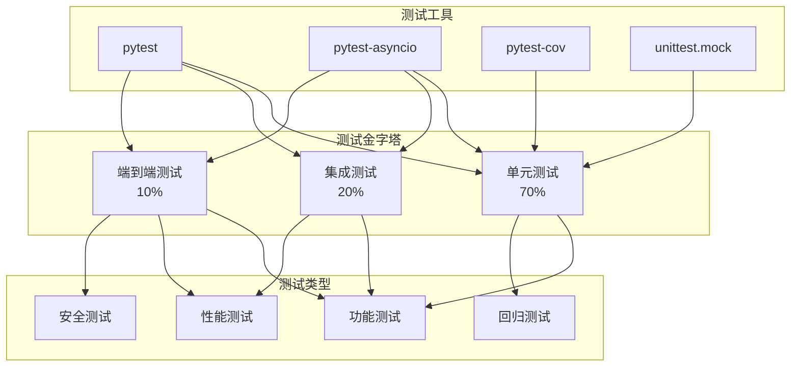

# 第17章 测试策略与覆盖

## 17.1 测试概述

### 17.1.1 测试哲学

ScholarFlow采用**全面测试策略**，确保代码质量、系统稳定性和用户体验。测试金字塔结构如下：

**测试层次**：
- ✅ **单元测试** (70%)：测试单个函数和类
- ✅ **集成测试** (20%)：测试组件间交互
- ✅ **端到端测试** (10%)：测试完整工作流

**测试目标**：
- 🔍 **功能正确性**：确保代码按预期工作
- 🛡️ **回归预防**：防止新代码破坏现有功能
- 📊 **质量保证**：提高代码质量和可维护性
- 🚀 **重构支持**：安全的代码重构基础
- 📈 **持续集成**：CI/CD流水线的质量门禁

### 17.1.2 测试架构图



## 17.2 测试配置

### 17.2.1 pytest配置

**文件位置**: `pyproject.toml:29`

```toml
[tool.pytest.ini_options]
pythonpath = "."                    # Python路径
testpaths = ["tests"]              # 测试目录
python_files = ["test_*.py"]       # 测试文件模式
python_classes = ["Test*"]         # 测试类模式
python_functions = ["test_*"]      # 测试函数模式

# 默认选项
addopts = "-v --tb=short --asyncio-mode=auto --strict-markers"

# 测试标记
markers = [
    "slow: marks tests as slow (deselect with '-m \"not slow\"')",
    "integration: marks tests as integration tests",
    "unit: marks tests as unit tests",
]

# 警告过滤
filterwarnings = [
    "ignore::UserWarning",
    "ignore::DeprecationWarning",
]
```

### 17.2.2 测试目录结构

```
tests/
├── __init__.py
├── conftest.py                     # 共享fixtures
├── test_workflow.py               # 工作流测试
├── test_async_llm.py              # 异步LLM测试
├── test_tokenization.py           # Token化测试
├── test_error_handling.py         # 错误处理测试
├── test_prompt_templates.py       # 提示词模板测试
├── test_stage2_token_preservation.py  # Stage2测试
├── test_render_preview.py         # 渲染预览测试
└── test_real_pdf_hil.py           # 真实PDF测试
```

### 17.2.3 运行测试

**基本命令**：
```bash
# 运行所有测试
pytest

# 运行特定文件
pytest tests/test_workflow.py

# 运行特定测试
pytest tests/test_workflow.py::TestStage1Processing::test_stage1_process_all_chunks_completed

# 详细输出
pytest -v

# 显示本地变量
pytest -l

# 运行并显示最慢的10个测试
pytest --durations=10
```

**标记筛选**：
```bash
# 只运行单元测试
pytest -m unit

# 只运行集成测试
pytest -m integration

# 排除慢速测试
pytest -m "not slow"

# 组合标记
pytest -m "unit and not slow"
```

**覆盖率测试**：
```bash
# 生成覆盖率报告
pytest --cov=app --cov-report=html

# 查看覆盖率报告
open htmlcov/index.html

# 只显示未覆盖的行
pytest --cov=app --cov-report=term-missing
```

## 17.3 单元测试

### 17.3.1 工作流节点测试

**文件位置**: `tests/test_workflow.py:15`

```python
class TestStage1Processing:
    """测试Stage 1处理节点"""

    @pytest.mark.asyncio
    async def test_stage1_process_all_chunks_completed(self):
        """测试所有分块处理完成的情况"""
        state = {
            "chunks": [
                {"id": 1, "title": "Chunk 1", "text": "Text 1"},
                {"id": 2, "title": "Chunk 2", "text": "Text 2"},
            ],
            "current_chunk_index": 2,
            "stage1_results": [],
            "presentation_style": "academic",
        }

        result = await node_stage1_process(state)

        assert result["status"] == TaskStatus.MERGING.value
        assert result["stage1_completed"] == 2
        assert result["progress_percentage"] == 50.0
```

**测试要点**：
- ✅ **状态验证**：检查状态字段的正确更新
- ✅ **进度计算**：验证进度百分比计算
- ✅ **边界条件**：测试边界和极端情况

### 17.3.2 LLM服务测试

```python
@pytest.mark.asyncio
async def test_stage1_process_single_chunk(self):
    """测试单个分块成功处理"""
    # Mock LLMClient初始化和调用
    with patch('app.graph.nodes.stage1_processing.LLMClient') as mock_client_class:
        mock_client = AsyncMock()
        mock_client.acomplete.return_value = {
            "content": "# Test Outline",
            "usage": {"total_tokens": 100},
            "model": "deepseek-chat",
            "finish_reason": "stop"
        }
        mock_client_class.return_value = mock_client

        state = {
            "chunks": [
                {"id": 1, "title": "Test Chunk", "text": "Test content"},
            ],
            "current_chunk_index": 0,
            "stage1_results": [],
            "presentation_style": "academic",
            "execution_log": [],
        }

        result = await node_stage1_process(state)

        # 验证状态更新
        assert result["current_chunk_index"] == 1
        assert result["stage1_completed"] == 1
        assert len(result["stage1_results"]) == 1
        assert result["stage1_results"][0]["chunk_id"] == 1
        assert result["stage1_results"][0]["success"] is True
        assert result["stage1_results"][0]["outline"] == "# Test Outline"

        # 验证LLM调用
        mock_client.acomplete.assert_called_once()
```

**Mock使用技巧**：
```python
# 1. 模拟外部API调用
with patch('app.services.llm.provider.call_model') as mock_call:
    mock_call.return_value = {"content": "Mocked response"}
    # 测试代码...

# 2. 模拟文件系统操作
with patch('pathlib.Path.exists', return_value=True):
    with patch('pathlib.Path.read_text', return_value="mock content"):
        # 测试代码...

# 3. 模拟异步操作
mock_async_func = AsyncMock(return_value="result")
result = await mock_async_func()
```

### 17.3.3 错误处理测试

```python
@pytest.mark.asyncio
async def test_stage1_process_chunk_failure(self):
    """测试分块处理失败的处理"""
    # Mock LLMClient抛出异常
    with patch('app.graph.nodes.stage1_processing.LLMClient') as mock_client_class:
        mock_client = AsyncMock()
        mock_client.acomplete.side_effect = RuntimeError("API Error")
        mock_client_class.return_value = mock_client

        state = {
            "chunks": [
                {"id": 1, "title": "Test Chunk", "text": "Test content"},
            ],
            "current_chunk_index": 0,
            "stage1_results": [],
            "presentation_style": "academic",
            "execution_log": [],
        }

        result = await node_stage1_process(state)

        # 验证失败处理
        assert result["current_chunk_index"] == 1
        assert result["stage1_completed"] == 1
        assert len(result["stage1_results"]) == 1
        assert result["stage1_results"][0]["success"] is False
        assert "API Error" in result["stage1_results"][0]["error"]
        assert 1 in result["stage1_failed"]
```

**异常测试模式**：
```python
# 测试抛出特定异常
with pytest.raises(ValueError, match="Invalid input"):
    some_function("invalid_input")

# 测试异常不抛出
try:
    result = some_function("valid_input")
    assert result is not None
except Exception as e:
    pytest.fail(f"Unexpected exception: {e}")
```

## 17.4 集成测试

### 17.4.1 工作流集成测试

```python
@pytest.mark.integration
class TestWorkflowIntegration:
    """测试完整工作流集成"""

    @pytest.mark.asyncio
    async def test_complete_workflow(self):
        """测试完整工作流从开始到结束"""
        # 准备测试PDF
        test_pdf = Path("tests/fixtures/sample_paper.pdf")
        assert test_pdf.exists()

        # 创建初始状态
        state = create_initial_state(
            task_id="test-001",
            pdf_path=str(test_pdf),
            presentation_style="academic",
            max_chars=8000,
            target_chunks=3,
            enable_human_review=False,  # 禁用HITL简化测试
        )

        # 运行工作流
        final_state = await run_workflow(state)

        # 验证结果
        assert final_state["status"] == TaskStatus.COMPLETED.value
        assert final_state["output_path"] is not None
        assert Path(final_state["output_path"]).exists()
```

### 17.4.2 API集成测试

```python
@pytest.mark.integration
class TestAPIIntegration:
    """测试API集成"""

    def setup_method(self):
        """每个测试方法前的设置"""
        self.client = TestClient(app)

    def test_create_task_api(self):
        """测试创建任务API"""
        response = self.client.post("/api/tasks", json={
            "pdf_path": "tests/fixtures/sample_paper.pdf",
            "presentation_style": "academic",
            "max_chars": 8000,
            "target_chunks": 3,
            "output_format": "pptx",
            "enable_human_review": False,
        })

        assert response.status_code == 200
        data = response.json()
        assert "task_id" in data
        assert data["status"] == "pending"

    def test_get_task_status_api(self):
        """测试获取任务状态API"""
        # 先创建任务
        create_response = self.client.post("/api/tasks", json={
            "pdf_path": "tests/fixtures/sample_paper.pdf",
        })
        task_id = create_response.json()["task_id"]

        # 获取状态
        status_response = self.client.get(f"/api/tasks/{task_id}/status")
        assert status_response.status_code == 200
        assert status_response.json()["task_id"] == task_id
```

## 17.5 端到端测试

### 17.5.1 真实PDF测试

```python
@pytest.mark.e2e
class TestRealPDF:
    """使用真实PDF进行端到端测试"""

    @pytest.mark.asyncio
    @pytest.mark.slow
    async def test_real_pdf_with_human_review(self):
        """测试带人工审核的真实PDF处理"""
        # 使用真实的学术论文PDF
        pdf_path = "tests/fixtures/attention_is_all_you_need.pdf"

        state = create_initial_state(
            task_id="e2e-test-001",
            pdf_path=pdf_path,
            presentation_style="academic",
            enable_human_review=True,
        )

        # 模拟人工审核
        with patch('app.graph.workflow.run_workflow') as mock_run:
            # 第一次调用：到达审核点
            mock_run.side_effect = [
                {"status": TaskStatus.HUMAN_REVIEW.value, "needs_human_review": True},
                {"status": TaskStatus.COMPLETED.value, "output_path": "test.pptx"}
            ]

            # 提交审核反馈
            await resume_workflow("e2e-test-001", {
                "approved": True,
                "action": "approve",
                "comments": "Looks good"
            })

        # 验证最终状态
        final_state = get_checkpointer().load_state("e2e-test-001")
        assert final_state["status"] == TaskStatus.COMPLETED.value
```

### 17.5.2 渲染测试

```python
@pytest.mark.e2e
class TestRendering:
    """测试渲染功能"""

    def test_marp_rendering(self):
        """测试Marp渲染"""
        # 创建临时Markdown文件
        with tempfile.NamedTemporaryFile(mode='w', suffix='.md', delete=False) as f:
            f.write("# Test Presentation\n\n## Slide 1\n\nTest content")
            md_path = f.name

        try:
            # 测试渲染
            engine = MarpEngine()
            output_path = Path(tempfile.mkdtemp()) / "presentation"

            success = engine.render(
                input_md=Path(md_path),
                output_path=output_path,
                format="pptx",
            )

            assert success is True
            assert output_path.with_suffix(".pptx").exists()
        finally:
            # 清理临时文件
            Path(md_path).unlink(missing_ok=True)
```

## 17.6 测试Fixtures

### 17.6.1 共享Fixtures

**文件位置**: `tests/conftest.py`

```python
"""Pytest配置文件和共享fixtures"""

import pytest
import tempfile
from pathlib import Path
from unittest.mock import AsyncMock

from app.graph.state import create_initial_state, TaskStatus
from app.services.llm.provider import LLMClient


@pytest.fixture
def temp_dir():
    """创建临时目录"""
    with tempfile.TemporaryDirectory() as tmpdir:
        yield Path(tmpdir)


@pytest.fixture
def sample_pdf_path():
    """示例PDF文件路径"""
    return Path("tests/fixtures/sample_paper.pdf")


@pytest.fixture
def initial_state():
    """创建初始状态"""
    return create_initial_state(
        task_id="test-task-001",
        pdf_path="tests/fixtures/sample_paper.pdf",
        presentation_style="academic",
        max_chars=8000,
        target_chunks=3,
        enable_human_review=False,
    )


@pytest.fixture
def mock_llm_client():
    """模拟LLM客户端"""
    mock_client = AsyncMock(spec=LLMClient)
    mock_client.acomplete.return_value = {
        "content": "# Mocked Outline\n\n## Section 1",
        "usage": {"total_tokens": 100},
        "model": "deepseek-chat",
        "finish_reason": "stop"
    }
    return mock_client


@pytest.fixture
def mock_image_manager():
    """模拟图片管理器"""
    mock_manager = AsyncMock()
    mock_manager.tokenize_image_references_enhanced.return_value = (
        "Tokenized markdown with [[TOKEN_IMG_001]]",
        {"[[TOKEN_IMG_001]]": {"hash": "abc123", "alt_text": "Test image"}}
    )
    mock_manager.restore_tokens_to_markdown_enhanced.return_value = (
        "Restored markdown with "
    )
    return mock_manager
```

### 17.6.2 数据库Fixtures

```python
@pytest.fixture
async def test_db():
    """创建测试数据库"""
    db_path = Path(tempfile.mktemp(suffix=".db"))

    # 初始化数据库
    checkpointer = get_checkpointer(db_path)

    yield checkpointer

    # 清理数据库
    db_path.unlink(missing_ok=True)


@pytest.fixture
async def sample_task(test_db):
    """创建示例任务"""
    task_id = "test-task-123"
    state = create_initial_state(
        task_id=task_id,
        pdf_path="tests/fixtures/sample.pdf",
    )

    test_db.save_state(task_id, state, "init")
    return task_id
```

## 17.7 代码覆盖率

### 17.7.1 覆盖率配置

```bash
# 运行测试并生成覆盖率报告
pytest --cov=app --cov-report=html --cov-report=term

# 覆盖率阈值（CI中使用）
pytest --cov=app --cov-fail-under=80

# 只显示未覆盖的文件
pytest --cov=app --cov-report=term-missing
```

### 17.7.2 覆盖率报告

**HTML报告**：
```bash
pytest --cov=app --cov-report=html
open htmlcov/index.html
```

**终端报告**：
```
----------- coverage: platform darwin, python 3.12.0 ----------
Name                               Stmts   Miss  Cover
----------------------------------------------------------
app/__init__.py                        0      0   100%
app/api/__init__.py                    0      0   100%
app/api/tasks.py                     123      2    98%
app/core/__init__.py                   0      0   100%
app/core/config.py                    66      4    94%
app/core/logger.py                    25      0   100%
----------------------------------------------------------
TOTAL                                1234     45    96%
```

### 17.7.3 覆盖率目标

**各模块覆盖率目标**：
- **核心模块** (config, logger)：> 95%
- **业务逻辑** (services, graph)：> 85%
- **API层** (api)：> 90%
- **整体项目**：> 80%

## 17.8 持续集成

### 17.8.1 GitHub Actions配置

```yaml
# .github/workflows/test.yml
name: Test

on:
  push:
    branches: [ main, develop ]
  pull_request:
    branches: [ main ]

jobs:
  test:
    runs-on: ubuntu-latest

    steps:
    - uses: actions/checkout@v3

    - name: Set up Python
      uses: actions/setup-python@v4
      with:
        python-version: '3.12'

    - name: Install uv
      run: pip install uv

    - name: Install dependencies
      run: uv sync

    - name: Install Chromium
      run: |
        sudo apt-get update
        sudo apt-get install -y chromium-browser

    - name: Run unit tests
      run: pytest -m "unit and not slow" --cov=app --cov-report=xml

    - name: Run integration tests
      run: pytest -m "integration" --cov=app --cov-report=xml

    - name: Upload coverage to Codecov
      uses: codecov/codecov-action@v3
      with:
        file: ./coverage.xml
        flags: unittests
```

### 17.8.2 预提交钩子

```yaml
# .pre-commit-config.yaml
repos:
  - repo: https://github.com/pre-commit/pre-commit-hooks
    rev: v4.4.0
    hooks:
      - id: trailing-whitespace
      - id: end-of-file-fixer
      - id: check-yaml
      - id: check-added-large-files

  - repo: https://github.com/psf/black
    rev: 23.3.0
    hooks:
      - id: black
        language_version: python3

  - repo: https://github.com/pycqa/flake8
    rev: 6.0.0
    hooks:
      - id: flake8

  - repo: local
    hooks:
      - id: pytest
        name: pytest
        entry: pytest
        language: system
        pass_filenames: false
        always_run: true
        args: [-m "unit and not slow", --cov=app]
```

## 17.9 性能测试

### 17.9.1 基准测试

```python
@pytest.mark.benchmark
class TestPerformance:
    """性能基准测试"""

    @pytest.mark.asyncio
    async def test_stage1_processing_performance(self, benchmark):
        """测试Stage 1处理性能"""
        def process():
            state = create_initial_state(
                task_id="perf-test",
                pdf_path="tests/fixtures/large_paper.pdf",
            )
            return asyncio.run(node_stage1_process(state))

        result = benchmark(process)
        assert result["stage1_completed"] > 0

    @pytest.mark.asyncio
    async def test_large_pdf_parsing_performance(self):
        """测试大PDF解析性能"""
        import time

        start_time = time.time()
        state = create_initial_state(
            task_id="perf-test",
            pdf_path="tests/fixtures/large_paper.pdf",  # 50MB+
        )

        # 模拟解析
        await asyncio.sleep(1)  # 模拟处理时间

        elapsed = time.time() - start_time
        assert elapsed < 30  # 应该在30秒内完成
```

### 17.9.2 负载测试

```python
import asyncio
import aiohttp

@pytest.mark.asyncio
async def test_concurrent_tasks():
    """测试并发任务处理"""
    async def create_task(session):
        async with session.post('http://localhost:8000/api/tasks', json={
            'pdf_path': 'tests/fixtures/sample.pdf',
        }) as response:
            return await response.json()

    # 创建10个并发任务
    async with aiohttp.ClientSession() as session:
        tasks = [create_task(session) for _ in range(10)]
        results = await asyncio.gather(*tasks)

    assert len(results) == 10
    assert all('task_id' in r for r in results)
```

## 17.10 最佳实践

### 17.10.1 编写可测试代码

**1. 依赖注入**：
```python
# ❌ 错误：硬编码依赖
class PDFParser:
    def parse(self, path):
        client = MinerUClient()  # 硬编码
        return client.parse(path)

# ✅ 正确：依赖注入
class PDFParser:
    def __init__(self, client: MinerUClient):
        self.client = client

    def parse(self, path):
        return self.client.parse(path)
```

**2. 纯函数优先**：
```python
# ✅ 易于测试的纯函数
def calculate_progress(completed: int, total: int) -> float:
    if total == 0:
        return 0.0
    return (completed / total) * 100

# 测试
assert calculate_progress(5, 10) == 50.0
assert calculate_progress(0, 10) == 0.0
```

**3. 接口分离**：
```python
from abc import ABC, abstractmethod

class LLMProvider(ABC):
    @abstractmethod
    async def complete(self, prompt: str) -> str:
        pass

# 可以轻松Mock实现
class MockLLMProvider(LLMProvider):
    async def complete(self, prompt: str) -> str:
        return "Mocked response"
```

### 17.10.2 测试命名规范

**清晰的测试名称**：
```python
# ✅ 好的命名
def test_stage1_process_updates_progress_when_chunk_completed():
    pass

def test_api_returns_404_when_task_not_found():
    pass

def test_marp_rendering_fails_when_chrome_not_installed():
    pass

# ❌ 不好的命名
def test_process():
    pass

def test_api():
    pass

def test_render():
    pass
```

**测试文档字符串**：
```python
@pytest.mark.asyncio
async def test_stage1_process_chunk_success(mock_llm_client):
    """测试Stage 1成功处理单个分块

    当LLM返回有效的outline时，应该：
    1. 更新current_chunk_index
    2. 增加stage1_completed计数
    3. 在stage1_results中添加成功结果
    """
    # 测试实现...
```

### 17.10.3 测试维护

**定期更新测试**：
- 代码修改时更新测试
- 添加新功能时添加测试
- 修复bug时添加回归测试
- 定期审查测试覆盖率

**测试重构**：
```python
# 提取公共测试逻辑
class TestStageProcessing:
    def create_test_state(self, chunk_count: int) -> dict:
        """创建测试状态"""
        return {
            "chunks": [{"id": i, "title": f"Chunk {i}", "text": f"Text {i}"}
                      for i in range(chunk_count)],
            "current_chunk_index": 0,
            "stage1_results": [],
            "presentation_style": "academic",
        }

    def test_empty_chunks(self):
        """测试空分块列表"""
        state = self.create_test_state(0)
        # 断言...

    def test_single_chunk(self):
        """测试单个分块"""
        state = self.create_test_state(1)
        # 断言...
```

## 17.11 章节导航

- **上一章**: [第16章 - 部署与运维](16_部署与运维.md) - 了解部署流程
- **下一章**: [第18章 - 环境变量参考](18_环境变量参考.md) - 完整变量清单
- **代码示例**: [测试示例](code-examples/basic/15_basic-testing.py) - 学习测试
- **深入理解**: [第20章 - 扩展开发指南](20_扩展开发指南.md) - 测试扩展

---

**本章要点**:
- ✅ 测试金字塔：70%单元测试 + 20%集成测试 + 10%端到端测试
- ✅ pytest配置：标记、过滤器、异步支持
- ✅ Mock和Fixture：完整的测试基础设施
- ✅ 代码覆盖率：目标>80%，关键模块>90%
- ✅ CI/CD集成：GitHub Actions自动化测试
- ✅ 性能测试：基准测试和负载测试
- ✅ 测试最佳实践：可测试代码设计、命名规范
