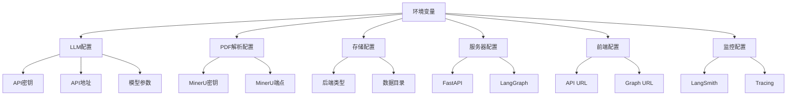

# 第18章 环境变量参考

## 18.1 环境变量概述

### 18.1.1 配置系统说明

ScholarFlow使用**环境变量**进行配置管理，支持多种配置来源：

**配置优先级**（从高到低）：
1. **系统环境变量** - 最高优先级
2. **.env文件** - 项目级配置
3. **代码默认值** - 最低优先级

**配置方式**：
- ✅ **开发环境**：使用`.env`文件
- ✅ **生产环境**：使用系统环境变量或密钥管理服务
- ✅ **Docker环境**：通过docker-compose.yml或容器环境变量

### 18.1.2 环境变量分类



## 18.2 LLM配置

### 18.2.1 API密钥

**LLM_API_KEY** (推荐)
- **描述**: LLM服务API密钥（通用格式）
- **类型**: string
- **必需**: 是
- **示例**: `LLM_API_KEY=sk-89alOLRJDtps121ENQ94JA`
- **说明**: 推荐使用此变量名，支持所有LLM提供商

**OPENAI_API_KEY** (兼容)
- **描述**: OpenAI API密钥
- **类型**: string
- **必需**: 否（如果设置了LLM_API_KEY则无需设置）
- **示例**: `OPENAI_API_KEY=sk-proj-xxxxx`
- **说明**: 向后兼容变量，会被LLM_API_KEY覆盖

**DEEPSEEK_API_KEY** (兼容)
- **描述**: DeepSeek API密钥
- **类型**: string
- **必需**: 否
- **示例**: `DEEPSEEK_API_KEY=sk-xxxxx`
- **说明**: DeepSeek专用的API密钥变量

### 18.2.2 API地址

**LLM_BASE_URL** (推荐)
- **描述**: LLM服务API地址（通用格式）
- **类型**: string
- **必需**: 否
- **默认值**: `https://api.deepseek.com`
- **示例**:
  ```bash
  # DeepSeek
  LLM_BASE_URL=https://api.deepseek.com

  # OpenAI
  LLM_BASE_URL=https://api.openai.com/v1

  # Kimi (Paratera)
  LLM_BASE_URL=https://llmapi.paratera.com/v1

  # 自建服务
  LLM_BASE_URL=https://your-llm-service.com/v1
  ```

**OPENAI_BASE_URL** (兼容)
- **描述**: OpenAI兼容API地址
- **类型**: string
- **必需**: 否
- **示例**: `OPENAI_BASE_URL=https://api.openai.com/v1`

**DEEPSEEK_BASE_URL** (兼容)
- **描述**: DeepSeek API地址
- **类型**: string
- **必需**: 否
- **默认值**: `https://api.deepseek.com`
- **示例**: `DEEPSEEK_BASE_URL=https://api.deepseek.com`

### 18.2.3 模型配置

**LLM_MODEL** (推荐)
- **描述**: LLM模型名称
- **类型**: string
- **必需**: 否
- **默认值**: `deepseek-chat`
- **示例**:
  ```bash
  # DeepSeek
  LLM_MODEL=deepseek-chat
  LLM_MODEL=deepseek-coder

  # OpenAI
  LLM_MODEL=gpt-4
  LLM_MODEL=gpt-3.5-turbo

  # Kimi
  LLM_MODEL=Kimi-K2
  LLM_MODEL=moonshot-v1-8k
  ```

**OPENAI_MODEL** (兼容)
- **描述**: OpenAI模型名称
- **类型**: string
- **必需**: 否
- **示例**: `OPENAI_MODEL=gpt-4`

**DEEPSEEK_MODEL** (兼容)
- **描述**: DeepSeek模型名称
- **类型**: string
- **必需**: 否
- **默认值**: `deepseek-chat`
- **示例**: `DEEPSEEK_MODEL=deepseek-chat`

### 18.2.4 模型参数

**LLM_MAX_TOKENS**
- **描述**: LLM生成的最大token数
- **类型**: integer
- **必需**: 否
- **默认值**: `4000`
- **范围**: 1-32768
- **示例**: `LLM_MAX_TOKENS=8000`
- **说明**: 控制单次生成的最大长度

**LLM_TEMPERATURE**
- **描述**: LLM生成温度参数
- **类型**: float
- **必需**: 否
- **默认值**: `0.7`
- **范围**: 0.0-1.0
- **示例**: `LLM_TEMPERATURE=0.3`
- **说明**:
  - `0.0`: 最确定性输出
  - `0.7`: 平衡创造性和准确性（推荐）
  - `1.0`: 最创造性输出

## 18.3 PDF解析配置

### 18.3.1 MinerU配置

**MINERU_API_KEY**
- **描述**: MinerU服务API密钥
- **类型**: string
- **必需**: 是
- **示例**: `MINERU_API_KEY=eyJ0eXBlIjoiSldUIi...`
- **说明**: 用于PDF解析的API密钥，可在[MinerU官网](https://mineru.net)申请

**MINERU_ENDPOINT**
- **描述**: MinerU API端点地址
- **类型**: string
- **必需**: 否
- **默认值**: `https://api.opendatalab.org.cn`
- **示例**: `MINERU_ENDPOINT=https://api.opendatalab.org.cn`
- **说明**: MinerU服务的API地址

## 18.4 存储配置

### 18.4.1 后端配置

**STORAGE_BACKEND**
- **描述**: 存储后端类型
- **类型**: string
- **必需**: 否
- **默认值**: `local`
- **可选值**:
  - `local`: 本地文件系统
  - `s3`: Amazon S3
  - `oss`: 阿里云OSS
  - `minio`: MinIO对象存储
- **示例**: `STORAGE_BACKEND=s3`
- **说明**: 控制文件存储方式

**DATA_DIR**
- **描述**: 数据工作目录
- **类型**: string
- **必需**: 否
- **默认值**: `data`
- **示例**: `DATA_DIR=/var/lib/scholarflow/data`
- **说明**: 存储上传的PDF、中间文件、输出结果的目录

## 18.5 服务器配置

### 18.5.1 FastAPI配置

**FASTAPI_HOST**
- **描述**: FastAPI服务器绑定地址
- **类型**: string
- **必需**: 否
- **默认值**: `0.0.0.0`
- **示例**: `FASTAPI_HOST=0.0.0.0`
- **说明**:
  - `0.0.0.0`: 监听所有网络接口
  - `127.0.0.1`: 仅本地访问
  - 特定IP: 绑定到指定IP

**FASTAPI_PORT**
- **描述**: FastAPI服务器端口
- **类型**: integer
- **必需**: 否
- **默认值**: `8000`
- **示例**: `FASTAPI_PORT=8080`
- **说明**: FastAPI服务的监听端口

### 18.5.2 LangGraph配置

**LANGGRAPH_HOST**
- **描述**: LangGraph服务器绑定地址
- **类型**: string
- **必需**: 否
- **默认值**: `0.0.0.0`
- **示例**: `LANGGRAPH_HOST=0.0.0.0`
- **说明**: LangGraph工作流服务的监听地址

**LANGGRAPH_PORT**
- **描述**: LangGraph服务器端口
- **类型**: integer
- **必需**: 否
- **默认值**: `8123`
- **示例**: `LANGGRAPH_PORT=8123`
- **说明**: LangGraph服务的监听端口

## 18.6 前端配置

### 18.6.1 Vite配置

**VITE_API_URL**
- **描述**: 前端访问后端API的URL
- **类型**: string
- **必需**: 否
- **默认值**: `http://localhost:8000`
- **示例**:
  ```bash
  # 本地开发
  VITE_API_URL=http://localhost:8000

  # 生产环境
  VITE_API_URL=https://api.scholarflow.com

  # Docker环境
  VITE_API_URL=http://fastapi:8000
  ```
- **说明**: 前端构建时使用的API地址

**VITE_LANGGRAPH_URL**
- **描述**: 前端访问LangGraph服务的URL
- **类型**: string
- **必需**: 否
- **默认值**: `http://localhost:8123`
- **示例**:
  ```bash
  # 本地开发
  VITE_LANGGRAPH_URL=http://localhost:8123

  # 生产环境
  VITE_LANGGRAPH_URL=https://graph.scholarflow.com

  # Docker环境
  VITE_LANGGRAPH_URL=http://langgraph:8123
  ```
- **说明**: 前端访问LangGraph服务的地址

## 18.7 监控配置

### 18.7.1 LangSmith配置

**LANGSMITH_API_KEY**
- **描述**: LangSmith API密钥
- **类型**: string
- **必需**: 否
- **示例**: `LANGSMITH_API_KEY=lsv2_pt_xxxxx`
- **说明**: LangSmith链路追踪服务的API密钥，用于监控LLM调用

**LANGCHAIN_TRACING_V2**
- **描述**: 启用LangChain v2链路追踪
- **类型**: boolean
- **必需**: 否
- **默认值**: 无
- **示例**: `LANGCHAIN_TRACING_V2=true`
- **说明**: 启用后将追踪所有LLM调用，可在LangSmith控制台查看

## 18.8 完整配置示例

### 18.8.1 开发环境配置

**`.env.development`**
```bash
# ========================================
# LLM Configuration
# ========================================
LLM_API_KEY=sk-dev-xxxxx
LLM_BASE_URL=https://api.deepseek.com
LLM_MODEL=deepseek-chat
LLM_MAX_TOKENS=4000
LLM_TEMPERATURE=0.8

# ========================================
# MinerU Configuration
# ========================================
MINERU_API_KEY=eyJ0eXBlIjoiSldUIi...
MINERU_ENDPOINT=https://api.opendatalab.org.cn

# ========================================
# Storage Configuration
# ========================================
STORAGE_BACKEND=local
DATA_DIR=data

# ========================================
# Server Configuration
# ========================================
FASTAPI_HOST=0.0.0.0
FASTAPI_PORT=8000
LANGGRAPH_HOST=0.0.0.0
LANGGRAPH_PORT=8123

# ========================================
# Frontend Configuration
# ========================================
VITE_API_URL=http://localhost:8000
VITE_LANGGRAPH_URL=http://localhost:8123

# ========================================
# Monitoring Configuration
# ========================================
LANGSMITH_API_KEY=lsv2_pt_xxxxx
LANGCHAIN_TRACING_V2=true
```

### 18.8.2 生产环境配置

**`.env.production`**
```bash
# ========================================
# LLM Configuration
# ========================================
LLM_API_KEY=sk-prod-xxxxx
LLM_BASE_URL=https://api.deepseek.com
LLM_MODEL=deepseek-chat
LLM_MAX_TOKENS=4000
LLM_TEMPERATURE=0.3

# ========================================
# MinerU Configuration
# ========================================
MINERU_API_KEY=eyJ0eXBlIjoiSldUIi...
MINERU_ENDPOINT=https://api.opendatalab.org.cn

# ========================================
# Storage Configuration
# ========================================
STORAGE_BACKEND=s3
DATA_DIR=/var/lib/scholarflow/data

# ========================================
# Server Configuration
# ========================================
FASTAPI_HOST=0.0.0.0
FASTAPI_PORT=80
LANGGRAPH_HOST=0.0.0.0
LANGGRAPH_PORT=8080

# ========================================
# Frontend Configuration
# ========================================
VITE_API_URL=https://api.scholarflow.com
VITE_LANGGRAPH_URL=https://graph.scholarflow.com

# ========================================
# Monitoring Configuration
# ========================================
LANGSMITH_API_KEY=lsv2_pt_xxxxx
LANGCHAIN_TRACING_V2=true
```

### 18.8.3 Docker环境配置

**`docker-compose.yml`**
```yaml
version: '3.8'

services:
  scholarflow-api:
    image: scholarflow:latest
    environment:
      # LLM Configuration
      - LLM_API_KEY=${LLM_API_KEY}
      - LLM_BASE_URL=${LLM_BASE_URL}
      - LLM_MODEL=${LLM_MODEL}
      - LLM_MAX_TOKENS=4000
      - LLM_TEMPERATURE=0.7

      # MinerU Configuration
      - MINERU_API_KEY=${MINERU_API_KEY}
      - MINERU_ENDPOINT=https://api.opendatalab.org.cn

      # Storage Configuration
      - STORAGE_BACKEND=local
      - DATA_DIR=/app/data

      # Server Configuration
      - FASTAPI_HOST=0.0.0.0
      - FASTAPI_PORT=8000
      - LANGGRAPH_HOST=0.0.0.0
      - LANGGRAPH_PORT=8123

      # Monitoring
      - LANGSMITH_API_KEY=${LANGSMITH_API_KEY}
      - LANGCHAIN_TRACING_V2=true
    ports:
      - "8000:8000"
      - "8123:8123"
    volumes:
      - scholarflow_data:/app/data

  scholarflow-frontend:
    build:
      context: ./frontend
      args:
        - VITE_API_URL=http://localhost:8000
        - VITE_LANGGRAPH_URL=http://localhost:8123
    ports:
      - "3000:3000"

volumes:
  scholarflow_data:
```

## 18.9 配置验证

### 18.9.1 必需变量检查

使用以下脚本检查必需的环境变量：

```bash
#!/bin/bash
# check_env.sh - 检查环境变量

echo "检查必需的环境变量..."

# 检查LLM API密钥
if [ -z "$LLM_API_KEY" ] && [ -z "$OPENAI_API_KEY" ] && [ -z "$DEEPSEEK_API_KEY" ]; then
    echo "❌ 错误: 未设置LLM API密钥 (LLM_API_KEY, OPENAI_API_KEY, 或 DEEPSEEK_API_KEY)"
    exit 1
fi

# 检查MinerU API密钥
if [ -z "$MINERU_API_KEY" ]; then
    echo "❌ 错误: 未设置MINERU_API_KEY"
    exit 1
fi

echo "✅ 环境变量检查通过"
```

### 18.9.2 Python配置验证

```python
# validate_config.py - Python配置验证脚本
import os
from app.core.config import get_settings

def validate_config():
    """验证环境配置"""
    settings = get_settings()
    errors = []

    # 检查LLM配置
    if not settings.llm_api_key:
        errors.append("❌ LLM API密钥未设置")

    if settings.llm_temperature < 0 or settings.llm_temperature > 1:
        errors.append(f"❌ LLM温度参数无效: {settings.llm_temperature}")

    if settings.llm_max_tokens <= 0:
        errors.append(f"❌ LLM最大token数无效: {settings.llm_max_tokens}")

    # 检查MinerU配置
    if not settings.mineru_api_key:
        errors.append("❌ MinerU API密钥未设置")

    # 输出结果
    if errors:
        print("配置验证失败:")
        for error in errors:
            print(error)
        return False
    else:
        print("✅ 配置验证通过")
        print(f"LLM模型: {settings.llm_model}")
        print(f"LLM温度: {settings.llm_temperature}")
        print(f"数据目录: {settings.data_dir}")
        return True

if __name__ == "__main__":
    validate_config()
```

## 18.10 安全最佳实践

### 18.10.1 敏感信息管理

**1. 使用密钥管理服务**：
```bash
# AWS Secrets Manager
LLM_API_KEY=$(aws secretsmanager get-secret-value --secret-id scholarflow/llm-key --query SecretString --output text)

# Azure Key Vault
LLM_API_KEY=$(az keyvault secret show --vault-name scholarflow-vault --name llm-key --query value -o tsv)

# Google Secret Manager
LLM_API_KEY=$(gcloud secrets versions access latest --secret="llm-key")
```

**2. 加密存储**：
```bash
# 使用age加密
echo "sk-xxxxx" | age -r recipient@email.com -o secret.age

# 使用gpg加密
echo "sk-xxxxx" | gpg --cipher-algo AES256 --compress-algo 1 --s2k-mode 3 --s2k-digest-algo SHA512 --s2k-count 65536 --force-mdc --quiet --no-greeting -c -o secret.gpg
```

**3. 最小权限原则**：
```bash
# 仅授予必要的API权限
# LLM API: 只读权限
# MinerU API: PDF解析权限
```

### 18.10.2 环境隔离

**开发环境**：
```bash
# 使用独立的API密钥和测试资源
LLM_API_KEY=sk-dev-xxxxx
MINERU_API_KEY=dev-key
```

**预发布环境**：
```bash
# 使用模拟数据和限流API
LLM_API_KEY=sk-staging-xxxxx
LLM_MAX_TOKENS=1000
```

**生产环境**：
```bash
# 使用高可用API和完整权限
LLM_API_KEY=sk-prod-xxxxx
MINERU_API_KEY=prod-key
```

## 18.11 故障排除

### 18.11.1 常见问题

**问题1：API密钥不生效**
```bash
# 检查变量名
echo $LLM_API_KEY

# 检查.env文件是否加载
python -c "from dotenv import load_dotenv; load_dotenv(); import os; print(os.getenv('LLM_API_KEY'))"

# 检查变量优先级
export LLM_API_KEY=override_value  # 最高优先级
```

**问题2：端口冲突**
```bash
# 检查端口占用
netstat -tulpn | grep 8000

# 使用其他端口
FASTAPI_PORT=8001
LANGGRAPH_PORT=8124
```

**问题3：温度参数无效**
```bash
# 检查数据类型
LLM_TEMPERATURE=0.7  # 正确：浮点数
LLM_TEMPERATURE=0    # 错误：会解析为整数
```

### 18.11.2 调试技巧

**启用详细日志**：
```bash
# 设置日志级别
export LOG_LEVEL=DEBUG

# 启用Python详细输出
export PYTHONUNBUFFERED=1

# 启用pytest详细输出
export PYTEST_VERBOSE=1
```

**检查配置加载**：
```python
import os
from dotenv import load_dotenv

# 手动加载.env文件
load_dotenv()

# 打印所有相关环境变量
for key in ['LLM_API_KEY', 'LLM_BASE_URL', 'LLM_MODEL', 'MINERU_API_KEY']:
    print(f"{key}: {os.getenv(key)}")
```

## 18.12 配置模板

### 18.12.1 .env.example模板

```bash
# ========================================
# ScholarFlow Environment Variables Template
# ========================================

# ----------------------------------------
# LLM Configuration (Required)
# ----------------------------------------
# LLM API Key - Get from your LLM provider
LLM_API_KEY=your_llm_api_key_here

# LLM Base URL - API endpoint
LLM_BASE_URL=https://api.deepseek.com

# LLM Model - Model name to use
LLM_MODEL=deepseek-chat

# Maximum tokens for LLM response
LLM_MAX_TOKENS=4000

# Temperature (0.0-1.0) - Lower for consistency, higher for creativity
LLM_TEMPERATURE=0.7

# ----------------------------------------
# MinerU Configuration (Required)
# ----------------------------------------
# MinerU API Key - Get from https://mineru.net
MINERU_API_KEY=your_mineru_api_key_here

# MinerU Endpoint
MINERU_ENDPOINT=https://api.opendatalab.org.cn

# ----------------------------------------
# Storage Configuration
# ----------------------------------------
# Storage backend: local, s3, oss, minio
STORAGE_BACKEND=local

# Data directory for uploads and outputs
DATA_DIR=data

# ----------------------------------------
# Server Configuration
# ----------------------------------------
# FastAPI Server
FASTAPI_HOST=0.0.0.0
FASTAPI_PORT=8000

# LangGraph Server
LANGGRAPH_HOST=0.0.0.0
LANGGRAPH_PORT=8123

# ----------------------------------------
# Frontend Configuration
# ----------------------------------------
# Frontend API URLs
VITE_API_URL=http://localhost:8000
VITE_LANGGRAPH_URL=http://localhost:8123

# ----------------------------------------
# Monitoring Configuration (Optional)
# ----------------------------------------
# LangSmith API Key - For LLM tracing
LANGSMITH_API_KEY=your_langsmith_key_here

# Enable LangChain v2 tracing
LANGCHAIN_TRACING_V2=true
```

## 18.13 章节导航

- **上一章**: [第17章 - 测试策略与覆盖](17_测试策略与覆盖.md) - 了解测试方法
- **下一章**: [第19章 - 故障排除指南](19_故障排除指南.md) - 问题诊断
- **代码示例**: [配置验证示例](code-examples/basic/02_basic-config.py) - 配置使用
- **深入理解**: [第15章 - 配置管理](15_配置管理.md) - 配置系统设计

---

**本章要点**:
- ✅ 完整的LLM配置（API密钥、地址、模型、参数）
- ✅ MinerU PDF解析配置
- ✅ 存储和服务器配置选项
- ✅ 前端和监控配置
- ✅ 开发、生产、Docker环境配置示例
- ✅ 配置验证和安全最佳实践
- ✅ 详细的环境变量参考文档
