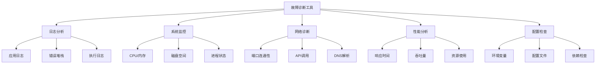

# 第19章 故障排除指南

## 19.1 故障排除概述

### 19.1.1 故障诊断流程

ScholarFlow的故障排除遵循**系统化诊断**流程，确保快速定位和解决问题。

**诊断流程**：
1. **识别问题** - 收集错误信息和症状
2. **分析日志** - 查看相关日志和追踪信息
3. **定位根因** - 缩小问题范围，找到根本原因
4. **实施修复** - 应用解决方案
5. **验证解决** - 确认问题已解决
6. **文档记录** - 记录问题和解决方案

**故障分类**：
- 🔴 **严重故障** - 服务无法启动或崩溃
- 🟡 **性能问题** - 响应慢、内存泄漏
- 🟠 **功能错误** - 特定功能异常
- 🔵 **配置问题** - 环境变量或设置错误

### 19.1.2 诊断工具箱



## 19.2 常见问题及解决方案

### 19.2.1 服务启动问题

**问题1：FastAPI服务启动失败**

**症状**：
```bash
❌ Error: bind(): Address already in use
❌ Error: No module named 'app'
❌ Error: uvicorn not found
```

**诊断步骤**：
```bash
# 1. 检查端口占用
netstat -tulpn | grep 8000

# 2. 检查Python模块路径
echo $PYTHONPATH

# 3. 检查依赖安装
pip list | grep fastapi
pip list | grep uvicorn

# 4. 检查Python版本
python --version
```

**解决方案**：
```bash
# 端口被占用 - 杀死占用进程
lsof -ti:8000 | xargs kill -9

# 或使用其他端口
uvicorn app.api.main:app --port 8001

# 模块未找到 - 检查PYTHONPATH
export PYTHONPATH=/path/to/scholarflow:$PYTHONPATH

# 依赖未安装 - 安装依赖
pip install fastapi uvicorn
pip install -r requirements.txt

# 或使用uv
uv sync
```

**问题2：LangGraph服务启动失败**

**症状**：
```bash
❌ Error: SQLite database is locked
❌ Error: Checkpoint directory not writable
❌ Error: Port 8123 already in use
```

**诊断步骤**：
```bash
# 1. 检查数据库文件权限
ls -la data/workflows/checkpoints.db

# 2. 检查目录权限
ls -ld data/workflows/

# 3. 检查端口占用
netstat -tulpn | grep 8123

# 4. 检查是否有僵尸进程
ps aux | grep langgraph
```

**解决方案**：
```bash
# 数据库锁定 - 杀死占用进程
fuser data/workflows/checkpoints.db
kill -9 <pid>

# 权限问题 - 修复权限
chmod 755 data/workflows/
chmod 664 data/workflows/checkpoints.db
chown -R $USER:$USER data/workflows/

# 端口占用 - 杀死进程或换端口
lsof -ti:8123 | xargs kill -9
python langgraph_server.py --port 8124
```

**问题3：前端服务启动失败**

**症状**：
```bash
❌ Error: npm not found
❌ Error: Port 3000 already in use
❌ Error: VITE_API_URL is not defined
```

**诊断步骤**：
```bash
# 1. 检查Node.js和npm
node --version
npm --version

# 2. 检查端口占用
netstat -tulpn | grep 3000

# 3. 检查环境变量
echo $VITE_API_URL

# 4. 检查依赖安装
cd frontend && npm list
```

**解决方案**：
```bash
# Node.js未安装 - 安装Node.js
curl -fsSL https://deb.nodesource.com/setup_18.x | sudo -E bash -
sudo apt-get install -y nodejs

# 端口占用 - 杀死进程或换端口
lsof -ti:3000 | xargs kill -9
npm run dev -- --port 3001

# 环境变量未设置 - 设置环境变量
export VITE_API_URL=http://localhost:8000
export VITE_LANGGRAPH_URL=http://localhost:8123

# 依赖未安装 - 安装依赖
cd frontend
npm install
```

### 19.2.2 工作流执行问题

**问题1：工作流卡在某个节点**

**症状**：
```json
{
  "status": "stage1_processing",
  "progress_percentage": 20.0,
  "current_step": "正在处理第2/5个分块",
  "updated_at": "2024-12-21T10:30:00"
}
```

**诊断步骤**：
```python
# 1. 检查执行日志
from app.storage.checkpointer import get_checkpointer
checkpointer = get_checkpointer()
state = checkpointer.load_state("task_id")
print(state.get("execution_log", []))

# 2. 检查当前节点状态
print(f"当前分块索引: {state.get('current_chunk_index')}")
print(f"已完成分块: {state.get('stage1_completed')}")
print(f"失败分块: {state.get('stage1_failed', [])}")

# 3. 检查LLM API调用
# 查看是否有API调用失败
```

**解决方案**：
```python
# 重置到失败前的状态
state["current_chunk_index"] = 0
state["stage1_results"] = []
state["stage1_completed"] = 0
state["stage1_failed"] = []
state["status"] = "stage1_processing"

# 保存状态
checkpointer.save_state("task_id", state, "reset")

# 恢复工作流
from app.graph.workflow import resume_workflow
await resume_workflow("task_id", None)
```

**问题2：工作流失败并报错**

**症状**：
```json
{
  "status": "failed",
  "error_message": "LLM API call failed: Rate limit exceeded",
  "current_step": "LLM调用失败"
}
```

**诊断步骤**：
```bash
# 1. 检查API密钥
echo $LLM_API_KEY

# 2. 测试API连接
curl -H "Authorization: Bearer $LLM_API_KEY" $LLM_BASE_URL/models

# 3. 检查API配额
# 登录LLM提供商控制台查看配额

# 4. 查看详细错误
# 检查应用日志
tail -f logs/scholarflow.log
```

**解决方案**：
```python
# API密钥错误 - 更新.env文件
# 检查API密钥拼写和有效性

# 速率限制 - 实现重试机制
import asyncio
from functools import wraps

def retry_on_rate_limit(max_retries=3, delay=5):
    def decorator(func):
        @wraps(func)
        async def wrapper(*args, **kwargs):
            for i in range(max_retries):
                try:
                    return await func(*args, **kwargs)
                except Exception as e:
                    if "rate limit" in str(e).lower() and i < max_retries - 1:
                        print(f"Rate limit hit, retrying in {delay}s... ({i+1}/{max_retries}).sleep(delay)
")
                        await asyncio                        delay *= 2  # 指数退避
                    else:
                        raise
            return None
        return wrapper
    return decorator
```

### 19.2.3 PDF解析问题

**问题1：PDF上传失败**

**症状**：
```bash
❌ Error: Only PDF files are allowed
❌ Error: File too large
❌ Error: Upload failed
```

**诊断步骤**：
```bash
# 1. 检查文件类型
file uploaded_file.pdf

# 2. 检查文件大小
ls -lh uploaded_file.pdf

# 3. 检查上传目录权限
ls -ld data/upload/

# 4. 检查磁盘空间
df -h
```

**解决方案**：
```python
# 文件类型错误 - 确保是PDF
if not file.filename.lower().endswith('.pdf'):
    raise HTTPException(status_code=400, detail="Only PDF files are allowed")

# 文件过大 - 压缩或分段
# PDF文件建议 < 50MB

# 权限问题 - 修复权限
chmod 755 data/upload/
chown -R $USER:$USER data/upload/

# 磁盘空间不足 - 清理空间
# 或扩展磁盘
```

**问题2：PDF解析超时**

**症状**：
```bash
❌ Error: MinerU API timeout
❌ Error: PDF parsing failed
```

**诊断步骤**：
```bash
# 1. 检查MinerU API状态
curl -I $MINERU_ENDPOINT/health

# 2. 检查网络连接
ping api.opendatalab.org.cn

# 3. 测试API密钥
curl -H "Authorization: Bearer $MINERU_API_KEY" $MINERU_ENDPOINT/status

# 4. 检查PDF文件
pdfinfo paper.pdf  # 查看PDF信息
```

**解决方案**：
```python
# 增加超时时间
async with MinerUClient(...) as client:
    result = await asyncio.wait_for(
        client.parse_pdf(pdf_path),
        timeout=300  # 5分钟
    )

# 优化PDF文件
# - 压缩图片
# - 移除不必要的内容
# - 修复损坏的PDF

# 检查PDF质量
# 使用pdfinfo检查PDF信息
```

### 19.2.4 渲染问题

**问题1：Marp渲染失败**

**症状**：
```bash
❌ Error: Marp binary not found
❌ Error: Chrome not found
❌ Error: Rendering timeout
```

**诊断步骤**：
```bash
# 1. 检查Marp CLI安装
marp --version

# 2. 检查Chrome安装
chromium --version
google-chrome --version

# 3. 测试手动渲染
marp test.md --pptx

# 4. 检查环境变量
echo $CHROME_PATH
```

**解决方案**：
```bash
# Marp CLI未安装
npm install -g @marp-team/marp-cli

# Chrome未安装
# Ubuntu/Debian
sudo apt-get install -y chromium-browser

# macOS
brew install chromium

# 设置CHROME_PATH
export CHROME_PATH=/usr/bin/chromium-browser

# 渲染超时 - 增加超时时间
# 在marp_engine.py中
result = subprocess.run(
    cmd,
    timeout=600  # 10分钟
)
```

**问题2：图片引用错误**

**症状**：
```bash
❌ Error: Image not found: images/hash123.jpg
❌ Error: Broken image link
```

**诊断步骤**：
```python
# 1. 检查Token映射
from app.services.parser.image_manager import ImageManager
manager = ImageManager(Path("data/intermediate"))
token_map = manager.load_token_map(task_id)
print(token_map)

# 2. 检查图片文件
import os
for token, info in token_map.items():
    img_path = info["original_path"]
    print(f"{token}: {os.path.exists(img_path)}")

# 3. 检查Token恢复
# 查看rendering节点是否正确恢复Token
```

**解决方案**：
```python
# Token丢失 - 从文件重新加载
token_map_path = Path("data/intermediate/{task_id}/token_map.json")
if token_map_path.exists():
    with open(token_map_path, 'r') as f:
        image_token_map = json.load(f)

# 图片文件缺失 - 重新提取
# 从原始PDF重新解析

# Token未恢复 - 检查rendering节点
# 确保在渲染前调用restore_tokens_to_markdown_enhanced()
```

## 19.3 日志分析

### 19.3.1 日志类型

**应用日志**：
```python
# app/core/logger.py
import logging
from datetime import datetime

# 设置日志格式
logging.basicConfig(
    level=logging.INFO,
    format='%(asctime)s - %(name)s - %(levelname)s - %(message)s',
    handlers=[
        logging.FileHandler(f'logs/app_{datetime.now().strftime("%Y%m%d")}.log'),
        logging.StreamHandler()
    ]
)

logger = logging.getLogger(__name__)

# 记录不同级别日志
logger.info("Task created: {task_id}")
logger.warning("Rate limit approaching")
logger.error("LLM API failed", exc_info=True)
```

**执行日志**（存储在状态中）：
```python
{
  "execution_log": [
    {
      "timestamp": "2024-12-21T10:30:00",
      "event": "task_created",
      "details": {}
    },
    {
      "timestamp": "2024-12-21T10:30:05",
      "event": "pdf_parsing_started",
      "details": {"pdf_path": "paper.pdf"}
    },
    {
      "timestamp": "2024-12-21T10:32:00",
      "event": "pdf_parsing_completed",
      "details": {"markdown_size": 50000}
    }
  ]
}
```

### 19.3.2 日志分析工具

**日志查看命令**：
```bash
# 实时查看日志
tail -f logs/app.log

# 查看最近100行
tail -100 logs/app.log

# 搜索错误
grep ERROR logs/app.log

# 搜索特定任务
grep "task_id" logs/app.log

# 按时间过滤
sed -n '/2024-12-21 10:30:00/,/2024-12-21 11:00:00/p' logs/app.log
```

**日志聚合工具**：
```bash
# 使用jq格式化JSON日志
cat logs/app.log | jq '.'

# 统计错误数量
grep ERROR logs/app.log | wc -l

# 提取错误堆栈
grep -A 10 ERROR logs/app.log

# 生成错误报告
grep ERROR logs/app.log | \
awk '{print $4, $5, $6}' | \
sort | uniq -c | sort -nr
```

### 19.3.3 常见错误模式

**错误模式1：API调用失败**
```
ERROR - LLM API call failed: Connection timeout
Traceback (most recent call last):
  File "app/services/llm/provider.py", line 45, in call_model
    response = await client.acomplete(prompt)
  File "httpx/_client.py", line 350, in request
    response = await self.send(request, auth=auth)
  File "httpx/_transports/asgi.py", line 149, in send
    response = await self.app(scope, receive, send)
TimeoutError: The request timed out.
```

**解决方案**：
- 检查网络连接
- 增加超时时间
- 实现重试机制

**错误模式2：数据库锁定**
```
ERROR - SQLite database is locked
Traceback (most recent call last):
  File "aiosqlite/_context_manager.py", line 35, in __aenter__
    return await self._conn.__aenter__()
  File "aiosqlite/_connection.py", line 140, in __aenter__
    await self._execute("BEGIN IMMEDIATE")
OperationalError: database is locked
```

**解决方案**：
```bash
# 杀死占用数据库的进程
fuser data/workflows/checkpoints.db

# 重启服务
docker-compose restart

# 恢复数据库
sqlite3 data/workflows/checkpoints.db ".recover" > recovered.sql
```

**错误模式3：内存不足**
```
ERROR - Memory allocation failed
Traceback (most recent call last):
  File "app/services/llm/provider.py", line 45, in call_model
    response = await client.acomplete(prompt)
MemoryError: Unable to allocate memory
```

**解决方案**：
- 减少并发任务数
- 优化内存使用
- 增加系统内存

## 19.4 性能诊断

### 19.4.1 性能指标

**关键性能指标 (KPI)**：
- **响应时间** - API调用响应时间
- **吞吐量** - 每秒处理的任务数
- **资源使用** - CPU、内存、磁盘使用率
- **错误率** - 请求失败百分比

**监控脚本**：
```bash
#!/bin/bash
# monitor_performance.sh - 性能监控脚本

echo "=== 系统性能监控 $(date) ==="

# CPU使用率
CPU_USAGE=$(top -bn1 | grep "Cpu(s)" | awk '{print $2}' | cut -d'%' -f1)
echo "CPU使用率: ${CPU_USAGE}%"

# 内存使用率
MEM_USAGE=$(free | grep Mem | awk '{printf("%.2f%%"), $3/$2 * 100.0}')
echo "内存使用率: ${MEM_USAGE}"

# 磁盘使用率
DISK_USAGE=$(df -h / | awk 'NR==2{printf "%s", $5}')
echo "磁盘使用率: ${DISK_USAGE}"

# 进程数
PROCESS_COUNT=$(ps aux | wc -l)
echo "进程数: $PROCESS_COUNT"

# 网络连接数
CONNECTION_COUNT=$(netstat -an | grep ESTABLISHED | wc -l)
echo "活跃连接数: $CONNECTION_COUNT"

# Python进程
PYTHON_PROCESSES=$(ps aux | grep python | grep -v grep | wc -l)
echo "Python进程数: $PYTHON_PROCESSES"
```

### 19.4.2 性能瓶颈分析

**瓶颈1：CPU使用率过高**

**症状**：
```
CPU使用率: 95.0%
```

**诊断**：
```bash
# 查看CPU密集型进程
top -o %CPU

# 查看Python进程CPU使用
ps aux | grep python | awk '{print $2, $3, $11}'

# 分析火焰图（如果安装了py-spy）
py-spy top --pid <python_pid>
```

**解决方案**：
```python
# 限制并发数
import asyncio

MAX_CONCURRENT_TASKS = 5
semaphore = asyncio.Semaphore(MAX_CONCURRENT_TASKS)

async def process_task(task):
    async with semaphore:
        # 处理任务
        await some_cpu_intensive_operation()
```

**瓶颈2：内存使用过高**

**症状**：
```
内存使用率: 90.0%
```

**诊断**：
```bash
# 查看内存使用进程
top -o %MEM

# 检查Python进程内存使用
ps aux | grep python | awk '{print $2, $4, $11}'

# 生成内存转储
python -m pdb -c "import tracemalloc; tracemalloc.start()" script.py
```

**解决方案**：
```python
# 内存优化
import gc

# 手动触发垃圾回收
gc.collect()

# 使用生成器减少内存占用
def process_large_dataset(data):
    for item in data:
        yield process_item(item)  # 而不是一次性返回全部

# 及时释放大对象
del large_variable
gc.collect()
```

**瓶颈3：磁盘I/O瓶颈**

**症状**：
```
磁盘使用率: 95.0%
I/O等待时间: 80%
```

**诊断**：
```bash
# 检查磁盘I/O
iostat -x 1

# 查看磁盘空间
df -h

# 检查大文件
find data/ -type f -size +100M -exec ls -lh {} \;

# 检查磁盘读写速度
dd if=/dev/zero of=/tmp/test bs=1M count=1000 oflag=direct
```

**解决方案**：
```python
# 优化文件操作
import aiofiles
import aiofiles.os

# 异步文件读写
async def read_file_async(path):
    async with aiofiles.open(path, 'r') as f:
        return await f.read()

# 清理临时文件
import shutil
import glob

def cleanup_temp_files():
    temp_files = glob.glob('data/intermediate/*/temp_*')
    for file in temp_files:
        try:
            os.remove(file)
        except:
            pass
```

### 19.4.3 性能优化建议

**1. 工作流优化**：
```python
# 并行处理Stage 1
async def stage1_parallel_processing(chunks):
    # 分批处理，避免资源过载
    batch_size = 3
    for i in range(0, len(chunks), batch_size):
        batch = chunks[i:i+batch_size]
        await asyncio.gather(*[
            process_chunk(chunk) for chunk in batch
        ])
```

**2. 缓存优化**：
```python
from functools import lru_cache
import redis

# 内存缓存
@lru_cache(maxsize=128)
def get_cached_data(key):
    return expensive_operation(key)

# Redis缓存
redis_client = redis.Redis(host='localhost', port=6379, db=0)

def get_or_set_cache(key, value, expire=3600):
    cached = redis_client.get(key)
    if cached:
        return json.loads(cached)
    redis_client.setex(key, expire, json.dumps(value))
    return value
```

## 19.5 网络诊断

### 19.5.1 网络连接测试

**LLM API连接测试**：
```bash
#!/bin/bash
# test_llm_connection.sh - 测试LLM API连接

API_KEY=$LLM_API_KEY
BASE_URL=$LLM_BASE_URL

echo "测试LLM API连接..."
echo "API地址: $BASE_URL"

# 测试API密钥
curl -s -H "Authorization: Bearer $API_KEY" \
     -H "Content-Type: application/json" \
     $BASE_URL/models | \
     jq '.data[0].id'

if [ $? -eq 0 ]; then
    echo "✅ LLM API连接成功"
else
    echo "❌ LLM API连接失败"
    echo "请检查:"
    echo "1. API密钥是否正确"
    echo "2. API地址是否正确"
    echo "3. 网络是否可访问"
fi
```

**MinerU API连接测试**：
```bash
#!/bin/bash
# test_mineru_connection.sh - 测试MinerU API连接

API_KEY=$MINERU_API_KEY
ENDPOINT=$MINERU_ENDPOINT

echo "测试MinerU API连接..."
echo "API地址: $ENDPOINT"

# 测试API密钥
curl -s -H "Authorization: Bearer $API_KEY" \
     $ENDPOINT/health | \
     jq '.status'

if [ $? -eq 0 ]; then
    echo "✅ MinerU API连接成功"
else
    echo "❌ MinerU API连接失败"
fi
```

### 19.5.2 网络问题诊断

**问题1：DNS解析失败**

**症状**：
```bash
❌ Error: Failed to resolve hostname: api.deepseek.com
```

**诊断**：
```bash
# 检查DNS解析
nslookup api.deepseek.com
dig api.deepseek.com

# 测试网络连通性
ping api.deepseek.com

# 检查网络配置
cat /etc/resolv.conf
```

**解决方案**：
```bash
# echo "更换DNS服务器
nameserver 8.8.8.8" > /etc/resolv.conf

# 或使用公共DNS
echo "nameserver 1.1.1.1" >> /etc/resolv.conf
```

**问题2：SSL证书错误**

**症状**：
```bash
❌ Error: SSL certificate verify failed
```

**诊断**：
```bash
# 检查证书
openssl s_client -connect api.deepseek.com:443 -servername api.deepseek.com

# 检查系统时间
date
```

**解决方案**：
```python
# 忽略SSL验证（仅开发环境）
import ssl
ssl._create_default_https_context = ssl._create_unverified_context

# 或更新证书
sudo apt-get update && sudo apt-get install ca-certificates
```

## 19.6 数据库诊断

### 19.6.1 SQLite问题

**问题1：数据库损坏**

**症状**：
```bash
❌ Error: database disk image is malformed
❌ Error: database is locked
```

**诊断**：
```bash
# 检查数据库完整性
sqlite3 data/workflows/checkpoints.db "PRAGMA integrity_check;"

# 查看数据库大小
ls -lh data/workflows/checkpoints.db

# 检查进程占用
lsof data/workflows/checkpoints.db
```

**解决方案**：
```bash
# 恢复损坏的数据库
sqlite3 corrupted.db ".recover" > recovered.sql
sqlite3 new.db < recovered.sql

# 杀死占用进程
fuser data/workflows/checkpoints.db
kill -9 <pid>

# 重新启动服务
docker-compose restart
```

**问题2：数据库性能问题**

**诊断**：
```sql
-- 查看数据库统计信息
PRAGMA database_list;

-- 查看表结构
.schema

-- 分析查询性能
EXPLAIN QUERY PLAN SELECT * FROM checkpoints WHERE thread_id = 'task123';

-- 优化数据库
PRAGMA optimize;
VACUUM;
```

**解决方案**：
```sql
-- 启用WAL模式
PRAGMA journal_mode = WAL;

-- 设置同步模式
PRAGMA synchronous = NORMAL;

-- 增加缓存大小
PRAGMA cache_size = 10000;

-- 设置临时存储为内存
PRAGMA temp_store = memory;
```

### 19.6.2 数据恢复

**备份恢复流程**：
```bash
#!/bin/bash
# backup_and_restore.sh - 备份和恢复数据库

BACKUP_DIR="/backup/scholarflow"
DATE=$(date +%Y%m%d_%H%M%S)

# 创建备份
echo "创建备份..."
cp data/workflows/checkpoints.db $BACKUP_DIR/checkpoints_${DATE}.db

# 压缩备份
gzip $BACKUP_DIR/checkpoints_${DATE}.db

echo "备份完成: $BACKUP_DIR/checkpoints_${DATE}.db.gz"

# 恢复备份
echo "恢复备份..."
gunzip -c $BACKUP_DIR/checkpoints_20241221_120000.db.gz > data/workflows/checkpoints.db

echo "恢复完成"
```

## 19.7 监控与告警

### 19.7.1 健康检查端点

**实现健康检查**：
```python
# app/api/health.py
from fastapi import APIRouter
from datetime import datetime
import asyncio

router = APIRouter(tags=["health"])

@router.get("/health")
async def health_check():
    """系统健康检查"""
    health_status = {
        "status": "healthy",
        "timestamp": datetime.now().isoformat(),
        "services": {}
    }

    # 检查FastAPI
    health_status["services"]["fastapi"] = "up"

    # 检查LangGraph
    try:
        from app.storage.checkpointer import get_checkpointer
        checkpointer = get_checkpointer()
        health_status["services"]["langgraph"] = "up"
    except Exception as e:
        health_status["services"]["langgraph"] = f"down: {str(e)}"
        health_status["status"] = "unhealthy"

    # 检查数据库
    try:
        import aiosqlite
        async with aiosqlite.connect("data/workflows/checkpoints.db") as db:
            await db.execute("SELECT 1")
        health_status["services"]["database"] = "up"
    except Exception as e:
        health_status["services"]["database"] = f"down: {str(e)}"
        health_status["status"] = "unhealthy"

    # 检查外部服务
    # LLM API
    # MinerU API
    # ...

    return health_status
```

### 19.7.2 告警规则

**告警脚本**：
```bash
#!/bin/bash
# alert.sh - 告警脚本

# CPU使用率告警
CPU_USAGE=$(top -bn1 | grep "Cpu(s)" | awk '{print $2}' | cut -d'%' -f1 | cut -d'.' -f1)
if [ $CPU_USAGE -gt 80 ]; then
    echo "🚨 CPU使用率过高: ${CPU_USAGE}%"
    # 发送告警（邮件/微信/钉钉等）
fi

# 内存使用率告警
MEM_USAGE=$(free | grep Mem | awk '{printf "%.0f", $3/$2 * 100.0}')
if [ $MEM_USAGE -gt 85 ]; then
    echo "🚨 内存使用率过高: ${MEM_USAGE}%"
fi

# 磁盘使用率告警
DISK_USAGE=$(df -h / | awk 'NR==2{print $5}' | cut -d'%' -f1)
if [ $DISK_USAGE -gt 90 ]; then
    echo "🚨 磁盘使用率过高: ${DISK_USAGE}%"
fi

# 任务失败率告警
FAILED_TASKS=$(find data/workflows/tasks -name "*.json" -exec grep -l '"status": "failed"' {} \; | wc -l)
TOTAL_TASKS=$(find data/workflows/tasks -name "*.json" | wc -l)
if [ $TOTAL_TASKS -gt 0 ]; then
    FAIL_RATE=$((FAILED_TASKS * 100 / TOTAL_TASKS))
    if [ $FAIL_RATE -gt 10 ]; then
        echo "🚨 任务失败率过高: ${FAIL_RATE}%"
    fi
fi
```

## 19.8 最佳实践

### 19.8.1 预防措施

**1. 定期健康检查**：
```bash
# 添加到crontab，每小时检查一次
0 * * * * /path/to/health_check.sh
```

**2. 日志轮转**：
```bash
# 配置logrotate
# /etc/logrotate.d/scholarflow
/path/to/logs/*.log {
    daily
    rotate 30
    compress
    delaycompress
    missingok
    notifempty
    create 644 www-data www-data
}
```

**3. 资源监控**：
```bash
# 设置监控任务，每5分钟检查一次
*/5 * * * * /path/to/monitor_resources.sh
```

**4. 自动备份**：
```bash
# 每天凌晨2点备份
0 2 * * * /path/to/backup.sh
```

### 19.8.2 故障恢复手册

**服务完全宕机**：
1. 检查服务状态
2. 查看错误日志
3. 重启服务
4. 验证恢复

**数据库损坏**：
1. 停止所有服务
2. 恢复最新备份
3. 验证数据完整性
4. 重启服务

**API密钥过期**：
1. 更新API密钥
2. 重启服务
3. 测试连接

**性能下降**：
1. 检查系统资源
2. 分析瓶颈
3. 优化配置
4. 监控效果

## 19.9 故障排除清单

### 19.9.1 启动问题检查清单

- [ ] 检查端口占用
- [ ] 检查Python模块路径
- [ ] 检查依赖安装
- [ ] 检查环境变量
- [ ] 检查文件权限
- [ ] 检查磁盘空间
- [ ] 检查系统资源

### 19.9.2 运行问题检查清单

- [ ] 查看应用日志
- [ ] 查看错误堆栈
- [ ] 检查API调用
- [ ] 检查数据库状态
- [ ] 检查网络连接
- [ ] 检查资源使用
- [ ] 检查任务队列

### 19.9.3 性能问题检查清单

- [ ] 监控系统指标
- [ ] 分析性能瓶颈
- [ ] 检查并发设置
- [ ] 检查缓存配置
- [ ] 检查数据库性能
- [ ] 优化代码逻辑
- [ ] 调整资源配置

## 19.10 章节导航

- **上一章**: [第18章 - 环境变量参考](18_环境变量参考.md) - 配置参考
- **下一章**: [第20章 - 扩展开发指南](20_扩展开发指南.md) - 开发扩展
- **代码示例**: [错误处理示例](code-examples/basic/14_basic-error-handling.py) - 学习错误处理
- **深入理解**: [第17章 - 测试策略与覆盖](17_测试策略与覆盖.md) - 测试驱动调试

---

**本章要点**:
- ✅ 系统化故障诊断流程
- ✅ 常见问题及解决方案（启动、工作流、PDF、渲染）
- ✅ 日志分析和错误模式识别
- ✅ 性能瓶颈诊断和优化
- ✅ 网络和数据库问题排查
- ✅ 健康检查和告警机制
- ✅ 完整的故障排除清单和恢复手册
