# API调用序列图

## 概述
展示ScholarFlow系统前端与后端API的完整交互序列，从任务创建到结果获取。

```mermaid
sequenceDiagram
    participant F as Frontend (React)
    participant A as FastAPI Server
    participant L as LangGraph Server
    participant W as Workflow Engine
    participant S as SQLite Checkpointer
    participant D as Data Storage

    Note over F, D: 1. 创建任务流程

    F->>A: POST /api/tasks
    Note right of F: 上传PDF，配置参数
    A->>A: 验证请求参数
    A->>D: 保存任务元数据
    D-->>A: 确认保存
    A->>A: 生成task_id
    A-->>F: 202 Accepted
    Note right of A: 返回: {task_id, status: "pending"}

    Note over F, D: 2. 启动工作流

    F->>A: POST /api/tasks/{task_id}/start
    A->>L: invoke_workflow(initial_state)
    Note right of L: 传递初始状态
    L->>W: compile_workflow()
    W->>W: 初始化状态
    W->>S: save_checkpoint(task_id, state)
    S-->>W: 保存成功
    W->>W: 开始执行节点

    par 并行执行工作流节点
        W->>W: parse_pdf -> split_markdown
        W->>W: stage1_process (并行处理分块)
        W->>W: merge_outlines
    end

    W->>S: save_checkpoint(task_id, state)
    S-->>W: 保存成功
    L-->>A: 工作流启动成功
    A-->>F: 200 OK
    Note right of A: 返回: {task_id, status: "running"}

    Note over F, D: 3. 轮询任务状态

    loop 定期轮询
        F->>A: GET /api/tasks/{task_id}
        A->>S: load_checkpoint(task_id)
        S-->>A: 返回最新状态
        A->>A: 过滤敏感数据
        A-->>F: 返回状态快照
        Note right of A: 包含: status, progress, current_step
    end

    Note over F, D: 4. 工作流执行 (详细)

    W->>W: node_parse_pdf
    W->>W: 调用MinerU API
    W->>D: 保存解析结果 (Markdown + images)
    W->>S: save_checkpoint
    S-->>W: ✓

    W->>W: node_split_markdown
    W->>W: 文本分块处理
    W->>S: save_checkpoint
    S-->>W: ✓

    W->>W: node_stage1_process
    Note right of W: 并行处理多个分块
    par 并行LLM调用
        W->>L: 调用LLM (分块1)
        L-->>W: 返回outline_1
    and
        W->>L: 调用LLM (分块2)
        L-->>W: 返回outline_2
    and
        W->>L: 调用LLM (分块N)
        L-->>W: 返回outline_N
    end
    W->>S: save_checkpoint
    S-->>W: ✓

    W->>W: node_merge_outlines
    W->>W: 合并所有outline
    W->>S: save_checkpoint
    S-->>W: ✓

    Note over F, D: 5. 人机交互阶段

    W->>W: node_human_review
    W->>W: 检查是否启用审核
    W->>S: save_checkpoint(status="human_review")
    S-->>W: ✓
    W->>W: 暂停工作流

    A->>F: WebSocket 通知
    Note right of A: {type: "review_required", task_id}

    F->>A: GET /api/tasks/{task_id}/review
    A->>S: load_checkpoint(task_id)
    S-->>A: 返回审核点数据
    A-->>F: 返回审核界面数据
    Note right of A: 包含: outline, prompt, metadata

    F->>F: 显示审核界面
    Note right of F: 用户查看并决策

    F->>A: POST /api/tasks/{task_id}/feedback
    Note right of F: 提交审核反馈
    A->>S: save_checkpoint(feedback)
    S-->>A: ✓
    A->>L: resume_workflow(task_id)
    L-->>A: 恢复成功

    Note over F, D: 6. 继续执行

    W->>W: node_process_feedback
    W->>W: 处理反馈并路由
    W->>S: save_checkpoint
    S-->>W: ✓

    W->>W: node_stage2_process
    W->>L: 调用LLM生成Marp Markdown
    L-->>W: 返回完整幻灯片
    W->>S: save_checkpoint
    S-->>W: ✓

    W->>W: node_render
    W->>W: 调用Marp渲染
    W->>D: 保存输出文件
    W->>S: save_checkpoint(status="completed")
    S-->>W: ✓

    Note over F, D: 7. 获取结果

    F->>A: GET /api/tasks/{task_id}
    A->>S: load_checkpoint(task_id)
    S-->>A: 返回完成状态
    A-->>F: 返回最终结果
    Note right of A: 包含: download_url, output_files

    F->>A: GET /api/tasks/{task_id}/download/{file_id}
    A->>D: 读取输出文件
    D-->>A: 返回文件内容
    A-->>F: 返回文件下载
    Note right of A: Content-Disposition: attachment

    Note over F, D: 完成
```



## 任务创建API序列

### 详细序列：任务创建与启动
```mermaid
sequenceDiagram
    participant C as Client
    participant API as FastAPI
    participant DB as SQLite
    participant CG as Checkpointer

    C->>API: POST /api/tasks
    Note right of C: multipart/form-data:
    Note right of C: - file: PDF文档
    Note right of C: - presentation_style
    Note right of C: - max_chars
    Note right of C: - target_chunks

    API->>API: 验证文件
    API->>API: 检查文件类型 (PDF)
    API->>API: 保存文件到 data/inputs/
    API->>DB: INSERT INTO tasks (...)
    DB-->>API: 返回 task_id

    API->>CG: create_initial_state()
    Note right of CG: 创建WorkflowState
    CG->>CG: 生成初始状态
    CG-->>API: 返回初始状态

    API->>DB: UPDATE tasks SET initial_state=...
    DB-->>API: ✓

    API-->>C: 201 Created
    Note right of API: {
    Note right of API:   "task_id": "uuid",
    Note right of API:   "status": "pending",
    Note right of API:   "message": "Task created"
    Note right of API: }

    Note over C, CG: === 步骤2: 启动工作流 ===

    C->>API: POST /api/tasks/{task_id}/start

    API->>DB: SELECT * FROM tasks WHERE id=task_id
    DB-->>API: 返回任务记录

    API->>API: 验证任务状态 (必须为pending)

    API->>CG: compile_workflow()
    Note right of CG: 创建LangGraph工作流
    CG->>CG: 添加10个节点
    CG->>CG: 添加条件边
    CG->>CG: 编译工作流
    CG-->>API: 返回编译后的工作流

    API->>CG: workflow.invoke(initial_state)
    Note right of CG: 开始执行
    CG->>CG: 执行第一个节点 (initialize)
    CG->>CG: 持久化状态
    CG->>CG: 执行下一个节点 (parse_pdf)
    ...

    CG-->>API: 异步执行已启动
    API-->>C: 202 Accepted
    Note right of API: {
    Note right of API:   "task_id": "uuid",
    Note right of API:   "status": "running",
    Note right of API:   "message": "Workflow started"
    Note right: API: }
```

## 状态查询API序列

### WebSocket实时通知
```mermaid
sequenceDiagram
    participant F as Frontend
    participant WS as WebSocket Server
    participant CG as Checkpointer
    participant W as Workflow

    Note over F, W: 建立WebSocket连接

    F->>WS: Connect /ws/{task_id}
    WS->>WS: 验证task_id
    WS->>WS: 注册连接
    WS-->>F: WebSocket连接已建立

    Note over F, W: 工作流执行中

    W->>CG: save_checkpoint(...)
    CG->>CG: 更新状态到数据库

    CG->>WS: 状态已更新 (事件)
    WS->>F: 发送状态更新
    Note right of WS: {
    Note right of WS:   "type": "status_update",
    Note right: WS:     "task_id": "uuid",
    Note right: WS:     "status": "stage1_processing",
    Note right: WS:     "progress": 35.5,
    Note right: WS:     "current_step": "处理第2个分块"
    Note right: WS: }

    F->>F: 更新UI进度条

    Note over F, W: 需要审核

    W->>CG: save_checkpoint(status="human_review")
    CG->>WS: 审核点已就绪
    WS->>F: 发送审核通知
    Note right of WS: {
    Note right: WS:     "type": "review_required",
    Note right: WS:     "task_id": "uuid",
    Note right: WS:     "review_point": {...}
    Note right: WS: }

    F->>F: 显示审核界面

    Note over F, W: 任务完成

    W->>CG: save_checkpoint(status="completed")
    CG->>WS: 任务已完成
    WS->>F: 发送完成通知
    Note right of WS: {
    Note right: WS:     "type": "task_completed",
    Note right: WS:     "task_id": "uuid",
    Note right: WS:     "download_urls": {...}
    Note right: WS: }

    F->>F: 显示下载按钮
```

## 文件上传API序列

### PDF文件上传流程
```mermaid
sequenceDiagram
    participant U as User
    participant F as Frontend
    participant A as API Server
    participant FS as File System

    U->>F: 选择PDF文件
    F->>F: 验证文件类型 (PDF)
    F->>F: 检查文件大小 (<100MB)

    F->>A: POST /api/upload
    Note right of F: multipart/form-data
    Note right of F: 文件: paper.pdf

    A->>A: 验证Content-Type
    A->>A: 生成唯一文件名
    Note right of A: {timestamp}_{random}.pdf

    A->>FS: 保存文件
    Note right of FS: data/inputs/{filename}
    FS-->>A: 文件保存成功

    A->>A: 计算文件哈希
    A->>A: 病毒扫描 (可选)

    A-->>F: 200 OK
    Note right of A: {
    Note right: A:   "filename": "xxx.pdf",
    Note right: A:   "original_name": "paper.pdf",
    Note right: A:   "size": 15728640,
    Note right: A:   "path": "data/inputs/xxx.pdf",
    Note right: A:   "sha256": "abc123..."
    Note right: A: }

    F->>U: 显示上传成功
    Note right of F: "文件已上传，可以开始转换"
```

## 人机交互API序列

### 审核反馈提交流程
```mermaid
sequenceDiagram
    participant U as User
    participant F as Frontend
    participant A as API Server
    participant C as Checkpointer
    participant W as Workflow

    Note over U, W: 用户查看审核界面

    F->>A: GET /api/tasks/{task_id}/review
    A->>C: load_state(task_id)
    C->>C: 查询审核点数据
    C-->>A: 返回审核内容

    A-->>F: 返回审核数据
    Note right of A: {
    Note right: A:   "task_id": "uuid",
    Note right: A:   "outline": "# 演示文稿大纲",
    Note right: A:   "prompt": "请审核...",
    Note right: A:   "metadata": {...}
    Note right: A: }

    F->>F: 渲染审核界面
    U->>F: 查看内容并决策

    Note over U, W: === 用户提交反馈 ===

    U->>F: 选择操作 (批准/重新生成/终止)
    U->>F: 输入反馈意见 (可选)
    F->>F: 验证用户输入

    F->>A: POST /api/tasks/{task_id}/feedback
    Note right of F: {
    Note right: F:   "approved": true,
    Note right: F:   "action": "approve",
    Note right: F:   "comments": "内容很好，可以继续",
    Note right: F:   "modifications": {...}
    Note right: F: }

    A->>A: 验证反馈数据
    A->>A: 检查任务状态 (必须是human_review)

    A->>C: save_state(human_feedback)
    Note right: C: 保存反馈到状态
    C->>C: 更新状态到数据库
    C-->>A: ✓

    A->>A: 确定下一状态
    Note right of A: approved=true → stage2_processing
    Note right of A: action=regenerate → stage1_processing
    Note right: A: action=abort → failed

    A->>W: resume_workflow(task_id, feedback)
    Note right of W: 恢复工作流执行
    W->>W: 跳转到相应节点
    W-->>A: 恢复成功

    A-->>F: 200 OK
    Note right: A: {
    Note right: A:   "status": "success",
    Note right: A:   "message": "反馈已提交，工作流继续执行"
    Note right: A: }

    F->>U: 显示确认消息
    Note right: F: "审核通过，正在继续生成..."
```

## 错误处理API序列

### 错误响应与恢复
```mermaid
sequenceDiagram
    participant F as Frontend
    participant A as API Server
    participant C as Checkpointer
    participant L as LangGraph

    Note over F, L: 错误发生场景

    L->>L: 执行节点时发生异常
    L->>L: 分类错误类型

    alt 可重试错误
        L->>L: 记录错误信息
        L->>C: save_state(last_error)
        C-->>L: ✓

        L->>L: 指数退避重试
        L->>L: 最多3次重试
        L->>L: 重试成功
        L->>C: save_state(success)
        C-->>L: ✓
    else 不可重试错误
        L->>L: 标记任务失败
        L->>C: save_state(status="failed")
        C-->>L: ✓
    end

    Note over F, L: 前端查询状态

    F->>A: GET /api/tasks/{task_id}
    A->>C: load_state(task_id)
    C-->>A: 返回状态 (可能包含错误)

    alt 任务成功
        A-->>F: 返回结果
        Note right: {status: "completed", result: {...}}
    else 任务失败
        A-->>F: 返回错误信息
        Note right: {
        Note right:   "status": "failed",
        Note right:   "error_code": "LLM_API_ERROR",
        Note right:   "error_message": "...",
        Note right:   "can_retry": false,
        Note right:   "retry_after": null
        Note right: }
        F->>F: 显示错误界面
    else 需要重试
        A-->>F: 返回重试状态
        Note right: {
        Note right:   "status": "retrying",
        Note right:   "retry_count": 2,
        Note right:   "retry_after": 5
        Note right: }
        F->>F: 显示重试倒计时
    end

    Note over F, L: 用户请求重试

    F->>A: POST /api/tasks/{task_id}/retry
    A->>A: 验证是否可以重试
    A->>C: save_state(status="pending")
    A->>L: resume_workflow(task_id)
    L-->>A: 恢复成功
    A-->>F: 202 Accepted
    Note right: {status: "running", message: "任务已重新开始"}
```

## API端点一览

### 主要API端点
| 方法 | 路径 | 描述 | 请求体 | 响应 |
|------|------|------|--------|------|
| POST | `/api/upload` | 上传PDF文件 | multipart/form-data | `{filename, path, size}` |
| POST | `/api/tasks` | 创建任务 | JSON配置 | `{task_id, status}` |
| POST | `/api/tasks/{id}/start` | 启动工作流 | - | `{task_id, status}` |
| GET | `/api/tasks/{id}` | 查询任务状态 | - | `WorkflowState` |
| GET | `/api/tasks/{id}/review` | 获取审核数据 | - | 审核点信息 |
| POST | `/api/tasks/{id}/feedback` | 提交审核反馈 | Feedback对象 | `{status}` |
| POST | `/api/tasks/{id}/retry` | 重试任务 | - | `{status}` |
| GET | `/api/tasks/{id}/download/{file}` | 下载结果 | - | 文件流 |
| GET | `/api/tasks` | 列出任务 | Query参数 | 任务列表 |
| DELETE | `/api/tasks/{id}` | 删除任务 | - | `{status}` |
| WebSocket | `/ws/{task_id}` | 实时状态推送 | - | 状态更新事件 |

### WebSocket消息格式
```typescript
// 状态更新
interface StatusUpdate {
  type: "status_update";
  task_id: string;
  status: string;
  progress: number;
  current_step: string;
}

// 审核通知
interface ReviewRequired {
  type: "review_required";
  task_id: string;
  review_point: ReviewPoint;
}

// 任务完成
interface TaskCompleted {
  type: "task_completed";
  task_id: string;
  download_urls: {
    pptx?: string;
    pdf?: string;
    html?: string;
  };
}

// 错误通知
interface ErrorNotification {
  type: "error";
  task_id: string;
  error_code: string;
  error_message: string;
}
```

## 性能优化

### 1. 请求合并
- 状态查询：前端合并多个状态请求，避免频繁调用
- 批量查询：一次API调用获取多个任务状态
- 增量更新：WebSocket推送增量更新，减少轮询

### 2. 缓存策略
```python
# 状态缓存
@cache(ttl=5)  # 缓存5秒
def get_task_status(task_id: str):
    return checkpointer.load_state(task_id)

# 文件缓存
@cache(ttl=3600)  # 缓存1小时
def get_output_file(file_id: str):
    return read_output_file(file_id)
```

### 3. 分页查询
```python
@router.get("/api/tasks")
async def list_tasks(
    page: int = 1,
    page_size: int = 20,
    status: Optional[str] = None
):
    """分页列出任务"""
    tasks = checkpointer.list_tasks(
        status=status,
        offset=(page - 1) * page_size,
        limit=page_size
    )
    total = checkpointer.count_tasks(status=status)

    return {
        "tasks": tasks,
        "pagination": {
            "page": page,
            "page_size": page_size,
            "total": total,
            "pages": (total + page_size - 1) // page_size
        }
    }
```
