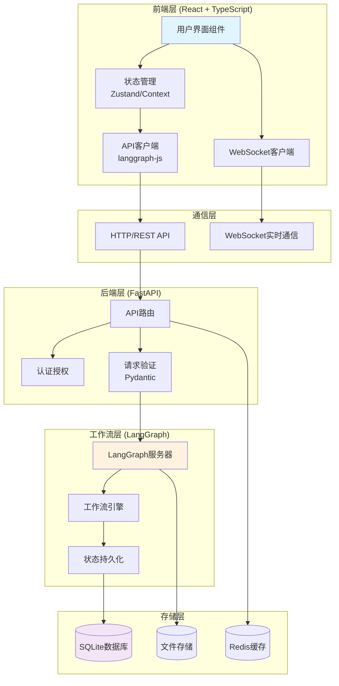
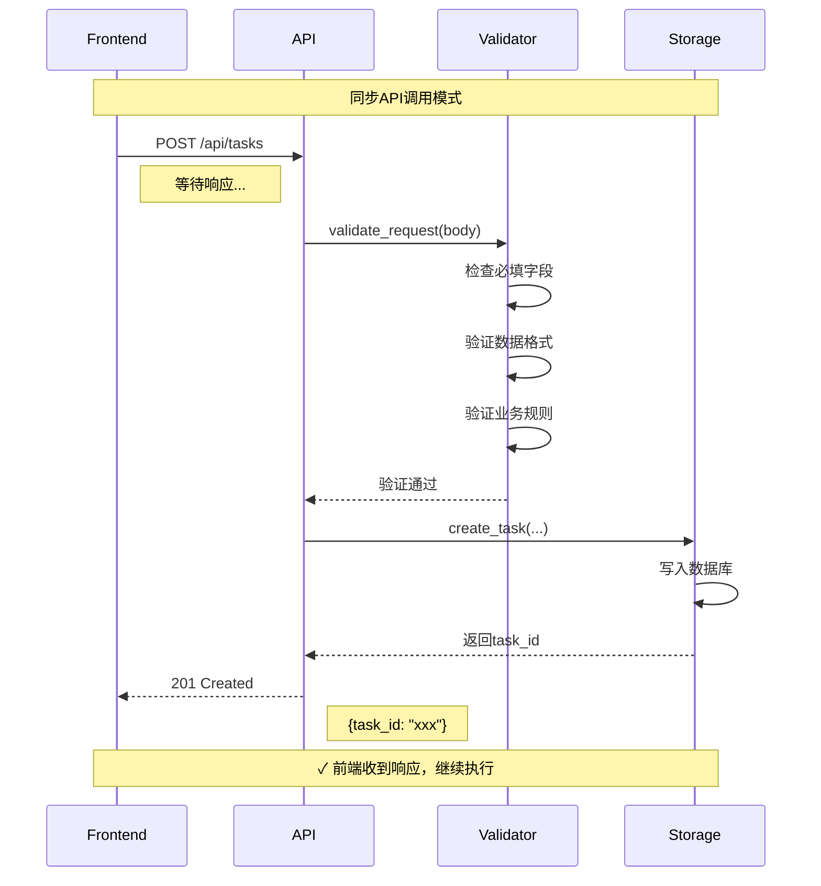
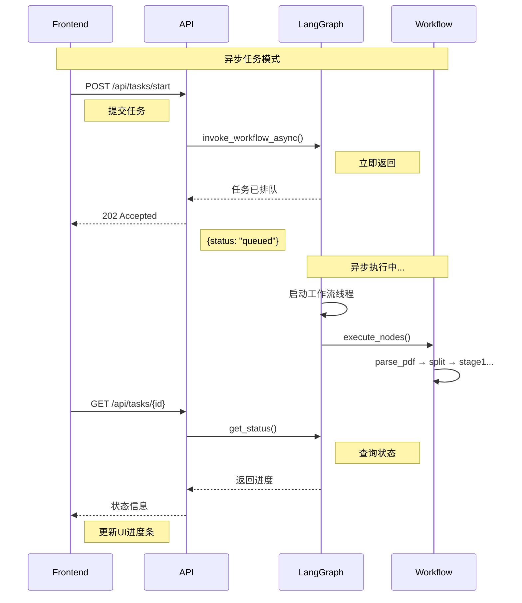
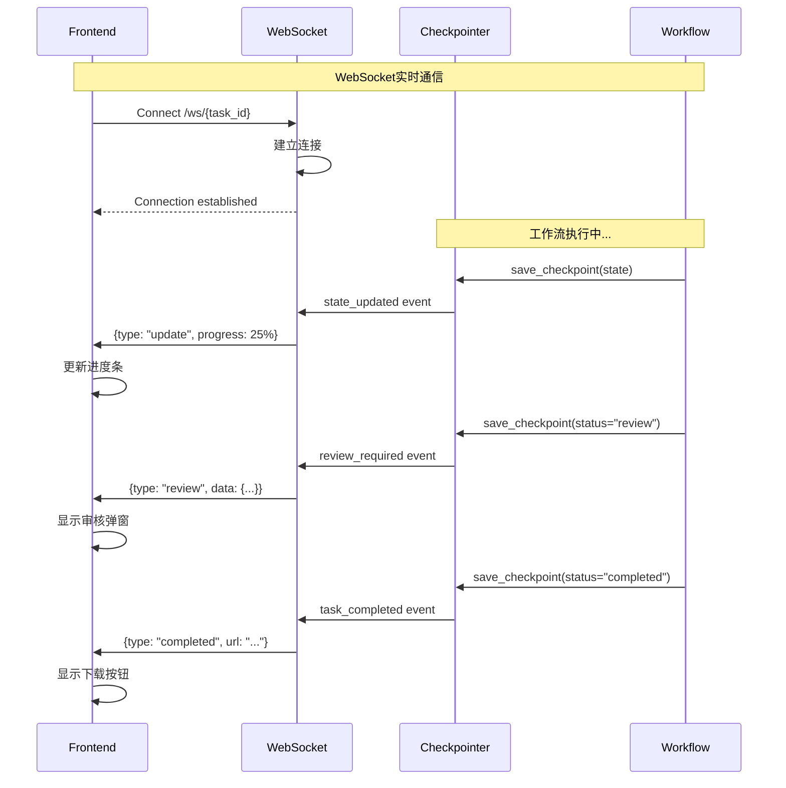
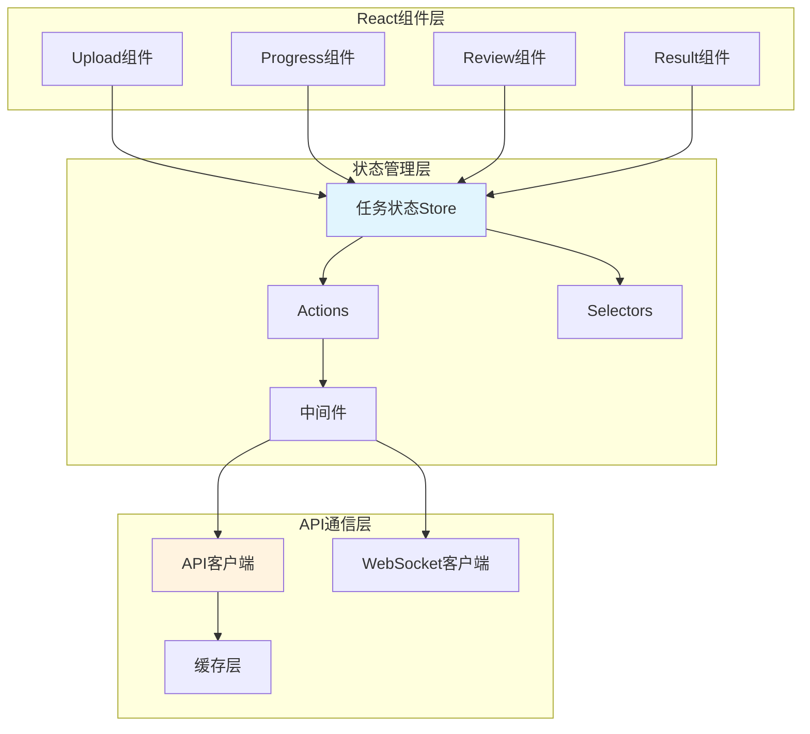
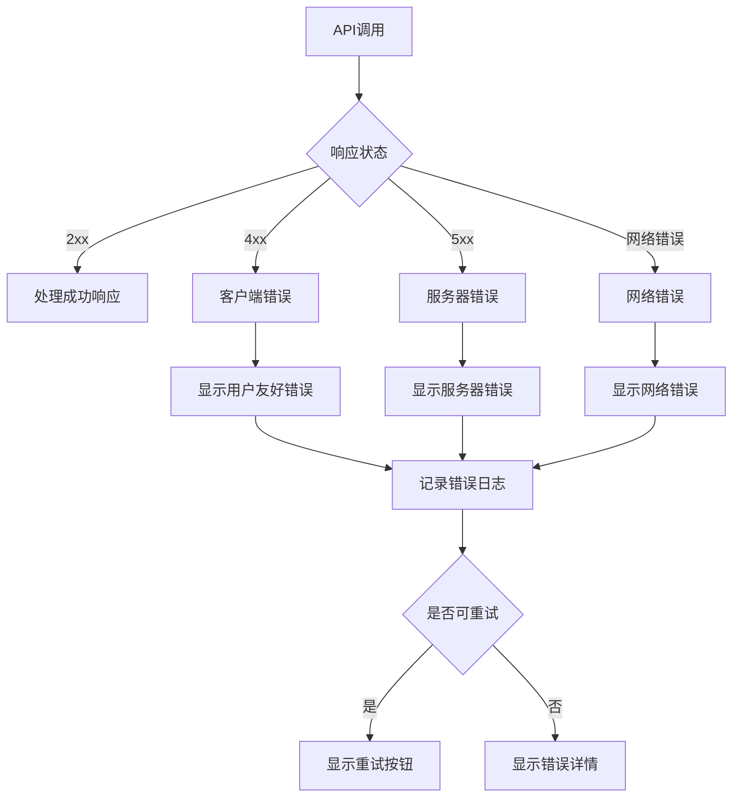

# 前后端交互模式图

## 概述
展示ScholarFlow前端（React）与后端（FastAPI + LangGraph）之间的交互模式和通信机制。



## 交互模式分类

### 1. 同步请求-响应模式


### 2. 异步任务提交模式


### 3. WebSocket实时推送模式


## 前端状态管理

### 状态管理架构


### Zustand状态管理实现
```typescript
// stores/taskStore.ts
import { create } from 'zustand';
import { subscribeWithSelector } from 'zustand/middleware';

interface TaskState {
  // 状态
  taskId: string | null;
  status: TaskStatus | null;
  progress: number;
  currentStep: string;
  error: string | null;
  result: TaskResult | null;

  // 操作
  createTask: (config: TaskConfig) => Promise<void>;
  startWorkflow: () => Promise<void>;
  pollStatus: () => void;
  submitFeedback: (feedback: HumanFeedback) => Promise<void>;
  resetTask: () => void;
}

export const useTaskStore = create<TaskState>()(
  subscribeWithSelector((set, get) => ({
    // 初始状态
    taskId: null,
    status: null,
    progress: 0,
    currentStep: '',
    error: null,
    result: null,

    // 创建任务
    createTask: async (config: TaskConfig) => {
      try {
        set({ status: 'creating', error: null });

        const response = await apiClient.post('/api/tasks', config);
        const { task_id } = response.data;

        set({
          taskId: task_id,
          status: 'pending',
        });

        // 连接WebSocket
        connectWebSocket(task_id);

      } catch (error) {
        set({
          status: 'error',
          error: error.message,
        });
      }
    },

    // 启动工作流
    startWorkflow: async () => {
      const { taskId } = get();
      if (!taskId) return;

      try {
        await apiClient.post(`/api/tasks/${taskId}/start`);
        set({ status: 'running' });
      } catch (error) {
        set({
          status: 'error',
          error: error.message,
        });
      }
    },

    // 轮询状态（备用方案）
    pollStatus: async () => {
      const { taskId } = get();
      if (!taskId) return;

      try {
        const response = await apiClient.get(`/api/tasks/${taskId}`);
        const state = response.data;

        set({
          status: state.status,
          progress: state.progress_percentage,
          currentStep: state.current_step,
          result: state.result,
        });
      } catch (error) {
        console.error('Status polling failed:', error);
      }
    },

    // 提交反馈
    submitFeedback: async (feedback: HumanFeedback) => {
      const { taskId } = get();
      if (!taskId) return;

      try {
        await apiClient.post(`/api/tasks/${taskId}/feedback`, feedback);
        set({ status: 'processing_feedback' });
      } catch (error) {
        set({
          status: 'error',
          error: error.message,
        });
      }
    },

    // 重置任务
    resetTask: () => {
      set({
        taskId: null,
        status: null,
        progress: 0,
        currentStep: '',
        error: null,
        result: null,
      });

      disconnectWebSocket();
    },
  }))
);

// WebSocket连接管理
let wsConnection: WebSocket | null = null;

function connectWebSocket(taskId: string) {
  const wsUrl = `${WS_BASE_URL}/ws/${taskId}`;
  wsConnection = new WebSocket(wsUrl);

  wsConnection.onopen = () => {
    console.log('WebSocket connected');
  };

  wsConnection.onmessage = (event) => {
    const message = JSON.parse(event.data);

    switch (message.type) {
      case 'status_update':
        useTaskStore.setState({
          status: message.status,
          progress: message.progress,
          currentStep: message.current_step,
        });
        break;

      case 'review_required':
        useTaskStore.setState({ status: 'human_review' });
        // 显示审核界面
        showReviewModal(message.review_point);
        break;

      case 'task_completed':
        useTaskStore.setState({
          status: 'completed',
          progress: 100,
          result: message.result,
        });
        break;

      case 'error':
        useTaskStore.setState({
          status: 'error',
          error: message.error_message,
        });
        break;
    }
  };

  wsConnection.onerror = (error) => {
    console.error('WebSocket error:', error);
  };

  wsConnection.onclose = () => {
    console.log('WebSocket disconnected');
  };
}

function disconnectWebSocket() {
  if (wsConnection) {
    wsConnection.close();
    wsConnection = null;
  }
}
```

## API客户端封装

### Axios客户端配置
```typescript
// api/client.ts
import axios, { AxiosInstance, AxiosRequestConfig } from 'axios';

class ApiClient {
  private client: AxiosInstance;

  constructor() {
    this.client = axios.create({
      baseURL: import.meta.env.VITE_API_BASE_URL || 'http://localhost:8000',
      timeout: 30000,
      headers: {
        'Content-Type': 'application/json',
      },
    });

    // 请求拦截器
    this.client.interceptors.request.use(
      (config) => {
        // 添加认证token
        const token = localStorage.getItem('auth_token');
        if (token) {
          config.headers.Authorization = `Bearer ${token}`;
        }

        // 添加请求ID
        config.headers['X-Request-ID'] = generateRequestId();

        return config;
      },
      (error) => {
        return Promise.reject(error);
      }
    );

    // 响应拦截器
    this.client.interceptors.response.use(
      (response) => {
        return response;
      },
      async (error) => {
        const { response } = error;

        // 处理401未授权
        if (response?.status === 401) {
          // 重定向到登录页
          window.location.href = '/login';
          return Promise.reject(error);
        }

        // 处理429限流
        if (response?.status === 429) {
          const retryAfter = response.headers['retry-after'];
          if (retryAfter) {
            await new Promise(resolve => setTimeout(resolve, parseInt(retryAfter) * 1000));
            return this.client.request(error.config);
          }
        }

        // 处理500+服务器错误
        if (response?.status >= 500) {
          console.error('Server error:', response.data);
          // 可以显示全局错误提示
        }

        return Promise.reject(error);
      }
    );
  }

  // GET请求
  async get<T = any>(url: string, config?: AxiosRequestConfig): Promise<ApiResponse<T>> {
    const response = await this.client.get(url, config);
    return response.data;
  }

  // POST请求
  async post<T = any>(url: string, data?: any, config?: AxiosRequestConfig): Promise<ApiResponse<T>> {
    const response = await this.client.post(url, data, config);
    return response.data;
  }

  // 上传文件
  async uploadFile<T = any>(url: string, file: File, onProgress?: (progress: number) => void): Promise<ApiResponse<T>> {
    const formData = new FormData();
    formData.append('file', file);

    const response = await this.client.post(url, formData, {
      headers: {
        'Content-Type': 'multipart/form-data',
      },
      onUploadProgress: (progressEvent) => {
        if (onProgress && progressEvent.total) {
          const progress = Math.round((progressEvent.loaded * 100) / progressEvent.total);
          onProgress(progress);
        }
      },
    });

    return response.data;
  }
}

export const apiClient = new ApiClient();
```

### API方法封装
```typescript
// api/tasks.ts
import { apiClient } from './client';

export interface TaskConfig {
  pdf_path: string;
  presentation_style: 'academic' | 'business' | 'popular';
  max_chars?: number;
  target_chunks?: number;
  enable_review?: boolean;
}

export interface TaskStatus {
  task_id: string;
  status: string;
  progress_percentage: number;
  current_step: string;
  created_at: string;
  updated_at: string;
}

export interface TaskResult {
  pptx_url?: string;
  pdf_url?: string;
  html_url?: string;
  preview_images?: string[];
}

// 创建任务
export async function createTask(config: TaskConfig): Promise<{ task_id: string }> {
  return apiClient.post('/api/tasks', config);
}

// 启动工作流
export async function startWorkflow(taskId: string): Promise<void> {
  await apiClient.post(`/api/tasks/${taskId}/start`);
}

// 获取任务状态
export async function getTaskStatus(taskId: string): Promise<TaskStatus> {
  return apiClient.get(`/api/tasks/${taskId}`);
}

// 获取审核数据
export async function getReviewData(taskId: string): Promise<any> {
  return apiClient.get(`/api/tasks/${taskId}/review`);
}

// 提交审核反馈
export async function submitFeedback(taskId: string, feedback: any): Promise<void> {
  await apiClient.post(`/api/tasks/${taskId}/feedback`, feedback);
}

// 下载文件
export async function downloadFile(url: string): Promise<Blob> {
  const response = await apiClient.get(url, {
    responseType: 'blob',
  });
  return response.data;
}

// 列出任务
export async function listTasks(params?: {
  status?: string;
  page?: number;
  page_size?: number;
}): Promise<{
  tasks: TaskStatus[];
  pagination: {
    page: number;
    page_size: number;
    total: number;
    pages: number;
  };
}> {
  return apiClient.get('/api/tasks', { params });
}

// 删除任务
export async function deleteTask(taskId: string): Promise<void> {
  await apiClient.delete(`/api/tasks/${taskId}`);
}
```

## 错误处理模式

### 前端错误处理


### 统一错误处理
```typescript
// utils/errorHandler.ts
export class ApiError extends Error {
  constructor(
    public status: number,
    public code: string,
    message: string,
    public details?: any
  ) {
    super(message);
    this.name = 'ApiError';
  }
}

export function handleApiError(error: any): string {
  if (error instanceof ApiError) {
    // API错误
    switch (error.code) {
      case 'VALIDATION_ERROR':
        return '输入数据无效，请检查后重试';
      case 'FILE_TOO_LARGE':
        return '文件过大，请选择小于100MB的文件';
      case 'UNSUPPORTED_FORMAT':
        return '不支持的文件格式，请上传PDF文件';
      case 'LLM_API_ERROR':
        return 'AI服务暂时不可用，请稍后重试';
      case 'RENDERING_ERROR':
        return '渲染失败，请重试';
      default:
        return error.message || '操作失败，请重试';
    }
  } else if (error.code === 'NETWORK_ERROR') {
    // 网络错误
    return '网络连接失败，请检查网络后重试';
  } else if (error.code === 'TIMEOUT') {
    // 超时错误
    return '请求超时，请重试';
  } else {
    // 未知错误
    console.error('Unexpected error:', error);
    return '系统错误，请联系管理员';
  }
}

// 错误边界组件
export class ErrorBoundary extends React.Component {
  state = { hasError: false, error: null };

  static getDerivedStateFromError(error: any) {
    return { hasError: true, error };
  }

  componentDidCatch(error: any, errorInfo: any) {
    console.error('Error caught by boundary:', error, errorInfo);
    // 发送错误到日志服务
  }

  render() {
    if (this.state.hasError) {
      return (
        <div className="error-boundary">
          <h2>页面出现错误</h2>
          <p>{this.state.error?.message}</p>
          <button onClick={() => window.location.reload()}>
            刷新页面
          </button>
        </div>
      );
    }

    return this.props.children;
  }
}
```

## 缓存策略

### 前端缓存实现
```typescript
// utils/cache.ts
class Cache {
  private cache = new Map<string, { data: any; timestamp: number; ttl: number }>();

  set(key: string, data: any, ttl: number = 300000) { // 默认5分钟
    this.cache.set(key, {
      data,
      timestamp: Date.now(),
      ttl,
    });
  }

  get(key: string): any | null {
    const item = this.cache.get(key);
    if (!item) return null;

    if (Date.now() - item.timestamp > item.ttl) {
      this.cache.delete(key);
      return null;
    }

    return item.data;
  }

  has(key: string): boolean {
    return this.get(key) !== null;
  }

  delete(key: string): void {
    this.cache.delete(key);
  }

  clear(): void {
    this.cache.clear();
  }
}

export const cache = new Cache();

// 缓存装饰器
export function cached(ttl: number = 300000) {
  return function (target: any, propertyKey: string, descriptor: PropertyDescriptor) {
    const originalMethod = descriptor.value;

    descriptor.value = async function (...args: any[]) {
      const key = `${propertyKey}:${JSON.stringify(args)}`;
      const cached = cache.get(key);

      if (cached !== null) {
        return cached;
      }

      const result = await originalMethod.apply(this, args);
      cache.set(key, result, ttl);
      return result;
    };

    return descriptor;
  };
}

// 使用示例
class TaskService {
  @cached(60000) // 缓存1分钟
  async getTaskStatus(taskId: string) {
    return apiClient.get(`/api/tasks/${taskId}`);
  }
}
```

## 性能优化

### 1. 请求去重
```typescript
// utils/requestDeduplicator.ts
class RequestDeduplicator {
  private pending = new Map<string, Promise<any>>();

  async deduplicate<T>(key: string, requestFn: () => Promise<T>): Promise<T> {
    if (this.pending.has(key)) {
      return this.pending.get(key);
    }

    const promise = requestFn()
      .finally(() => {
        this.pending.delete(key);
      });

    this.pending.set(key, promise);
    return promise;
  }
}

export const deduplicator = new RequestDeduplicator();

// 使用
async function getTaskStatus(taskId: string) {
  return deduplicator.deduplicate(
    `task-status:${taskId}`,
    () => apiClient.get(`/api/tasks/${taskId}`)
  );
}
```

### 2. 批量请求
```typescript
// utils/batchRequests.ts
class BatchRequest {
  private queue = new Map<string, Set<() => void>>();
  private timer: NodeJS.Timeout | null = null;

  add(key: string, callback: () => void) {
    if (!this.queue.has(key)) {
      this.queue.set(key, new Set());
    }
    this.queue.get(key)!.add(callback);

    if (!this.timer) {
      this.timer = setTimeout(() => this.flush(), 100); // 100ms批量
    }
  }

  private flush() {
    this.queue.forEach((callbacks, key) => {
      callbacks.forEach(callback => callback());
    });
    this.queue.clear();
    this.timer = null;
  }
}

export const batchRequest = new BatchRequest();
```

### 3. 预加载策略
```typescript
// utils/preloader.ts
class Preloader {
  private loaded = new Set<string>();

  async preload(url: string): Promise<void> {
    if (this.loaded.has(url)) return;

    try {
      await fetch(url);
      this.loaded.add(url);
    } catch (error) {
      console.error(`Failed to preload ${url}:`, error);
    }
  }

  // 预加载下载链接
  preloadDownloadUrls(result: TaskResult) {
    if (result.pptx_url) this.preload(result.pptx_url);
    if (result.pdf_url) this.preload(result.pdf_url);
    if (result.html_url) this.preload(result.html_url);
  }
}

export const preloader = new Preloader();
```

## 监控与调试

### API监控中间件
```typescript
// middleware/apiMonitor.ts
export class ApiMonitor {
  static trackRequest(config: any) {
    const requestId = config.headers['X-Request-ID'];
    const startTime = Date.now();

    console.log(`[API] ${config.method?.toUpperCase()} ${config.url}`, {
      requestId,
      timestamp: new Date().toISOString(),
    });

    return startTime;
  }

  static trackResponse(response: any, startTime: number) {
    const duration = Date.now() - startTime;
    const requestId = response.config.headers['X-Request-ID'];

    console.log(`[API] ${response.status} ${response.config.url}`, {
      requestId,
      duration: `${duration}ms`,
      timestamp: new Date().toISOString(),
    });

    // 发送到监控服务
    if (duration > 5000) {
      console.warn(`[API] Slow request detected: ${duration}ms`);
    }
  }

  static trackError(error: any, startTime: number) {
    const duration = Date.now() - startTime;
    const requestId = error.config?.headers?.['X-Request-ID'];

    console.error(`[API] Error ${error.response?.status}`, {
      requestId,
      url: error.config?.url,
      duration: `${duration}ms`,
      error: error.message,
    });
  }
}
```

## 安全机制

### 1. 请求签名
```typescript
// utils/signature.ts
function generateSignature(data: any, secret: string): string {
  const payload = JSON.stringify(data);
  return crypto.createHmac('sha256', secret)
    .update(payload)
    .digest('hex');
}

// 在请求拦截器中添加签名
this.client.interceptors.request.use((config) => {
  const timestamp = Date.now();
  const payload = {
    method: config.method,
    url: config.url,
    timestamp,
  };

  const signature = generateSignature(payload, API_SECRET);
  config.headers['X-Signature'] = signature;
  config.headers['X-Timestamp'] = timestamp.toString();

  return config;
});
```

### 2. 限流控制
```typescript
// utils/rateLimiter.ts
class RateLimiter {
  private requests = new Map<string, number[]>();

  async checkLimit(key: string, limit: number, window: number): Promise<boolean> {
    const now = Date.now();
    const windowStart = now - window;

    const requests = this.requests.get(key) || [];
    const recentRequests = requests.filter(time => time > windowStart);

    if (recentRequests.length >= limit) {
      return false; // 超过限制
    }

    recentRequests.push(now);
    this.requests.set(key, recentRequests);
    return true;
  }
}

export const rateLimiter = new RateLimiter();
```
