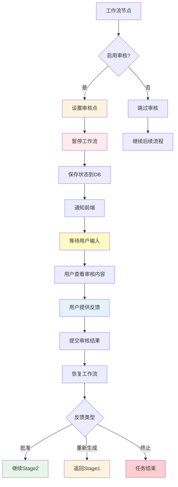
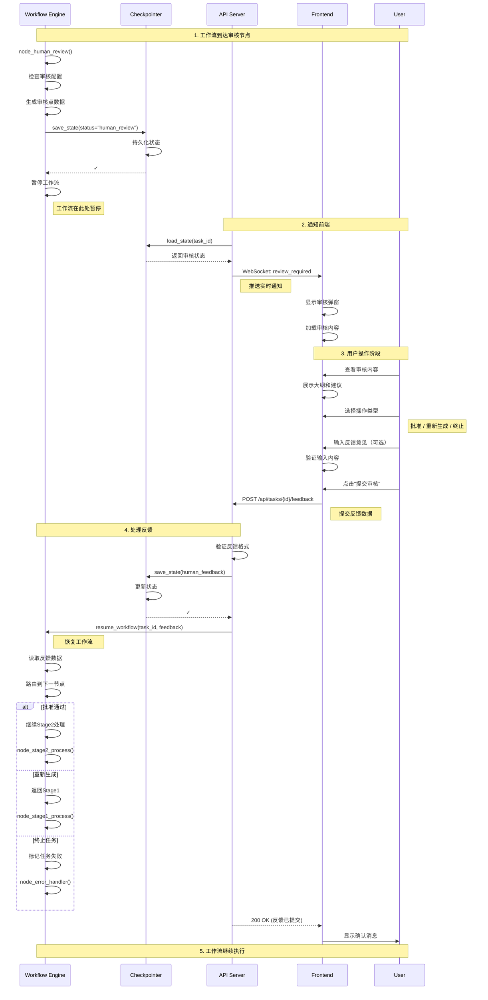
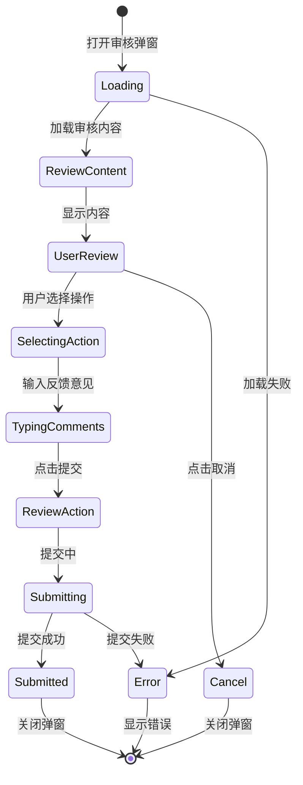
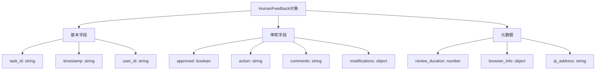
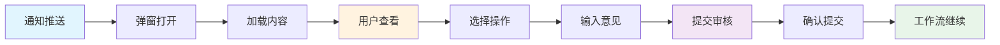

# 人机交互工作流图

## 概述
展示HITL（Human-in-the-Loop）人机交互工作流的完整序列，包括审核、反馈处理和决策路由。



## 详细交互序列

### 审核流程序列图


## 审核界面设计

### 前端审核组件流程


### 审核组件实现
```typescript
// components/HumanReviewModal.tsx
import React, { useState, useEffect } from 'react';
import { Modal, Button, Radio, Input, Spin, Alert } from 'antd';
import { useTaskStore } from '../stores/taskStore';
import { submitFeedback } from '../api/tasks';

const { TextArea } = Input;

export const HumanReviewModal: React.FC = () => {
  const {
    taskId,
    status,
    reviewData,
    closeReviewModal,
    submitReviewFeedback,
  } = useTaskStore();

  const [action, setAction] = useState<'approve' | 'regenerate' | 'abort'>('approve');
  const [comments, setComments] = useState('');
  const [submitting, setSubmitting] = useState(false);
  const [error, setError] = useState<string | null>(null);

  const isVisible = status === 'human_review';

  const handleSubmit = async () => {
    if (!taskId) return;

    setSubmitting(true);
    setError(null);

    try {
      const feedback = {
        approved: action === 'approve',
        action,
        comments,
        timestamp: new Date().toISOString(),
      };

      await submitFeedback(taskId, feedback);
      submitReviewFeedback(feedback);
      closeReviewModal();

    } catch (err: any) {
      setError(err.message || '提交失败，请重试');
    } finally {
      setSubmitting(false);
    }
  };

  const handleCancel = () => {
    if (!submitting) {
      closeReviewModal();
    }
  };

  return (
    <Modal
      title="演示文稿审核"
      open={isVisible}
      onCancel={handleCancel}
      footer={null}
      width={800}
      maskClosable={false}
    >
      <Spin spinning={submitting}>
        {error && (
          <Alert
            type="error"
            message={error}
            closable
            onClose={() => setError(null)}
            style={{ marginBottom: 16 }}
          />
        )}

        {/* 审核内容展示 */}
        <div style={{ marginBottom: 24 }}>
          <h3>审核内容</h3>
          <div
            style={{
              background: '#f5f5f5',
              padding: 16,
              borderRadius: 4,
              maxHeight: 300,
              overflowY: 'auto',
            }}
          >
            <pre style={{ margin: 0, whiteSpace: 'pre-wrap' }}>
              {reviewData?.outline || '加载中...'}
            </pre>
          </div>
        </div>

        {/* 审核提示 */}
        <div style={{ marginBottom: 24 }}>
          <h3>审核提示</h3>
          <p>{reviewData?.prompt}</p>
        </div>

        {/* 操作选择 */}
        <div style={{ marginBottom: 24 }}>
          <h3>请选择操作</h3>
          <Radio.Group
            value={action}
            onChange={(e) => setAction(e.target.value)}
            style={{ width: '100%' }}
          >
            <Radio value="approve" style={{ display: 'block', marginBottom: 8 }}>
              ✅ 批准通过 - 继续生成演示文稿
            </Radio>
            <Radio value="regenerate" style={{ display: 'block', marginBottom: 8 }}>
              🔄 重新生成 - 修改大纲后重新生成
            </Radio>
            <Radio value="abort" style={{ display: 'block' }}>
              ⏹️ 终止任务 - 结束当前任务
            </Radio>
          </Radio.Group>
        </div>

        {/* 反馈意见 */}
        <div style={{ marginBottom: 24 }}>
          <h3>反馈意见（可选）</h3>
          <TextArea
            value={comments}
            onChange={(e) => setComments(e.target.value)}
            placeholder="请提供修改建议或意见..."
            rows={4}
            maxLength={500}
            showCount
          />
        </div>

        {/* 操作按钮 */}
        <div style={{ textAlign: 'right' }}>
          <Button
            onClick={handleCancel}
            disabled={submitting}
            style={{ marginRight: 8 }}
          >
            取消
          </Button>
          <Button
            type="primary"
            onClick={handleSubmit}
            loading={submitting}
            disabled={!action}
          >
            提交审核
          </Button>
        </div>
      </Spin>
    </Modal>
  );
};
```

## 反馈处理机制

### 反馈数据结构


### 反馈提交API
```python
# app/api/endpoints.py
from pydantic import BaseModel, Field
from typing import Optional, Literal

class HumanFeedbackRequest(BaseModel):
    """人工反馈请求模型"""
    approved: bool = Field(..., description="是否批准")
    action: Literal["approve", "regenerate", "abort"] = Field(
        ..., description="操作类型"
    )
    comments: str = Field("", max_length=500, description="反馈意见")
    modifications: dict = Field(default_factory=dict, description="具体修改")
    user_id: Optional[str] = Field(None, description="审核用户ID")

@router.post("/tasks/{task_id}/feedback")
async def submit_human_feedback(
    task_id: str,
    feedback: HumanFeedbackRequest,
    background_tasks: BackgroundTasks,
    request: Request
):
    """提交人工审核反馈"""

    # 1. 验证任务状态
    checkpointer = get_checkpointer()
    state = checkpointer.load_state(task_id)

    if not state:
        raise HTTPException(status_code=404, detail=f"Task not found: {task_id}")

    if state.get("status") != TaskStatus.HUMAN_REVIEW.value:
        raise HTTPException(
            status_code=400,
            detail=f"Task is not in review state. Current status: {state.get('status')}"
        )

    # 2. 验证反馈数据
    if feedback.action not in ["approve", "regenerate", "abort"]:
        raise HTTPException(
            status_code=400,
            detail=f"Invalid action: {feedback.action}"
        )

    # 3. 准备反馈数据
    feedback_dict = {
        "approved": feedback.approved,
        "action": feedback.action,
        "comments": feedback.comments,
        "modifications": feedback.modifications,
        "timestamp": datetime.now().isoformat(),
        "user_id": feedback.user_id or "anonymous",
        "ip_address": request.client.host,
    }

    # 4. 确定下一状态
    if feedback.approved:
        new_status = TaskStatus.STAGE2_PROCESSING.value
        current_step = "审核通过，准备进入Stage 2"
    elif feedback.action == "regenerate":
        new_status = TaskStatus.STAGE1_PROCESSING.value
        current_step = "准备重新生成"
    elif feedback.action == "abort":
        new_status = TaskStatus.FAILED.value
        current_step = "任务被用户终止"
    else:
        new_status = TaskStatus.STAGE2_PROCESSING.value
        current_step = "处理中"

    # 5. 更新状态
    state["status"] = new_status
    state["needs_human_review"] = False
    state["current_step"] = current_step
    state["human_feedback"] = feedback_dict
    state["updated_at"] = datetime.now().isoformat()

    checkpointer.save_state(task_id, state, "feedback_received")

    # 6. 恢复工作流（异步）
    background_tasks.add_task(resume_workflow, task_id, feedback_dict)

    return {
        "status": "success",
        "message": "Feedback submitted, workflow resuming",
        "task_id": task_id,
        "next_status": new_status,
    }
```

### 反馈路由逻辑
```python
# app/graph/workflow.py
def route_after_feedback(state: WorkflowState) -> Literal["stage1", "stage2", "end"]:
    """基于反馈路由到下一节点"""
    feedback = state.get("human_feedback", {})
    action = feedback.get("action", "approve")
    approved = feedback.get("approved", False)

    if action == "approve" or approved:
        return "stage2"
    elif action == "regenerate":
        return "stage1"
    else:
        return "end"

# 在工作流中添加条件边
workflow.add_conditional_edges(
    "process_feedback",
    route_after_feedback,
    {
        "stage1": "stage1_process",
        "stage2": "stage2_process",
        "end": "handle_error",
    }
)
```

## 审核历史记录

### 审核记录结构
```python
# app/models/review_record.py
from datetime import datetime
from typing import Optional
from pydantic import BaseModel

class ReviewRecord(BaseModel):
    """审核记录"""
    review_id: str
    task_id: str
    timestamp: str
    review_type: str  # outline, content, style
    content: str  # 审核内容
    feedback: dict  # 反馈数据
    processing_time: float  # 处理耗时（秒）
    user_id: str
    ip_address: str
    user_agent: str

    def to_dict(self) -> dict:
        return {
            "review_id": self.review_id,
            "task_id": self.task_id,
            "timestamp": self.timestamp,
            "review_type": self.review_type,
            "content": self.content,
            "feedback": self.feedback,
            "processing_time": self.processing_time,
            "user_id": self.user_id,
            "ip_address": self.ip_address,
            "user_agent": self.user_agent,
        }

# 创建审核记录
def create_review_record(
    task_id: str,
    feedback: dict,
    content: str,
    start_time: float,
    request: Request
) -> ReviewRecord:
    """创建审核记录"""
    end_time = time.time()
    processing_time = end_time - start_time

    return ReviewRecord(
        review_id=str(uuid.uuid4()),
        task_id=task_id,
        timestamp=datetime.now().isoformat(),
        review_type="outline",
        content=content,
        feedback=feedback,
        processing_time=processing_time,
        user_id=feedback.get("user_id", "anonymous"),
        ip_address=request.client.host,
        user_agent=request.headers.get("user-agent", ""),
    )
```

### 审核历史查询API
```python
@router.get("/tasks/{task_id}/review-history")
async def get_review_history(task_id: str):
    """获取审核历史"""
    checkpointer = get_checkpointer()
    state = checkpointer.load_state(task_id)

    if not state:
        raise HTTPException(status_code=404, detail="Task not found")

    # 提取审核相关日志
    review_logs = [
        log for log in state.get("execution_log", [])
        if "review" in log.get("event", "").lower()
    ]

    # 计算审核指标
    review_count = len(review_logs)
    approved_count = sum(
        1 for log in review_logs
        if log.get("approved", False)
    )
    regenerate_count = sum(
        1 for log in review_logs
        if log.get("action") == "regenerate"
    )

    return {
        "task_id": task_id,
        "review_count": review_count,
        "approved_count": approved_count,
        "regenerate_count": regenerate_count,
        "approval_rate": (
            approved_count / review_count if review_count > 0 else 0
        ),
        "review_logs": review_logs,
    }
```

## 实时通知机制

### WebSocket消息定义
```typescript
// types/websocket.ts
export interface ReviewRequiredMessage {
  type: 'review_required';
  task_id: string;
  review_point: {
    type: string;
    node: string;
    content: string;
    prompt: string;
    timestamp: string;
    metadata: Record<string, any>;
  };
}

export interface ReviewSubmittedMessage {
  type: 'review_submitted';
  task_id: string;
  feedback: {
    approved: boolean;
    action: string;
    comments: string;
    timestamp: string;
  };
}

export interface WorkflowResumedMessage {
  type: 'workflow_resumed';
  task_id: string;
  next_status: string;
  current_step: string;
}

export type WebSocketMessage =
  | ReviewRequiredMessage
  | ReviewSubmittedMessage
  | WorkflowResumedMessage;
```

### WebSocket服务器实现
```python
# app/api/websocket.py
from fastapi import WebSocket, WebSocketDisconnect
from typing import Dict, Set
import json

class ConnectionManager:
    """WebSocket连接管理器"""

    def __init__(self):
        # task_id -> Set[WebSocket]
        self.active_connections: Dict[str, Set[WebSocket]] = {}

    async def connect(self, websocket: WebSocket, task_id: str):
        await websocket.accept()

        if task_id not in self.active_connections:
            self.active_connections[task_id] = set()

        self.active_connections[task_id].add(websocket)

    def disconnect(self, websocket: WebSocket, task_id: str):
        if task_id in self.active_connections:
            self.active_connections[task_id].discard(websocket)
            if not self.active_connections[task_id]:
                del self.active_connections[task_id]

    async def send_personal_message(
        self,
        message: dict,
        task_id: str
    ):
        """发送消息到指定任务的所有连接"""
        if task_id in self.active_connections:
            disconnected = []
            for connection in self.active_connections[task_id]:
                try:
                    await connection.send_text(json.dumps(message))
                except WebSocketDisconnect:
                    disconnected.append(connection)

            # 清理断开的连接
            for conn in disconnected:
                self.disconnect(conn, task_id)

manager = ConnectionManager()

@router.websocket("/ws/{task_id}")
async def websocket_endpoint(websocket: WebSocket, task_id: str):
    await manager.connect(websocket, task_id)

    try:
        while True:
            # 客户端可以发送心跳或指令
            data = await websocket.receive_text()
            message = json.loads(data)

            if message.get("type") == "ping":
                await websocket.send_text(json.dumps({"type": "pong"}))

    except WebSocketDisconnect:
        manager.disconnect(websocket, task_id)

# 发送审核通知
async def notify_review_required(task_id: str, review_point: ReviewPoint):
    """通知需要审核"""
    await manager.send_personal_message(
        {
            "type": "review_required",
            "task_id": task_id,
            "review_point": review_point.to_dict(),
        },
        task_id
    )

# 发送反馈确认
async def notify_feedback_submitted(task_id: str, feedback: dict):
    """通知反馈已提交"""
    await manager.send_personal_message(
        {
            "type": "review_submitted",
            "task_id": task_id,
            "feedback": feedback,
        },
        task_id
    )
```

## 审核统计与分析

### 审核指标计算
```python
# app/analytics/review_analytics.py
from typing import List, Dict
from datetime import datetime, timedelta

@dataclass
class ReviewMetrics:
    """审核指标"""
    total_reviews: int = 0
    approved_count: int = 0
    regenerate_count: int = 0
    aborted_count: int = 0
    avg_review_time: float = 0.0
    approval_rate: float = 0.0

def calculate_review_metrics(review_records: List[ReviewRecord]) -> ReviewMetrics:
    """计算审核指标"""
    if not review_records:
        return ReviewMetrics()

    metrics = ReviewMetrics()
    metrics.total_reviews = len(review_records)

    # 统计各类操作
    for record in review_records:
        feedback = record.feedback

        if feedback.get("approved"):
            metrics.approved_count += 1
        elif feedback.get("action") == "regenerate":
            metrics.regenerate_count += 1
        elif feedback.get("action") == "abort":
            metrics.aborted_count += 1

    # 计算通过率
    metrics.approval_rate = (
        metrics.approved_count / metrics.total_reviews
        if metrics.total_reviews > 0 else 0
    )

    # 计算平均审核时间
    total_time = sum(record.processing_time for record in review_records)
    metrics.avg_review_time = total_time / metrics.total_reviews

    return metrics

def generate_review_report(
    start_date: datetime,
    end_date: datetime
) -> Dict:
    """生成审核报告"""

    # 获取时间范围内的审核记录
    records = get_review_records_in_range(start_date, end_date)

    # 按任务分组
    task_groups = {}
    for record in records:
        task_id = record.task_id
        if task_id not in task_groups:
            task_groups[task_id] = []
        task_groups[task_id].append(record)

    # 计算每个任务的指标
    task_metrics = []
    for task_id, task_records in task_groups.items():
        metrics = calculate_review_metrics(task_records)
        task_metrics.append({
            "task_id": task_id,
            "review_count": metrics.total_reviews,
            "approval_rate": metrics.approval_rate,
            "avg_review_time": metrics.avg_review_time,
        })

    # 总体指标
    all_metrics = calculate_review_metrics(records)

    return {
        "period": {
            "start": start_date.isoformat(),
            "end": end_date.isoformat(),
        },
        "overall_metrics": {
            "total_reviews": all_metrics.total_reviews,
            "approval_rate": f"{all_metrics.approval_rate:.2%}",
            "avg_review_time_seconds": f"{all_metrics.avg_review_time:.2f}",
            "approved": all_metrics.approved_count,
            "regenerated": all_metrics.regenerate_count,
            "aborted": all_metrics.aborted_count,
        },
        "task_metrics": task_metrics,
    }
```

## 用户体验优化

### 1. 审核界面UX流程


### 2. 进度指示器
```typescript
// components/ReviewProgress.tsx
export const ReviewProgress: React.FC<{
  reviewData: ReviewData;
  onActionSelect: (action: ReviewAction) => void;
}> = ({ reviewData, onActionSelect }) => {
  const [currentStep, setCurrentStep] = useState(0);

  const steps = [
    { title: '查看内容', description: '仔细阅读审核内容' },
    { title: '做出决策', description: '选择批准、重新生成或终止' },
    { title: '提交反馈', description: '提交审核结果' },
  ];

  return (
    <Steps current={currentStep} style={{ marginBottom: 24 }}>
      {steps.map(step => (
        <Steps.Step key={step.title} title={step.title} description={step.description} />
      ))}
    </Steps>
  );
};
```

## 性能优化

### 1. 审核数据缓存
```python
# app/services/cache/review_cache.py
from functools import lru_cache
import redis

redis_client = redis.Redis(host='localhost', port=6379, db=1)

@cache.memoize(timeout=300)  # 缓存5分钟
def get_cached_review_data(task_id: str) -> ReviewPoint:
    """缓存审核点数据"""
    cached = redis_client.get(f"review:{task_id}")
    if cached:
        return ReviewPoint.from_dict(json.loads(cached))

    # 从数据库加载
    review_data = load_review_from_db(task_id)

    # 缓存到Redis
    redis_client.setex(
        f"review:{task_id}",
        300,
        json.dumps(review_data.to_dict())
    )

    return review_data
```

### 2. 异步反馈处理
```python
# app/services/feedback_processor.py
async def process_feedback_async(task_id: str, feedback: dict):
    """异步处理反馈"""

    # 并行执行多个任务
    tasks = [
        save_feedback_to_db(task_id, feedback),
        update_task_metrics(task_id, feedback),
        send_notification(task_id, feedback),
        update_user_activity(task_id, feedback),
    ]

    await asyncio.gather(*tasks, return_exceptions=True)
```
