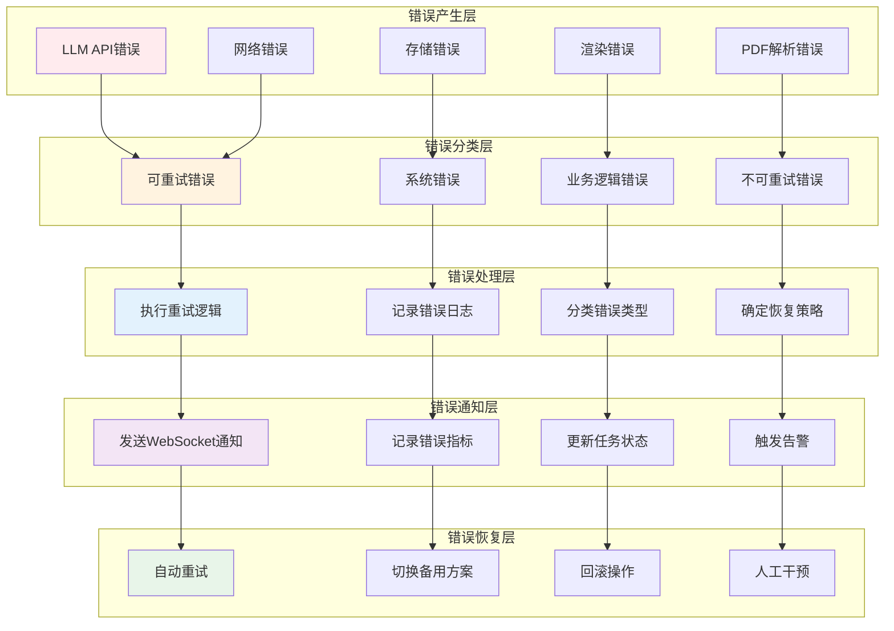
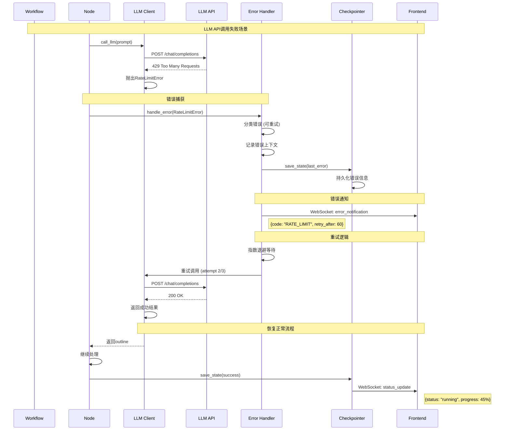
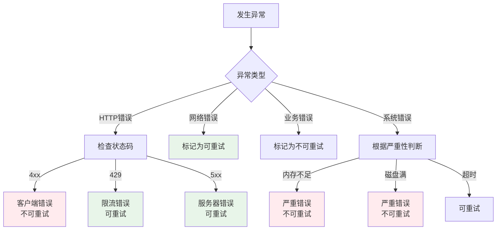

# 错误传播路径图

## 概述
展示ScholarFlow系统中错误的产生、传播、处理和恢复的完整路径。



## 错误传播序列

### 1. LLM API错误传播


### 2. PDF解析错误传播
```mermaid
sequenceDiagram
    participant W as Workflow
    participant P as PDF Parser
    participant M as MinerU API
    participant E as Error Handler
    participant R as Recovery Service
    participant C as Checkpointer
    participant F as Frontend

    Note over W, F: PDF解析失败场景

    W->>P: parse_pdf(pdf_path)
    P->>M: extract_content()
    M-->>P: 413 Payload Too Large
    P->>P: 抛出FileTooLargeError

    Note over P, E: 错误处理

    P->>E: handle_error(FileTooLargeError)
    E->>E: 分类错误 (不可重试)
    E->>E: 标记任务失败

    Note over E, F: 状态更新

    E->>C: save_state(status="failed")
    C->>C: 更新状态到数据库
    C-->>E: ✓

    E->>F: WebSocket: task_failed
    Note right of E: {
    Note right:   type: "error",
    Note right:   error_code: "FILE_TOO_LARGE",
    Note right:   error_message: "PDF文件超过100MB限制"
    Note right: }

    Note over E, R: 尝试恢复

    E->>R: attempt_recovery()
    R->>R: 检查是否有备用方案

    alt 有备用解析器
        R->>R: 切换到备用解析器
        R->>W: 重新开始解析
    else 无备用方案
        R->>F: 发送最终失败通知
        Note right: {status: "failed", can_retry: false}
    end
```

### 3. 工作流节点错误传播
```mermaid
sequenceDiagram
    participant W as Workflow
    participant N as Current Node
    participant E as Error Handler
    participant H as Handle Error Node
    participant C as Checkpointer
    participant F as Frontend

    Note over W, F: 节点执行异常

    N->>N: 执行节点逻辑
    N->>N: 访问空字典键
    N->>N: 抛出KeyError

    Note over N, E: 错误传播

    N->>E: handle_error(KeyError, node="stage1_process")
    E->>E: 分类为业务逻辑错误
    E->>E: 记录堆栈跟踪

    Note over E, H: 路由到错误处理节点

    E->>H: 路由到handle_error
    H->>H: 分析错误类型
    H->>H: 判断是否可恢复

    alt 可恢复错误
        H->>H: 重置到安全状态
        H->>H: 记录恢复尝试
        H->>C: save_state(status="pending")
        C->>C: 更新状态
        C->>F: WebSocket: status_update
        Note right: {status: "pending", retry_count: 1}
        H->>W: 重新执行节点
    else 不可恢复错误
        H->>H: 标记任务失败
        H->>C: save_state(status="failed")
        C->>F: WebSocket: task_failed
        Note right: {status: "failed", error: "KeyError in stage1_process"}
    end
```

## 错误分类体系

### 错误分类决策树


### 错误分类实现
```python
# app/core/error_classifier.py
from enum import Enum
from typing import Tuple, Optional
import httpx

class ErrorCategory(Enum):
    """错误分类"""
    NETWORK = "network_error"
    RATE_LIMIT = "rate_limit_error"
    SERVICE = "service_error"
    CLIENT = "client_error"
    BUSINESS = "business_error"
    SYSTEM = "system_error"
    VALIDATION = "validation_error"

class ErrorSeverity(Enum):
    """错误严重性"""
    LOW = "low"
    MEDIUM = "medium"
    HIGH = "high"
    CRITICAL = "critical"

class ErrorClassification:
    """错误分类器"""

    @staticmethod
    def classify(error: Exception) -> Tuple[ErrorCategory, ErrorSeverity, bool]:
        """
        分类错误
        返回: (错误类型, 严重性, 是否可重试)
        """

        # 网络相关错误
        if isinstance(error, (
            httpx.ConnectError,
            httpx.TimeoutException,
            httpx.RemoteProtocolError,
            ConnectionRefusedError,
            OSError
        )):
            return ErrorCategory.NETWORK, ErrorSeverity.MEDIUM, True

        # HTTP状态码错误
        if isinstance(error, httpx.HTTPStatusError):
            status_code = error.response.status_code

            # 429 限流
            if status_code == 429:
                return ErrorCategory.RATE_LIMIT, ErrorSeverity.MEDIUM, True

            # 4xx 客户端错误
            if 400 <= status_code < 500:
                # 400-499 大部分不可重试
                if status_code in [408, 409]:  # 请求超时、冲突可重试
                    return ErrorCategory.CLIENT, ErrorSeverity.MEDIUM, True
                return ErrorCategory.CLIENT, ErrorSeverity.HIGH, False

            # 5xx 服务器错误
            if status_code >= 500:
                return ErrorCategory.SERVICE, ErrorSeverity.MEDIUM, True

        # 业务逻辑错误
        if isinstance(error, (
            ValueError,
            KeyError,
            TypeError,
            AttributeError
        )):
            return ErrorCategory.BUSINESS, ErrorSeverity.HIGH, False

        # 验证错误
        if isinstance(error, ValidationError):
            return ErrorCategory.VALIDATION, ErrorSeverity.HIGH, False

        # 系统严重错误
        if isinstance(error, (
            MemoryError,
            SystemError,
            KeyboardInterrupt
        )):
            return ErrorCategory.SYSTEM, ErrorSeverity.CRITICAL, False

        # 未知错误，保守处理
        return ErrorCategory.SYSTEM, ErrorSeverity.MEDIUM, True

    @staticmethod
    def get_retry_strategy(error: Exception) -> Optional[dict]:
        """获取重试策略"""
        category, severity, can_retry = ErrorClassification.classify(error)

        if not can_retry:
            return None

        strategies = {
            ErrorCategory.NETWORK: {
                "max_attempts": 5,
                "base_delay": 1.0,
                "exponential_base": 2.0,
                "max_delay": 60.0,
            },
            ErrorCategory.RATE_LIMIT: {
                "max_attempts": 3,
                "base_delay": 60.0,  # 60秒起步
                "exponential_base": 2.0,
                "max_delay": 300.0,
            },
            ErrorCategory.SERVICE: {
                "max_attempts": 3,
                "base_delay": 2.0,
                "exponential_base": 2.0,
                "max_delay": 30.0,
            },
        }

        return strategies.get(category)
```

## 错误处理工作流

### 错误处理节点
```python
# app/graph/nodes/error_handler.py
from app.core.error_classifier import ErrorClassification, ErrorCategory

def node_handle_error(state: WorkflowState) -> WorkflowState:
    """错误处理节点"""

    error_info = state.get("last_error")
    task_id = state.get("task_id")

    if not error_info:
        logger.error("Error handler called without error info")
        return {
            **state,
            "status": TaskStatus.FAILED.value,
            "error_message": "Unknown error occurred",
        }

    error = error_info.get("error")
    error_context = error_info.get("context", {})
    node_name = error_info.get("node_name", "unknown")

    # 分类错误
    error_obj = error_info.get("error_obj")
    if error_obj:
        category, severity, can_retry = ErrorClassification.classify(error_obj)

        logger.error(
            f"Task {task_id} error in {node_name}: "
            f"{category.value} ({severity.value}) - {str(error_obj)}"
        )

        # 根据错误分类处理
        if category == ErrorCategory.RATE_LIMIT:
            return handle_rate_limit_error(state, error_info)
        elif category == ErrorCategory.SERVICE:
            return handle_service_error(state, error_info)
        elif category == ErrorCategory.NETWORK:
            return handle_network_error(state, error_info)
        elif category == ErrorCategory.BUSINESS:
            return handle_business_error(state, error_info)
        else:
            return handle_generic_error(state, error_info)

    # 默认处理
    return handle_generic_error(state, error_info)

def handle_rate_limit_error(state: dict, error_info: dict) -> dict:
    """处理限流错误"""
    retry_count = state.get("retry_count", 0)

    if retry_count >= 3:
        logger.error(f"Rate limit retry count exceeded for task {state['task_id']}")
        return {
            **state,
            "status": TaskStatus.FAILED.value,
            "error_message": "API rate limit exceeded after retries",
            "error_code": "RATE_LIMIT_EXCEEDED",
        }

    # 计算等待时间（从响应头获取）
    retry_after = error_info.get("retry_after", 60)

    return {
        **state,
        "status": TaskStatus.PENDING.value,
        "current_step": f"等待API限流恢复 (retry {retry_count + 1}/3)",
        "retry_count": retry_count + 1,
        "retry_after": retry_after,
        "last_retry_at": datetime.now().isoformat(),
        "error_code": "RATE_LIMIT",
    }

def handle_service_error(state: dict, error_info: dict) -> dict:
    """处理服务错误"""
    retry_count = state.get("retry_count", 0)

    if retry_count >= 3:
        return {
            **state,
            "status": TaskStatus.FAILED.value,
            "error_message": "Service unavailable after retries",
            "error_code": "SERVICE_UNAVAILABLE",
            "can_retry": False,
        }

    return {
        **state,
        "status": TaskStatus.PENDING.value,
        "current_step": f"服务错误，重试中 (retry {retry_count + 1}/3)",
        "retry_count": retry_count + 1,
        "last_retry_at": datetime.now().isoformat(),
        "error_code": "SERVICE_ERROR",
    }

def handle_business_error(state: dict, error_info: dict) -> dict:
    """处理业务逻辑错误"""
    # 业务错误通常不可重试，需要人工干预
    return {
        **state,
        "status": TaskStatus.FAILED.value,
        "error_message": str(error_info.get("error")),
        "error_code": "BUSINESS_LOGIC_ERROR",
        "needs_manual_intervention": True,
        "failed_at": datetime.now().isoformat(),
    }
```

## 错误通知机制

### WebSocket错误通知
```typescript
// types/error.ts
export interface ErrorNotification {
  type: 'error';
  task_id: string;
  error_code: string;
  error_message: string;
  severity: 'low' | 'medium' | 'high' | 'critical';
  can_retry: boolean;
  retry_after?: number;
  retry_count?: number;
  node_name?: string;
  timestamp: string;
}

export interface RetryNotification {
  type: 'retrying';
  task_id: string;
  retry_count: number;
  max_retries: number;
  retry_after: number;
  error_code: string;
}

export interface RecoveryNotification {
  type: 'recovered';
  task_id: string;
  previous_error: string;
  recovery_strategy: string;
}
```

### 错误通知发送
```python
# app/services/notification/error_notifier.py
from app.api.websocket import manager

class ErrorNotifier:
    """错误通知器"""

    @staticmethod
    async def notify_error(task_id: str, error_info: dict):
        """发送错误通知"""
        category, severity, can_retry = ErrorClassification.classify(error_info["error_obj"])

        message = {
            "type": "error",
            "task_id": task_id,
            "error_code": category.value.upper(),
            "error_message": str(error_info["error_obj"]),
            "severity": severity.value,
            "can_retry": can_retry,
            "retry_count": error_info.get("retry_count", 0),
            "node_name": error_info.get("node_name"),
            "timestamp": datetime.now().isoformat(),
        }

        await manager.send_personal_message(message, task_id)

    @staticmethod
    async def notify_retry(task_id: str, retry_count: int, max_retries: int, retry_after: int):
        """发送重试通知"""
        message = {
            "type": "retrying",
            "task_id": task_id,
            "retry_count": retry_count,
            "max_retries": max_retries,
            "retry_after": retry_after,
        }

        await manager.send_personal_message(message, task_id)

    @staticmethod
    async def notify_recovery(task_id: str, error_code: str, strategy: str):
        """发送恢复通知"""
        message = {
            "type": "recovered",
            "task_id": task_id,
            "previous_error": error_code,
            "recovery_strategy": strategy,
        }

        await manager.send_personal_message(message, task_id)
```

### 前端错误处理
```typescript
// stores/errorStore.ts
import { create } from 'zustand';

interface ErrorState {
  errors: Record<string, ErrorNotification>;
  addError: (error: ErrorNotification) => void;
  removeError: (taskId: string) => void;
  clearErrors: () => void;
  getError: (taskId: string) => ErrorNotification | null;
}

export const useErrorStore = create<ErrorState>((set, get) => ({
  errors: {},

  addError: (error: ErrorNotification) => {
    set((state) => ({
      errors: {
        ...state.errors,
        [error.task_id]: error,
      },
    }));

    // 显示通知
    showErrorNotification(error);
  },

  removeError: (taskId: string) => {
    set((state) => {
      const newErrors = { ...state.errors };
      delete newErrors[taskId];
      return { errors: newErrors };
    });
  },

  clearErrors: () => {
    set({ errors: {} });
  },

  getError: (taskId: string) => {
    return get().errors[taskId] || null;
  },
}));

function showErrorNotification(error: ErrorNotification) {
  const { message, severity } = error;

  switch (severity) {
    case 'critical':
      notification.error({
        message: '严重错误',
        description: message,
        duration: 0, // 不自动关闭
      });
      break;

    case 'high':
      notification.error({
        message: '错误',
        description: message,
        duration: 5,
      });
      break;

    case 'medium':
      notification.warning({
        message: '警告',
        description: message,
        duration: 3,
      });
      break;

    case 'low':
      notification.info({
        message: '提示',
        description: message,
        duration: 2,
      });
      break;
  }
}

// WebSocket错误监听
export function setupErrorWebSocket(taskId: string) {
  const ws = new WebSocket(`${WS_BASE_URL}/ws/${taskId}`);

  ws.onmessage = (event) => {
    const message = JSON.parse(event.data);

    if (message.type === 'error') {
      useErrorStore.getState().addError(message);
    } else if (message.type === 'recovered') {
      // 错误已恢复，移除错误
      useErrorStore.getState().removeError(taskId);
      notification.success({
        message: '错误已恢复',
        description: `任务 ${taskId} 已从错误中恢复`,
      });
    } else if (message.type === 'retrying') {
      // 显示重试进度
      notification.info({
        message: '正在重试',
        description: `第 ${message.retry_count}/${message.max_retries} 次重试，等待 ${message.retry_after} 秒...`,
        duration: 2,
      });
    }
  };

  return ws;
}
```

## 错误恢复策略

### 自动恢复流程
```python
# app/services/recovery/recovery_service.py
class RecoveryService:
    """错误恢复服务"""

    def __init__(self, checkpointer):
        self.checkpointer = checkpointer
        self.logger = logging.getLogger(__name__)

    async def attempt_recovery(
        self,
        task_id: str,
        error_info: dict,
        max_attempts: int = 3
    ) -> tuple[bool, str]:
        """尝试恢复任务"""

        for attempt in range(1, max_attempts + 1):
            try:
                state = self.checkpointer.load_state(task_id)

                if not state:
                    return False, "Task not found"

                error_obj = error_info.get("error_obj")
                category, _, _ = ErrorClassification.classify(error_obj)

                # 根据错误类型应用恢复策略
                if category == ErrorCategory.RATE_LIMIT:
                    recovered_state = await self._recover_rate_limit(state, attempt)
                elif category == ErrorCategory.NETWORK:
                    recovered_state = await self._recover_network(state, attempt)
                elif category == ErrorCategory.SERVICE:
                    recovered_state = await self._recover_service(state, attempt)
                else:
                    recovered_state = await self._recover_generic(state, attempt)

                # 保存恢复后的状态
                self.checkpointer.save_state(
                    task_id,
                    recovered_state,
                    "recovery_attempt"
                )

                # 验证恢复
                if await self._verify_recovery(recovered_state):
                    self.logger.info(f"Task {task_id} recovered on attempt {attempt}")
                    return True, f"Recovered on attempt {attempt}"

            except Exception as e:
                self.logger.error(
                    f"Recovery attempt {attempt} failed for task {task_id}: {e}"
                )

        return False, f"Failed after {max_attempts} attempts"

    async def _recover_rate_limit(self, state: dict, attempt: int) -> dict:
        """限流错误恢复"""
        # 1. 增加等待时间
        retry_after = min(300, 60 * attempt)  # 最多5分钟

        # 2. 记录恢复尝试
        return {
            **state,
            "status": "pending",
            "current_step": f"等待API限流恢复 (第{attempt}次尝试)",
            "retry_count": attempt,
            "retry_after": retry_after,
            "last_recovery_attempt": datetime.now().isoformat(),
            "recovery_strategy": "rate_limit_backoff",
        }

    async def _recover_network(self, state: dict, attempt: int) -> dict:
        """网络错误恢复"""
        # 1. 尝试切换网络配置
        # 2. 增加超时时间
        return {
            **state,
            "status": "pending",
            "current_step": f"网络错误，正在重试 (第{attempt}次)",
            "retry_count": attempt,
            "timeout_multiplier": min(3.0, 1.5 ** attempt),
            "last_recovery_attempt": datetime.now().isoformat(),
            "recovery_strategy": "network_retry",
        }

    async def _recover_service(self, state: dict, attempt: int) -> dict:
        """服务错误恢复"""
        # 1. 尝试切换备用服务
        # 2. 降低服务负载
        return {
            **state,
            "status": "pending",
            "current_step": f"服务错误，切换备用方案 (第{attempt}次)",
            "retry_count": attempt,
            "fallback_enabled": True,
            "last_recovery_attempt": datetime.now().isoformat(),
            "recovery_strategy": "fallback_service",
        }

    async def _recover_generic(self, state: dict, attempt: int) -> dict:
        """通用错误恢复"""
        return {
            **state,
            "status": "pending",
            "current_step": f"通用错误重试 (第{attempt}次)",
            "retry_count": attempt,
            "last_recovery_attempt": datetime.now().isoformat(),
            "recovery_strategy": "generic_retry",
        }
```

## 错误监控与指标

### 错误监控中间件
```python
# app/middleware/error_monitor.py
import time
import json
from typing import Callable
from fastapi import Request, Response

class ErrorMonitorMiddleware:
    """错误监控中间件"""

    def __init__(self, app):
        self.app = app
        self.error_counts = defaultdict(int)
        self.start_time = time.time()

    async def __call__(self, scope, receive, send):
        if scope["type"] == "http":
            await self.handle_http_request(scope, receive, send)
        else:
            await self.app(scope, receive, send)

    async def handle_http_request(self, scope, receive, send):
        request = Request(scope)
        start_time = time.time()

        try:
            response = await self.app(scope, receive, send)
            duration = time.time() - start_time

            # 监控慢请求
            if duration > 5.0:
                self.logger.warning(
                    f"Slow request: {request.method} {request.url.path} - {duration:.2f}s"
                )

            return response

        except Exception as e:
            duration = time.time() - start_time

            # 记录错误
            error_info = {
                "timestamp": datetime.now().isoformat(),
                "method": request.method,
                "url": str(request.url.path),
                "status_code": 500,
                "duration": duration,
                "error": str(e),
                "traceback": traceback.format_exc(),
            }

            self.log_error(error_info)
            self.increment_error_count(str(type(e).__name__))

            raise

    def log_error(self, error_info: dict):
        """记录错误到监控系统"""
        # 发送到日志系统
        logger.error(
            f"API Error: {error_info['error']}",
            extra={"error_info": error_info}
        )

        # 发送到监控服务
        self.send_to_monitoring(error_info)

    def increment_error_count(self, error_type: str):
        """增加错误计数"""
        self.error_counts[error_type] += 1

    def get_error_metrics(self) -> dict:
        """获取错误指标"""
        uptime = time.time() - self.start_time

        return {
            "uptime_seconds": uptime,
            "error_counts": dict(self.error_counts),
            "total_errors": sum(self.error_counts.values()),
            "error_rate": sum(self.error_counts.values()) / max(uptime, 1),
        }
```

### 错误指标计算
```python
# app/analytics/error_analytics.py
from collections import defaultdict, Counter
from datetime import datetime, timedelta

@dataclass
class ErrorMetrics:
    """错误指标"""
    total_errors: int = 0
    error_by_type: Dict[str, int] = field(default_factory=dict)
    error_by_severity: Dict[str, int] = field(default_factory=dict)
    error_by_node: Dict[str, int] = field(default_factory=dict)
    retry_success_rate: float = 0.0
    avg_recovery_time: float = 0.0

def calculate_error_metrics(
    error_logs: list[dict],
    start_time: datetime,
    end_time: datetime
) -> ErrorMetrics:
    """计算错误指标"""

    metrics = ErrorMetrics()

    # 过滤时间范围内的错误
    filtered_logs = [
        log for log in error_logs
        if start_time <= parse_datetime(log["timestamp"]) <= end_time
    ]

    metrics.total_errors = len(filtered_logs)

    # 按类型统计
    error_types = [log.get("error_type", "unknown") for log in filtered_logs]
    metrics.error_by_type = dict(Counter(error_types))

    # 按严重性统计
    severities = [log.get("severity", "unknown") for log in filtered_logs]
    metrics.error_by_severity = dict(Counter(severities))

    # 按节点统计
    nodes = [log.get("node_name", "unknown") for log in filtered_logs]
    metrics.error_by_node = dict(Counter(nodes))

    # 计算重试成功率
    retry_attempts = [log for log in filtered_logs if log.get("retry_count", 0) > 0]
    if retry_attempts:
        successful_retries = sum(
            1 for log in retry_attempts
            if log.get("recovery_successful", False)
        )
        metrics.retry_success_rate = successful_retries / len(retry_attempts)

    # 计算平均恢复时间
    recovery_times = [
        log.get("recovery_time", 0)
        for log in filtered_logs
        if log.get("recovery_time")
    ]
    if recovery_times:
        metrics.avg_recovery_time = sum(recovery_times) / len(recovery_times)

    return metrics
```

## 告警机制

### 错误告警规则
```python
# app/alerts/error_alerts.py
class ErrorAlertManager:
    """错误告警管理器"""

    def __init__(self):
        self.thresholds = {
            "error_rate": 0.05,  # 错误率超过5%
            "critical_error_count": 5,  # 严重错误超过5个
            "service_error_count": 20,  # 服务错误超过20个
            "retry_failure_rate": 0.5,  # 重试失败率超过50%
        }
        self.notification_channels = [
            {"type": "email", "recipients": ["admin@example.com"]},
            {"type": "slack", "webhook": "https://hooks.slack.com/..."},
        ]

    async def check_and_alert(self, metrics: ErrorMetrics):
        """检查错误指标并发送告警"""

        alerts = []

        # 检查错误率
        if metrics.error_rate > self.thresholds["error_rate"]:
            alerts.append(Alert(
                level="critical",
                message=f"High error rate: {metrics.error_rate:.2%}",
                metric="error_rate",
                value=metrics.error_rate,
            ))

        # 检查严重错误
        critical_count = metrics.error_by_severity.get("critical", 0)
        if critical_count > self.thresholds["critical_error_count"]:
            alerts.append(Alert(
                level="critical",
                message=f"Too many critical errors: {critical_count}",
                metric="critical_errors",
                value=critical_count,
            ))

        # 检查服务错误
        service_count = metrics.error_by_type.get("SERVICE_ERROR", 0)
        if service_count > self.thresholds["service_error_count"]:
            alerts.append(Alert(
                level="warning",
                message=f"High service error count: {service_count}",
                metric="service_errors",
                value=service_count,
            ))

        # 发送告警
        for alert in alerts:
            await self.send_alert(alert)

    async def send_alert(self, alert: Alert):
        """发送告警"""
        for channel in self.notification_channels:
            if channel["type"] == "email":
                await self.send_email_alert(channel, alert)
            elif channel["type"] == "slack":
                await self.send_slack_alert(channel, alert)
```
