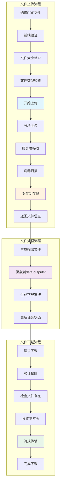

# 文件上传下载流程图

## 概述
展示ScholarFlow系统中文件上传（PDF）和文件下载（PPT/PDF/HTML）的完整流程。



## 文件上传详细流程

### 上传序列图
```mermaid
sequenceDiagram
    participant U as User
    participant F as Frontend
    participant A as API Server
    participant FS as File System
    participant DB as Database
    participant VS as Virus Scanner

    Note over U, VS: 1. 选择文件

    U->>F: 选择PDF文件
    F->>F: 读取文件信息
    Note right of F: File对象

    Note over F, VS: 2. 前端预验证

    F->>F: 验证文件类型 (PDF)
    F->>F: 验证文件大小 (<100MB)

    alt 验证失败
        F->>U: 显示错误消息
    else 验证通过
        Note over F, VS: 3. 开始上传

        F->>A: POST /api/upload
        Note right of F: multipart/form-data
        Note right of F: 文件: paper.pdf

        A->>A: 验证Content-Type
        A->>A: 生成唯一文件名
        Note right of A: {timestamp}_{random}.pdf

        Note over A, VS: 4. 服务端验证

        A->>A: 验证文件大小
        A->>A: 验证文件类型 (magic bytes)

        Note over A, FS: 5. 保存文件

        A->>FS: 保存文件流
        Note right of FS: data/inputs/{filename}
        FS-->>A: 文件保存成功

        Note over A, VS: 6. 病毒扫描

        VS->>FS: 扫描文件
        Note right of VS: ClamAV或云服务
        VS-->>A: 扫描结果 (clean/malicious)

        alt 文件不干净
            A->>FS: 删除文件
            A-->>F: 403 Forbidden
            Note right: {error: "VIRUS_DETECTED"}
        else 文件干净
            Note over A, DB: 7. 记录到数据库

            A->>DB: INSERT INTO files (...)
            Note right: 文件元数据
            DB-->>A: 返回file_id

            Note over A, F: 8. 返回响应

            A-->>F: 200 OK
            Note right of A: {
            Note right:   "filename": "xxx.pdf",
            Note right:   "original_name": "paper.pdf",
            Note right:   "size": 15728640,
            Note right:   "path": "data/inputs/xxx.pdf",
            Note right:   "sha256": "abc123..."
            Note right: }

            Note over F, U: 9. 完成

            F->>U: 显示上传成功
            Note right: "文件已上传"
        end
    end
```

### 分块上传实现
```python
# app/api/upload.py
from fastapi import APIRouter, UploadFile, File, HTTPException
from fastapi.responses import JSONResponse
import aiofiles
import aiofiles.os
import hashlib
import magic
from pathlib import Path
import uuid
from typing import Optional

router = APIRouter()

# 配置
MAX_FILE_SIZE = 100 * 1024 * 1024  # 100MB
ALLOWED_MIME_TYPES = ['application/pdf']
UPLOAD_DIR = Path("data/inputs")

class FileUploadHandler:
    """文件上传处理器"""

    def __init__(self, upload_dir: Path):
        self.upload_dir = upload_dir
        self.upload_dir.mkdir(parents=True, exist_ok=True)

    async def save_file(self, file: UploadFile) -> dict:
        """保存上传的文件"""

        # 1. 验证文件
        await self._validate_file(file)

        # 2. 生成唯一文件名
        file_id = str(uuid.uuid4())
        original_name = file.filename
        file_extension = Path(original_name).suffix
        stored_filename = f"{file_id}{file_extension}"
        file_path = self.upload_dir / stored_filename

        # 3. 保存文件
        content = await file.read()
        await aiofiles.os.write(file_path, content)

        # 4. 计算文件哈希
        file_hash = hashlib.sha256(content).hexdigest()

        # 5. 验证文件类型
        mime_type = magic.from_buffer(content, mime=True)
        if mime_type not in ALLOWED_MIME_TYPES:
            await aiofiles.os.remove(file_path)
            raise HTTPException(
                status_code=400,
                detail=f"Unsupported file type: {mime_type}"
            )

        # 6. 返回文件信息
        return {
            "file_id": file_id,
            "filename": stored_filename,
            "original_name": original_name,
            "size": len(content),
            "path": str(file_path),
            "sha256": file_hash,
            "mime_type": mime_type,
            "uploaded_at": datetime.now().isoformat(),
        }

    async def _validate_file(self, file: UploadFile):
        """验证上传的文件"""

        # 检查文件名
        if not file.filename:
            raise HTTPException(status_code=400, detail="Filename is required")

        # 检查文件大小
        # 注意：UploadFile在内存中，最大100MB
        if file.spool_max_size > MAX_FILE_SIZE:
            raise HTTPException(
                status_code=400,
                detail=f"File too large. Max size: {MAX_FILE_SIZE} bytes"
            )

        # 检查文件扩展名
        if not Path(file.filename).suffix.lower() == '.pdf':
            raise HTTPException(status_code=400, detail="Only PDF files are allowed")

@router.post("/upload")
async def upload_file(
    file: UploadFile = File(...),
    handler: FileUploadHandler = Depends(lambda: FileUploadHandler(UPLOAD_DIR))
):
    """上传PDF文件"""

    try:
        file_info = await handler.save_file(file)

        # 保存文件记录到数据库
        await save_file_record(file_info)

        return JSONResponse(
            status_code=200,
            content={
                "status": "success",
                "message": "File uploaded successfully",
                **file_info,
            }
        )

    except HTTPException:
        raise
    except Exception as e:
        logger.error(f"File upload failed: {e}", exc_info=True)
        raise HTTPException(status_code=500, detail="File upload failed")

async def save_file_record(file_info: dict):
    """保存文件记录到数据库"""
    # 实现保存到SQLite
    pass
```

### 前端上传组件
```typescript
// components/FileUpload.tsx
import React, { useState, useCallback } from 'react';
import { Upload, Button, Progress, Alert } from 'antd';
import { InboxOutlined } from '@ant-design/icons';
import type { UploadProps } from 'antd';

const { Dragger } = Upload;

interface FileUploadProps {
  onUploadSuccess: (fileInfo: any) => void;
  onUploadError: (error: string) => void;
}

export const FileUpload: React.FC<FileUploadProps> = ({
  onUploadSuccess,
  onUploadError,
}) => {
  const [uploading, setUploading] = useState(false);
  const [progress, setProgress] = useState(0);

  const customRequest: UploadProps['customRequest'] = async ({
    file,
    onProgress,
    onSuccess,
    onError,
  }) => {
    const fileObj = file as File;

    try {
      setUploading(true);
      setProgress(0);

      // 创建FormData
      const formData = new FormData();
      formData.append('file', fileObj);

      // 上传文件
      const response = await fetch('/api/upload', {
        method: 'POST',
        body: formData,
      });

      // 模拟进度
      const progressInterval = setInterval(() => {
        setProgress((prev) => {
          if (prev >= 90) {
            clearInterval(progressInterval);
            return prev;
          }
          return prev + 10;
        });
      }, 200);

      if (!response.ok) {
        const error = await response.json();
        throw new Error(error.detail || 'Upload failed');
      }

      const result = await response.json();

      clearInterval(progressInterval);
      setProgress(100);

      onSuccess?.(result);
      onUploadSuccess(result);

    } catch (error: any) {
      setProgress(0);
      onError?.(error);
      onUploadError(error.message);
    } finally {
      setUploading(false);
    }
  };

  const beforeUpload = (file: File) => {
    // 前端验证
    const isPDF = file.type === 'application/pdf';
    if (!isPDF) {
      onUploadError('只允许上传PDF文件');
      return Upload.LIST_IGNORE;
    }

    const isLt100M = file.size / 1024 / 1024 < 100;
    if (!isLt100M) {
      onUploadError('文件大小不能超过100MB');
      return Upload.LIST_IGNORE;
    }

    return true;
  };

  return (
    <div className="file-upload">
      <Dragger
        name="file"
        multiple={false}
        customRequest={customRequest}
        beforeUpload={beforeUpload}
        disabled={uploading}
        showUploadList={false}
      >
        <p className="ant-upload-drag-icon">
          <InboxOutlined />
        </p>
        <p className="ant-upload-text">
          点击或拖拽PDF文件到此区域上传
        </p>
        <p className="ant-upload-hint">
          支持单个PDF文件，文件大小不超过100MB
        </p>
      </Dragger>

      {uploading && (
        <div style={{ marginTop: 16 }}>
          <Progress percent={progress} status={progress === 100 ? 'success' : 'active'} />
        </div>
      )}
    </div>
  );
};
```

## 文件下载流程

### 下载序列图
```mermaid
sequenceDiagram
    participant F as Frontend
    participant A as API Server
    participant FS as File System
    participant C as Checkpointer

    Note over F, C: 1. 任务完成

    A->>C: load_state(task_id)
    C->>A: 返回完成状态
    Note right: 包含下载链接

    A-->>F: 返回任务结果
    Note right: {
    Note right:   status: "completed",
    Note right:   download_urls: {
    Note right:     pptx: "/api/tasks/123/download/pptx",
    Note right:     pdf: "/api/tasks/123/download/pdf"
    Note right:   }
    Note right: }

    Note over F, FS: 2. 请求下载

    F->>A: GET /api/tasks/123/download/pptx
    Note right of F: 请求下载PPTX文件

    A->>FS: 检查文件是否存在
    FS-->>A: 文件存在

    A->>A: 验证权限
    Note right: 检查任务是否属于当前用户

    A->>FS: 读取文件
    FS-->>A: 文件内容 (流)

    Note over A, F: 3. 返回文件

    A-->>F: 200 OK
    Note right: Content-Type: application/vnd.openxmlformats-officedocument.presentationml.presentation
    Note right: Content-Disposition: attachment; filename="presentation.pptx"
    Note right: 文件流

    F->>F: 触发下载
    Note right: 浏览器下载对话框

    Note over F, FS: 4. 下载完成

    F->>F: 保存到用户下载文件夹
```

### 下载API实现
```python
# app/api/download.py
from fastapi import APIRouter, HTTPException, Depends, Response
from fastapi.responses import FileResponse, StreamingResponse
from pathlib import Path
import aiofiles
import mimetypes
from typing import Optional

router = APIRouter()

class FileDownloadHandler:
    """文件下载处理器"""

    def __init__(self, output_dir: Path):
        self.output_dir = output_dir
        self.output_dir.mkdir(parents=True, exist_ok=True)

    async def get_file_path(
        self,
        task_id: str,
        file_type: str
    ) -> Optional[Path]:
        """获取文件路径"""

        # 映射文件类型到文件名
        file_extensions = {
            'pptx': '.pptx',
            'pdf': '.pdf',
            'html': '.html',
            'markdown': '.md',
        }

        extension = file_extensions.get(file_type)
        if not extension:
            return None

        # 查找匹配的文件
        for file_path in self.output_dir.glob(f"{task_id}_*{extension}"):
            return file_path

        return None

    async def stream_file(self, file_path: Path):
        """流式传输文件"""

        # 读取文件并流式传输
        async with aiofiles.open(file_path, 'rb') as file:
            while chunk := await file.read(8192):  # 8KB块
                yield chunk

@router.get("/tasks/{task_id}/download/{file_type}")
async def download_file(
    task_id: str,
    file_type: str,
    handler: FileDownloadHandler = Depends(lambda: FileDownloadHandler(Path("data/outputs"))),
    current_user: User = Depends(get_current_user)
):
    """下载生成的文件"""

    try:
        # 1. 获取文件路径
        file_path = await handler.get_file_path(task_id, file_type)

        if not file_path or not file_path.exists():
            raise HTTPException(
                status_code=404,
                detail=f"File not found: {task_id}/{file_type}"
            )

        # 2. 验证权限
        # 检查任务是否属于当前用户
        task = await get_task_by_id(task_id)
        if not task or task.user_id != current_user.id:
            raise HTTPException(status_code=403, detail="Permission denied")

        # 3. 确定MIME类型
        mime_type, _ = mimetypes.guess_type(str(file_path))
        if not mime_type:
            mime_type = 'application/octet-stream'

        # 4. 确定文件名
        original_filename = file_path.name.replace(f"{task_id}_", "")
        download_filename = f"{task_id}_{file_type}{file_path.suffix}"

        # 5. 返回文件响应
        return FileResponse(
            path=str(file_path),
            media_type=mime_type,
            filename=download_filename,
            headers={
                "Content-Disposition": f'attachment; filename="{download_filename}"',
                "Cache-Control": "private, max-age=3600",  # 缓存1小时
            }
        )

    except HTTPException:
        raise
    except Exception as e:
        logger.error(f"Download failed: {e}", exc_info=True)
        raise HTTPException(status_code=500, detail="Download failed")

@router.get("/tasks/{task_id}/download/{file_type}/stream")
async def stream_file(
    task_id: str,
    file_type: str,
    handler: FileDownloadHandler = Depends(lambda: FileDownloadHandler(Path("data/outputs"))),
    current_user: User = Depends(get_current_user)
):
    """流式下载（大文件）"""

    file_path = await handler.get_file_path(task_id, file_type)

    if not file_path or not file_path.exists():
        raise HTTPException(
            status_code=404,
            detail=f"File not found"
        )

    # 验证权限
    task = await get_task_by_id(task_id)
    if not task or task.user_id != current_user.id:
        raise HTTPException(status_code=403, detail="Permission denied")

    # 流式传输
    file_iter = handler.stream_file(file_path)

    mime_type, _ = mimetypes.guess_type(str(file_path))
    download_filename = f"{task_id}_{file_type}{file_path.suffix}"

    return StreamingResponse(
        file_iter,
        media_type=mime_type,
        headers={
            "Content-Disposition": f'attachment; filename="{download_filename}"',
            "Content-Length": str(file_path.stat().st_size),
        }
    )
```

### 前端下载组件
```typescript
// components/FileDownload.tsx
import React, { useState } from 'react';
import { Button, Dropdown, Menu, Space, Progress } from 'antd';
import { DownloadOutlined, FilePdfOutlined, FilePptOutlined, CodeOutlined } from '@ant-design/icons';
import type { MenuProps } from 'antd';

interface DownloadUrls {
  pdf?: string;
  pptx?: string;
  html?: string;
  markdown?: string;
}

interface FileDownloadProps {
  taskId: string;
  downloadUrls: DownloadUrls;
  onDownloadStart?: () => void;
  onDownloadComplete?: () => void;
  onDownloadError?: (error: string) => void;
}

export const FileDownload: React.FC<FileDownloadProps> = ({
  taskId,
  downloadUrls,
  onDownloadStart,
  onDownloadComplete,
  onDownloadError,
}) => {
  const [downloading, setDownloading] = useState<string | null>(null);
  const [progress, setProgress] = useState(0);

  const handleDownload = async (fileType: string, url: string) => {
    try {
      setDownloading(fileType);
      setProgress(0);
      onDownloadStart?.();

      // 使用fetch下载文件
      const response = await fetch(url);

      if (!response.ok) {
        throw new Error(`Download failed: ${response.statusText}`);
      }

      // 获取文件名
      const contentDisposition = response.headers.get('Content-Disposition');
      const filename = contentDisposition
        ? contentDisposition.split('filename=')[1].replace(/"/g, '')
        : `${taskId}.${fileType}`;

      // 创建下载链接
      const blob = await response.blob();
      const downloadUrl = window.URL.createObjectURL(blob);
      const link = document.createElement('a');
      link.href = downloadUrl;
      link.download = filename;
      document.body.appendChild(link);
      link.click();
      document.body.removeChild(link);
      window.URL.revokeObjectURL(downloadUrl);

      setProgress(100);
      onDownloadComplete?.();

    } catch (error: any) {
      onDownloadError?.(error.message);
    } finally {
      setDownloading(null);
      setProgress(0);
    }
  };

  // 构建下载菜单
  const menuItems: MenuProps['items'] = [];

  if (downloadUrls.pdf) {
    menuItems.push({
      key: 'pdf',
      label: (
        <Button
          type="link"
          icon={<FilePdfOutlined />}
          loading={downloading === 'pdf'}
          onClick={() => handleDownload('pdf', downloadUrls.pdf!)}
        >
          下载 PDF
        </Button>
      ),
    });
  }

  if (downloadUrls.pptx) {
    menuItems.push({
      key: 'pptx',
      label: (
        <Button
          type="link"
          icon={<FilePptOutlined />}
          loading={downloading === 'pptx'}
          onClick={() => handleDownload('pptx', downloadUrls.pptx!)}
        >
          下载 PPTX
        </Button>
      ),
    });
  }

  if (downloadUrls.html) {
    menuItems.push({
      key: 'html',
      label: (
        <Button
          type="link"
          icon={<CodeOutlined />}
          loading={downloading === 'html'}
          onClick={() => handleDownload('html', downloadUrls.html!)}
        >
          下载 HTML
        </Button>
      ),
    });
  }

  if (menuItems.length === 0) {
    return null;
  }

  return (
    <div className="file-download">
      <Space direction="vertical" style={{ width: '100%' }}>
        <Dropdown menu={{ items: menuItems }} placement="bottomRight">
          <Button type="primary" icon={<DownloadOutlined />} size="large">
            下载文件
          </Button>
        </Dropdown>

        {downloading && (
          <Progress
            percent={progress}
            status={progress === 100 ? 'success' : 'active'}
            size="small"
          />
        )}
      </Space>
    </div>
  );
};
```

## 文件管理API

### 列出用户文件
```python
@router.get("/files")
async def list_files(
    page: int = 1,
    page_size: int = 20,
    current_user: User = Depends(get_current_user)
):
    """列出用户上传的文件"""

    # 从数据库查询文件列表
    files = await get_user_files(
        user_id=current_user.id,
        offset=(page - 1) * page_size,
        limit=page_size
    )

    # 获取总数
    total = await count_user_files(current_user.id)

    return {
        "files": files,
        "pagination": {
            "page": page,
            "page_size": page_size,
            "total": total,
            "pages": (total + page_size - 1) // page_size,
        }
    }

@router.delete("/files/{file_id}")
async def delete_file(
    file_id: str,
    current_user: User = Depends(get_current_user)
):
    """删除文件"""

    # 验证文件存在且属于用户
    file_info = await get_file_by_id(file_id)
    if not file_info or file_info.user_id != current_user.id:
        raise HTTPException(status_code=404, detail="File not found")

    # 删除物理文件
    file_path = Path(file_info['path'])
    if file_path.exists():
        file_path.unlink()

    # 从数据库删除记录
    await delete_file_record(file_id)

    return {"status": "success", "message": "File deleted"}
```

### 文件元数据API
```python
@router.get("/files/{file_id}/metadata")
async def get_file_metadata(
    file_id: str,
    current_user: User = Depends(get_current_user)
):
    """获取文件元数据"""

    file_info = await get_file_by_id(file_id)
    if not file_info or file_info.user_id != current_user.id:
        raise HTTPException(status_code=404, detail="File not found")

    # 获取文件统计信息
    file_path = Path(file_info['path'])
    stat = file_path.stat() if file_path.exists() else None

    return {
        "file_id": file_info['file_id'],
        "filename": file_info['filename'],
        "original_name": file_info['original_name'],
        "size": file_info['size'],
        "mime_type": file_info['mime_type'],
        "sha256": file_info['sha256'],
        "uploaded_at": file_info['uploaded_at'],
        "file_stats": {
            "created_at": datetime.fromtimestamp(stat.st_ctime).isoformat() if stat else None,
            "modified_at": datetime.fromtimestamp(stat.st_mtime).isoformat() if stat else None,
        } if stat else None,
    }
```

## 文件存储优化

### 存储策略
```python
# app/storage/file_storage.py
from pathlib import Path
import shutil
import hashlib
from typing import Optional

class FileStorage:
    """文件存储管理器"""

    def __init__(self, base_dir: Path):
        self.base_dir = base_dir
        self.temp_dir = base_dir / "temp"
        self.inputs_dir = base_dir / "inputs"
        self.outputs_dir = base_dir / "outputs"

        # 创建目录
        for dir_path in [self.base_dir, self.temp_dir, self.inputs_dir, self.outputs_dir]:
            dir_path.mkdir(parents=True, exist_ok=True)

    def get_file_hash(self, content: bytes) -> str:
        """计算文件哈希"""
        return hashlib.sha256(content).hexdigest()

    def get_storage_path(self, file_hash: str, extension: str) -> Path:
        """根据哈希获取存储路径"""
        # 使用哈希的前2个字符作为子目录
        subdir = file_hash[:2]
        return self.base_dir / subdir / f"{file_hash}{extension}"

    async def save_file(
        self,
        content: bytes,
        original_filename: str,
        directory: str = "inputs"
    ) -> dict:
        """保存文件"""

        # 计算哈希
        file_hash = self.get_file_hash(content)

        # 获取扩展名
        extension = Path(original_filename).suffix

        # 选择目录
        dir_map = {
            "inputs": self.inputs_dir,
            "outputs": self.outputs_dir,
            "temp": self.temp_dir,
        }
        target_dir = dir_map.get(directory, self.inputs_dir)

        # 获取存储路径
        storage_path = self.get_storage_path(file_hash, extension)

        # 保存文件
        storage_path.parent.mkdir(parents=True, exist_ok=True)
        async with aiofiles.open(storage_path, 'wb') as f:
            await f.write(content)

        return {
            "file_hash": file_hash,
            "storage_path": str(storage_path),
            "size": len(content),
            "extension": extension,
        }

    def cleanup_temp_files(self, max_age_hours: int = 24):
        """清理临时文件"""
        cutoff_time = time.time() - (max_age_hours * 3600)

        for file_path in self.temp_dir.rglob('*'):
            if file_path.is_file() and file_path.stat().st_mtime < cutoff_time:
                file_path.unlink()
```

## 文件访问控制

### 权限检查
```python
# app/middleware/file_access_control.py
from fastapi import HTTPException, Depends, Request
from app.models.user import User

async def check_file_access(
    request: Request,
    file_id: str,
    current_user: User = Depends(get_current_user)
):
    """检查文件访问权限"""

    # 获取文件信息
    file_info = await get_file_by_id(file_id)

    if not file_info:
        raise HTTPException(status_code=404, detail="File not found")

    # 检查所有权
    if file_info.user_id != current_user.id:
        # 检查是否为管理员
        if not current_user.is_admin:
            raise HTTPException(status_code=403, detail="Permission denied")

    return file_info

# 在路由中使用
@router.get("/files/{file_id}/download")
async def download_file(
    file_id: str,
    file_info: dict = Depends(check_file_access)
):
    # 下载逻辑
    pass
```

## 监控指标

| 指标 | 说明 | 计算方式 | 目标值 |
|------|------|----------|--------|
| 上传成功率 | 成功上传比例 | 成功数/总数 | > 99% |
| 平均上传时间 | 平均上传耗时 | Σ上传时间/上传次数 | < 10秒 |
| 下载成功率 | 成功下载比例 | 成功数/总数 | > 99% |
| 平均下载速度 | 平均下载速度 | 文件大小/下载时间 | > 1MB/s |
| 存储使用率 | 存储空间使用率 | 已用空间/总空间 | < 80% |
| 临时文件清理率 | 及时清理比例 | 清理文件数/过期文件数 | 100% |
| 文件重复率 | 重复文件比例 | 重复文件数/总文件数 | < 10% |
