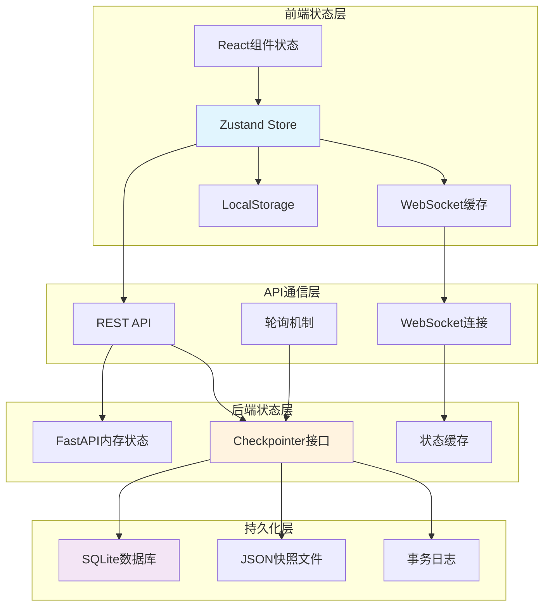

# 状态管理与同步图

## 概述
展示ScholarFlow系统中前端、后端和数据库之间的状态管理、同步机制和数据一致性保证。



## 状态同步序列

### 1. 初始状态同步
```mermaid
sequenceDiagram
    participant F as Frontend
    participant A as API Server
    participant C as Checkpointer
    participant DB as SQLite
    participant W as Workflow

    Note over F, DB: 1. 任务创建后的状态同步

    F->>A: POST /api/tasks
    A->>A: 创建初始状态
    A->>C: save_state(initial_state)
    C->>DB: INSERT INTO checkpoints
    DB-->>C: ✓
    C-->>A: ✓
    A-->>F: {task_id, status: "pending"}

    Note over F, DB: 2. 前端查询状态

    F->>A: GET /api/tasks/{task_id}
    A->>C: load_state(task_id)
    C->>DB: SELECT * FROM checkpoints
    DB-->>C: 返回状态数据
    C-->>A: 返回WorkflowState
    A-->>F: 返回状态快照

    Note over W, DB: 3. 工作流执行并更新状态

    W->>W: 执行节点
    W->>C: save_state(updated_state)
    C->>DB: UPDATE checkpoints
    DB-->>C: ✓
    C->>C: 触发状态变更事件

    Note over A, F: 4. WebSocket推送更新

    A->>F: WebSocket: status_update
    Note right: {status: "parsing", progress: 15%}
    F->>F: 更新UI状态

    Note over F, DB: 5. 状态一致性检查

    F->>A: GET /api/tasks/{task_id}
    A->>C: load_state(task_id)
    C->>DB: SELECT最新状态
    DB-->>C: 返回
    C-->>A: 返回
    A-->>F: 返回状态
    Note right: 检查WebSocket状态是否一致
```

### 2. 状态冲突解决
```mermaid
sequenceDiagram
    participant F as Frontend
    participant A as API Server
    participant C as Checkpointer
    participant DB as SQLite

    Note over F, DB: 状态冲突场景

    F->>A: GET /api/tasks/{task_id}
    Note right: 本地状态版本: v1

    A->>C: load_state(task_id)
    C->>DB: SELECT * WHERE version>1
    DB-->>C: 返回v2状态
    C-->>A: 返回v2状态

    A-->>F: 返回v2状态
    Note right: 服务器版本: v2

    F->>F: 检测到版本冲突

    alt 前端状态较新
        F->>A: POST /api/tasks/{task_id}/sync
        Note right: 提交本地v1状态
        A->>C: check_version_conflict()
        C->>C: 检测冲突
        C->>C: 合并状态差异
        C->>DB: UPDATE with merged state
        C-->>A: 返回合并结果
        A-->>F: 返回合并后状态v3
        F->>F: 更新为v3状态
    else 服务器状态较新
        F->>F: 直接更新为v2状态
        Note right: 丢弃本地v1状态
    end
```

### 3. 断线重连同步
```mermaid
sequenceDiagram
    participant F as Frontend
    participant WS as WebSocket
    participant C as Checkpointer
    participant DB as SQLite

    Note over F, DB: WebSocket断线重连

    F->>WS: Connect /ws/{task_id}
    WS-->>F: 连接成功
    Note right: 开始监听状态更新

    Note over F, DB: 网络中断

    WS->>WS: 连接断开
    F->>F: 检测到断线

    Note over F, DB: 重连过程

    F->>WS: 尝试重连
    WS-->>F: 重连成功
    Note right: 重新连接

    F->>C: load_state(task_id)
    Note right: 获取最新状态
    C->>DB: SELECT * WHERE updated_at>last_seen
    DB-->>C: 返回增量更新
    C-->>F: 返回增量状态

    F->>F: 应用增量更新
    Note right: 更新本地状态

    F->>F: 继续监听状态更新
```

## 前端状态管理

### Zustand状态架构
```typescript
// stores/taskStore.ts
import { create } from 'zustand';
import { subscribeWithSelector } from 'zustand/middleware';

interface TaskState {
  // 当前任务
  currentTask: {
    taskId: string | null;
    status: string | null;
    progress: number;
    currentStep: string;
    lastUpdate: number;
    version: number;
  };

  // 状态历史
  stateHistory: Array<{
    version: number;
    timestamp: number;
    status: string;
    progress: number;
  }>;

  // 操作
  createTask: (config: TaskConfig) => Promise<void>;
  updateState: (newState: Partial<TaskState>) => void;
  syncWithServer: () => Promise<void>;
  addToHistory: (state: any) => void;
  reset: () => void;
}

export const useTaskStore = create<TaskState>()(
  subscribeWithSelector((set, get) => ({
    // 初始状态
    currentTask: {
      taskId: null,
      status: null,
      progress: 0,
      currentStep: '',
      lastUpdate: 0,
      version: 0,
    },
    stateHistory: [],

    // 创建任务
    createTask: async (config: TaskConfig) => {
      try {
        const response = await apiClient.post('/api/tasks', config);
        const { task_id } = response.data;

        set((state) => ({
          currentTask: {
            ...state.currentTask,
            taskId: task_id,
            status: 'pending',
            version: 1,
          },
        }));

        // 连接WebSocket
        connectWebSocket(task_id);

        // 启动同步
        startStateSync(task_id);

      } catch (error) {
        console.error('Failed to create task:', error);
        throw error;
      }
    },

    // 更新状态
    updateState: (newState: Partial<TaskState>) => {
      set((state) => {
        const updatedTask = {
          ...state.currentTask,
          ...newState,
          lastUpdate: Date.now(),
          version: state.currentTask.version + 1,
        };

        return {
          currentTask: updatedTask,
        };
      });

      // 添加到历史
      const { currentTask } = get();
      get().addToHistory(currentTask);
    },

    // 服务器同步
    syncWithServer: async () => {
      const { currentTask } = get();
      if (!currentTask.taskId) return;

      try {
        const response = await apiClient.get(`/api/tasks/${currentTask.taskId}`);
        const serverState = response.data;

        const { currentTask: localState } = get();

        // 比较版本
        if (serverState.version > localState.version) {
          // 服务器版本更新
          set({
            currentTask: {
              ...serverState,
              lastUpdate: Date.now(),
            },
          });

          get().addToHistory(serverState);

        } else if (serverState.version < localState.version) {
          // 本地版本更新，推送服务器
          await apiClient.post(`/api/tasks/${currentTask.taskId}/sync`, {
            localState,
          });
        }

      } catch (error) {
        console.error('Sync failed:', error);
      }
    },

    // 添加到历史
    addToHistory: (state: any) => {
      set((prev) => ({
        stateHistory: [
          ...prev.stateHistory,
          {
            version: state.version,
            timestamp: Date.now(),
            status: state.status,
            progress: state.progress,
          },
        ].slice(-50), // 保留最近50条
      }));
    },

    // 重置
    reset: () => {
      set({
        currentTask: {
          taskId: null,
          status: null,
          progress: 0,
          currentStep: '',
          lastUpdate: 0,
          version: 0,
        },
        stateHistory: [],
      });

      disconnectWebSocket();
      stopStateSync();
    },
  }))
);
```

### 状态同步服务
```typescript
// services/stateSync.ts
let syncInterval: NodeJS.Timeout | null = null;
let lastSyncTime = 0;

export function startStateSync(taskId: string, intervalMs: number = 5000) {
  stopStateSync();

  syncInterval = setInterval(async () => {
    try {
      await useTaskStore.getState().syncWithServer();
      lastSyncTime = Date.now();
    } catch (error) {
      console.error('State sync error:', error);
    }
  }, intervalMs);
}

export function stopStateSync() {
  if (syncInterval) {
    clearInterval(syncInterval);
    syncInterval = null;
  }
}

// WebSocket状态更新处理
export function handleWebSocketMessage(message: any) {
  const { type, ...data } = message;

  switch (type) {
    case 'status_update':
      useTaskStore.getState().updateState({
        status: data.status,
        progress: data.progress,
        currentStep: data.current_step,
      });
      break;

    case 'review_required':
      useTaskStore.getState().updateState({
        status: 'human_review',
        currentStep: '需要人工审核',
      });
      showReviewModal(data.review_point);
      break;

    case 'task_completed':
      useTaskStore.getState().updateState({
        status: 'completed',
        progress: 100,
        currentStep: '任务完成',
      });
      showDownloadDialog(data.download_urls);
      break;

    case 'error':
      useTaskStore.getState().updateState({
        status: 'error',
        currentStep: `错误: ${data.error_message}`,
      });
      showErrorNotification(data);
      break;
  }
}

// 状态版本检查
export function checkStateConsistency() {
  const { currentTask } = useTaskStore.getState();
  const timeSinceLastUpdate = Date.now() - currentTask.lastUpdate;

  // 如果超过30秒没有更新，认为可能不同步
  if (timeSinceLastUpdate > 30000) {
    console.warn('State may be out of sync, triggering sync');
    useTaskStore.getState().syncWithServer();
  }
}
```

## 后端状态管理

### Checkpointer状态持久化
```python
# app/storage/checkpointer.py
from typing import Any, Dict, Optional
from datetime import datetime
import json
import aiosqlite
from pathlib import Path

class SQLiteCheckpointer:
    """SQLite状态持久化器"""

    def __init__(self, db_path: Path):
        self.db_path = db_path
        self.db_path.parent.mkdir(parents=True, exist_ok=True)

    async def save_state(
        self,
        task_id: str,
        state: Dict[str, Any],
        node_name: Optional[str] = None
    ):
        """保存状态"""

        # 生成版本号
        version = await self._get_next_version(task_id)

        # 添加元数据
        state_with_metadata = {
            **state,
            "_metadata": {
                "task_id": task_id,
                "version": version,
                "node_name": node_name,
                "timestamp": datetime.now().isoformat(),
            }
        }

        async with aiosqlite.connect(self.db_path) as db:
            await db.execute("""
                INSERT INTO checkpoints (
                    task_id, version, node_name, state, created_at
                ) VALUES (?, ?, ?, ?, ?)
            """, (
                task_id,
                version,
                node_name,
                json.dumps(state_with_metadata, ensure_ascii=False),
                datetime.now().isoformat(),
            ))

            await db.commit()

        # 同时保存JSON快照
        await self._save_json_snapshot(task_id, state_with_metadata)

    async def load_state(self, task_id: str) -> Optional[Dict[str, Any]]:
        """加载最新状态"""

        async with aiosqlite.connect(self.db_path) as db:
            db.row_factory = aiosqlite.Row
            cursor = await db.execute("""
                SELECT state FROM checkpoints
                WHERE task_id = ?
                ORDER BY version DESC
                LIMIT 1
            """, (task_id,))

            row = await cursor.fetchone()

            if not row:
                return None

            state = json.loads(row["state"])

            # 移除元数据
            state.pop("_metadata", None)

            return state

    async def load_state_with_metadata(self, task_id: str) -> Optional[Dict[str, Any]]:
        """加载状态（含元数据）"""

        async with aiosqlite.connect(self.db_path) as db:
            db.row_factory = aiosqlite.Row
            cursor = await db.execute("""
                SELECT * FROM checkpoints
                WHERE task_id = ?
                ORDER BY version DESC
                LIMIT 1
            """, (task_id,))

            row = await cursor.fetchone()

            if not row:
                return None

            state = json.loads(row["state"])
            return state

    async def get_state_history(self, task_id: str, limit: int = 50) -> list[Dict[str, Any]]:
        """获取状态历史"""

        async with aiosqlite.connect(self.db_path) as db:
            db.row_factory = aiosqlite.Row
            cursor = await db.execute("""
                SELECT version, node_name, state, created_at
                FROM checkpoints
                WHERE task_id = ?
                ORDER BY version DESC
                LIMIT ?
            """, (task_id, limit))

            rows = await cursor.fetchall()

            history = []
            for row in rows:
                state = json.loads(row["state"])
                state.pop("_metadata", None)
                history.append({
                    "version": row["version"],
                    "node_name": row["node_name"],
                    "state": state,
                    "created_at": row["created_at"],
                })

            return history

    async def _get_next_version(self, task_id: str) -> int:
        """获取下一个版本号"""

        async with aiosqlite.connect(self.db_path) as db:
            cursor = await db.execute("""
                SELECT MAX(version) as max_version
                FROM checkpoints
                WHERE task_id = ?
            """, (task_id,))

            row = await cursor.fetchone()
            max_version = row["max_version"] if row["max_version"] else 0

            return max_version + 1

    async def _save_json_snapshot(self, task_id: str, state: Dict[str, Any]):
        """保存JSON快照"""

        snapshot_dir = Path("data/workflows/tasks")
        snapshot_dir.mkdir(parents=True, exist_ok=True)

        snapshot_path = snapshot_dir / f"{task_id}.json"

        async with aiofiles.open(snapshot_path, 'w', encoding='utf-8') as f:
            await f.write(json.dumps(state, ensure_ascii=False, indent=2))
```

### 状态变更通知
```python
# app/services/state_notifier.py
from typing import Dict, Any, Callable
from asyncio import Queue
import json

class StateChangeNotifier:
    """状态变更通知器"""

    def __init__(self):
        self.listeners: Dict[str, Queue] = {}
        self.state_cache: Dict[str, Dict[str, Any]] = {}

    async def notify_state_change(
        self,
        task_id: str,
        old_state: Dict[str, Any],
        new_state: Dict[str, Any]
    ):
        """通知状态变更"""

        # 更新缓存
        self.state_cache[task_id] = new_state

        # 构建通知消息
        message = {
            "type": "state_change",
            "task_id": task_id,
            "timestamp": datetime.now().isoformat(),
            "changes": self._calculate_changes(old_state, new_state),
            "new_state": new_state,
        }

        # 发送给所有监听者
        if task_id in self.listeners:
            queue = self.listeners[task_id]
            await queue.put(message)

    def _calculate_changes(
        self,
        old_state: Dict[str, Any],
        new_state: Dict[str, Any]
    ) -> Dict[str, Any]:
        """计算状态差异"""

        changes = {}

        # 找出新增和更新的字段
        for key, new_value in new_state.items():
            old_value = old_state.get(key)
            if old_value != new_value:
                changes[key] = {
                    "old": old_value,
                    "new": new_value,
                }

        # 找出删除的字段
        for key in old_state:
            if key not in new_state:
                changes[key] = {
                    "old": old_state[key],
                    "new": None,
                }

        return changes

    async def subscribe(self, task_id: str) -> Queue:
        """订阅状态变更"""

        if task_id not in self.listeners:
            self.listeners[task_id] = Queue()

        return self.listeners[task_id]

    def unsubscribe(self, task_id: str):
        """取消订阅"""

        if task_id in self.listeners:
            del self.listeners[task_id]

    def get_cached_state(self, task_id: str) -> Optional[Dict[str, Any]]:
        """获取缓存的状态"""

        return self.state_cache.get(task_id)

notifier = StateChangeNotifier()
```

## 状态一致性保证

### 乐观锁实现
```python
# app/api/state_api.py
from pydantic import BaseModel, Field
from typing import Optional

class StateUpdateRequest(BaseModel):
    """状态更新请求"""
    task_id: str
    client_version: int = Field(..., ge=1)
    new_state: Dict[str, Any]

@router.post("/api/tasks/{task_id}/sync")
async def sync_state(
    task_id: str,
    request: StateUpdateRequest,
    checkpointer: SQLiteCheckpointer = Depends(get_checkpointer)
):
    """同步状态（乐观锁）"""

    # 1. 加载服务器当前状态
    server_state = await checkpointer.load_state_with_metadata(task_id)

    if not server_state:
        raise HTTPException(status_code=404, detail="Task not found")

    server_version = server_state["_metadata"]["version"]

    # 2. 检查版本冲突
    if request.client_version < server_version:
        # 客户端版本较旧，返回服务器状态
        return {
            "status": "conflict",
            "server_version": server_version,
            "server_state": server_state,
            "message": "Client version is outdated",
        }

    elif request.client_version == server_version:
        # 版本匹配，可以更新
        await checkpointer.save_state(
            task_id,
            request.new_state,
            "client_sync"
        )

        return {
            "status": "updated",
            "new_version": server_version + 1,
            "message": "State updated successfully",
        }

    else:
        # 客户端版本更新，可能有问题
        raise HTTPException(
            status_code=409,
            detail=f"Client version {request.client_version} is ahead of server {server_version}"
        )
```

### 状态版本检查
```python
# app/middleware/state_version_check.py
from fastapi import Request, HTTPException

async def check_state_version_middleware(request: Request, call_next):
    """状态版本检查中间件"""

    # 检查请求是否包含版本信息
    if request.method in ["POST", "PUT", "PATCH"]:
        # 从请求头或请求体中提取版本信息
        client_version = request.headers.get("X-State-Version")
        task_id = request.path_params.get("task_id")

        if client_version and task_id:
            # 验证版本是否有效
            checkpointer = get_checkpointer()
            server_state = await checkpointer.load_state_with_metadata(task_id)

            if server_state:
                server_version = server_state["_metadata"]["version"]
                requested_version = int(client_version)

                if requested_version < server_version:
                    raise HTTPException(
                        status_code=409,
                        detail="State version conflict",
                        headers={"X-Server-Version": str(server_version)}
                    )

    response = await call_next(request)
    return response
```

## 状态压缩与归档

### 状态压缩
```python
# app/services/state_compression.py
import zlib
import json
from typing import Dict, Any

class StateCompressor:
    """状态压缩器"""

    @staticmethod
    def compress_state(state: Dict[str, Any]) -> bytes:
        """压缩状态"""

        # 移除不需要压缩的大字段
        state_copy = {k: v for k, v in state.items() if k not in [
            "large_content",
            "raw_data",
            "debug_info",
        ]}

        # 转换为JSON字符串
        json_str = json.dumps(state_copy, ensure_ascii=False)

        # 压缩
        compressed = zlib.compress(json_str.encode('utf-8'))

        return compressed

    @staticmethod
    def decompress_state(compressed_data: bytes) -> Dict[str, Any]:
        """解压缩状态"""

        # 解压缩
        json_str = zlib.decompress(compressed_data).decode('utf-8')

        # 解析JSON
        state = json.loads(json_str)

        return state

async def compress_old_checkpoints():
    """压缩旧的检查点"""

    cutoff_date = datetime.now() - timedelta(days=7)

    async with aiosqlite.connect(DB_PATH) as db:
        cursor = await db.execute("""
            SELECT task_id, version, state, created_at
            FROM checkpoints
            WHERE created_at < ?
            AND compressed = 0
        """, (cutoff_date.isoformat(),))

        rows = await cursor.fetchall()

        for row in rows:
            task_id, version, state_json, created_at = row

            try:
                state = json.loads(state_json)
                compressed_state = StateCompressor.compress_state(state)

                # 更新数据库
                await db.execute("""
                    UPDATE checkpoints
                    SET state = ?, compressed = 1
                    WHERE task_id = ? AND version = ?
                """, (compressed_state, task_id, version))

            except Exception as e:
                logger.error(f"Failed to compress checkpoint {task_id}:{version}: {e}")
```

## 状态监控指标

### 状态同步指标
```python
# app/analytics/state_analytics.py
from collections import defaultdict
from datetime import datetime, timedelta

@dataclass
class StateSyncMetrics:
    """状态同步指标"""
    total_syncs: int = 0
    successful_syncs: int = 0
    failed_syncs: int = 0
    conflict_count: int = 0
    avg_sync_latency: float = 0.0
    sync_rate: float = 0.0  # 每秒同步次数

def calculate_sync_metrics(sync_logs: list[dict]) -> StateSyncMetrics:
    """计算同步指标"""

    metrics = StateSyncMetrics()

    # 基本统计
    metrics.total_syncs = len(sync_logs)
    metrics.successful_syncs = sum(1 for log in sync_logs if log["status"] == "success")
    metrics.failed_syncs = sum(1 for log in sync_logs if log["status"] == "failed")
    metrics.conflict_count = sum(1 for log in sync_logs if log["status"] == "conflict")

    # 平均延迟
    latencies = [log["latency"] for log in sync_logs if "latency" in log]
    if latencies:
        metrics.avg_sync_latency = sum(latencies) / len(latencies)

    # 同步速率（每秒）
    time_span = max(
        (log["timestamp"] for log in sync_logs),
        default=0
    ) - min(
        (log["timestamp"] for log in sync_logs),
        default=0
    )

    if time_span > 0:
        metrics.sync_rate = metrics.total_syncs / time_span

    return metrics
```

### 状态健康检查
```python
# app/health/state_health_check.py
async def check_state_health() -> dict:
    """检查状态健康状况"""

    health_status = {
        "status": "healthy",
        "checks": {},
        "metrics": {},
    }

    try:
        # 检查1: 数据库连接
        async with aiosqlite.connect(DB_PATH) as db:
            await db.execute("SELECT 1")
            health_status["checks"]["database"] = "ok"

        # 检查2: 状态一致性
        inconsistent_tasks = await find_inconsistent_tasks()
        if inconsistent_tasks:
            health_status["checks"]["consistency"] = "warning"
            health_status["metrics"]["inconsistent_tasks"] = len(inconsistent_tasks)
        else:
            health_status["checks"]["consistency"] = "ok"

        # 检查3: 状态版本冲突
        conflict_count = await count_version_conflicts()
        if conflict_count > 0:
            health_status["checks"]["version_conflicts"] = "warning"
            health_status["metrics"]["version_conflicts"] = conflict_count
        else:
            health_status["checks"]["version_conflicts"] = "ok"

        # 检查4: 磁盘使用率
        disk_usage = await get_disk_usage(Path("data/workflows"))
        if disk_usage > 0.9:
            health_status["checks"]["disk_usage"] = "critical"
            health_status["metrics"]["disk_usage"] = f"{disk_usage:.2%}"
        elif disk_usage > 0.8:
            health_status["checks"]["disk_usage"] = "warning"
            health_status["metrics"]["disk_usage"] = f"{disk_usage:.2%}"
        else:
            health_status["checks"]["disk_usage"] = "ok"
            health_status["metrics"]["disk_usage"] = f"{disk_usage:.2%}"

        # 确定整体状态
        if any(status == "critical" for status in health_status["checks"].values()):
            health_status["status"] = "critical"
        elif any(status == "warning" for status in health_status["checks"].values()):
            health_status["status"] = "degraded"

    except Exception as e:
        health_status["status"] = "unhealthy"
        health_status["error"] = str(e)

    return health_status
```

## 监控指标

| 指标 | 说明 | 计算方式 | 目标值 |
|------|------|----------|--------|
| 状态同步成功率 | 同步成功比例 | 成功数/总数 | > 99% |
| 平均同步延迟 | 平均同步耗时 | Σ同步时间/同步次数 | < 100ms |
| 状态版本冲突率 | 冲突发生比例 | 冲突数/同步数 | < 1% |
| 状态一致性检查通过率 | 一致性检查通过比例 | 通过数/检查数 | > 95% |
| WebSocket连接稳定性 | 连接断开频率 | 断开次数/总连接数 | < 5% |
| 状态历史完整性 | 历史记录完整性 | 记录数/预期数 | 100% |
| 状态压缩率 | 压缩节省空间比例 | 压缩前大小-压缩后大小 | > 60% |
