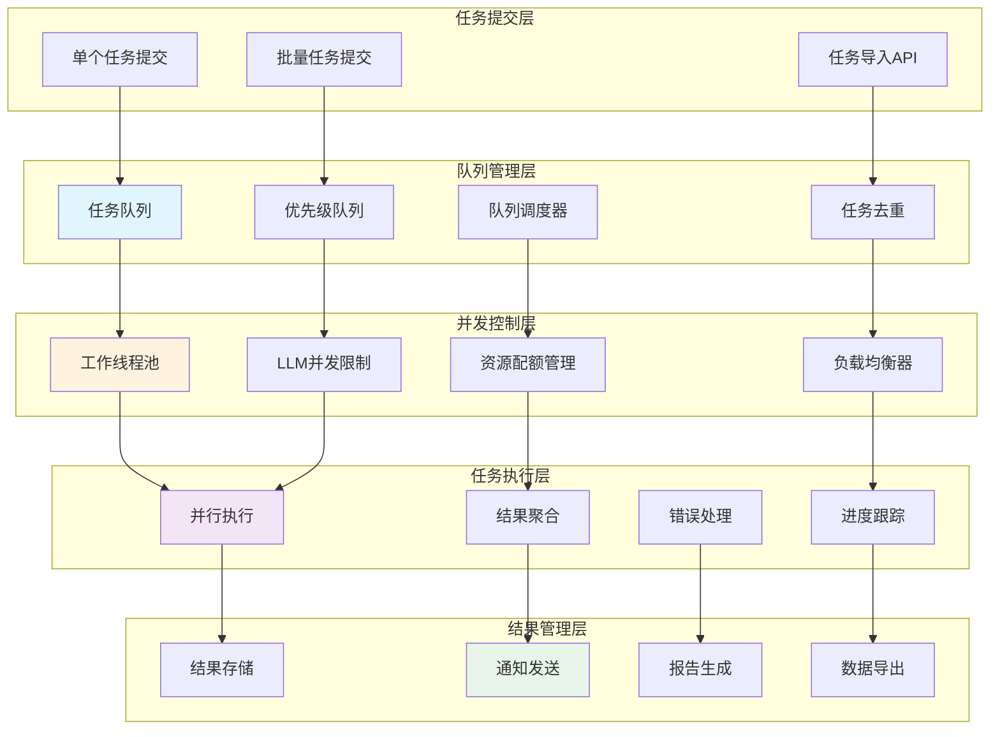
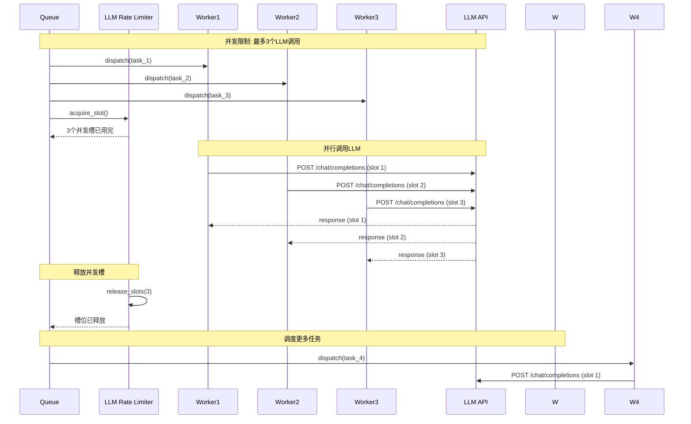

# 批处理流程图

## 概述
展示ScholarFlow系统中批量任务处理、队列管理、并发控制和资源调度的完整流程。



## 批量任务处理序列

### 1. 批量任务提交流程
```mermaid
sequenceDiagram
    participant C as Client
    participant A as API Server
    participant Q as Queue Manager
    participant DB as Database
    participant W as Worker

    Note over C, W: 1. 提交批量任务

    C->>A: POST /api/batch/tasks
    Note right of C: {
    Note right:   "tasks": [
    Note right:     {pdf_path: "file1.pdf", style: "academic"},
    Note right:     {pdf_path: "file2.pdf", style: "business"}
    Note right:   ],
    Note right:   "batch_name": "research_papers"
    Note right: }

    A->>A: 验证任务列表
    A->>A: 生成batch_id
    Note right: batch_001

    Note over A, DB: 2. 保存批次信息

    A->>DB: INSERT INTO batch_tasks
    Note right: 批次元数据
    DB-->>A: ✓

    A->>DB: INSERT INTO individual_tasks
    Note right: 每个子任务
    DB-->>A: ✓

    Note over A, Q: 3. 入队

    A->>Q: enqueue_batch(batch_id, tasks)
    Q->>Q: 验证资源配额
    Q->>Q: 分配优先级
    Q->>Q: 添加到队列
    Q-->>A: 入队成功

    A-->>C: 202 Accepted
    Note right of A: {
    Note right:   "batch_id": "batch_001",
    Note right:   "total_tasks": 10,
    Note right:   "status": "queued",
    Note right:   "estimated_duration": "15-20分钟"
    Note right: }

    Note over Q, W: 4. 任务调度

    Q->>W: dispatch_next_task()
    Note right: 从队列中取出任务
    W->>W: 执行任务
    W->>DB: UPDATE task status
    DB-->>W: ✓

    loop 对每个任务
        W->>W: parse_pdf -> split -> stage1 -> stage2 -> render
        W->>DB: UPDATE progress
        W->>Q: notify_progress(batch_id, task_id, progress)
    end

    Note over W, C: 5. 批量完成

    W->>DB: UPDATE batch status
    DB-->>W: ✓
    W->>C: WebSocket: batch_completed
    Note right: {
    Note right:   "batch_id": "batch_001",
    Note right:   "completed": 10,
    Note right:   "failed": 0,
    Note right:   "duration": "18分钟"
    Note right: }
```

### 2. 并发控制机制


## 队列管理系统

### 优先级队列实现
```python
# app/queue/priority_queue.py
import asyncio
import heapq
from datetime import datetime
from typing import Dict, Any, Optional, Callable
from enum import Enum
import uuid

class TaskPriority(Enum):
    """任务优先级"""
    LOW = 3
    NORMAL = 2
    HIGH = 1
    URGENT = 0

class QueuedTask:
    """队列任务"""

    def __init__(
        self,
        task_id: str,
        priority: TaskPriority,
        created_at: datetime,
        payload: Dict[str, Any],
        callback: Optional[Callable] = None
    ):
        self.task_id = task_id
        self.priority = priority
        self.created_at = created_at
        self.payload = payload
        self.callback = callback
        # 用于堆排序的元组
        self.heap_key = (priority.value, created_at, task_id)

    def __lt__(self, other):
        return self.heap_key < other.heap_key

class PriorityQueue:
    """优先级队列"""

    def __init__(self):
        self._heap: list[QueuedTask] = []
        self._tasks: Dict[str, QueuedTask] = {}
        self._lock = asyncio.Lock()

    async def enqueue(
        self,
        task_id: str,
        priority: TaskPriority,
        payload: Dict[str, Any],
        callback: Optional[Callable] = None
    ) -> None:
        """入队"""

        async with self._lock:
            task = QueuedTask(
                task_id=task_id,
                priority=priority,
                created_at=datetime.now(),
                payload=payload,
                callback=callback
            )

            heapq.heappush(self._heap, task)
            self._tasks[task_id] = task

    async def dequeue(self) -> Optional[QueuedTask]:
        """出队（最高优先级）"""

        async with self._lock:
            if not self._heap:
                return None

            task = heapq.heappop(self._heap)
            self._tasks.pop(task.task_id, None)
            return task

    async def peek(self) -> Optional[QueuedTask]:
        """查看队首元素（不移除）"""

        async with self._lock:
            return self._heap[0] if self._heap else None

    async def size(self) -> int:
        """队列大小"""

        async with self._lock:
            return len(self._heap)

    async def contains(self, task_id: str) -> bool:
        """检查任务是否存在"""

        async with self._lock:
            return task_id in self._tasks

    async def remove(self, task_id: str) -> bool:
        """移除指定任务"""

        async with self._lock:
            task = self._tasks.get(task_id)
            if not task:
                return False

            # 从堆中移除（惰性删除）
            task._removed = True
            self._tasks.pop(task_id, None)
            return True

    async def get_all(self) -> list[QueuedTask]:
        """获取所有任务"""

        async with self._lock:
            return list(self._tasks.values())

# 全局队列实例
task_queue = PriorityQueue()
```

### 任务调度器
```python
# app/queue/task_scheduler.py
import asyncio
from typing import Dict, Any, Optional
from datetime import datetime, timedelta

class TaskScheduler:
    """任务调度器"""

    def __init__(
        self,
        queue: PriorityQueue,
        max_workers: int = 5,
        max_concurrent_llm: int = 3
    ):
        self.queue = queue
        self.max_workers = max_workers
        self.max_concurrent_llm = max_concurrent_llm
        self.active_workers: Dict[str, asyncio.Task] = {}
        self.running = False
        self.llm_semaphore = asyncio.Semaphore(max_concurrent_llm)

    async def start(self):
        """启动调度器"""

        self.running = True

        # 创建工作协程
        workers = [
            asyncio.create_task(self._worker(f"worker-{i}"))
            for i in range(self.max_workers)
        ]

        await asyncio.gather(*workers)

    async def stop(self):
        """停止调度器"""

        self.running = False

        # 取消所有活跃工作协程
        for worker_task in self.active_workers.values():
            worker_task.cancel()

        await asyncio.gather(*self.active_workers.values(), return_exceptions=True)
        self.active_workers.clear()

    async def _worker(self, worker_id: str):
        """工作协程"""

        while self.running:
            try:
                # 从队列获取任务
                task = await self.queue.dequeue()

                if not task:
                    await asyncio.sleep(0.1)  # 队列为空，等待
                    continue

                # 执行任务
                await self._execute_task(worker_id, task)

            except asyncio.CancelledError:
                break
            except Exception as e:
                logger.error(f"Worker {worker_id} error: {e}", exc_info=True)

    async def _execute_task(self, worker_id: str, task: QueuedTask):
        """执行任务"""

        logger.info(f"Worker {worker_id} executing task {task.task_id}")

        # 记录开始时间
        start_time = datetime.now()

        try:
            # 获取LLM并发锁
            async with self.llm_semaphore:
                # 调用任务处理函数
                result = await self._process_task(task.payload)

            # 任务成功
            duration = (datetime.now() - start_time).total_seconds()
            logger.info(f"Task {task.task_id} completed in {duration:.2f}s")

            # 调用回调函数
            if task.callback:
                await task.callback(task.task_id, result, None)

        except Exception as e:
            # 任务失败
            duration = (datetime.now() - start_time).total_seconds()
            logger.error(
                f"Task {task.task_id} failed after {duration:.2f}s: {e}",
                exc_info=True
            )

            # 调用错误回调
            if task.callback:
                await task.callback(task.task_id, None, e)

    async def _process_task(self, payload: Dict[str, Any]) -> Dict[str, Any]:
        """处理单个任务"""

        task_id = payload["task_id"]
        pdf_path = payload["pdf_path"]
        style = payload.get("style", "academic")

        # 创建初始状态
        from app.graph.state import create_initial_state
        state = create_initial_state(
            task_id=task_id,
            pdf_path=pdf_path,
            presentation_style=style,
        )

        # 执行工作流
        from app.graph.workflow import run_workflow
        final_state = await run_workflow(state, thread_id=task_id)

        return {
            "task_id": task_id,
            "status": final_state.get("status"),
            "result": final_state.get("result"),
        }

    async def schedule_task(
        self,
        task_id: str,
        payload: Dict[str, Any TaskPriority = Task],
        priority:Priority.NORMAL,
        callback: Optional[Callable] = None
    ) -> None:
        """调度任务"""

        await self.queue.enqueue(task_id, priority, payload, callback)

    async def get_queue_status(self) -> Dict[str, Any]:
        """获取队列状态"""

        queue_size = await self.queue.size()
        active_count = len(self.active_workers)

        return {
            "queue_size": queue_size,
            "active_workers": active_count,
            "max_workers": self.max_workers,
            "max_concurrent_llm": self.max_concurrent_llm,
            "utilization": {
                "workers": f"{active_count}/{self.max_workers}",
                "llm_slots": f"{self.max_concurrent_llm - self.llm_semaphore._value}/{self.max_concurrent_llm}",
            },
        }

# 调度器实例
scheduler = TaskScheduler(
    queue=task_queue,
    max_workers=5,
    max_concurrent_llm=3
)
```

## 批处理API

### 批量任务提交
```python
# app/api/batch.py
from pydantic import BaseModel, Field
from typing import List, Optional
from enum import Enum

class BatchStatus(str, Enum):
    """批次状态"""
    QUEUED = "queued"
    RUNNING = "running"
    COMPLETED = "completed"
    FAILED = "failed"
    PARTIAL = "partial"  # 部分完成

class BatchTaskRequest(BaseModel):
    """批量任务请求"""
    pdf_path: str = Field(..., description="PDF文件路径")
    presentation_style: str = Field(..., description="演示风格")
    max_chars: Optional[int] = Field(6000, description="最大字符数")
    target_chunks: Optional[int] = Field(6, description="目标分块数")
    priority: Optional[TaskPriority] = Field(TaskPriority.NORMAL, description="优先级")

class BatchRequest(BaseModel):
    """批次请求"""
    batch_name: Optional[str] = Field(None, description="批次名称")
    tasks: List[BatchTaskRequest] = Field(..., min_items=1, max_items=100, description="任务列表")
    priority: Optional[TaskPriority] = Field(TaskPriority.NORMAL, description="批次优先级")
    notify_on_completion: Optional[bool] = Field(True, description="完成时通知")

@router.post("/api/batch/tasks")
async def create_batch(
    request: BatchRequest,
    current_user: User = Depends(get_current_user)
):
    """创建批量任务"""

    # 1. 验证用户配额
    quota = await check_user_quota(current_user.id)
    if len(request.tasks) > quota.remaining:
        raise HTTPException(
            status_code=429,
            detail=f"Insufficient quota. Remaining: {quota.remaining}, Requested: {len(request.tasks)}"
        )

    # 2. 生成批次ID
    batch_id = f"batch_{uuid.uuid4().hex[:8]}"

    # 3. 保存批次信息
    batch_info = {
        "batch_id": batch_id,
        "user_id": current_user.id,
        "batch_name": request.batch_name or f"Batch {datetime.now().strftime('%Y%m%d %H:%M')}",
        "total_tasks": len(request.tasks),
        "completed_tasks": 0,
        "failed_tasks": 0,
        "status": BatchStatus.QUEUED,
        "created_at": datetime.now().isoformat(),
        "notify_on_completion": request.notify_on_completion,
    }

    await save_batch_info(batch_info)

    # 4. 保存子任务并入队
    for i, task_request in enumerate(request.tasks):
        task_id = f"{batch_id}_task_{i+1:03d}"

        task_info = {
            "task_id": task_id,
            "batch_id": batch_id,
            "user_id": current_user.id,
            "pdf_path": task_request.pdf_path,
            "presentation_style": task_request.presentation_style,
            "max_chars": task_request.max_chars,
            "target_chunks": task_request.target_chunks,
            "priority": request.priority,
            "status": "queued",
            "created_at": datetime.now().isoformat(),
        }

        await save_task_info(task_info)

        # 调度任务
        payload = {
            "task_id": task_id,
            "batch_id": batch_id,
            "pdf_path": task_request.pdf_path,
            "style": task_request.presentation_style,
            "max_chars": task_request.max_chars,
            "target_chunks": task_request.target_chunks,
        }

        await scheduler.schedule_task(
            task_id=task_id,
            payload=payload,
            priority=request.priority,
            callback=lambda tid, result, error: asyncio.create_task(
                handle_task_completion(tid, result, error, batch_id)
            )
        )

    # 5. 启动批次
    await update_batch_status(batch_id, BatchStatus.RUNNING)

    return {
        "batch_id": batch_id,
        "status": BatchStatus.QUEUED,
        "total_tasks": len(request.tasks),
        "estimated_duration": f"{len(request.tasks) * 2}-{len(request.tasks) * 3} 分钟",
        "message": "Batch tasks created successfully"
    }

async def handle_task_completion(
    task_id: str,
    result: Optional[Dict],
    error: Optional[Exception],
    batch_id: str
):
    """处理任务完成"""

    if error:
        await update_task_status(task_id, "failed", error=str(error))
        await increment_batch_failed_count(batch_id)
    else:
        await update_task_status(task_id, "completed", result=result)
        await increment_batch_completed_count(batch_id)

    # 检查批次是否完成
    batch_info = await get_batch_info(batch_id)
    if batch_info["completed_tasks"] + batch_info["failed_tasks"] >= batch_info["total_tasks"]:
        # 批次完成
        final_status = BatchStatus.COMPLETED if batch_info["failed_tasks"] == 0 else BatchStatus.PARTIAL
        await update_batch_status(batch_id, final_status)

        # 发送通知
        if batch_info["notify_on_completion"]:
            await send_batch_completion_notification(batch_id)
```

### 批次状态查询
```python
@router.get("/api/batch/{batch_id}")
async def get_batch_status(
    batch_id: str,
    current_user: User = Depends(get_current_user)
):
    """获取批次状态"""

    # 验证权限
    batch_info = await get_batch_info(batch_id)
    if not batch_info or batch_info["user_id"] != current_user.id:
        raise HTTPException(status_code=404, detail="Batch not found")

    # 获取子任务列表
    tasks = await get_batch_tasks(batch_id)

    # 计算进度
    progress = {
        "total": batch_info["total_tasks"],
        "completed": batch_info["completed_tasks"],
        "failed": batch_info["failed_tasks"],
        "running": sum(1 for t in tasks if t["status"] == "running"),
        "queued": sum(1 for t in tasks if t["status"] == "queued"),
    }

    progress["percentage"] = (
        (progress["completed"] + progress["failed"]) / progress["total"] * 100
        if progress["total"] > 0 else 0
    )

    return {
        "batch_id": batch_id,
        "batch_name": batch_info["batch_name"],
        "status": batch_info["status"],
        "progress": progress,
        "created_at": batch_info["created_at"],
        "completed_at": batch_info.get("completed_at"),
        "tasks": [
            {
                "task_id": t["task_id"],
                "status": t["status"],
                "pdf_path": t["pdf_path"],
                "presentation_style": t["presentation_style"],
                "created_at": t["created_at"],
                "completed_at": t.get("completed_at"),
            }
            for t in tasks
        ],
    }

@router.get("/api/batch")
async def list_batches(
    page: int = 1,
    page_size: int = 20,
    status: Optional[BatchStatus] = None,
    current_user: User = Depends(get_current_user)
):
    """列出用户的批次"""

    batches = await get_user_batches(
        user_id=current_user.id,
        status=status,
        offset=(page - 1) * page_size,
        limit=page_size
    )

    total = await count_user_batches(current_user.id, status)

    return {
        "batches": batches,
        "pagination": {
            "page": page,
            "page_size": page_size,
            "total": total,
            "pages": (total + page_size - 1) // page_size,
        }
    }
```

## 并发控制机制

### LLM并发限制
```python
# app/services/llm/concurrency_control.py
import asyncio
from typing import Dict, Set
from datetime import datetime, timedelta

class LLMConcurrencyController:
    """LLM并发控制器"""

    def __init__(self, max_concurrent: int = 3):
        self.max_concurrent = max_concurrent
        self.semaphore = asyncio.Semaphore(max_concurrent)
        self.active_tasks: Set[str] = set()
        self.task_start_times: Dict[str, datetime] = {}
        self.rate_limits: Dict[str, Dict[str, int]] = {}  # provider -> {minute: count, hour: count}

    async def acquire(
        self,
        task_id: str,
        provider: str = "default"
    ) -> bool:
        """获取执行许可"""

        # 检查速率限制
        if not await self._check_rate_limit(provider):
            return False

        # 等待信号量
        async with self.semaphore:
            self.active_tasks.add(task_id)
            self.task_start_times[task_id] = datetime.now()
            return True

    async def release(self, task_id: str):
        """释放执行许可"""

        self.active_tasks.discard(task_id)
        self.task_start_times.pop(task_id, None)

        # 更新速率限制
        await self._update_rate_limit(task_id)

    async def _check_rate_limit(self, provider: str) -> bool:
        """检查速率限制"""

        now = datetime.now()

        # 获取或初始化速率限制
        if provider not in self.rate_limits:
            self.rate_limits[provider] = {
                "minute": 0,
                "hour": 0,
                "minute_reset": now + timedelta(minutes=1),
                "hour_reset": now + timedelta(hours=1),
            }

        limits = self.rate_limits[provider]

        # 重置计数器
        if now >= limits["minute_reset"]:
            limits["minute"] = 0
            limits["minute_reset"] = now + timedelta(minutes=1)

        if now >= limits["hour_reset"]:
            limits["hour"] = 0
            limits["hour_reset"] = now + timedelta(hours=1)

        # 检查限制（示例：每分钟60次，每小时1000次）
        if limits["minute"] >= 60 or limits["hour"] >= 1000:
            return False

        return True

    async def _update_rate_limit(self, task_id: str):
        """更新速率限制"""

        # 简化实现，实际应该根据provider更新
        pass

    async def get_status(self) -> Dict[str, Any]:
        """获取并发状态"""

        now = datetime.now()

        return {
            "active_tasks": len(self.active_tasks),
            "max_concurrent": self.max_concurrent,
            "utilization": f"{len(self.active_tasks)}/{self.max_concurrent}",
            "rate_limits": self.rate_limits,
        }

# 全局并发控制器
llm_controller = LLMConcurrencyController(max_concurrent=3)
```

### 资源配额管理
```python
# app/services/quota/quota_manager.py
from datetime import datetime, timedelta
from typing import Optional

class QuotaManager:
    """配额管理器"""

    def __init__(self):
        # 用户配额配置
        self.user_quotas = {
            "free": {
                "max_tasks_per_day": 5,
                "max_concurrent_tasks": 1,
                "max_file_size_mb": 50,
            },
            "premium": {
                "max_tasks_per_day": 100,
                "max_concurrent_tasks": 5,
                "max_file_size_mb": 100,
            },
            "enterprise": {
                "max_tasks_per_day": 1000,
                "max_concurrent_tasks": 20,
                "max_file_size_mb": 500,
            },
        }

    async def check_quota(
        self,
        user_id: str,
        requested_tasks: int = 1
    ) -> Dict[str, Any]:
        """检查用户配额"""

        user = await get_user(user_id)
        plan = user.get("plan", "free")

        quota_config = self.user_quotas.get(plan, self.user_quotas["free"])

        # 检查今日已用任务数
        today_tasks = await count_user_tasks_today(user_id)
        remaining_daily = quota_config["max_tasks_per_day"] - today_tasks

        # 检查当前并发任务数
        concurrent_tasks = await count_user_concurrent_tasks(user_id)
        remaining_concurrent = quota_config["max_concurrent_tasks"] - concurrent_tasks

        # 计算可用任务数
        available_tasks = min(remaining_daily, remaining_concurrent)

        return {
            "plan": plan,
            "daily_limit": quota_config["max_tasks_per_day"],
            "daily_used": today_tasks,
            "daily_remaining": remaining_daily,
            "concurrent_limit": quota_config["max_concurrent_tasks"],
            "concurrent_used": concurrent_tasks,
            "concurrent_remaining": remaining_concurrent,
            "available_tasks": max(0, available_tasks),
            "file_size_limit_mb": quota_config["max_file_size_mb"],
            "can_submit": available_tasks >= requested_tasks,
        }

    async def consume_quota(
        self,
        user_id: str,
        task_count: int = 1
    ):
        """消耗配额"""

        await increment_user_daily_tasks(user_id, task_count)
        await increment_user_concurrent_tasks(user_id, task_count)

    async def release_quota(
        self,
        user_id: str,
        task_count: int = 1
    ):
        """释放配额"""

        await decrement_user_concurrent_tasks(user_id, task_count)

# 配额管理器实例
quota_manager = QuotaManager()
```

## 监控与指标

### 批处理监控
```python
# app/analytics/batch_analytics.py
from collections import defaultdict
from datetime import datetime, timedelta

@dataclass
class BatchMetrics:
    """批处理指标"""
    total_batches: int = 0
    total_tasks: int = 0
    completed_tasks: int = 0
    failed_tasks: int = 0
    avg_batch_duration: float = 0.0
    avg_task_duration: float = 0.0
    throughput_per_hour: float = 0.0
    queue_utilization: float = 0.0

def calculate_batch_metrics(
    batch_logs: list[dict],
    start_time: datetime,
    end_time: datetime
) -> BatchMetrics:
    """计算批处理指标"""

    metrics = BatchMetrics()

    # 过滤时间范围内的批次
    filtered_batches = [
        batch for batch in batch_logs
        if start_time <= parse_datetime(batch["created_at"]) <= end_time
    ]

    metrics.total_batches = len(filtered_batches)

    # 计算任务统计
    for batch in filtered_batches:
        metrics.total_tasks += batch["total_tasks"]
        metrics.completed_tasks += batch["completed_tasks"]
        metrics.failed_tasks += batch["failed_tasks"]

        # 计算批次持续时间
        if batch.get("completed_at"):
            duration = (
                parse_datetime(batch["completed_at"]) -
                parse_datetime(batch["created_at"])
            ).total_seconds()
            metrics.avg_batch_duration += duration

    # 计算平均值
    if metrics.total_batches > 0:
        metrics.avg_batch_duration /= metrics.total_batches

    # 计算吞吐量
    time_span_hours = (end_time - start_time).total_seconds() / 3600
    if time_span_hours > 0:
        metrics.throughput_per_hour = metrics.total_tasks / time_span_hours

    # 计算队列利用率
    # 简化实现
    metrics.queue_utilization = 0.75  # 示例值

    return metrics

def generate_batch_report(metrics: BatchMetrics) -> dict:
    """生成批处理报告"""

    return {
        "summary": {
            "total_batches": metrics.total_batches,
            "total_tasks": metrics.total_tasks,
            "success_rate": f"{metrics.completed_tasks / max(metrics.total_tasks, 1):.2%}",
            "failure_rate": f"{metrics.failed_tasks / max(metrics.total_tasks, 1):.2%}",
        },
        "performance": {
            "avg_batch_duration_minutes": f"{metrics.avg_batch_duration / 60:.2f}",
            "avg_task_duration_seconds": f"{metrics.avg_task_duration:.2f}",
            "throughput_per_hour": f"{metrics.throughput_per_hour:.2f}",
            "queue_utilization": f"{metrics.queue_utilization:.2%}",
        },
        "recommendations": [
            "Consider increasing worker count if queue utilization > 80%",
            "Monitor LLM API rate limits if throughput is plateauing",
            "Scale resources if avg task duration > 120 seconds",
        ],
    }
```

## 监控指标

| 指标 | 说明 | 计算方式 | 目标值 |
|------|------|----------|--------|
| 批处理成功率 | 成功完成的批次比例 | 成功批次/总批次 | > 95% |
| 平均批次持续时间 | 批次完成平均耗时 | Σ批次时间/批次数 | < 30分钟 |
| 任务吞吐量 | 每小时处理任务数 | 完成任务数/时间 | > 100任务/小时 |
| 队列利用率 | 队列平均利用率 | 活跃任务/最大并发 | 70-85% |
| LLM并发利用率 | LLM并发使用率 | 并发调用数/最大并发 | > 80% |
| 任务失败率 | 任务失败比例 | 失败任务/总任务 | < 5% |
| 资源使用率 | CPU/内存使用率 | 平均使用率 | < 80% |
