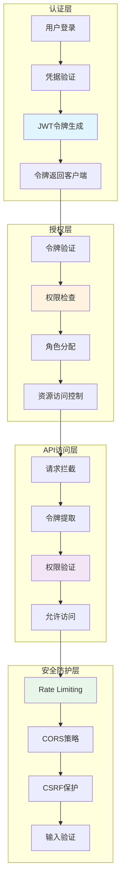

# 认证与授权流程图

## 概述
展示ScholarFlow系统中用户认证、JWT令牌管理、权限控制和API安全防护的完整流程。



## 用户认证流程

### 1. 登录认证序列
```mermaid
sequenceDiagram
    participant U as User
    participant F as Frontend
    participant A as API Server
    participant DB as Database
    participant J as JWT Handler
    participant C as Cache

    Note over U, C: 1. 用户登录

    U->>F: 输入用户名/密码
    F->>F: 前端验证
    Note right: 检查格式

    F->>A: POST /api/auth/login
    Note right of F: {
    Note right:   "username": "user@example.com",
    Note right:   "password": "******"
    Note right: }

    Note over A, DB: 2. 验证凭据

    A->>DB: SELECT user WHERE email=...
    DB-->>A: 返回用户信息
    Note right: 包含哈希密码

    A->>A: 验证密码
    Note right: 使用bcrypt

    alt 密码错误
        A-->>F: 401 Unauthorized
        Note right: {error: "INVALID_CREDENTIALS"}
        F->>U: 显示错误
    else 密码正确
        Note over A, J: 3. 生成JWT令牌

        A->>J: generate_token(user_id, role)
        Note right: 有效期: 24小时
        J->>J: 创建JWT
        Note right: 包含: user_id, email, role
        J-->>A: 返回access_token

        Note over A, C: 4. 缓存令牌

        A->>C: cache_token(token, user_info)
        Note right: Redis缓存
        C-->>A: ✓

        Note over A, F: 5. 返回响应

        A-->>F: 200 OK
        Note right of A: {
        Note right:   "access_token": "eyJ...",
        Note right:   "token_type": "Bearer",
        Note right:   "expires_in": 86400,
        Note right:   "user": {
        Note right:     "id": "user_123",
        Note right:     "email": "user@example.com",
        Note right:     "role": "user"
        Note right:   }
        Note right: }

        Note over F, U: 6. 保存令牌

        F->>F: 保存到localStorage
        F->>U: 登录成功
    end
```

### 2. 令牌验证流程
```mermaid
sequenceDiagram
    participant F as Frontend
    participant A as API Server
    participant J as JWT Handler
    participant C as Cache
    participant DB as Database

    Note over F, DB: 1. 携带令牌请求

    F->>A: GET /api/tasks/123
    Note right: Authorization: Bearer eyJ...

    Note over A, J: 2. 提取并验证令牌

    A->>J: verify_token(token)
    J->>J: 验证签名
    J->>J: 检查过期时间
    J-->>A: 返回用户信息

    Note over A, C: 3. 检查令牌黑名单

    A->>C: is_token_blacklisted(token_id)
    C-->>A: False (未黑名单)

    Note over A, DB: 4. 验证用户状态

    A->>DB: SELECT user WHERE id=...
    DB-->>A: 返回用户状态

    alt 用户状态有效
        A->>A: 检查API权限
        Note right: 验证访问权限
        A-->>F: 返回API响应
        Note right: 200 OK + 数据
    else 用户被禁用
        A-->>F: 403 Forbidden
        Note right: {error: "USER_DISABLED"}
    else 令牌无效
        A-->>F: 401 Unauthorized
        Note right: {error: "INVALID_TOKEN"}
    end
```

### 3. 令牌刷新流程
```mermaid
sequenceDiagram
    participant F as Frontend
    participant A as API Server
    participant J as JWT Handler
    participant C as Cache

    Note over F, C: 1. 检测令牌即将过期

    F->>F: 检查令牌剩余时间
    Note right: < 5分钟

    Note over F, A: 2. 请求刷新令牌

    F->>A: POST /api/auth/refresh
    Note right: Authorization: Bearer eyJ...

    Note over A, J: 3. 验证当前令牌

    A->>J: verify_token(refresh_token)
    J->>J: 检查是否刷新令牌
    J->>J: 验证过期时间
    Note right: 刷新令牌有效期: 7天
    J-->>A: 返回有效

    Note over A, J: 4. 生成新令牌

    A->>J: generate_token(user_id, role)
    J-->>A: 返回新access_token

    Note over A, C: 5. 更新缓存

    A->>C: update_cached_token(old_token, new_token)
    C-->>A: ✓
    A->>C: cache_token(new_token, user_info)
    C-->>A: ✓

    Note over A, F: 6. 返回新令牌

    A-->>F: 200 OK
    Note right of A: {
    Note right:   "access_token": "new_eyJ...",
    Note right:   "expires_in": 86400
    Note right: }

    F->>F: 更新本地令牌
```

## JWT令牌管理

### JWT配置与实现
```python
# app/auth/jwt.py
from datetime import datetime, timedelta
from typing import Optional, Dict, Any
import jwt
from passlib.context import CryptContext

# JWT配置
JWT_SECRET_KEY = os.getenv("JWT_SECRET_KEY", "your-secret-key")
JWT_ALGORITHM = "HS256"
JWT_ACCESS_TOKEN_EXPIRE_MINUTES = 24 * 60  # 24小时
JWT_REFRESH_TOKEN_EXPIRE_DAYS = 7  # 7天

# 密码加密
pwd_context = CryptContext(schemes=["bcrypt"], deprecated="auto")

class JWTHandler:
    """JWT处理器"""

    @staticmethod
    def create_access_token(
        user_id: str,
        email: str,
        role: str,
        expires_delta: Optional[timedelta] = None
    ) -> str:
        """创建访问令牌"""

        if expires_delta:
            expire = datetime.utcnow() + expires_delta
        else:
            expire = datetime.utcnow() + timedelta(minutes=JWT_ACCESS_TOKEN_EXPIRE_MINUTES)

        payload = {
            "sub": user_id,
            "email": email,
            "role": role,
            "type": "access",
            "exp": expire,
            "iat": datetime.utcnow(),
        }

        token = jwt.encode(payload, JWT_SECRET_KEY, algorithm=JWT_ALGORITHM)
        return token

    @staticmethod
    def create_refresh_token(user_id: str) -> str:
        """创建刷新令牌"""

        expire = datetime.utcnow() + timedelta(days=JWT_REFRESH_TOKEN_EXPIRE_DAYS)

        payload = {
            "sub": user_id,
            "type": "refresh",
            "exp": expire,
            "iat": datetime.utcnow(),
        }

        token = jwt.encode(payload, JWT_SECRET_KEY, algorithm=JWT_ALGORITHM)
        return token

    @staticmethod
    def verify_token(token: str) -> Optional[Dict[str, Any]]:
        """验证令牌"""

        try:
            payload = jwt.decode(token, JWT_SECRET_KEY, algorithms=[JWT_ALGORITHM])
            return payload
        except jwt.ExpiredSignatureError:
            logger.warning("Token has expired")
            return None
        except jwt.InvalidTokenError:
            logger.warning("Invalid token")
            return None

    @staticmethod
    def decode_token_without_verification(token: str) -> Optional[Dict[str, Any]]:
        """解码令牌（不验证签名）"""

        try:
            payload = jwt.decode(
                token,
                options={"verify_signature": False}
            )
            return payload
        except Exception:
            return None

    @staticmethod
    def is_refresh_token(token: str) -> bool:
        """检查是否为刷新令牌"""

        payload = JWTHandler.decode_token_without_verification(token)
        return payload.get("type") == "refresh" if payload else False

    @staticmethod
    def get_token_expired_time(token: str) -> Optional[datetime]:
        """获取令牌过期时间"""

        payload = JWTHandler.decode_token_without_verification(token)
        if payload and "exp" in payload:
            return datetime.fromtimestamp(payload["exp"])

        return None

# 密码验证
def verify_password(plain_password: str, hashed_password: str) -> bool:
    """验证密码"""
    return pwd_context.verify(plain_password, hashed_password)

def get_password_hash(password: str) -> str:
    """获取密码哈希"""
    return pwd_context.hash(password)
```

### 认证端点实现
```python
# app/api/auth.py
from pydantic import BaseModel, EmailStr, Field
from typing import Optional
from fastapi.security import OAuth2PasswordBearer

oauth2_scheme = OAuth2PasswordBearer(tokenUrl="/api/auth/login")

class LoginRequest(BaseModel):
    """登录请求"""
    email: EmailStr
    password: str = Field(..., min_length=6)

class LoginResponse(BaseModel):
    """登录响应"""
    access_token: str
    token_type: str = "Bearer"
    expires_in: int
    user: Dict[str, Any]

class RefreshTokenRequest(BaseModel):
    """刷新令牌请求"""
    refresh_token: str

@router.post("/api/auth/login")
async def login(
    request: LoginRequest,
    db: Database = Depends(get_db)
):
    """用户登录"""

    # 1. 查找用户
    user = await get_user_by_email(db, request.email)

    if not user:
        raise HTTPException(
            status_code=401,
            detail="Invalid credentials",
            headers={"WWW-Authenticate": "Bearer"},
        )

    # 2. 验证密码
    if not verify_password(request.password, user["password_hash"]):
        raise HTTPException(
            status_code=401,
            detail="Invalid credentials",
            headers={"WWW-Authenticate": "Bearer"},
        )

    # 3. 检查用户状态
    if not user["is_active"]:
        raise HTTPException(status_code=403, detail="User account is disabled")

    # 4. 生成令牌
    access_token = JWTHandler.create_access_token(
        user_id=user["id"],
        email=user["email"],
        role=user["role"]
    )

    refresh_token = JWTHandler.create_refresh_token(user_id=user["id"])

    # 5. 缓存令牌
    await cache_user_token(
        user_id=user["id"],
        access_token=access_token,
        refresh_token=refresh_token
    )

    # 6. 记录登录日志
    await log_user_login(user["id"], request.client.host)

    return LoginResponse(
        access_token=access_token,
        expires_in=JWT_ACCESS_TOKEN_EXPIRE_MINUTES * 60,
        user={
            "id": user["id"],
            "email": user["email"],
            "role": user["role"],
            "name": user["name"],
        }
    )

@router.post("/api/auth/refresh")
async def refresh_token(
    request: RefreshTokenRequest,
    db: Database = Depends(get_db)
):
    """刷新访问令牌"""

    # 1. 验证刷新令牌
    payload = JWTHandler.verify_token(request.refresh_token)

    if not payload or not JWTHandler.is_refresh_token(request.refresh_token):
        raise HTTPException(
            status_code=401,
            detail="Invalid refresh token",
            headers={"WWW-Authenticate": "Bearer"},
        )

    # 2. 获取用户信息
    user = await get_user_by_id(db, payload["sub"])

    if not user or not user["is_active"]:
        raise HTTPException(status_code=403, detail="User not found or disabled")

    # 3. 生成新的访问令牌
    new_access_token = JWTHandler.create_access_token(
        user_id=user["id"],
        email=user["email"],
        role=user["role"]
    )

    # 4. 更新缓存
    await cache_user_token(
        user_id=user["id"],
        access_token=new_access_token
    )

    return {
        "access_token": new_access_token,
        "token_type": "Bearer",
        "expires_in": JWT_ACCESS_TOKEN_EXPIRE_MINUTES * 60,
    }

@router.post("/api/auth/logout")
async def logout(
    current_user: User = Depends(get_current_user),
    token: str = Depends(oauth2_scheme)
):
    """用户登出"""

    # 1. 将令牌加入黑名单
    await blacklist_token(token)

    # 2. 清理用户令牌缓存
    await clear_user_tokens(current_user.id)

    # 3. 记录登出日志
    await log_user_logout(current_user.id)

    return {"message": "Successfully logged out"}
```

## 权限控制系统

### 基于角色的访问控制（RBAC）
```python
# app/auth/rbac.py
from enum import Enum
from typing import List, Set, Callable
from functools import wraps

class Permission(Enum):
    """权限枚举"""
    # 任务相关
    TASK_CREATE = "task:create"
    TASK_VIEW = "task:view"
    TASK_EDIT = "task:edit"
    TASK_DELETE = "task:delete"
    TASK_DOWNLOAD = "task:download"

    # 批次相关
    BATCH_CREATE = "batch:create"
    BATCH_VIEW = "batch:view"
    BATCH_MANAGE = "batch:manage"

    # 用户管理
    USER_VIEW = "user:view"
    USER_EDIT = "user:edit"
    USER_DELETE = "user:delete"

    # 系统管理
    SYSTEM_ADMIN = "system:admin"
    SYSTEM_MONITOR = "system:monitor"

class Role(Enum):
    """角色枚举"""
    ADMIN = "admin"
    USER = "user"
    PREMIUM = "premium"
    VIEWER = "viewer"

# 角色权限映射
ROLE_PERMISSIONS = {
    Role.ADMIN: {
        Permission.TASK_CREATE,
        Permission.TASK_VIEW,
        Permission.TASK_EDIT,
        Permission.TASK_DELETE,
        Permission.TASK_DOWNLOAD,
        Permission.BATCH_CREATE,
        Permission.BATCH_VIEW,
        Permission.BATCH_MANAGE,
        Permission.USER_VIEW,
        Permission.USER_EDIT,
        Permission.USER_DELETE,
        Permission.SYSTEM_ADMIN,
        Permission.SYSTEM_MONITOR,
    },
    Role.PREMIUM: {
        Permission.TASK_CREATE,
        Permission.TASK_VIEW,
        Permission.TASK_EDIT,
        Permission.TASK_DELETE,
        Permission.TASK_DOWNLOAD,
        Permission.BATCH_CREATE,
        Permission.BATCH_VIEW,
        Permission.BATCH_MANAGE,
        Permission.SYSTEM_MONITOR,
    },
    Role.USER: {
        Permission.TASK_CREATE,
        Permission.TASK_VIEW,
        Permission.TASK_DOWNLOAD,
        Permission.BATCH_CREATE,
        Permission.BATCH_VIEW,
    },
    Role.VIEWER: {
        Permission.TASK_VIEW,
        Permission.BATCH_VIEW,
    },
}

class PermissionChecker:
    """权限检查器"""

    @staticmethod
    def has_permission(user_role: Role, permission: Permission) -> bool:
        """检查用户是否有特定权限"""
        user_permissions = ROLE_PERMISSIONS.get(user_role, set())
        return permission in user_permissions

    @staticmethod
    def has_any_permission(user_role: Role, permissions: Set[Permission]) -> bool:
        """检查用户是否有任意权限"""
        user_permissions = ROLE_PERMISSIONS.get(user_role, set())
        return bool(user_permissions & permissions)

    @staticmethod
    def has_all_permissions(user_role: Role, permissions: Set[Permission]) -> bool:
        """检查用户是否有所有权限"""
        user_permissions = ROLE_PERMISSIONS.get(user_role, set())
        return permissions.issubset(user_permissions)

def require_permission(permission: Permission):
    """权限检查装饰器"""
    def decorator(func: Callable):
        @wraps(func)
        async def wrapper(*args, **kwargs):
            # 获取当前用户
            current_user = kwargs.get("current_user")
            if not current_user:
                raise HTTPException(status_code=401, detail="Not authenticated")

            # 检查权限
            user_role = Role(current_user["role"])
            if not PermissionChecker.has_permission(user_role, permission):
                raise HTTPException(
                    status_code=403,
                    detail=f"Insufficient permissions. Required: {permission.value}"
                )

            return await func(*args, **kwargs)
        return wrapper
    return decorator

def require_any_permission(permissions: Set[Permission]):
    """任意权限检查装饰器"""
    def decorator(func: Callable):
        @wraps(func)
        async def wrapper(*args, **kwargs):
            current_user = kwargs.get("current_user")
            if not current_user:
                raise HTTPException(status_code=401, detail="Not authenticated")

            user_role = Role(current_user["role"])
            if not PermissionChecker.has_any_permission(user_role, permissions):
                raise HTTPException(
                    status_code=403,
                    detail="Insufficient permissions"
                )

            return await func(*args, **kwargs)
        return wrapper
    return decorator
```

### 权限检查中间件
```python
# app/middleware/auth_middleware.py
from fastapi import Request, HTTPException, Depends
from fastapi.security import HTTPBearer, HTTPAuthorizationCredentials

security = HTTPBearer()

async def get_current_user(
    request: Request,
    credentials: HTTPAuthorizationCredentials = Depends(security)
) -> Dict[str, Any]:
    """获取当前用户"""

    token = credentials.credentials

    # 1. 验证JWT令牌
    payload = JWTHandler.verify_token(token)

    if not payload:
        raise HTTPException(
            status_code=401,
            detail="Invalid or expired token",
            headers={"WWW-Authenticate": "Bearer"},
        )

    # 2. 检查令牌黑名单
    if await is_token_blacklisted(token):
        raise HTTPException(
            status_code=401,
            detail="Token has been revoked",
            headers={"WWW-Authenticate": "Bearer"},
        )

    # 3. 从缓存获取用户信息
    user_info = await get_user_from_cache(payload["sub"])

    if not user_info:
        # 缓存未命中，从数据库获取
        user_info = await get_user_by_id(payload["sub"])

        if not user_info:
            raise HTTPException(status_code=404, detail="User not found")

        # 缓存用户信息
        await cache_user_info(user_info)

    # 4. 检查用户状态
    if not user_info["is_active"]:
        raise HTTPException(status_code=403, detail="User account is disabled")

    return user_info

async def require_admin(current_user: Dict[str, Any] = Depends(get_current_user)) -> Dict[str, Any]:
    """要求管理员权限"""

    if current_user["role"] != Role.ADMIN.value:
        raise HTTPException(status_code=403, detail="Admin access required")

    return current_user

async def require_premium_or_admin(
    current_user: Dict[str, Any] = Depends(get_current_user)
) -> Dict[str, Any]:
    """要求高级用户或管理员权限"""

    role = current_user["role"]
    if role not in [Role.PREMIUM.value, Role.ADMIN.value]:
        raise HTTPException(status_code=403, detail="Premium or admin access required")

    return current_user
```

### 资源级权限控制
```python
# app/api/endpoints.py
from app.auth.rbac import require_permission, Permission

@router.get("/api/tasks/{task_id}")
@require_permission(Permission.TASK_VIEW)
async def get_task(
    task_id: str,
    current_user: User = Depends(get_current_user)
):
    """获取任务（只能访问自己的任务）"""

    # 检查任务所有权
    task = await get_task_by_id(task_id)

    if not task:
        raise HTTPException(status_code=404, detail="Task not found")

    # 管理员可以查看所有任务
    if current_user["role"] == Role.ADMIN.value:
        return task

    # 普通用户只能查看自己的任务
    if task["user_id"] != current_user["id"]:
        raise HTTPException(status_code=403, detail="Access denied")

    return task

@router.delete("/api/tasks/{task_id}")
@require_permission(Permission.TASK_DELETE)
async def delete_task(
    task_id: str,
    current_user: User = Depends(get_current_user)
):
    """删除任务"""

    task = await get_task_by_id(task_id)

    if not task:
        raise HTTPException(status_code=404, detail="Task not found")

    # 检查权限
    if current_user["role"] != Role.ADMIN.value and task["user_id"] != current_user["id"]:
        raise HTTPException(status_code=403, detail="Access denied")

    # 执行删除
    await delete_task(task_id)

    return {"message": "Task deleted successfully"}

@router.get("/api/batch")
@require_permission(Permission.BATCH_VIEW)
async def list_batches(
    current_user: User = Depends(get_current_user),
    db: Database = Depends(get_db)
):
    """列出批次（根据角色过滤）"""

    # 管理员查看所有批次
    if current_user["role"] == Role.ADMIN.value:
        batches = await get_all_batches(db)
    else:
        # 普通用户只查看自己的批次
        batches = await get_user_batches(db, current_user["id"])

    return batches

@router.get("/api/admin/users")
@require_admin
async def list_users(
    db: Database = Depends(get_db),
    current_user: User = Depends(require_admin)
):
    """列出所有用户（仅管理员）"""

    users = await get_all_users(db)
    return users
```

## 安全防护机制

### Rate Limiting实现
```python
# app/security/rate_limiter.py
from datetime import datetime, timedelta
from typing import Dict, Optional
from fastapi import HTTPException
import redis

class RateLimiter:
    """速率限制器"""

    def __init__(self, redis_client: redis.Redis):
        self.redis = redis_client

    async def check_rate_limit(
        self,
        identifier: str,
        limit: int,
        window_seconds: int,
        scope: str = "default"
    ) -> Dict[str, Any]:
        """检查速率限制"""

        key = f"rate_limit:{scope}:{identifier}"
        now = datetime.now()

        pipe = self.redis.pipeline()

        # 清理过期记录
        pipe.zremrangebyscore(key, 0, now.timestamp() - window_seconds)

        # 获取当前窗口内的请求数
        pipe.zcard(key)

        # 添加当前请求
        pipe.zadd(key, {str(now.timestamp()): now.timestamp()})

        # 设置过期时间
        pipe.expire(key, window_seconds)

        results = await pipe.execute()
        current_requests = results[1]

        if current_requests >= limit:
            # 超出限制
            retry_after = window_seconds - (now.timestamp() - self._get_oldest_request(key))

            raise HTTPException(
                status_code=429,
                detail="Rate limit exceeded",
                headers={
                    "Retry-After": str(int(retry_after)),
                    "X-RateLimit-Limit": str(limit),
                    "X-RateLimit-Remaining": "0",
                    "X-RateLimit-Reset": str(int(now.timestamp() + window_seconds)),
                }
            )

        # 返回限制信息
        return {
            "limit": limit,
            "remaining": limit - current_requests - 1,
            "reset_time": int(now.timestamp() + window_seconds),
        }

    def _get_oldest_request(self, key: str) -> float:
        """获取最早请求时间"""
        # 简化实现
        return 0

# 速率限制装饰器
def rate_limit(
    limit: int,
    window_seconds: int,
    scope: str = "default"
):
    """速率限制装饰器"""

    def decorator(func):
        @wraps(func)
        async def wrapper(*args, **kwargs):
            # 获取客户端标识
            request = kwargs.get("request")
            if not request:
                return await func(*args, **kwargs)

            # 根据请求类型确定标识符
            if request.method == "POST" and "/auth/" in request.url.path:
                # 登录接口：基于IP
                identifier = request.client.host
            else:
                # 其他接口：基于用户ID
                current_user = kwargs.get("current_user")
                if not current_user:
                    raise HTTPException(status_code=401, detail="Not authenticated")
                identifier = current_user["id"]

            # 检查限制
            rate_limiter = RateLimiter(redis_client)
            await rate_limiter.check_rate_limit(
                identifier=identifier,
                limit=limit,
                window_seconds=window_seconds,
                scope=scope
            )

            return await func(*args, **kwargs)

        return wrapper
    return decorator

# 使用示例
@router.post("/api/auth/login")
@rate_limit(limit=5, window_seconds=60, scope="login")
async def login(request: LoginRequest):
    # 登录逻辑
    pass

@router.post("/api/tasks")
@rate_limit(limit=10, window_seconds=60, scope="task_creation")
async def create_task(
    request: TaskRequest,
    current_user: User = Depends(get_current_user)
):
    # 创建任务逻辑
    pass
```

### CORS和安全头
```python
# app/middleware/cors_middleware.py
from fastapi.middleware.cors import CORSMiddleware
from fastapi.middleware.trustedhost import TrustedHostMiddleware

# CORS配置
app.add_middleware(
    CORSMiddleware,
    allow_origins=[
        "http://localhost:3000",  # 前端开发地址
        "https://yourdomain.com",  # 生产域名
    ],
    allow_credentials=True,
    allow_methods=["GET", "POST", "PUT", "DELETE"],
    allow_headers=[
        "Authorization",
        "Content-Type",
        "X-Requested-With",
    ],
    expose_headers=[
        "X-RateLimit-Limit",
        "X-RateLimit-Remaining",
        "X-RateLimit-Reset",
    ],
    max_age=86400,  # 24小时
)

# 信任的主机
app.add_middleware(
    TrustedHostMiddleware,
    allowed_hosts=[
        "localhost",
        "127.0.0.1",
        "yourdomain.com",
    ]
)

# 安全头中间件
@app.middleware("http")
async def add_security_headers(request: Request, call_next):
    response = await call_next(request)

    response.headers["X-Content-Type-Options"] = "nosniff"
    response.headers["X-Frame-Options"] = "DENY"
    response.headers["X-XSS-Protection"] = "1; mode=block"
    response.headers["Strict-Transport-Security"] = "max-age=31536000; includeSubDomains"
    response.headers["Referrer-Policy"] = "strict-origin-when-cross-origin"
    response.headers["Content-Security-Policy"] = (
        "default-src 'self'; "
        "script-src 'self' 'unsafe-inline'; "
        "style-src 'self' 'unsafe-inline'; "
        "img-src 'self' data: https:; "
        "font-src 'self'; "
        "connect-src 'self' https://api.yourdomain.com"
    )

    return response
```

## 令牌黑名单管理

### 令牌黑名单实现
```python
# app/auth/token_blacklist.py
import redis
from datetime import datetime, timedelta

class TokenBlacklist:
    """令牌黑名单管理器"""

    def __init__(self, redis_client: redis.Redis):
        self.redis = redis_client

    async def add_to_blacklist(self, token: str, expires_in: Optional[int] = None):
        """添加令牌到黑名单"""

        # 解码令牌获取过期时间
        payload = JWTHandler.decode_token_without_verification(token)

        if not payload or "exp" not in payload:
            # 如果无法解码，使用默认过期时间
            expires_at = datetime.now() + timedelta(hours=24)
        else:
            expires_at = datetime.fromtimestamp(payload["exp"])

        # 如果没有过期时间，使用计算出的时间
        if expires_in:
            expires_at = datetime.now() + timedelta(seconds=expires_in)

        # 计算剩余时间（秒）
        ttl = int((expires_at - datetime.now()).total_seconds())

        if ttl > 0:
            # 添加到Redis黑名单
            await self.redis.setex(
                f"blacklist:{token}",
                ttl,
                "revoked"
            )

            # 记录到审计日志
            await log_token_revocation(token, payload.get("sub"), "manual")

    async def is_blacklisted(self, token: str) -> bool:
        """检查令牌是否在黑名单中"""

        result = await self.redis.get(f"blacklist:{token}")
        return result is not None

    async def remove_from_blacklist(self, token: str):
        """从黑名单中移除令牌"""

        await self.redis.delete(f"blacklist:{token}")

    async def cleanup_expired_tokens(self):
        """清理过期的黑名单令牌（Redis自动处理）"""

        # Redis的TTL机制会自动清理过期键
        # 这里可以添加额外的清理逻辑
        pass

# 全局黑名单管理器
token_blacklist = TokenBlacklist(redis_client)
```

## 监控与审计

### 认证审计日志
```python
# app/audit/auth_audit.py
from datetime import datetime
from typing import Dict, Any

class AuthAuditLogger:
    """认证审计日志记录器"""

    @staticmethod
    async def log_login(
        user_id: str,
        email: str,
        ip_address: str,
        user_agent: str,
        success: bool,
        failure_reason: Optional[str] = None
    ):
        """记录登录日志"""

        log_entry = {
            "event_type": "login",
            "user_id": user_id,
            "email": email,
            "ip_address": ip_address,
            "user_agent": user_agent,
            "success": success,
            "failure_reason": failure_reason,
            "timestamp": datetime.now().isoformat(),
        }

        await save_audit_log(log_entry)

    @staticmethod
    async def log_logout(
        user_id: str,
        ip_address: str,
        user_agent: str
    ):
        """记录登出日志"""

        log_entry = {
            "event_type": "logout",
            "user_id": user_id,
            "ip_address": ip_address,
            "user_agent": user_agent,
            "timestamp": datetime.now().isoformat(),
        }

        await save_audit_log(log_entry)

    @staticmethod
    async def log_token_revocation(
        token: str,
        user_id: str,
        reason: str
    ):
        """记录令牌撤销日志"""

        log_entry = {
            "event_type": "token_revocation",
            "user_id": user_id,
            "reason": reason,
            "token_id": token[:20] + "...",  # 只记录令牌前20位
            "timestamp": datetime.now().isoformat(),
        }

        await save_audit_log(log_entry)

    @staticmethod
    async def log_permission_denied(
        user_id: str,
        required_permission: str,
        endpoint: str,
        ip_address: str
    ):
        """记录权限拒绝日志"""

        log_entry = {
            "event_type": "permission_denied",
": user_id,
            "user_id            "required_permission": required_permission,
            "endpoint": endpoint,
            "ip_address": ip_address,
            "timestamp": datetime.now().isoformat(),
        }

        await save_audit_log(log_entry)
```

## 监控指标

| 指标 | 说明 | 计算方式 | 目标值 |
|------|------|----------|--------|
| 登录成功率 | 成功登录比例 | 成功登录/总登录 | > 90% |
| 令牌验证失败率 | 验证失败比例 | 失败验证/总验证 | < 5% |
| 平均认证延迟 | 认证耗时 | Σ认证时间/认证次数 | < 100ms |
| 权限拒绝率 | 权限拒绝比例 | 拒绝次数/总请求 | < 10% |
| 并发登录数 | 同时在线用户 | 在线用户统计 | < 1000 |
| 令牌续签成功率 | 续签成功比例 | 成功续签/总续签 | > 95% |
| 安全事件数 | 安全事件统计 | 攻击/异常/天 | < 10 |
