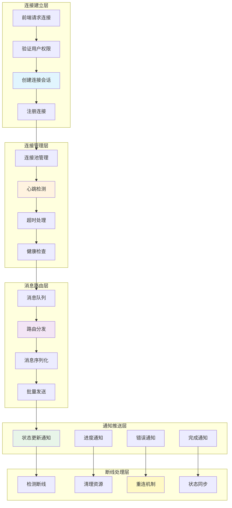

# 实时通知与WebSocket流程图

## 概述
展示ScholarFlow系统中WebSocket连接管理、实时通知推送、心跳检测和断线重连的完整机制。



## WebSocket连接管理

### 1. 连接建立序列
```mermaid
sequenceDiagram
    participant F as Frontend
    participant WS as WebSocket Server
    participant A as Auth Service
    participant C as Connection Manager
    participant DB as Database

    Note over F, DB: 1. 请求建立连接

    F->>WS: Connect /ws/{task_id}
    Note right: 携带Authorization token

    Note over WS, A: 2. 验证权限

    WS->>A: verify_token(token)
    A->>A: 验证JWT令牌
    A-->>WS: 返回用户信息

    alt 令牌无效
        WS-->>F: 1008 Policy Violation
        Note right: 连接拒绝
    else 令牌有效
        Note over WS, C: 3. 创建连接会话

        WS->>C: register_connection(task_id, user_id, ws)
        C->>C: 创建连接对象
        Note right: {task_id, user_id, ws, heartbeat}
        C->>C: 添加到连接池
        C-->>WS: 连接已注册

        Note over WS, F: 4. 发送连接确认

        WS-->>F: 101 Switching Protocols
        Note right: {
        Note right:   "type": "connection_established",
        Note right:   "task_id": "task_123",
        Note right:   "timestamp": "..."
        Note right: }

        Note over F, WS: 5. 开始心跳

        F->>WS: {"type": "ping", "timestamp": "..."}
        WS->>F: {"type": "pong", "timestamp": "..."}
        Note right: 心跳检测
    end
```

### 2. 消息推送序列
```mermaid
sequenceDiagram
    participant W as Workflow
    participant N as Notification Service
    participant C as Connection Manager
    participant F as Frontend
    participant M as Message Queue

    Note over W, M: 1. 工作流状态变更

    W->>W: 执行节点完成
    W->>N: notify_state_change(task_id, new_state)

    Note over N, M: 2. 消息入队

    N->>M: enqueue(message)
    Note right: {task_id, type, data}
    M-->>N: ✓

    Note over M, C: 3. 消息分发

    M->>C: dispatch_message(message)
    C->>C: 查找目标连接
    Note right: 根据task_id查找

    alt 找到连接
        C->>C: 序列化消息
        Note right: JSON序列化
        C->>F: 发送消息
        Note right: {"type": "status_update", "data": {...}}
        F->>F: 处理消息
        Note right: 更新UI状态
    else 连接不存在
        C->>M: 消息进入待发队列
        Note right: 等待重连
    end
```

### 3. 断线重连序列
```mermaid
sequenceDiagram
    participant F as Frontend
    participant WS as WebSocket Server
    participant C as Connection Manager
    participant M as Message Queue

    Note over F, M: 网络中断

    WS->>WS: 检测到连接断开
    WS->>C: unregister_connection(ws)
    C->>C: 从连接池移除
    C->>C: 标记连接为断开

    Note over F, M: 客户端检测

    F->>F: 检测到连接断开
    Note right: onclose事件

    Note over F, WS: 尝试重连

    F->>WS: Connect /ws/{task_id}
    WS->>C: register_connection(...)
    C-->>WS: 连接已注册

    Note over C, M: 同步待发消息

    C->>M: get_pending_messages(task_id)
    M-->>C: 返回待发消息
    C->>F: 批量发送待发消息
    Note right: {type: "batch_update", messages: [...]}

    Note over F, M: 状态同步

    F->>C: request_state_sync(task_id)
    C->>M: get_latest_state(task_id)
    M-->>C: 返回最新状态
    C->>F: 发送完整状态
    Note right: {type: "state_sync", state: {...}}
```

## WebSocket服务器实现

### 连接管理器
```python
# app/api/websocket/connection_manager.py
from typing import Dict, Set, Optional
from fastapi import WebSocket, WebSocketDisconnect
import json
import asyncio
from datetime import datetime

class ConnectionManager:
    """WebSocket连接管理器"""

    def __init__(self):
        # task_id -> Set[WebSocket]
        self.active_connections: Dict[str, Set[WebSocket]] = {}
        # WebSocket -> metadata
        self.connection_metadata: Dict[WebSocket, dict] = {}
        # 待发消息队列
        self.pending_messages: Dict[str, list] = {}

    async def connect(
        self,
        websocket: WebSocket,
        task_id: str,
        user_id: str
    ) -> bool:
        """建立连接"""

        await websocket.accept()

        # 创建连接元数据
        metadata = {
            "task_id": task_id,
            "user_id": user_id,
            "connected_at": datetime.now().isoformat(),
            "last_heartbeat": datetime.now(),
            "message_count": 0,
        }

        # 添加到连接池
        if task_id not in self.active_connections:
            self.active_connections[task_id] = set()

        self.active_connections[task_id].add(websocket)
        self.connection_metadata[websocket] = metadata

        # 发送连接确认
        await self.send_personal_message(
            websocket,
            {
                "type": "connection_established",
                "task_id": task_id,
                "timestamp": datetime.now().isoformat(),
            }
        )

        logger.info(f"WebSocket connected: task_id={task_id}, user_id={user_id}")
        return True

    def disconnect(self, websocket: WebSocket):
        """断开连接"""

        metadata = self.connection_metadata.get(websocket)
        if not metadata:
            return

        task_id = metadata["task_id"]

        # 从连接池移除
        if task_id in self.active_connections:
            self.active_connections[task_id].discard(websocket)

            # 如果没有连接了，清理
            if not self.active_connections[task_id]:
                del self.active_connections[task_id]

        # 清理元数据
        del self.connection_metadata[websocket]

        logger.info(f"WebSocket disconnected: task_id={task_id}")

    async def send_personal_message(
        self,
        websocket: WebSocket,
        message: dict
    ):
        """发送个人消息"""

        try:
            await websocket.send_text(json.dumps(message, ensure_ascii=False))

            # 更新消息计数
            if websocket in self.connection_metadata:
                self.connection_metadata[websocket]["message_count"] += 1

        except WebSocketDisconnect:
            # 连接已断开，自动清理
            self.disconnect(websocket)
        except Exception as e:
            logger.error(f"Failed to send message: {e}", exc_info=True)
            self.disconnect(websocket)

    async def broadcast_to_task(
        self,
        task_id: str,
        message: dict
    ):
        """广播消息到任务的所有连接"""

        if task_id not in self.active_connections:
            # 没有活跃连接，加入待发队列
            if task_id not in self.pending_messages:
                self.pending_messages[task_id] = []
            self.pending_messages[task_id].append(message)
            return

        # 发送给所有连接
        disconnected = set()
        for connection in self.active_connections[task_id]:
            try:
                await connection.send_text(json.dumps(message, ensure_ascii=False))

                # 更新消息计数
                self.connection_metadata[connection]["message_count"] += 1

            except WebSocketDisconnect:
                disconnected.add(connection)
            except Exception as e:
                logger.error(f"Failed to broadcast to connection: {e}")
                disconnected.add(connection)

        # 清理断开的连接
        for connection in disconnected:
            self.disconnect(connection)

    async def get_pending_messages(self, task_id: str) -> list:
        """获取待发消息"""

        messages = self.pending_messages.get(task_id, [])
        if messages:
            del self.pending_messages[task_id]

        return messages

    async def cleanup_stale_connections(self, timeout_seconds: int = 300):
        """清理超时的连接"""

        now = datetime.now()
        stale_connections = []

        for websocket, metadata in self.connection_metadata.items():
            last_heartbeat = datetime.fromisoformat(metadata["last_heartbeat"])
            if (now - last_heartbeat).total_seconds() > timeout_seconds:
                stale_connections.append(websocket)

        for websocket in stale_connections:
            self.disconnect(websocket)

        if stale_connections:
            logger.info(f"Cleaned up {len(stale_connections)} stale connections")

    def get_connection_stats(self) -> dict:
        """获取连接统计"""

        total_connections = sum(len(conns) for conns in self.active_connections.values())
        total_tasks = len(self.active_connections)
        total_pending = sum(len(msgs) for msgs in self.pending_messages.values())

        return {
            "total_connections": total_connections,
            "active_tasks": total_tasks,
            "pending_messages": total_pending,
            "connection_distribution": {
                task_id: len(connections)
                for task_id, connections in self.active_connections.items()
            },
        }

# 全局连接管理器
manager = ConnectionManager()
```

### WebSocket端点
```python
# app/api/websocket/endpoint.py
from fastapi import APIRouter, WebSocket, WebSocketDisconnect, Depends
from app.auth.jwt import JWTHandler
from app.auth.rbac import require_permission, Permission

router = APIRouter()

@router.websocket("/ws/{task_id}")
async def websocket_endpoint(
    websocket: WebSocket,
    task_id: str,
    token: str = None
):
    """WebSocket端点"""

    try:
        # 1. 验证令牌
        if not token:
            await websocket.close(code=1008, reason="Missing token")
            return

        payload = JWTHandler.verify_token(token)
        if not payload:
            await websocket.close(code=1008, reason="Invalid token")
            return

        user_id = payload["sub"]

        # 2. 验证权限（任务访问）
        has_permission = await check_task_access_permission(user_id, task_id)
        if not has_permission:
            await websocket.close(code=1008, reason="Access denied")
            return

        # 3. 建立连接
        await manager.connect(websocket, task_id, user_id)

        # 4. 处理消息循环
        while True:
            try:
                # 接收消息
                data = await websocket.receive_text()
                message = json.loads(data)

                # 处理心跳
                if message.get("type") == "ping":
                    await manager.send_personal_message(
                        websocket,
                        {
                            "type": "pong",
                            "timestamp": datetime.now().isoformat(),
                        }
                    )

                    # 更新心跳时间
                    if websocket in manager.connection_metadata:
                        manager.connection_metadata[websocket]["last_heartbeat"] = (
                            datetime.now()
                        )

                # 处理其他消息类型
                elif message.get("type") == "subscribe":
                    # 订阅特定事件
                    await handle_subscription(websocket, task_id, message)

                elif message.get("type") == "unsubscribe":
                    # 取消订阅
                    await handle_unsubscription(websocket, task_id, message)

            except WebSocketDisconnect:
                break
            except json.JSONDecodeError:
                await manager.send_personal_message(
                    websocket,
                    {"type": "error", "message": "Invalid JSON"}
                )
            except Exception as e:
                logger.error(f"WebSocket message error: {e}", exc_info=True)
                await manager.send_personal_message(
                    websocket,
                    {"type": "error", "message": "Internal error"}
                )

    except WebSocketDisconnect:
        pass
    finally:
        # 清理连接
        manager.disconnect(websocket)

async def handle_subscription(websocket: WebSocket, task_id: str, message: dict):
    """处理订阅请求"""

    event_type = message.get("event_type")
    # 记录订阅信息
    # ...

    await manager.send_personal_message(
        websocket,
        {
            "type": "subscribed",
            "event_type": event_type,
            "timestamp": datetime.now().isoformat(),
        }
    )
```

## 消息推送服务

### 通知服务实现
```python
# app/services/notifications/notification_service.py
from typing import Dict, Any, Optional
from datetime import datetime
import asyncio

class NotificationService:
    """通知服务"""

    def __init__(self, connection_manager: ConnectionManager):
        self.manager = connection_manager
        self.message_queue = asyncio.Queue()

    async def notify_status_update(
        self,
        task_id: str,
        status: str,
        progress: float,
        current_step: str
    ):
        """通知状态更新"""

        message = {
            "type": "status_update",
            "task_id": task_id,
            "data": {
                "status": status,
                "progress": progress,
                "current_step": current_step,
            },
            "timestamp": datetime.now().isoformat(),
        }

        await self.manager.broadcast_to_task(task_id, message)

    async def notify_progress(
        self,
        task_id: str,
        progress: float,
        message: Optional[str] = None
    ):
        """通知进度更新"""

        message = {
            "type": "progress_update",
            "task_id": task_id,
            "data": {
                "progress": progress,
                "message": message,
            },
            "timestamp": datetime.now().isoformat(),
        }

        await self.manager.broadcast_to_task(task_id, message)

    async def notify_error(
        self,
        task_id: str,
        error_code: str,
        error_message: str,
        can_retry: bool = False
    ):
        """通知错误"""

        message = {
            "type": "error",
            "task_id": task_id,
            "data": {
                "error_code": error_code,
                "error_message": error_message,
                "can_retry": can_retry,
            },
            "timestamp": datetime.now().isoformat(),
        }

        await self.manager.broadcast_to_task(task_id, message)

    async def notify_completion(
        self,
        task_id: str,
        result: Dict[str, Any]
    ):
        """通知任务完成"""

        message = {
            "type": "task_completed",
            "task_id": task_id,
            "data": {
                "result": result,
                "completed_at": datetime.now().isoformat(),
            },
        }

        await self.manager.broadcast_to_task(task_id, message)

    async def notify_review_required(
        self,
        task_id: str,
        review_point: Dict[str, Any]
    ):
        """通知需要审核"""

        message = {
            "type": "review_required",
            "task_id": task_id,
            "data": {
                "review_point": review_point,
            },
            "timestamp": datetime.now().isoformat(),
        }

        await self.manager.broadcast_to_task(task_id, message)

    async def notify_batch_progress(
        self,
        batch_id: str,
        completed_tasks: int,
        total_tasks: int,
        failed_tasks: int = 0
    ):
        """通知批次进度"""

        progress = (completed_tasks + failed_tasks) / total_tasks * 100

        message = {
            "type": "batch_progress",
            "batch_id": batch_id,
            "data": {
                "completed_tasks": completed_tasks,
                "total_tasks": total_tasks,
                "failed_tasks": failed_tasks,
                "progress": progress,
            },
            "timestamp": datetime.now().isoformat(),
        }

        # 广播给批次的所有任务
        batch_tasks = await get_batch_tasks(batch_id)
        for task in batch_tasks:
            await self.manager.broadcast_to_task(task["task_id"], message)

    async def notify_user(
        self,
        user_id: str,
        message: Dict[str, Any]
    ):
        """通知用户（所有活跃连接）"""

        # 获取用户的所有活跃任务
        user_tasks = await get_user_active_tasks(user_id)

        # 发送到所有任务连接
        for task_id in user_tasks:
            await self.manager.broadcast_to_task(task_id, message)

# 全局通知服务
notification_service = NotificationService(manager)
```

### 工作流集成
```python
# app/graph/workflow_hooks.py
from app.services.notifications.notification_service import notification_service

class WorkflowNotificationHook:
    """工作流通知钩子"""

    @staticmethod
    async def on_node_start(task_id: str, node_name: str):
        """节点开始执行时通知"""

        await notification_service.notify_status_update(
            task_id=task_id,
            status="running",
            progress=0,
            current_step=f"正在执行: {node_name}"
        )

    @staticmethod
    async def on_node_complete(task_id: str, node_name: str, progress: float):
        """节点完成时通知"""

        await notification_service.notify_status_update(
            task_id=task_id,
            status="running",
            progress=progress,
            current_step=f"已完成: {node_name}"
        )

    @staticmethod
    async def on_error(task_id: str, error: Exception, node_name: str):
        """发生错误时通知"""

        await notification_service.notify_error(
            task_id=task_id,
            error_code=type(error).__name__,
            error_message=str(error),
            can_retry=True
staticmethod
    async def on_complete        )

    @(task_id: str, result: dict):
        """任务完成时通知"""

        await notification_service.notify_completion(task_id, result)

# 在工作流节点中使用
def node_stage1_process(state: WorkflowState) -> WorkflowState:
    """Stage1处理节点"""

    task_id = state["task_id"]

    try:
        # 通知开始
        WorkflowNotificationHook.on_node_start(task_id, "stage1_process")

        # 执行处理逻辑
        result = process_stage1(state)

        # 通知进度
        WorkflowNotificationHook.on_node_complete(
            task_id, "stage1_process", 45.0
        )

        return result

    except Exception as e:
        # 通知错误
        WorkflowNotificationHook.on_error(task_id, e, "stage1_process")
        raise
```

## 心跳检测机制

### 心跳实现
```python
# app/api/websocket/heartbeat.py
import asyncio
from datetime import datetime, timedelta
from typing import Set

class HeartbeatManager:
    """心跳管理器"""

    def __init__(self, connection_manager: ConnectionManager):
        self.manager = connection_manager
        self.heartbeat_interval = 30  # 30秒
        self.timeout = 90  # 90秒超时
        self.running = False

    async def start(self):
        """启动心跳检测"""

        self.running = True

        while self.running:
            try:
                await self.check_heartbeats()
                await asyncio.sleep(self.heartbeat_interval)
            except Exception as e:
                logger.error(f"Heartbeat check error: {e}", exc_info=True)

    async def stop(self):
        """停止心跳检测"""

        self.running = False

    async def check_heartbeats(self):
        """检查心跳"""

        now = datetime.now()
        stale_connections = []

        for websocket, metadata in self.manager.connection_metadata.items():
            last_heartbeat = metadata["last_heartbeat"]
            elapsed = (now - last_heartbeat).total_seconds()

            if elapsed > self.timeout:
                stale_connections.append(websocket)

        # 清理过期连接
        for websocket in stale_connections:
            self.manager.disconnect(websocket)
            logger.info(f"Removed stale connection (no heartbeat for {elapsed:.0f}s)")

        # 发送心跳到活跃连接
        await self.send_heartbeats()

    async def send_heartbeats(self):
        """发送心跳"""

        heartbeat_message = {
            "type": "heartbeat",
            "timestamp": datetime.now().isoformat(),
        }

        disconnected = set()

        for task_id, connections in self.manager.active_connections.items():
            for websocket in connections:
                try:
                    await websocket.send_text(
                        json.dumps(heartbeat_message, ensure_ascii=False)
                    )
                except Exception:
                    disconnected.add(websocket)

        # 清理断开的连接
        for websocket in disconnected:
            self.manager.disconnect(websocket)

# 心跳管理器实例
heartbeat_manager = HeartbeatManager(manager)

# 启动心跳检测
async def start_heartbeat_service():
    asyncio.create_task(heartbeat_manager.start())
```

## 前端WebSocket客户端

### 客户端封装
```typescript
// services/websocketClient.ts
type MessageHandler = (message: any) => void;

class WebSocketClient {
  private ws: WebSocket | null = null;
  private taskId: string;
  private token: string;
  private handlers: Map<string, MessageHandler[]> = new Map();
  private reconnectAttempts = 0;
  private maxReconnectAttempts = 5;
  private reconnectInterval = 1000;
  private heartbeatInterval: NodeJS.Timeout | null = null;
  private isConnecting = false;

  constructor(taskId: string, token: string) {
    this.taskId = taskId;
    this.token = token;
  }

  connect(): Promise<void> {
    return new Promise((resolve, reject) => {
      if (this.isConnecting || (this.ws && this.ws.readyState === WebSocket.OPEN)) {
        resolve();
        return;
      }

      this.isConnecting = true;

      const wsUrl = `${WS_BASE_URL}/ws/${this.taskId}?token=${this.token}`;
      this.ws = new WebSocket(wsUrl);

      this.ws.onopen = () => {
        console.log('WebSocket connected');
        this.isConnecting = false;
        this.reconnectAttempts = 0;
        this.startHeartbeat();
        resolve();
      };

      this.ws.onmessage = (event) => {
        try {
          const message = JSON.parse(event.data);
          this.handleMessage(message);
        } catch (error) {
          console.error('Failed to parse WebSocket message:', error);
        }
      };

      this.ws.onerror = (error) => {
        console.error('WebSocket error:', error);
        this.isConnecting = false;
        reject(error);
      };

      this.ws.onclose = () => {
        console.log('WebSocket closed');
        this.isConnecting = false;
        this.stopHeartbeat();
        this.attemptReconnect();
      };
    });
  }

  private handleMessage(message: any): void {
    const { type } = message;

    // 处理心跳响应
    if (type === 'heartbeat') {
      return;
    }

    // 调用注册的处理器
    const handlers = this.handlers.get(type) || [];
    handlers.forEach(handler => handler(message));
  }

  private startHeartbeat(): void {
    this.heartbeatInterval = setInterval(() => {
      this.send({
        type: 'ping',
        timestamp: new Date().toISOString(),
      });
    }, 30000); // 30秒发送一次心跳
  }

  private stopHeartbeat(): void {
    if (this.heartbeatInterval) {
      clearInterval(this.heartbeatInterval);
      this.heartbeatInterval = null;
    }
  }

  private attemptReconnect(): void {
    if (this.reconnectAttempts >= this.maxReconnectAttempts) {
      console.error('Max reconnection attempts reached');
      return;
    }

    this.reconnectAttempts++;

    const delay = this.reconnectInterval * Math.pow(2, this.reconnectAttempts - 1);
    console.log(`Attempting to reconnect in ${delay}ms (attempt ${this.reconnectAttempts})`);

    setTimeout(() => {
      this.connect().catch(error => {
        console.error('Reconnection failed:', error);
      });
    }, delay);
  }

  send(message: any): void {
    if (this.ws && this.ws.readyState === WebSocket.OPEN) {
      this.ws.send(JSON.stringify(message));
    } else {
      console.warn('WebSocket is not connected');
    }
  }

  on(type: string, handler: MessageHandler): void {
    if (!this.handlers.has(type)) {
      this.handlers.set(type, []);
    }
    this.handlers.get(type)!.push(handler);
  }

  off(type: string, handler: MessageHandler): void {
    const handlers = this.handlers.get(type);
    if (handlers) {
      const index = handlers.indexOf(handler);
      if (index > -1) {
        handlers.splice(index, 1);
      }
    }
  }

  disconnect(): void {
    this.stopHeartbeat();
    if (this.ws) {
      this.ws.close();
      this.ws = null;
    }
    this.handlers.clear();
  }
}

export default WebSocketClient;
```

### 使用示例
```typescript
// components/TaskStatus.tsx
import React, { useEffect, useState } from 'react';
import WebSocketClient from '../services/websocketClient';

export const TaskStatus: React.FC<{ taskId: string; token: string }> = ({
  taskId,
  token,
}) => {
  const [status, setStatus] = useState<string>('pending');
  const [progress, setProgress] = useState<number>(0);
  const [currentStep, setCurrentStep] = useState<string>('');
  const [wsClient, setWsClient] = useState<WebSocketClient | null>(null);

  useEffect(() => {
    // 创建WebSocket客户端
    const client = new WebSocketClient(taskId, token);

    // 注册消息处理器
    client.on('status_update', (message) => {
      setStatus(message.data.status);
      setProgress(message.data.progress);
      setCurrentStep(message.data.current_step);
    });

    client.on('progress_update', (message) => {
      setProgress(message.data.progress);
    });

    client.on('error', (message) => {
      console.error('Task error:', message.data);
      // 显示错误通知
    });

    client.on('task_completed', (message) => {
      setStatus('completed');
      setProgress(100);
      setCurrentStep('任务完成');
      // 显示下载按钮
    });

    client.on('review_required', (message) => {
      setStatus('human_review');
      setCurrentStep('需要人工审核');
      // 显示审核弹窗
    });

    // 建立连接
    client.connect()
      .then(() => {
        console.log('WebSocket connected');
        setWsClient(client);
      })
      .catch((error) => {
        console.error('Failed to connect WebSocket:', error);
      });

    // 清理
    return () => {
      client.disconnect();
    };
  }, [taskId, token]);

  return (
    <div className="task-status">
      <div className="status-info">
        <p>状态: {status}</p>
        <p>进度: {progress.toFixed(1)}%</p>
        <p>当前步骤: {currentStep}</p>
      </div>

      <div className="progress-bar">
        <div
          className="progress-fill"
          style={{ width: `${progress}%` }}
        />
      </div>
    </div>
  );
};
```

## 监控指标

| 指标 | 说明 | 计算方式 | 目标值 |
|------|------|----------|--------|
| WebSocket连接数 | 活跃连接总数 | 当前连接数 | < 1000 |
| 消息推送成功率 | 成功推送比例 | 成功推送/总推送 | > 99% |
| 平均消息延迟 | 消息推送延迟 | Σ推送延迟/推送次数 | < 100ms |
| 心跳丢失率 | 心跳超时比例 | 超时连接/总连接 | < 5% |
| 重连成功率 | 重连成功比例 | 成功重连/重连尝试 | > 80% |
| 并发连接峰值 | 同时连接峰值 | 峰值连接数 | < 500 |
| 待发消息队列长度 | 未推送消息数 | 队列长度 | < 100 |
