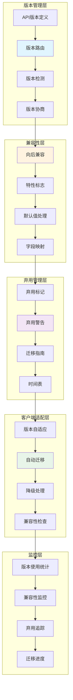

# API版本管理与兼容性流程图

## 概述
展示ScholarFlow系统中API版本管理、向后兼容性保证、弃用流程和客户端迁移策略的完整机制。



## API版本管理策略

### 1. 版本协商序列
```mermaid
sequenceDiagram
    participant C as Client
    participant A as API Gateway
    participant V as Version Router
    participant H as Version Handler
    participant DB as Database

    Note over C, DB: 1. 客户端发送请求

    C->>A: GET /api/v2/tasks/123
    Note right: Accept-Version: 2.0
    Note right: API-Version: 2.0

    Note over A, V: 2. 版本检测

    A->>V: detect_version(request)
    V->>V: 检查URL版本 (v2)
    V->>V: 检查Header版本 (Accept-Version)
    V->>V: 检查默认版本

    alt 版本存在
        V->>H: route_to_version(2.0)
        H->>DB: SELECT task WHERE id=123
        DB-->>H: 返回任务数据

        Note over H, C: 3. 版本适配

        H->>H: adapt_response(data, version=2.0)
        Note right: 转换响应格式
        H-->>A: 返回适配后数据
        A-->>C: 200 OK + v2格式
    else 版本不存在
        H-->>A: 406 Not Acceptable
        A-->>C: {error: "UNSUPPORTED_VERSION"}
    end
```

### 2. 多版本共存序列
```mermaid
sequenceDiagram
    participant V1 as v1客户端
    participant V2 as v2客户端
    participant A as API Server
    participant H as Handler

    Note over V1, H: v1客户端请求

    V1->>A: GET /api/v1/tasks/123
    Note right: {
    Note right:   "id": 123,
    Note right:   "status": "pending"
    Note right: }

    Note over V2, H: v2客户端请求

    V2->>A: GET /api/v2/tasks/123
    Note right: {
    Note right:   "task_id": "123",
    Note right:   "status": "pending",
    Note right:   "progress_percentage": 0,
    Note right:   "created_at": "2024-01-01T00:00:00Z"
    Note right: }

    Note over A, H: 并行处理

    A->>H: handle_v1_request()
    H->>H: format_v1_response()
    H-->>V1: v1格式响应

    A->>H: handle_v2_request()
    H->>H: format_v2_response()
    H-->>V2: v2格式响应
```

## 版本管理实现

### 版本路由器
```python
# app/api/versioning/version_router.py
from typing import Dict, Callable, Optional, Tuple
from fastapi import Request, Response
from functools import wraps
import re

class VersionManager:
    """版本管理器"""

    # 版本定义
    VERSIONS = {
        "1.0": {
            "released": "2024-01-01",
            "deprecated": None,
            "end_of_life": None,
        },
        "1.1": {
            "released": "2024-06-01",
            "deprecated": "2024-12-01",
            "end_of_life": "2025-06-01",
        },
        "2.0": {
            "released": "2024-12-01",
            "deprecated": None,
            "end_of_life": None,
        },
    }

    # 默认版本
    DEFAULT_VERSION = "1.0"

    # 支持的最高版本
    LATEST_VERSION = "2.0"

    @classmethod
    def extract_version_from_url(cls, url: str) -> Optional[str]:
        """从URL中提取版本"""

        match = re.match(r'/api/v(\d+(?:\.\d+)?)/', url)
        if match:
            return match.group(1)

        return None

    @classmethod
    def extract_version_from_header(cls, request: Request) -> Optional[str]:
        """从请求头中提取版本"""

        # Accept-Version: 2.0
        accept_version = request.headers.get("Accept-Version")
        if accept_version:
            return accept_version

        # API-Version: 2.0
        api_version = request.headers.get("API-Version")
        if api_version:
            return api_version

        return None

    @classmethod
    def get_requested_version(cls, request: Request) -> str:
        """获取请求的版本"""

        # 优先级: URL > Header > 默认
        url_version = cls.extract_version_from_url(request.url.path)
        if url_version and url_version in cls.VERSIONS:
            return url_version

        header_version = cls.extract_version_from_header(request)
        if header_version and header_version in cls.VERSIONS:
            return header_version

        # 返回默认版本
        return cls.DEFAULT_VERSION

    @classmethod
    def is_version_supported(cls, version: str) -> bool:
        """检查版本是否支持"""

        return version in cls.VERSIONS

    @classmethod
    def is_version_deprecated(cls, version: str) -> bool:
        """检查版本是否已弃用"""

        version_info = cls.VERSIONS.get(version)
        if not version_info:
            return False

        deprecated_date = version_info.get("deprecated")
        if not deprecated_date:
            return False

        from datetime import datetime
        return datetime.now() >= datetime.fromisoformat(deprecated_date)

    @classmethod
    def get_version_compatibility(cls, version: str) -> Dict[str, any]:
        """获取版本兼容性信息"""

        return {
            "version": version,
            "supported": cls.is_version_supported(version),
            "deprecated":precated(version),
            cls.is_version_de "latest": version == cls.LATEST_VERSION,
            "info": cls.VERSIONS.get(version, {}),
        }

# 版本装饰器
def api_version(required_version: str):
    """API版本装饰器"""

    def decorator(func: Callable):
        @wraps(func)
        async def wrapper(request: Request, *args, **kwargs):
            requested_version = VersionManager.get_requested_version(request)

            # 检查版本支持
            if not VersionManager.is_version_supported(requested_version):
                raise HTTPException(
                    status_code=400,
                    detail=f"Unsupported API version: {requested_version}",
                    headers={
                        "X-API-Version": requested_version,
                        "X-Supported-Versions": ",".join(VersionManager.VERSIONS.keys()),
                    }
                )

            # 添加弃用警告头
            headers = {}
            if VersionManager.is_version_deprecated(requested_version):
                headers["Warning"] = f'299 - "API version {requested_version} is deprecated"'

            headers["X-API-Version"] = requested_version

            # 执行函数
            response = await func(request, *args, **kwargs)

            # 添加版本头
            if isinstance(response, Response):
                for key, value in headers.items():
                    response.headers[key] = value

            return response

        return wrapper
    return decorator
```

### 版本路由配置
```python
# app/api/versioning/router_config.py
from fastapi import APIRouter
from typing import Dict, Callable

# 版本化路由器
routers_v1 = APIRouter(prefix="/api/v1")
routers_v2 = APIRouter(prefix="/api/v2")

# 版本特定的处理函数映射
version_handlers: Dict[str, Dict[str, Callable]] = {
    "1.0": {},
    "1.1": {},
    "2.0": {},
}

def register_versioned_endpoint(
    version: str,
    path: str,
    handler: Callable,
    methods: list = ["GET"]
):
    """注册版本化端点"""

    if version not in version_handlers:
        raise ValueError(f"Unsupported version: {version}")

    version_handlers[version][f"{':'.join(methods)} {path}"] = handler

    # 根据版本添加到路由器
    if version == "1.0" or version == "1.1":
        for method in methods:
            router = getattr(routers_v1, method.lower())
            router(path)(handler)
    elif version == "2.0":
        for method in methods:
            router = getattr(routers_v2, method.lower())
            router(path)(handler)

# 使用示例
@register_versioned_endpoint("1.0", "/tasks", get_tasks_v1, ["GET"])
@register_versioned_endpoint("2.0", "/tasks", get_tasks_v2, ["GET"])

async def get_tasks_v1(request: Request):
    """v1.0获取任务列表"""

    # v1.0实现
    tasks = await get_tasks_from_db()
    return {
        "tasks": tasks,
        "version": "1.0",
    }

async def get_tasks_v2(request: Request):
    """v2.0获取任务列表"""

    # v2.0实现（更丰富的响应）
    tasks = await get_tasks_from_db()
    return {
        "data": tasks,
        "meta": {
            "version": "2.0",
            "total": len(tasks),
            "timestamp": datetime.now().isoformat(),
        },
    }
```

## 兼容性处理

### 响应格式适配器
```python
# app/api/versioning/response_adapter.py
from typing import Any, Dict
from datetime import datetime

class ResponseAdapter:
    """响应适配器"""

    @staticmethod
    def adapt_task_response(data: Dict[str, Any], version: str) -> Dict[str, Any]:
        """适配任务响应"""

        if version.startswith("1."):
            # v1.x格式
            return {
                "id": data["task_id"],
                "status": data["status"],
                # v1.x的字段映射
            }
        elif version.startswith("2."):
            # v2.x格式
            return {
                "task_id": data["task_id"],
                "status": data["status"],
                "progress_percentage": data.get("progress_percentage", 0),
                "created_at": data.get("created_at"),
                "updated_at": data.get("updated_at"),
                "metadata": {
                    "version": version,
                    "generated_at": datetime.now().isoformat(),
                },
            }

        return data

    @staticmethod
    def adapt_error_response(error: Exception, version: str) -> Dict[str, Any]:
        """适配错误响应"""

        base_error = {
            "error": True,
            "message": str(error),
            "timestamp": datetime.now().isoformat(),
        }

        if version.startswith("1."):
            # v1.x错误格式
            return {
                **base_error,
                "error_code": type(error).__name__,
            }
        elif version.startswith("2."):
            # v2.x错误格式
            return {
                **base_error,
                "error": {
                    "code": type(error).__name__,
                    "message": str(error),
                    "type": "validation_error" if isinstance(error, ValueError) else "server_error",
                },
                "request_id": get_request_id(),
            }

        return base_error

    @staticmethod
    def adapt_list_response(data: list, version: str, total: int) -> Dict[str, Any]:
        """适配列表响应"""

        if version.startswith("1."):
            # v1.x格式
            return {
                "items": data,
                "count": len(data),
            }
        elif version.startswith("2."):
            # v2.x格式
            return {
                "data": data,
                "meta": {
                    "total": total,
                    "count": len(data),
                    "version": version,
                },
            }

        return {"items": data}
```

### 请求参数适配器
```python
# app/api/versioning/request_adapter.py
from typing import Any, Dict
from fastapi import Request

class RequestAdapter:
    """请求适配器"""

    @staticmethod
    def adapt_task_create_request(data: Dict[str, Any], version: str) -> Dict[str, Any]:
        """适配任务创建请求"""

        adapted = data.copy()

        if version.startswith("1."):
            # v1.x参数格式
            if "pdf_path" in data:
                adapted["file_path"] = data["pdf_path"]
                del adapted["pdf_path"]

            # 添加默认值
            adapted.setdefault("max_chars", 6000)
            adapted.setdefault("target_chunks", 6)

        elif version.startswith("2."):
            # v2.x参数格式
            if "file_path" in data:
                adapted["pdf_path"] = data["file_path"]
                del adapted["file_path"]

            # v2.x新字段
            adapted.setdefault("enable_review", True)
            adapted.setdefault("priority", "normal")

        return adapted

    @staticmethod
    def validate_versioned_request(data: Dict[str, Any], version: str) -> bool:
        """验证版本特定请求"""

        if version.startswith("1."):
            # v1.x验证规则
            required_fields = ["pdf_path", "presentation_style"]
            for field in required_fields:
                if field not in data:
                    raise ValueError(f"Missing required field: {field}")

        elif version.startswith("2."):
            # v2.x验证规则
            # 更严格的验证
            pass

        return True
```

## 弃用管理

### 弃用标记系统
```python
# app/api/deprecation/deprecation_manager.py
from datetime import datetime, timedelta
from typing import Optional, Dict, Any
import warnings

class DeprecationManager:
    """弃用管理器"""

    @staticmethod
    def mark_endpoint_as_deprecated(
        endpoint: str,
        version: str,
        deprecated_date: datetime,
        end_of_life_date: datetime,
        migration_guide: str
    ):
        """标记端点为弃用"""

        # 记录到弃用注册表
        register_deprecation(
            endpoint=endpoint,
            version=version,
            deprecated_date=deprecated_date,
            end_of_life_date=end_of_life_date,
            migration_guide=migration_guide,
        )

    @staticmethod
    def check_deprecation_status(version: str) -> Dict[str, Any]:
        """检查弃用状态"""

        now = datetime.now()

        deprecation_info = get_deprecation_info(version)

        if not deprecation_info:
            return {
                "deprecated": False,
                "end_of_life": False,
            }

        deprecated = now >= deprecation_info["deprecated_date"]
        end_of_life = now >= deprecation_info["end_of_life_date"]

        return {
            "deprecated": deprecated,
            "end_of_life": end_of_life,
            "deprecated_date": deprecation_info["deprecated_date"].isoformat(),
            "end_of_life_date": deprecation_info["end_of_life_date"].isoformat(),
            "days_remaining": (
                deprecation_info["end_of_life_date"] - now
            ).days,
            "migration_guide": deprecation_info["migration_guide"],
        }

    @staticmethod
    def send_deprecation_warning(request: Request, version: str):
        """发送弃用警告"""

        if VersionManager.is_version_deprecated(version):
            # 记录弃用警告日志
            logger.warning(
                f"Using deprecated API version {version}",
                extra={
                    "version": version,
                    "endpoint": request.url.path,
                    "client_ip": request.client.host,
                    "user_agent": request.headers.get("user-agent"),
                }
            )

            # 发送弃用响应头
            deprecation_info = get_deprecation_info(version)
            if deprecation_info:
                days_remaining = (
                    deprecation_info["end_of_life_date"] - datetime.now()
                ).days

                warnings.warn(
                    f"API version {version} is deprecated. "
                    f"End of life in {days_remaining} days. "
                    f"See: {deprecation_info['migration_guide']}",
                    DeprecationWarning,
                    stacklevel=3
                )

# 弃用装饰器
def deprecated(
    version: str,
    end_of_life: str,
    migration_guide: str
):
    """弃用装饰器"""

    def decorator(func: Callable):
        @wraps(func)
        async def wrapper(request: Request, *args, **kwargs):
            # 检查弃用状态
            status = DeprecationManager.check_deprecation_status(version)

            # 添加弃用响应头
            headers = {
                "X-API-Deprecated": "true",
                "X-API-Deprecated-Version": version,
                "X-API-End-Of-Life": status["end_of_life_date"],
                "Link": f'<{migration_guide}>; rel="deprecation"',
            }

            if status["deprecated"]:
                logger.warning(
                    f"Calling deprecated endpoint {request.url.path}",
                    extra={"version": version}
                )

            # 执行函数
            response = await func(request, *args, **kwargs)

            # 添加响应头
            if isinstance(response, Response):
                for key, value in headers.items():
                    response.headers[key] = value

            return response

        return wrapper
    return decorator

# 使用示例
@router.get("/api/v1/tasks")
@deprecated(
    version="1.0",
    end_of_life="2025-06-01",
    migration_guide="https://docs.example.com/migration/v2"
)
async def get_tasks_v1(request: Request):
    """获取任务列表 (已弃用)"""
    # 实现
    pass
```

### 迁移助手
```python
# app/api/migration/migration_assistant.py
from typing import Dict, Any, List
from datetime import datetime

class MigrationAssistant:
    """迁移助手"""

    @staticmethod
    def generate_migration_guide(from_version: str, to_version: str) -> Dict[str, Any]:
        """生成迁移指南"""

        migration_guides = {
            ("1.0", "2.0"): {
                "breaking_changes": [
                    {
                        "endpoint": "/api/tasks",
                        "change": "Response format changed",
                        "old_format": {
                            "id": "123",
                            "status": "pending"
                        },
                        "new_format": {
                            "task_id": "123",
                            "status": "pending",
                            "progress_percentage": 0
                        },
                    },
                    {
                        "endpoint": "/api/tasks",
                        "change": "Parameter rename",
                        "old_param": "pdf_path",
                        "new_param": "file_path",
                    },
                ],
                "new_features": [
                    {
                        "feature": "Batch processing",
                        "endpoint": "/api/batch",
                        "description": "Create and manage batch tasks",
                    },
                    {
                        "feature": "Real-time notifications",
                        "endpoint": "/ws/{task_id}",
                        "description": "WebSocket for real-time updates",
                    },
                ],
                "migration_steps": [
                    "1. Update API endpoint URLs to use /api/v2/",
                    "2. Update response field names (id -> task_id)",
                    "3. Add new optional parameters (enable_review, priority)",
                    "4. Implement WebSocket for real-time updates",
                    "5. Test with new response format",
                ],
            },
        }

        return migration_guides.get((from_version, to_version), {})

    @staticmethod
    def check_client_compatibility(
        user_agent: str,
        requested_version: str
    ) -> Dict[str, Any]:
        """检查客户端兼容性"""

        # 分析用户代理
        client_info = parse_user_agent(user_agent)

        # 根据客户端类型给出建议
        recommendations = []

        if client_info.get("name") == "ScholarFlow-Client":
            client_version = client_info.get("version")

            if requested_version == "1.0" and client_version >= "2.0":
                recommendations.append({
                    "type": "version_upgrade",
                    "message": "Your client supports v2.0, consider upgrading",
                    "action": "Update API calls to use /api/v2/",
                })

        return {
            "client_info": client_info,
            "requested_version": requested_version,
            "recommendations": recommendations,
        }

    @staticmethod
    def track_migration_progress(user_id: str, from_version: str, to_version: str):
        """跟踪迁移进度"""

        # 记录迁移开始
        log_migration_event(
            user_id=user_id,
            event="migration_started",
            from_version=from_version,
            to_version=to_version,
            timestamp=datetime.now().isoformat(),
        )

    @staticmethod
    def get_migration_stats() -> Dict[str, Any]:
        """获取迁移统计"""

        return {
            "total_users": count_total_users(),
            "users_by_version": get_users_by_api_version(),
            "migration_progress": calculate_migration_progress(),
            "deprecated_version_usage": get_deprecated_version_usage(),
        }
```

## 客户端版本适配

### 自动版本检测
```typescript
// utils/apiVersion.ts
class APIVersionManager {
  private supportedVersions = ['1.0', '1.1', '2.0'];
  private preferredVersion = '2.0';

  detectClientVersion(): string {
    // 方案1: 从用户代理检测
    const userAgent = navigator.userAgent;
    const clientVersion = this.parseUserAgent(userAgent);

    if (clientVersion && this.supportedVersions.includes(clientVersion)) {
      return clientVersion;
    }

    // 方案2: 从本地存储获取
    const savedVersion = localStorage.getItem('api_version');
    if (savedVersion && this.supportedVersions.includes(savedVersion)) {
      return savedVersion;
    }

    // 方案3: 使用首选版本
    return this.preferredVersion;
  }

  selectAPIVersion(): string {
    const detectedVersion = this.detectClientVersion();

    // 保存选择的版本
    localStorage.setItem('api_version', detectedVersion);

    return detectedVersion;
  }

  async checkVersionCompatibility(version: string): Promise<{
    compatible: boolean;
    warnings: string[];
    recommendations: string[];
  }> {
    const warnings: string[] = [];
    const recommendations: string[] = [];

    // 检查版本是否支持
    if (!this.supportedVersions.includes(version)) {
      warnings.push(`API version ${version} is not supported`);
      return { compatible: false, warnings, recommendations };
    }

    // 检查是否已弃用
    const deprecationStatus = await this.checkDeprecationStatus(version);
    if (deprecationStatus.deprecated) {
      warnings.push(
        `API version ${version} is deprecated. End of life: ${deprecationStatus.end_of_life_date}`
      );
      recommendations.push(
        `Please migrate to version ${deprecationStatus.latest_version}`
      );
    }

    return {
      compatible: true,
      warnings,
      recommendations,
    };
  }

  private parseUserAgent(userAgent: string): string | null {
    // 解析用户代理中的版本信息
    const match = userAgent.match(/ScholarFlow\/(\d+\.\d+)/);
    return match ? match[1] : null;
  }
}

export const versionManager = new APIVersionManager();
```

### 版本自适应客户端
```typescript
// services/versionedApiClient.ts
class VersionedAPIClient {
  private baseURL: string;
  private version: string;

  constructor() {
    this.baseURL = import.meta.env.VITE_API_BASE_URL;
    this.version = versionManager.selectAPIVersion();
  }

  private getAPIUrl(endpoint: string): string {
    return `${this.baseURL}/api/v${this.version}/${endpoint}`;
  }

  async request<T>(
    endpoint: string,
    options: RequestInit = {}
  ): Promise<T> {
    const url = this.getAPIUrl(endpoint);

    const response = await fetch(url, {
      ...options,
      headers: {
        ...options.headers,
        'Accept-Version': this.version,
        'Content-Type': 'application/json',
      },
    });

    // 检查版本兼容性
    const apiVersion = response.headers.get('X-API-Version');
    if (apiVersion && apiVersion !== this.version) {
      console.warn(`API version mismatch: expected ${this.version}, got ${apiVersion}`);
    }

    // 检查弃用警告
    const deprecated = response.headers.get('X-API-Deprecated');
    if (deprecated === 'true') {
      console.warn(
        `Using deprecated API version ${this.version}. ` +
        `Please upgrade to the latest version.`
      );
    }

    if (!response.ok) {
      throw new APIError(response.status, await response.text());
    }

    return response.json();
  }

  // 版本特定的适配
  adaptResponse<T>(data: any, endpoint: string): T {
    if (this.version.startsWith('1.')) {
      return this.adaptV1Response<T>(data, endpoint);
    } else if (this.version.startsWith('2.')) {
      return this.adaptV2Response<T>(data, endpoint);
    }

    return data;
  }

  private adaptV1Response<T>(data: any, endpoint: string): T {
    // v1.x响应适配
    if (endpoint === 'tasks') {
      return {
        items: data.tasks,
        count: data.count,
      } as T;
    }

    return data;
  }

  private adaptV2Response<T>(data: any, endpoint: string): T {
    // v2.x响应适配
    if (endpoint === 'tasks') {
      return {
        data: data.data,
        meta: data.meta,
      } as T;
    }

    return data;
  }
}

// 使用示例
const apiClient = new VersionedAPIClient();

async function fetchTasks() {
  const data = await apiClient.request('tasks');
  const adaptedData = apiClient.adaptResponse(data, 'tasks');
  return adaptedData;
}
```

## 监控与分析

### 版本使用统计
```python
# app/analytics/version_analytics.py
from collections import defaultdict, Counter
from datetime import datetime, timedelta

class VersionAnalytics:
    """版本分析"""

    @staticmethod
    def track_api_request(version: str, endpoint: str, user_id: str):
        """跟踪API请求"""

        log_entry = {
            "timestamp": datetime.now().isoformat(),
            "version": version,
            "endpoint": endpoint,
            "user_id": user_id,
        }

        save_api_request_log(log_entry)

    @staticmethod
    def get_version_usage_stats(
        start_date: datetime,
        end_date: datetime
    ) -> Dict[str, Any]:
        """获取版本使用统计"""

        # 从日志中获取数据
        logs = get_api_request_logs(start_date, end_date)

        # 版本分布
        version_distribution = Counter(log["version"] for log in logs)

        # 端点使用分布
        endpoint_usage = Counter(log["endpoint"] for log in logs)

        # 用户版本偏好
        user_versions = defaultdict(set)
        for log in logs:
            user_versions[log["user_id"]].add(log["version"])

        # 计算迁移进度
        migrated_users = sum(
            1 for versions in user_versions.values()
            if "2.0" in versions
        )
        total_users = len(user_versions)
        migration_progress = (
            migrated_users / total_users if total_users > 0 else 0
        )

        return {
            "period": {
                "start": start_date.isoformat(),
                "end": end_date.isoformat(),
            },
            "version_distribution": dict(version_distribution),
            "endpoint_usage": dict(endpoint_usage),
            "migration_progress": {
                "migrated_users": migrated_users,
                "total_users": total_users,
                "percentage": f"{migration_progress:.2%}",
            },
            "recommendations": generate_version_recommendations(version_distribution),
        }

    @staticmethod
    def generate_version_recommendations(
        version_distribution: Dict[str, int]
    ) -> List[str]:
        """生成版本建议"""

        total = sum(version_distribution.values())
        recommendations = []

        # 检查弃用版本使用率
        deprecated_usage = sum(
            count for version, count in version_distribution.items()
            if VersionManager.is_version_deprecated(version)
        )

        if deprecated_usage / total > 0.1:
            recommendations.append(
                "High usage of deprecated API versions detected. "
                "Consider implementing强制迁移策略."
            )

        # 检查版本分散度
        unique_versions = len(version_distribution)
        if unique_versions > 3:
            recommendations.append(
                "Too many API versions in use. Consider deprecating old versions."
            )

        return recommendations
```

## 监控指标

| 指标 | 说明 | 计算方式 | 目标值 |
|------|------|----------|--------|
| 版本多样性 | 同时使用的版本数 | 版本种类数 | ≤ 3 |
| 最新版本使用率 | 使用最新版本比例 | v2.0请求/总请求 | > 70% |
| 弃用版本使用率 | 使用弃用版本比例 | 弃用版本请求/总请求 | < 10% |
| 迁移成功率 | 成功迁移用户比例 | 迁移成功/总需迁移 | > 80% |
| 平均迁移时间 | 用户迁移平均耗时 | Σ迁移时间/迁移用户数 | < 30天 |
| 兼容性测试覆盖率 | 兼容性测试覆盖 | 覆盖版本对数/总版本对数 | 100% |
| 弃用警告响应率 | 响应弃用警告比例 | 响应警告/总警告 | > 60% |
