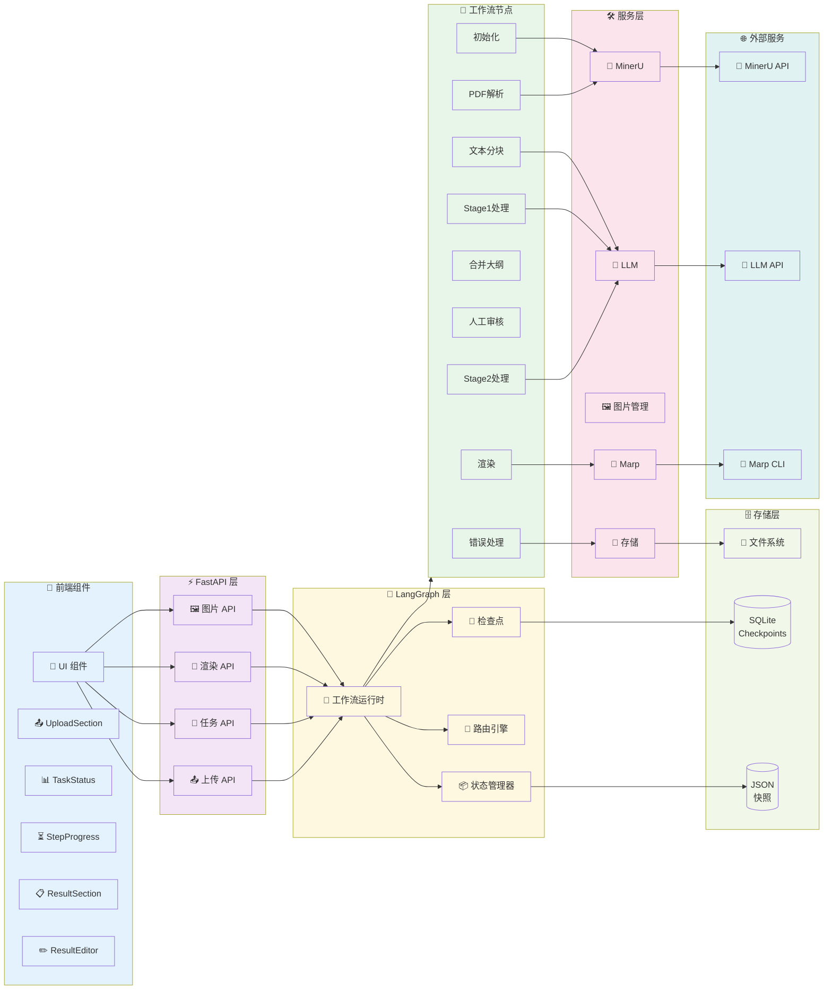

# 组件关系图

## Mermaid 图表



## 组件说明

### 前端组件层次

```
UI (根组件)
├── UploadSection (文件上传)
├── TaskStatus (任务状态)
├── StepProgress (进度显示)
├── ResultSection (结果展示)
└── ResultEditor (结果编辑)
```

### API 端点映射

| 组件 | 端点 | 功能 |
|------|------|------|
| UploadAPI | POST /api/upload | PDF文件上传 |
| TaskAPI | POST /api/tasks | 创建任务 |
| TaskAPI | GET /api/tasks/{id} | 查询状态 |
| TaskAPI | POST /api/tasks/{id}/human-feedback | 提交反馈 |
| RenderAPI | POST /api/render/preview | 预览渲染 |
| ImageAPI | GET /api/images/{path} | 获取图片 |

### 工作流节点职责

| 节点 | 组件 | 职责 |
|------|------|------|
| 初始化 | Init | 验证输入，创建状态 |
| PDF解析 | ParsePDF | 调用 MinerU，提取内容 |
| 文本分块 | SplitText | 分割文本为可处理块 |
| Stage1处理 | Stage1 | 并行生成大纲 |
| 合并大纲 | Merge | 合并所有大纲 |
| 人工审核 | Review | 暂停等待审核 |
| Stage2处理 | Stage2 | 转换为 Marp 格式 |
| 渲染 | Render | 生成演示文稿 |
| 错误处理 | Error | 错误恢复 |

### 服务层组件

| 服务 | 组件 | 技术 |
|------|------|------|
| PDF解析 | MinerUClient | MinerU API |
| LLM处理 | LLMClient | LangChain OpenAI |
| 图片管理 | ImageMgr | 自研 |
| 渲染引擎 | MarpEngine | Marp CLI |
| 存储服务 | Storage | SQLite + JSON |

### 依赖关系

1. **前端依赖 API**: UI 组件调用 REST API
2. **API 依赖工作流**: FastAPI 调用 LangGraph
3. **工作流依赖节点**: 运行时管理节点执行
4. **节点依赖服务**: 节点调用外部服务
5. **服务依赖外部**: 外部 API 调用
6. **工作流依赖存储**: 状态持久化

### 数据流

```
用户操作 → 前端组件 → API 端点 → 工作流节点 → 外部服务 → 存储 → 响应
```

### 交互模式

- **同步调用**: API → 工作流（启动任务）
- **异步轮询**: 前端 → API（查询状态）
- **事件推送**: 工作流 → 前端（SSE）
- **文件访问**: 前端 → ImageAPI（获取图片）

### 错误传播

```
节点错误 → Error 节点 → 存储错误 → API 返回 → 前端显示
```

### 扩展点

1. **自定义节点**: 在 Nodes 层添加新节点
2. **自定义服务**: 在 Services 层集成新服务
3. **自定义存储**: 在 StorageLayer 替换存储方案
4. **自定义API**: 在 API 层添加新端点
