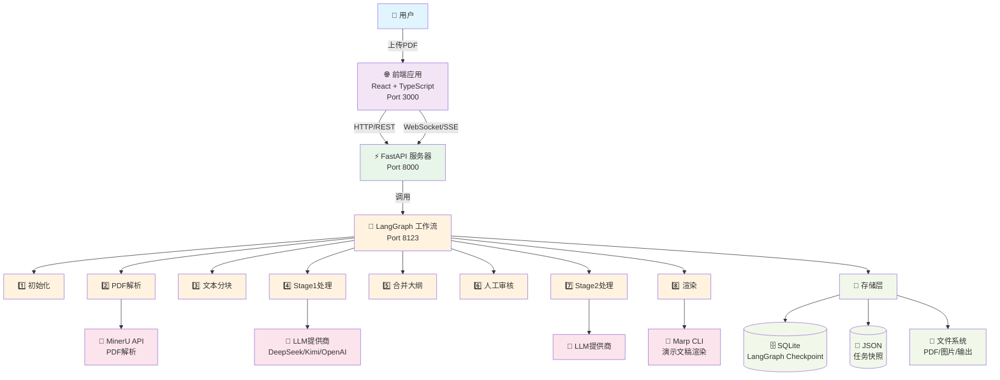

# 系统整体架构图

## Mermaid 图表

## 架构说明

### 分层架构

1. **表现层**: React 前端应用
   - 用户界面
   - 文件上传
   - 任务监控
   - 结果展示

2. **接口层**: FastAPI 服务器
   - REST API
   - 请求路由
   - 参数验证
   - 响应序列化

3. **业务层**: LangGraph 工作流
   - 10个处理节点
   - 状态管理
   - 条件路由
   - 错误处理

4. **服务层**: 外部服务集成
   - MinerU PDF解析
   - LLM文本处理
   - Marp渲染引擎

5. **数据层**: 存储系统
   - SQLite 持久化
   - JSON 快速访问
   - 文件系统

### 数据流

1. 用户通过前端上传 PDF
2. FastAPI 接收并存储文件
3. 调用 LangGraph 工作流启动处理
4. 工作流节点依次执行
5. 外部服务完成特定任务
6. 结果存储到数据库和文件系统
7. 前端展示最终结果

### 核心特性

- ✅ 前后端分离
- ✅ 微服务架构
- ✅ 状态持久化
- ✅ 错误恢复
- ✅ 人机协作
