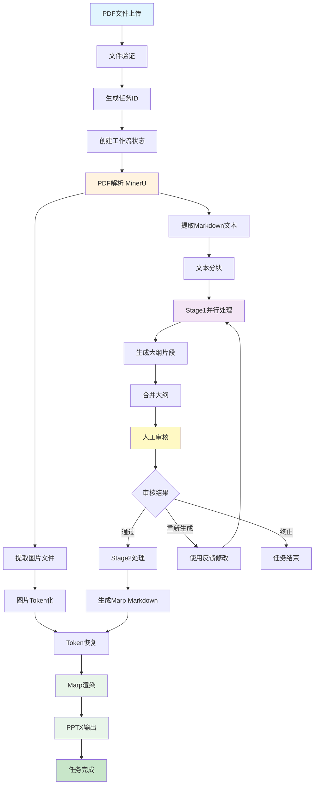

# PDF到PPT完整数据流

## 概述
此图展示了从PDF文件输入到演示文稿输出的完整数据流过程。

## 数据流动说明

### 1. 输入阶段
- **PDF文件**：用户上传的学术论文PDF
- **任务ID**：唯一标识符，跟踪整个流程
- **工作流状态**：包含所有处理信息的StateGraph状态

### 2. 解析阶段
- **MinerU API调用**：将PDF转换为结构化内容
- **Markdown文本**：提取的文本内容
- **图片文件**：提取的图像资源

### 3. 处理阶段
- **文本分块**：将长文本分割成可处理的片段
- **Stage1并行处理**：对每个分块独立生成大纲
- **大纲合并**：将分块大纲整合为完整结构

### 4. 审核阶段
- **HITL暂停**：等待人工审核
- **反馈处理**：根据审核结果决定下一步

### 5. 生成阶段
- **Stage2处理**：将大纲转换为演示文稿格式
- **Marp Markdown**：带有演示指令的Markdown
- **渲染输出**：生成最终的PPTX文件

## 关键数据

| 阶段 | 输入数据 | 输出数据 | 关键处理 |
|------|----------|----------|----------|
| 解析 | PDF文件 | Markdown + 图片 | MinerU API |
| 分块 | Markdown | 分块列表 | 智能分割 |
| Stage1 | 分块列表 | 大纲片段 | LLM调用 |
| 合并 | 大纲片段 | 完整大纲 | 结构整合 |
| Stage2 | 完整大纲 | Marp Markdown | 格式转换 |
| 渲染 | Marp Markdown | PPTX文件 | Marp CLI |

## 性能优化点

1. **并行处理**：Stage1处理支持多chunk并行
2. **缓存机制**：重复文件使用缓存
3. **增量处理**：支持断点续传
4. **流式处理**：大文件分块处理
