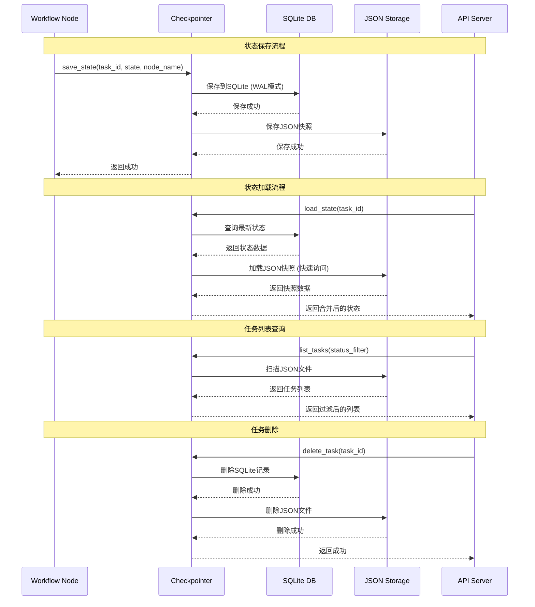

# 状态持久化流程

## 概述
展示工作流状态如何在SQLite数据库和JSON文件之间持久化和同步。



## 双存储架构

### SQLite数据库 (主存储)
- **作用**：LangGraph Checkpoint存储
- **优势**：事务安全、WAL模式、版本控制
- **数据结构**：
  ```sql
  CREATE TABLE checkpoint (
    thread_id TEXT,
    node_name TEXT,
    checkpoint_ns TEXT,
    payload BLOB,
    PRIMARY KEY (thread_id, node_name, checkpoint_ns)
  );
  ```

### JSON文件 (快速访问层)
- **作用**：任务元数据快速查询
- **优势**：快速读取、人类可读、简单查询
- **文件位置**：`data/workflows/tasks/{task_id}.json`

## 存储策略

### 写入策略
1. **原子操作**：SQLite和JSON要么都成功，要么都失败
2. **事务保护**：SQLite使用WAL模式保证一致性
3. **错误回滚**：失败时恢复到上一个稳定状态

### 读取策略
1. **优先SQLite**：获取最新完整状态
2. **补充JSON**：用于快速元数据查询
3. **合并策略**：SQLite为主，JSON为辅

### 同步机制
```python
def save_state(task_id: str, state: dict, node_name: str):
    """保存状态到双存储"""
    # 1. 保存到SQLite
    try:
        checkpointer.save(task_id, node_name, state)
        sqlite_success = True
    except Exception as e:
        logger.error(f"SQLite save failed: {e}")
        sqlite_success = False

    # 2. 保存到JSON
    try:
        json_path = Path(f"data/workflows/tasks/{task_id}.json")
        with open(json_path, 'w') as f:
            json.dump(state, f, indent=2)
        json_success = True
    except Exception as e:
        logger.error(f"JSON save failed: {e}")
        json_success = False

    # 3. 验证一致性
    if not (sqlite_success and json_success):
        # 如果有失败，尝试恢复或标记不一致
        mark_inconsistency(task_id)
        raise Exception("State save failed")
```

## 性能优化

### 缓存策略
- **内存缓存**：频繁访问的状态缓存在内存
- **LRU淘汰**：最近最少使用的状态被淘汰
- **预加载**：启动时预加载活跃任务状态

### 压缩策略
- **JSON压缩**：大字段使用gzip压缩
- **差分存储**：只存储变更部分
- **定期清理**：删除过期的中间状态

### 并发控制
- **读写分离**：查询用JSON，修改用SQLite
- **锁机制**：SQLite使用行级锁
- **队列管理**：批量写入减少I/O

## 备份与恢复

### 自动备份
```python
# 每日备份脚本
def backup_state_storage():
    """备份状态存储"""
    # 1. 备份SQLite
    shutil.copy(
        "data/workflows/checkpoints.db",
        f"backup/checkpoints_{date}.db"
    )

    # 2. 备份JSON文件
    shutil.make_archive(
        f"backup/tasks_{date}",
        'zip',
        "data/workflows/tasks"
    )
```

### 灾难恢复
1. **检测损坏**：定期检查数据库完整性
2. **恢复流程**：从备份恢复SQLite + JSON
3. **数据校验**：验证恢复后的数据一致性
4. **服务重启**：完成恢复后重启服务

## 监控指标

| 指标 | 说明 | 阈值 |
|------|------|------|
| 写入延迟 | 保存状态耗时 | < 100ms |
| 读取延迟 | 加载状态耗时 | < 50ms |
| 存储大小 | SQLite + JSON总大小 | < 10GB |
| 文件数量 | JSON文件数量 | < 10000 |
| 错误率 | 读写失败百分比 | < 0.1% |
