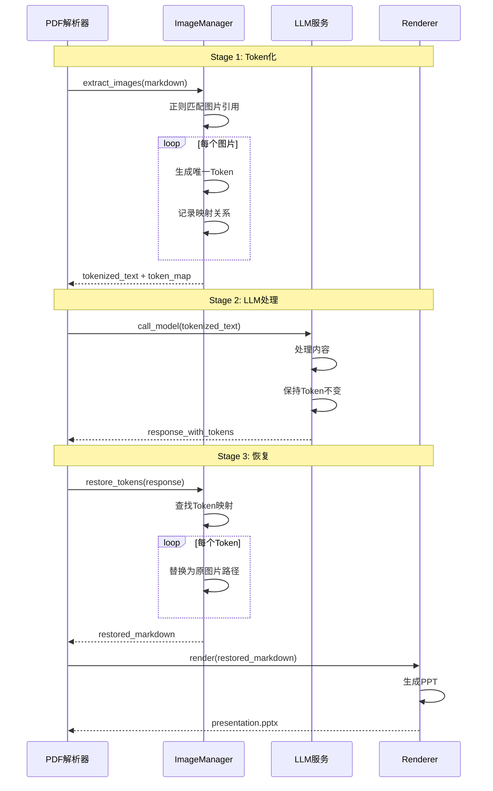

# 图片Token化流程

## 概述
展示图片Token化三阶段保护机制的数据流动。

```mermaid
flowchart LR
    subgraph "Stage 1: Token化"
        A1[MinerU输出<br/>] --> A2[正则匹配图片]
        A2 --> A3[生成Token<br/>[[TOKEN_IMG_001]]]
        A3 --> A4[创建Token Map]
        A4 --> A5[替换Markdown]
    end

    subgraph "Stage 2: LLM处理"
        B1[Tokenized Markdown] --> B2[LLM API调用]
        B2 --> B3[保持Token不变]
        B3 --> B4[生成内容<br/>包含Token]
        B4 --> B5[Stage2输出]
    end

    subgraph "Stage 3: 恢复"
        C1[Tokenized Output] --> C2[读取Token Map]
        C2 --> C3[反向替换<br/>[[TOKEN_IMG_001]]<br/>↓<br/>]
        C3 --> C4[验证图片路径]
        C4 --> C5[恢复完整Markdown]
        C5 --> C6[Marp渲染]
    end

    A5 --> B1
    B5 --> C1

    style A1 fill:#e1f5fe
    style A5 fill:#fff3e0
    style B2 fill:#f3e5f5
    style B5 fill:#f3e5f5
    style C6 fill:#e8f5e9
```

## 详细流程图



## Token化规则

### 正则表达式模式
```python
# 图片引用正则
IMAGE_PATTERN = re.compile(
    r'!\[(.*?)\]\((.*?)\)',
    re.MULTILINE | re.DOTALL
)

# Token格式
TOKEN_FORMAT = r'\[\[TOKEN_IMG_{num:03d}\]\]'

# 示例匹配
text = ""
# 匹配结果:
#   alt: "Figure 1"
#   path: "images/df31c4889a278a680daa11239dcc9df51b4c7fd8b86edfa336bc2b3dec9e25d0.jpg"
```

### Token Map结构
```python
token_map = {
    "[[TOKEN_IMG_001]]": {
        "hash": "df31c4889a278a680daa11239dcc9df51b4c7fd8b86edfa336bc2b3dec9e25d0",
        "alt_text": "Figure 1: CIFAR-10 results",
        "original_path": "images/df31c4889a278a680daa11239dcc9df51b4c7fd8b86edfa336bc2b3dec9e25d0.jpg",
        "filename": "df31c4889a278a680daa11239dcc9df51b4c7fd8b86edfa336bc2b3dec9e25d0.jpg",
        "token_index": 1,
        "context_before": "![Figure 1]",
        "context_after": ""
    },
    "[[TOKEN_IMG_002]]": {
        "hash": "ab12cd34ef56gh78ij90kl12mn34op56qr78st90uv12wx34yz56ab78cd90ef",
        "alt_text": "Figure 2: Model Architecture",
        "original_path": "images/ab12cd34ef56gh78ij90kl12mn34op56qr78st90uv12wx34yz56ab78cd90ef.png",
        "filename": "ab12cd34ef56gh78ij90kl12mn34op56qr78st90uv12wx34yz56ab78cd90ef.png",
        "token_index": 2,
        "context_before": "如图2所示",
        "context_after": "所示"
    }
}
```

## 关键算法

### Token化算法
```python
def tokenize_image_references(markdown_content: str, task_id: str) -> tuple[str, dict]:
    """将图片引用替换为Token"""
    token_map = {}
    token_counter = 1
    pos = 0

    def replace_match(match):
        nonlocal token_counter
        alt_text = match.group(1)
        image_path = match.group(2)

        # 生成Token
        token = f"[[TOKEN_IMG_{token_counter:03d}]]"

        # 记录映射
        image_hash = Path(image_path).stem
        token_map[token] = {
            "hash": image_hash,
            "alt_text": alt_text,
            "original_path": image_path,
            "filename": Path(image_path).name,
            "token_index": token_counter
        }

        token_counter += 1
        return token

    # 执行替换
    tokenized = re.sub(IMAGE_PATTERN, replace_match, markdown_content)

    # 保存Token Map
    save_token_map(task_id, token_map)

    return tokenized, token_map
```

### 恢复算法
```python
def restore_tokens_to_markdown(tokenized_content: str, token_map: dict) -> str:
    """将Token恢复为图片引用"""
    restored = tokenized_content

    for token, info in token_map.items():
        # 重建图片引用
        alt_text = info["alt_text"]
        image_path = info["original_path"]

        image_ref = f""

        # 替换Token
        restored = restored.replace(token, image_ref)

    return restored
```

## LLM保护机制

### 提示词增强
在LLM调用时添加保护指令：

```python
STAGE1_PROTECTED_PROMPT = """
请基于以下内容生成演示文稿大纲。

重要：请严格遵循以下规则：
1. 不要修改或删除任何 [[TOKEN_IMG_XXX]] 格式的标记
2. 不要将Token替换为其他格式
3. 保持Token的原始编号和格式
4. 可以在Token前后添加文字说明，但不要修改Token本身

内容：
{content}

请生成结构化大纲：
"""

STAGE2_PROTECTED_PROMPT = """
请将以下大纲转换为Marp格式的Markdown演示文稿。

重要规则：
1. 严格保持所有 [[TOKEN_IMG_XXX]] Token不变
2. 不要扩展Token为完整路径
3. 不要修改Token编号
4. Token应作为图片占位符保留
5. 可以在Token前后添加说明文字

大纲：
{outline}

请生成完整的Marp Markdown：
"""
```

### LLM响应验证
```python
def validate_llm_response(response: str, expected_tokens: set) -> bool:
    """验证LLM响应是否保持Token"""
    # 提取响应中的所有Token
    found_tokens = set(re.findall(r'\[\[TOKEN_IMG_\d{3}\]\]', response))

    # 检查是否所有预期Token都存在
    if not expected_tokens.issubset(found_tokens):
        missing = expected_tokens - found_tokens
        logger.error(f"Missing tokens in LLM response: {missing}")
        return False

    # 检查是否有未授权的Token修改
    # ... 进一步验证逻辑

    return True
```

## 错误处理

### 常见问题及解决方案

#### 1. Token丢失
```python
# 问题：LLM删除了Token
# 解决：重试或回退
if not validate_tokens(llm_response):
    logger.warning("Tokens lost in LLM response, retrying...")
    return await retry_with_strict_prompt(content, max_retries=3)
```

#### 2. Token Map损坏
```python
# 问题：Token Map文件损坏
# 解决：从备份恢复
try:
    token_map = load_token_map(task_id)
except Exception:
    logger.error("Token map corrupted, restoring from backup...")
    token_map = restore_token_map_from_backup(task_id)
```

#### 3. 图片文件缺失
```python
# 问题：原始图片文件不存在
# 解决：标记为缺失并跳过
for token, info in token_map.items():
    if not Path(info["original_path"]).exists():
        logger.warning(f"Image not found: {info['original_path']}")
        # 使用默认占位图或跳过
```

#### 4. Token编号不一致
```python
# 问题：Token编号混乱
# 解决：重新标准化
def normalize_tokens(text: str) -> str:
    """重新编号Token"""
    tokens = re.findall(r'\[\[TOKEN_IMG_\d{3}\]\]', text)
    token_map = {}

    for i, token in enumerate(tokens, 1):
        new_token = f"[[TOKEN_IMG_{i:03d}]]"
        text = text.replace(token, new_token, 1)
        token_map[new_token] = token

    return text, token_map
```

## 性能优化

### 批量处理
```python
def batch_tokenize(markdown_list: list[str]) -> list[tuple[str, dict]]:
    """批量Token化多个Markdown"""
    results = []
    for markdown in markdown_list:
        tokenized, token_map = tokenize_image_references(markdown)
        results.append((tokenized, token_map))
    return results
```

### 缓存机制
```python
from functools import lru_cache

@lru_cache(maxsize=128)
def get_cached_token_map(image_hash: str) -> Optional[dict]:
    """缓存Token Map"""
    # 从缓存获取
    pass
```

### 并行恢复
```python
async def parallel_restore_tokens(task_outputs: list[str], token_maps: list[dict]):
    """并行恢复多个输出的Token"""
    tasks = [
        restore_tokens_async(output, token_map)
        for output, token_map in zip(task_outputs, token_maps)
    ]
    return await asyncio.gather(*tasks)
```

## 测试验证

### Token完整性测试
```python
def test_tokenization_roundtrip():
    """测试Token化往返过程"""
    original = ""

    # Token化
    tokenized, token_map = tokenize_image_references(original)
    assert tokenized == "[[TOKEN_IMG_001]]"
    assert len(token_map) == 1

    # 恢复
    restored = restore_tokens_to_markdown(tokenized, token_map)
    assert restored == original
```

### LLM保护测试
```python
def test_llm_token_protection():
    """测试LLM保护Token"""
    prompt = "请修改内容: [[TOKEN_IMG_001]]"
    response = llm_call(prompt)

    # 验证Token保持不变
    assert "[[TOKEN_IMG_001]]" in response
    assert "images/" not in response
```

## 监控指标

| 指标 | 说明 | 阈值 |
|------|------|------|
| Token化成功率 | Token化成功比例 | > 99% |
| Token保护率 | LLM保持Token比例 | > 98% |
| 恢复成功率 | Token恢复成功比例 | > 99% |
| 图片完整性 | 最终PPT中图片完整显示 | > 95% |
| 处理延迟 | Token化处理耗时 | < 500ms |
| 错误率 | Token相关错误比例 | < 1% |
