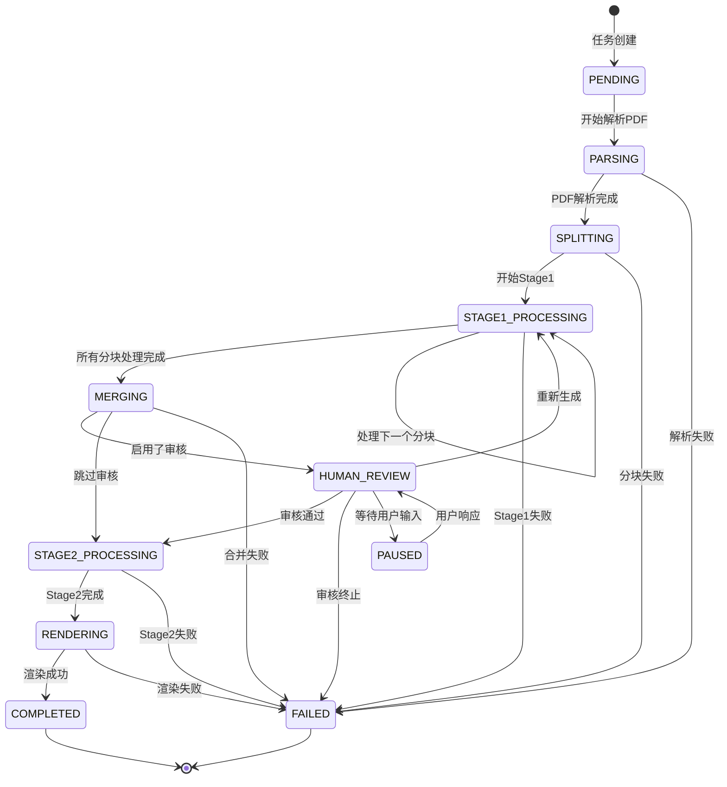
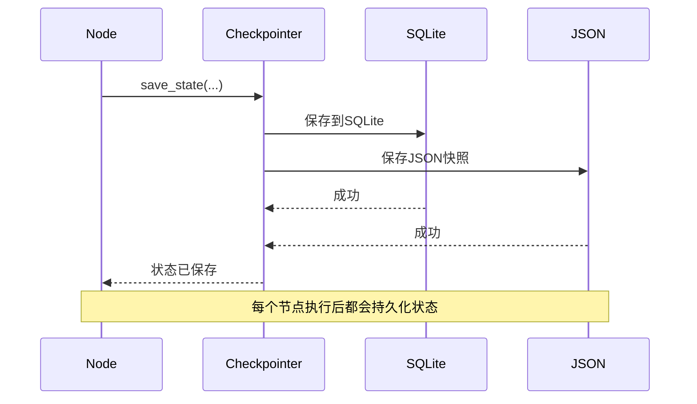

# 状态流转图

## 概述
展示ScholarFlow工作流中状态的完整流转过程。



## 状态详细定义

### TaskStatus枚举
```python
class TaskStatus(str, Enum):
    """任务状态枚举"""

    PENDING = "pending"                    # 等待处理
    PARSING = "parsing"                    # 解析PDF中
    SPLITTING = "splitting"                # 文本分块中
    STAGE1_PROCESSING = "stage1_processing" # Stage1处理中
    MERGING = "merging"                    # 合并大纲中
    HUMAN_REVIEW = "human_review"          # 等待人工审核
    STAGE2_PROCESSING = "stage2_processing" # Stage2处理中
    RENDERING = "rendering"                # 渲染中
    COMPLETED = "completed"                # 任务完成
    FAILED = "failed"                      # 任务失败
    PAUSED = "paused"                      # 任务暂停
```

## 状态流转矩阵

| 当前状态 | 触发条件 | 下一状态 | 节点 |
|----------|----------|----------|------|
| PENDING | 开始工作流 | PARSING | initialize |
| PARSING | PDF解析完成 | SPLITTING | parse_pdf |
| SPLITTING | 分块完成 | STAGE1_PROCESSING | split_markdown |
| STAGE1_PROCESSING | 所有分块完成 | MERGING | stage1_process |
| MERGING | 启用审核 | HUMAN_REVIEW | human_review |
| MERGING | 跳过审核 | STAGE2_PROCESSING | merge_outlines |
| HUMAN_REVIEW | 审核通过 | STAGE2_PROCESSING | process_feedback |
| HUMAN_REVIEW | 重新生成 | STAGE1_PROCESSING | process_feedback |
| HUMAN_REVIEW | 终止任务 | FAILED | process_feedback |
| STAGE2_PROCESSING | 处理完成 | RENDERING | stage2_process |
| RENDERING | 渲染完成 | COMPLETED | render |
| 任意 | 发生错误 | FAILED | handle_error |

## 状态生命周期

### 状态生命周期表

```mermaid
gantt
    title 任务状态生命周期
    dateFormat X
    axisFormat %H:%M

    section 初始阶段
    PENDING           :0, 5
    PARSING           :5, 15

    section 处理阶段
    SPLITTING         :15, 20
    STAGE1_PROCESSING :20, 45
    MERGING           :45, 50

    section 审核阶段
    HUMAN_REVIEW      :50, 70

    section 生成阶段
    STAGE2_PROCESSING :70, 85
    RENDERING         :85, 95

    section 完成
    COMPLETED         :95, 100
```


## 状态流转规则

### 1. 正常流转
```python
def transition_state(current_status: str, event: str, context: dict) -> str:
    """状态流转逻辑"""
    transitions = {
        ("PENDING", "start"): "PARSING",
        ("PARSING", "completed"): "SPLITTING",
        ("SPLITTING", "completed"): "STAGE1_PROCESSING",
        ("STAGE1_PROCESSING", "chunk_complete"): "STAGE1_PROCESSING",
        ("STAGE1_PROCESSING", "all_chunks_complete"): "MERGING",
        ("MERGING", "enable_review"): "HUMAN_REVIEW",
        ("MERGING", "skip_review"): "STAGE2_PROCESSING",
        ("HUMAN_REVIEW", "approved"): "STAGE2_PROCESSING",
        ("HUMAN_REVIEW", "regenerate"): "STAGE1_PROCESSING",
        ("HUMAN_REVIEW", "abort"): "FAILED",
        ("STAGE2_PROCESSING", "completed"): "RENDERING",
        ("RENDERING", "completed"): "COMPLETED",
    }

    next_status = transitions.get((current_status, event))
    if not next_status:
        raise InvalidTransitionError(f"Invalid transition: {current_status} -> {event}")

    return next_status
```

### 2. 错误处理
```python
def handle_error(current_status: str, error: Exception) -> str:
    """错误处理逻辑"""
    # 记录错误
    logger.error(f"Error in state {current_status}: {error}")

    # 根据状态和错误类型决定下一步
    if current_status in ["PENDING", "PARSING", "SPLITTING"]:
        # 早期阶段失败，终止任务
        return "FAILED"
    elif current_status in ["STAGE1_PROCESSING", "MERGING"]:
        # Stage1失败，可以重试
        if error.retryable:
            return current_status  # 保持当前状态，重试
        else:
            return "FAILED"
    else:
        # 其他阶段失败，终止
        return "FAILED"
```

### 3. 暂停/恢复机制
```python
def pause_workflow(state: WorkflowState) -> WorkflowState:
    """暂停工作流"""
    return {
        **state,
        "status": TaskStatus.PAUSED.value,
        "paused_at": datetime.now().isoformat(),
        "pause_reason": "用户手动暂停",
    }

def resume_workflow(state: WorkflowState) -> WorkflowState:
    """恢复工作流"""
    # 从暂停状态恢复到审核状态
    return {
        **state,
        "status": TaskStatus.HUMAN_REVIEW.value,
        "resumed_at": datetime.now().isoformat(),
    }
```

## 状态字段更新

### 状态更新规则
```python
def update_state_fields(
    current_state: WorkflowState,
    new_status: str,
    event: str,
    data: dict
) -> WorkflowState:
    """更新状态字段"""
    updates = {
        "status": new_status,
        "updated_at": datetime.now().isoformat(),
    }

    # 根据事件类型更新特定字段
    if event == "chunk_complete":
        updates["stage1_completed"] = current_state.get("stage1_completed", 0) + 1
        updates["progress_percentage"] = calculate_progress(updates["stage1_completed"])

    elif event == "review_approved":
        updates["approved"] = True
        updates["needs_human_review"] = False
        updates["progress_percentage"] = 60.0

    elif event == "review_rejected":
        updates["approved"] = False
        updates["needs_human_review"] = False
        updates["progress_percentage"] = 20.0

    # 添加执行日志
    log_entry = {
        "timestamp": datetime.now().isoformat(),
        "event": event,
        "status": new_status,
        "data": data,
    }
    updates["execution_log"] = current_state.get("execution_log", []) + [log_entry]

    return {**current_state, **updates}
```

## 进度计算

### 进度百分比规则
```python
def calculate_progress(status: str, **kwargs) -> float:
    """计算进度百分比"""
    progress_map = {
        "PENDING": 0.0,
        "PARSING": 10.0,
        "SPLITTING": 15.0,
        "STAGE1_PROCESSING": 15.0 + (kwargs.get("completed_chunks", 0) / kwargs.get("total_chunks", 1)) * 30.0,
        "MERGING": 50.0,
        "HUMAN_REVIEW": 55.0,
        "STAGE2_PROCESSING": 60.0,
        "RENDERING": 90.0,
        "COMPLETED": 100.0,
        "FAILED": 0.0,
    }

    return progress_map.get(status, 0.0)

# Stage1进度计算示例
if current_status == "STAGE1_PROCESSING":
    total_chunks = len(state.get("chunks", []))
    completed_chunks = state.get("stage1_completed", 0)
    base_progress = 15.0  # 基础进度
    chunk_progress = (completed_chunks / total_chunks) * 30.0 if total_chunks > 0 else 0
    progress = base_progress + chunk_progress
```

## 条件流转

### 条件路由示例
```python
def should_continue_stage1(state: WorkflowState) -> bool:
    """Stage1循环条件"""
    current_index = state.get("current_chunk_index", 0)
    total_chunks = state.get("chunks_count", 0)

    return current_index < total_chunks

def should_enable_review(state: WorkflowState) -> bool:
    """是否启用审核"""
    return state.get("needs_human_review", False)

def route_after_feedback(state: WorkflowState) -> str:
    """审核后路由"""
    feedback = state.get("human_feedback", {})

    if feedback.get("approved"):
        return "stage2"
    elif feedback.get("action") == "regenerate":
        return "stage1"
    else:
        return "end"
```

## 状态持久化

### 状态保存时机


### 断点续传
```python
# 工作流中断恢复
async def resume_workflow_from_checkpoint(task_id: str):
    """从检查点恢复工作流"""
    # 1. 加载最后的状态
    checkpointer = get_checkpointer()
    state = checkpointer.load_state(task_id)

    if not state:
        raise TaskNotFoundError(f"Task {task_id} not found")

    # 2. 确定当前节点
    current_status = state.get("status")
    current_node = determine_current_node(current_status)

    # 3. 从当前节点继续
    workflow = create_workflow()
    compiled = workflow.compile()

    # 4. 继续执行
    result = await compiled.ainvoke(state, config={"configurable": {"thread_id": task_id}})

    return result
```

## 状态查询API

### 状态查询端点
```python
@router.get("/tasks/{task_id}/status")
async def get_task_status(task_id: str):
    """获取任务状态"""
    checkpointer = get_checkpointer()
    state = checkpointer.load_state(task_id)

    if not state:
        raise HTTPException(status_code=404, detail="Task not found")

    return {
        "task_id": state.get("task_id"),
        "status": state.get("status"),
        "progress_percentage": state.get("progress_percentage", 0.0),
        "current_step": state.get("current_step"),
        "created_at": state.get("created_at"),
        "updated_at": state.get("updated_at"),
        "execution_log": state.get("execution_log", [])[-10:],  # 最近10条日志
    }
```

## 监控指标

| 指标 | 说明 | 计算方式 |
|------|------|----------|
| 平均完成时间 | 任务从开始到完成的平均耗时 | Σ(完成时间-开始时间) / 任务数 |
| 各阶段耗时 | 每个阶段的平均耗时 | Σ(阶段结束时间-阶段开始时间) / 任务数 |
| 状态分布 | 各状态的任务数量分布 | COUNT(tasks WHERE status=X) |
| 错误率 | 失败任务比例 | COUNT(FAILED) / COUNT(ALL) |
| 审核通过率 | 审核通过的任务比例 | COUNT(approved=true) / COUNT(human_review) |
| 恢复成功率 | 断点续传成功比例 | COUNT(resumed_success) / COUNT(resume_attempts) |
