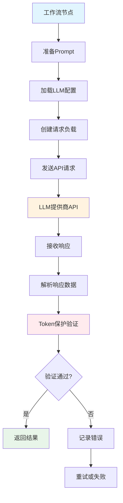
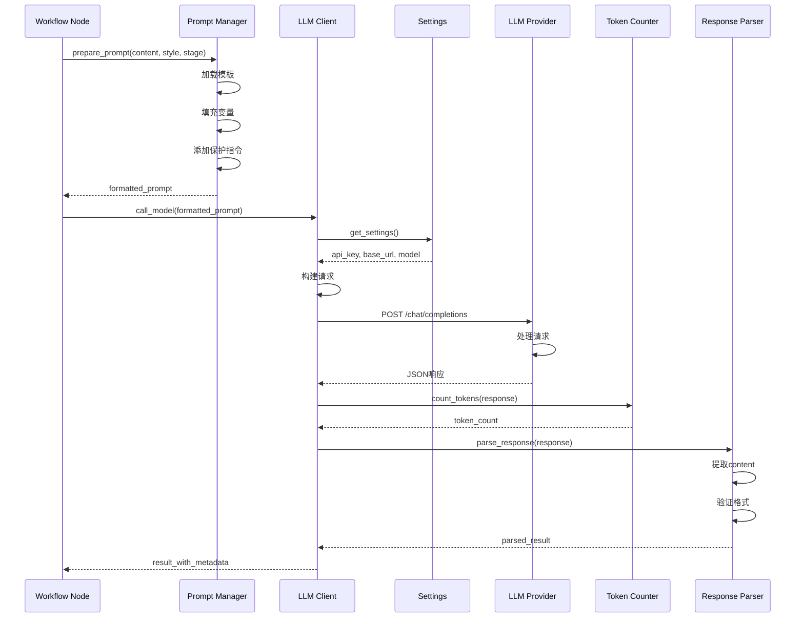
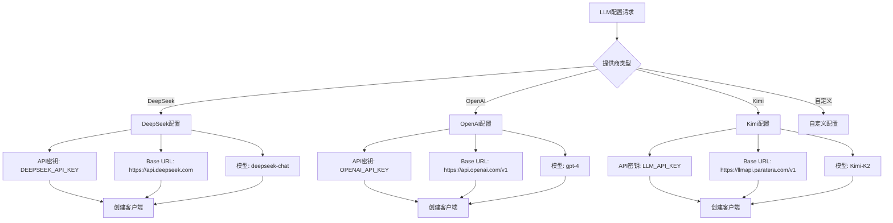
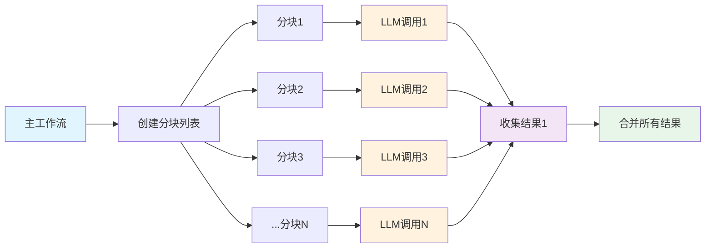

# LLM调用数据流

## 概述
展示LLM服务调用的完整数据流和调用链。



## 详细调用流程



## LLM配置加载

### 多提供商支持


### 配置加载代码
```python
def load_llm_config() -> dict:
    """加载LLM配置"""
    settings = get_settings()

    # 优先级: LLM_* > OPENAI_* > DEEPSEEK_*
    config = {
        "api_key": (
            settings.llm_api_key or
            settings.openai_api_key or
            settings.deepseek_api_key
        ),
        "base_url": (
            settings.llm_base_url or
            settings.openai_base_url or
            settings.deepseek_base_url or
            "https://api.deepseek.com"  # 默认
        ),
        "model": (
            settings.llm_model or
            settings.openai_model or
            settings.deepseek_model or
            "deepseek-chat"  # 默认
        ),
        "max_tokens": settings.llm_max_tokens or 4000,
        "temperature": settings.llm_temperature or 0.7,
    }

    if not config["api_key"]:
        raise ValueError("LLM API key not configured")

    return config
```

## Prompt工程

### 提示词模板结构
```python
STAGE1_PROMPT_TEMPLATE = """
你是一个专业的学术演示文稿生成助手。

任务：基于提供的学术论文内容，生成演示文稿大纲。

要求：
1. 结构清晰，层次分明
2. 突出重点内容
3. 适合学术演示风格
4. 严格保持所有Token标记不变：[[TOKEN_IMG_XXX]]

输入内容：
{content}

演示风格：{style}

请生成结构化大纲，包含：
- 标题
- 主要章节
- 每章节的要点
- 建议的图表位置

请以Markdown格式输出：
"""

STAGE2_PROMPT_TEMPLATE = """
你是一个专业的演示文稿格式化专家。

任务：将演示文稿大纲转换为Marp格式的Markdown。

要求：
1. 使用Marp指令语法
2. 保持幻灯片数量适中（每页3-5个要点）
3. 合理使用标题层级
4. 严格保持所有Token标记：[[TOKEN_IMG_XXX]]
5. 不要将Token替换为其他格式

大纲内容：
{outline}

演示风格：{style}

请生成完整的Marp Markdown：
---
"""
```

### 动态Prompt构建
```python
def build_prompt(template: str, **kwargs) -> str:
    """构建动态Prompt"""
    # 替换变量
    prompt = template.format(**kwargs)

    # 添加Token保护指令
    token_protection = """
重要提醒：
- 严格保持所有 [[TOKEN_IMG_XXX]] 格式的标记
- 不要修改Token编号
- 不要将Token替换为其他格式
- Token是图片占位符，必须保留
"""

    prompt += token_protection

    return prompt
```

## API调用实现

### HTTP客户端封装
```python
import httpx
import asyncio
from typing import Dict, Any

class LLMClient:
    """LLM API客户端"""

    def __init__(self, config: dict):
        self.config = config
        self.client = httpx.AsyncClient(
            base_url=config["base_url"],
            headers={
                "Authorization": f"Bearer {config['api_key']}",
                "Content-Type": "application/json",
            },
            timeout=60.0,
        )

    async def complete(self, prompt: str, **kwargs) -> Dict[str, Any]:
        """调用LLM生成文本"""
        payload = {
            "model": self.config["model"],
            "messages": [
                {"role": "user", "content": prompt}
            ],
            "temperature": kwargs.get("temperature", self.config["temperature"]),
            "max_tokens": kwargs.get("max_tokens", self.config["max_tokens"]),
        }

        try:
            response = await self.client.post(
                "/chat/completions",
                json=payload
            )
            response.raise_for_status()

            data = response.json()

            # 解析响应
            result = {
                "content": data["choices"][0]["message"]["content"],
                "usage": data.get("usage", {}),
                "model": data.get("model", self.config["model"]),
                "finish_reason": data["choices"][0].get("finish_reason", "stop"),
                "response_id": data.get("id"),
                "created": data.get("created"),
            }

            return result

        except httpx.HTTPStatusError as e:
            logger.error(f"HTTP error: {e.response.status_code} - {e.response.text}")
            raise LLMAPIError(f"HTTP {e.response.status_code}: {e.response.text}")
        except Exception as e:
            logger.error(f"LLM call failed: {e}")
            raise

    async def close(self):
        """关闭客户端"""
        await self.client.aclose()
```

### 异步调用封装
```python
async def call_llm_async(
    prompt: str,
    stage: str,
    retry_count: int = 3,
    retry_delay: float = 1.0
) -> Dict[str, Any]:
    """异步调用LLM（带重试）"""
    config = load_llm_config()
    client = LLMClient(config)

    for attempt in range(retry_count):
        try:
            async with client:
                result = await client.complete(prompt)

                # 验证响应
                if validate_response(result, stage):
                    return result
                else:
                    logger.warning(f"Response validation failed (attempt {attempt + 1})")

        except Exception as e:
            logger.error(f"LLM call failed (attempt {attempt + 1}): {e}")

            if attempt < retry_count - 1:
                # 指数退避
                await asyncio.sleep(retry_delay * (2 ** attempt))
            else:
                raise LLMCallError(f"Failed after {retry_count} attempts: {e}")

    raise LLMCallError("Max retries exceeded")
```

## 响应处理

### 响应解析器
```python
def parse_llm_response(response: Dict[str, Any], stage: str) -> str:
    """解析LLM响应"""
    content = response.get("content", "")

    # 清理响应内容
    content = content.strip()

    # 移除可能的解释性文字
    if stage == "stage1":
        # Stage1: 提取Markdown大纲
        content = extract_markdown_outline(content)
    elif stage == "stage2":
        # Stage2: 提取Marp Markdown
        content = extract_marp_markdown(content)

    return content

def extract_markdown_outline(content: str) -> str:
    """提取Markdown大纲"""
    # 如果包含解释文字，提取#开头的部分
    lines = content.split('\n')
    outline_lines = [line for line in lines if line.strip().startswith('#')]

    if outline_lines:
        return '\n'.join(outline_lines)

    # 否则返回原始内容
    return content

def extract_marp_markdown(content: str) -> str:
    """提取Marp Markdown"""
    # 确保包含Marp指令
    if not content.startswith('---'):
        content = '---\n' + content

    return content
```

### 响应验证
```python
def validate_response(response: Dict[str, Any], stage: str) -> bool:
    """验证LLM响应"""
    content = response.get("content", "")

    # 检查是否为空
    if not content or len(content.strip()) < 10:
        logger.warning("Response is too short")
        return False

    # 检查Token保护
    if stage in ["stage1", "stage2"]:
        tokens = re.findall(r'\[\[TOKEN_IMG_\d{3}\]\]', content)
        if tokens:
            # 检查是否有Token被破坏
            broken_tokens = [t for t in tokens if not re.match(r'\[\[TOKEN_IMG_\d{3}\]\]', t)]
            if broken_tokens:
                logger.error(f"Broken tokens found: {broken_tokens}")
                return False

    # 检查内容格式
    if stage == "stage1":
        # 应该有Markdown标题
        if not re.search(r'^#{1,3}\s+', content, re.MULTILINE):
            logger.warning("Stage1 response missing headers")
            return False

    elif stage == "stage2":
        # 应该有Marp指令
        if not content.startswith('---'):
            logger.warning("Stage2 response missing Marp directive")
            return False

    return True
```

## 并行调用

### Stage1并行处理


### 并行调用代码
```python
async def process_chunks_parallel(chunks: list[dict]) -> list[dict]:
    """并行处理所有分块"""
    # 创建信号量限制并发数
    semaphore = asyncio.Semaphore(5)

    async def process_single_chunk(chunk: dict) -> dict:
        async with semaphore:
            try:
                # 构建Prompt
                prompt = build_stage1_prompt(
                    content=chunk["text"],
                    style=chunk.get("style", "academic")
                )

                # 调用LLM
                result = await call_llm_async(prompt, stage="stage1")

                return {
                    "chunk_id": chunk["id"],
                    "chunk_title": chunk.get("title", ""),
                    "outline": result["content"],
                    "success": True,
                    "usage": result.get("usage", {}),
                }

            except Exception as e:
                logger.error(f"Chunk {chunk['id']} failed: {e}")
                return {
                    "chunk_id": chunk["id"],
                    "chunk_title": chunk.get("title", ""),
                    "outline": "",
                    "success": False,
                    "error": str(e),
                }

    # 并行处理所有分块
    tasks = [process_single_chunk(chunk) for chunk in chunks]
    results = await asyncio.gather(*tasks, return_exceptions=True)

    # 处理异常结果
    processed_results = []
    for i, result in enumerate(results):
        if isinstance(result, Exception):
            processed_results.append({
                "chunk_id": chunks[i]["id"],
                "success": False,
                "error": str(result),
            })
        else:
            processed_results.append(result)

    return processed_results
```

## 错误处理与重试

### 重试策略
```python
async def call_with_retry(
    func: Callable,
    max_retries: int = 3,
    base_delay: float = 1.0,
    max_delay: float = 60.0,
    exponential_base: float = 2.0
) -> Any:
    """带指数退避的重试"""
    for attempt in range(max_retries):
        try:
            return await func()
        except RetryableError as e:
            if attempt == max_retries - 1:
                raise  # 最后一次尝试失败，抛出异常

            # 计算延迟时间（指数退避）
            delay = min(
                base_delay * (exponential_base ** attempt),
                max_delay
            )

            logger.warning(
                f"Attempt {attempt + 1} failed, retrying in {delay}s: {e}"
            )

            await asyncio.sleep(delay)

        except NonRetryableError as e:
            logger.error(f"Non-retryable error: {e}")
            raise

    raise LLMCallError("Max retries exceeded")
```

### 错误分类
```python
class LLMError(Exception):
    """LLM相关错误基类"""
    pass

class RetryableError(LLMError):
    """可重试的错误"""
    pass

class NonRetryableError(LLMError):
    """不可重试的错误"""
    pass

def classify_error(error: Exception) -> type:
    """分类错误类型"""
    if isinstance(error, httpx.TimeoutException):
        return RetryableError
    elif isinstance(error, httpx.ConnectError):
        return RetryableError
    elif isinstance(error, httpx.HTTPStatusError):
        if error.response.status_code in [429, 502, 503, 504]:
            return RetryableError  # 限流或服务端错误
        else:
            return NonRetryableError  # 客户端错误
    elif isinstance(error, ValueError):
        return NonRetryableError  # 参数错误
    else:
        return RetryableError  # 其他错误可能可重试
```

## 性能监控

### 监控指标
```python
@dataclass
class LLMMetrics:
    """LLM调用指标"""
    call_count: int = 0
    success_count: int = 0
    failure_count: int = 0
    total_tokens: int = 0
    total_latency: float = 0.0
    average_latency: float = 0.0

    def record_call(self, success: bool, tokens: int, latency: float):
        """记录一次调用"""
        self.call_count += 1
        if success:
            self.success_count += 1
        else:
            self.failure_count += 1

        self.total_tokens += tokens
        self.total_latency += latency
        self.average_latency = self.total_latency / self.call_count

    @property
    def success_rate(self) -> float:
        """成功率"""
        if self.call_count == 0:
            return 0.0
        return self.success_count / self.call_count

    @property
    def failure_rate(self) -> float:
        """失败率"""
        if self.call_count == 0:
            return 0.0
        return self.failure_count / self.call_count
```

### 监控报告
```python
def generate_llm_report(metrics: LLMMetrics) -> dict:
    """生成LLM调用报告"""
    return {
        "total_calls": metrics.call_count,
        "success_rate": f"{metrics.success_rate:.2%}",
        "failure_rate": f"{metrics.failure_rate:.2%}",
        "total_tokens": metrics.total_tokens,
        "average_latency_ms": f"{metrics.average_latency * 1000:.2f}",
        "cost_estimate": calculate_cost(metrics.total_tokens),
    }
```

## 成本优化

### Token计数与成本
```python
def count_tokens(text: str) -> int:
    """估算Token数量（简单实现）"""
    # 粗略估算：1 token ≈ 4字符
    return len(text) // 4

def calculate_cost(token_count: int, price_per_1k_tokens: float = 0.002) -> float:
    """计算API成本"""
    return (token_count / 1000) * price_per_1k_tokens
```

### 成本优化策略
1. **Prompt优化**：减少不必要的说明文字
2. **分块策略**：合理控制分块大小
3. **缓存复用**：相同内容使用缓存
4. **模型选择**：根据任务选择合适的模型
5. **温度调优**：降低temperature减少无效生成
