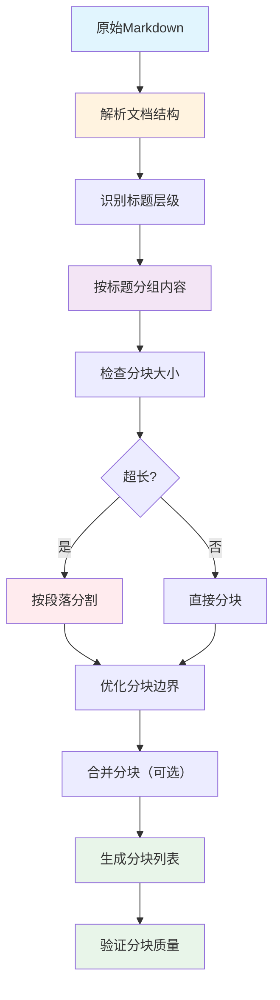
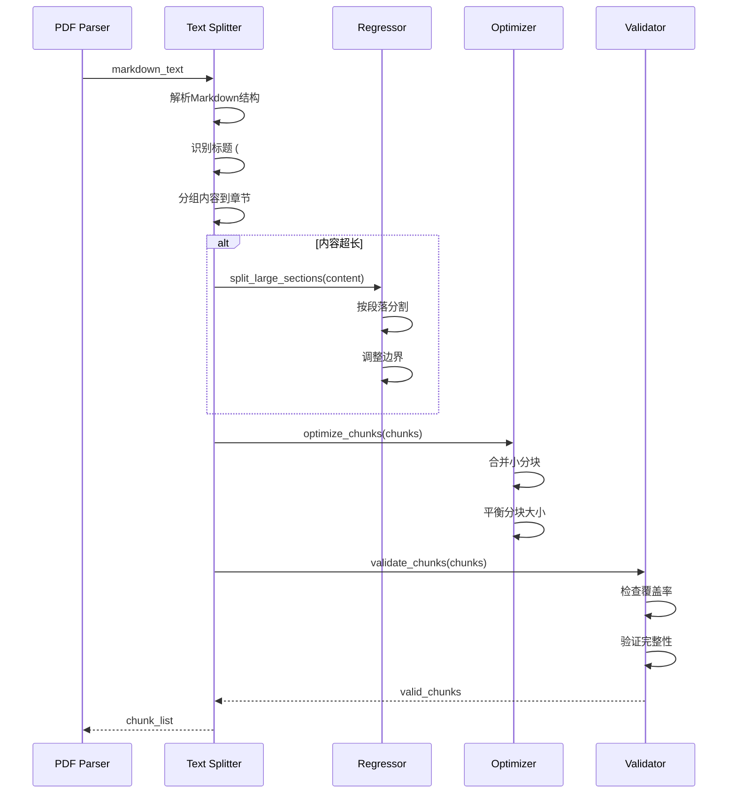
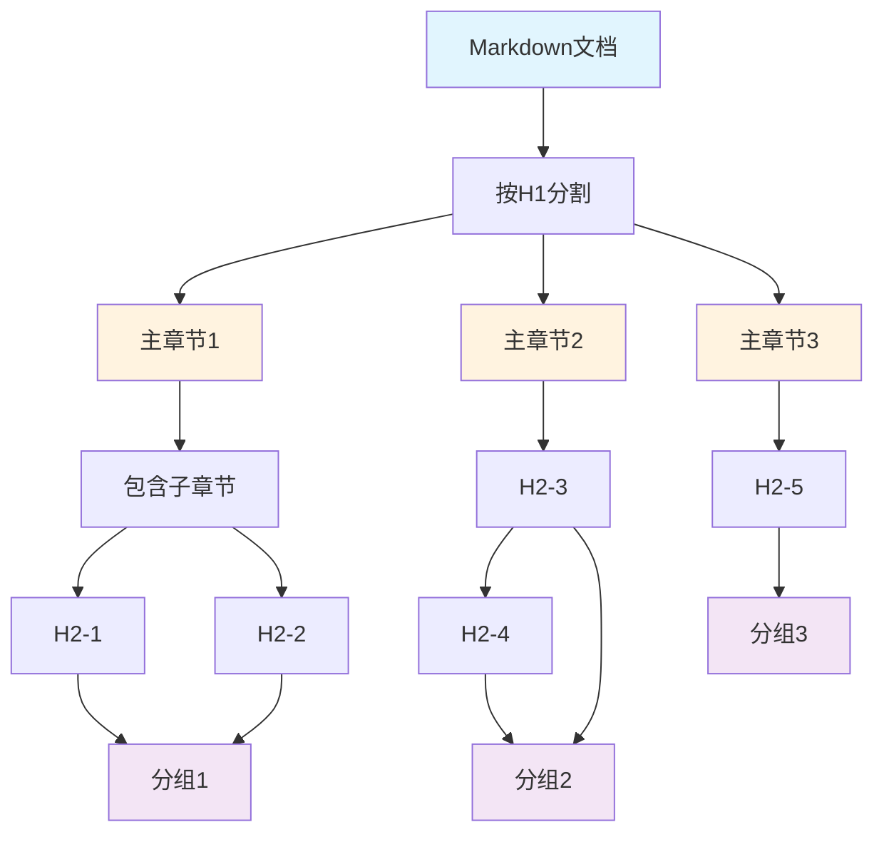

# 文本分块数据流

## 概述
展示从Markdown文本到分块的完整处理流程。



## 详细处理流程



## 分块算法详解

### 1. 文档结构解析
```python
def parse_markdown_structure(markdown: str) -> list[dict]:
    """解析Markdown文档结构"""
    lines = markdown.split('\n')
    sections = []
    current_section = None

    for line in lines:
        # 检查是否是标题
        header_match = re.match(r'^(#{1,6})\s+(.+)$', line)
        if header_match:
            level = len(header_match.group(1))
            title = header_match.group(2)

            # 保存前一个section
            if current_section:
                sections.append(current_section)

            # 开始新section
            current_section = {
                "level": level,
                "title": title,
                "content": [],
                "start_line": len(sections) + 1
            }
        else:
            # 添加到当前section
            if current_section:
                current_section["content"].append(line)

    # 添加最后一个section
    if current_section:
        sections.append(current_section)

    return sections
```

### 2. 内容分组策略


### 3. 分块大小控制
```python
def calculate_chunk_size(text: str) -> int:
    """计算文本大小（字符数）"""
    # 移除Markdown标记
    clean_text = re.sub(r'[#*`_\[\]()\-!]', '', text)
    return len(clean_text)

def should_split_section(section: dict, max_chars: int) -> bool:
    """判断section是否需要分割"""
    content_text = '\n'.join(section["content"])
    return calculate_chunk_size(content_text) > max_chars

def split_large_section(section: dict, max_chars: int) -> list[dict]:
    """分割大section"""
    content_lines = section["content"]
    chunks = []
    current_chunk = {
        "level": section["level"],
        "title": section["title"],
        "content": [],
        "size": 0
    }

    for line in content_lines:
        line_size = calculate_chunk_size(line)

        # 检查是否超出限制
        if current_chunk["size"] + line_size > max_chars and current_chunk["content"]:
            # 保存当前chunk
            chunks.append(current_chunk)

            # 开始新chunk
            current_chunk = {
                "level": section["level"],
                "title": f"{section['title']} (续)",
                "content": [],
                "size": 0
            }

        # 添加行到当前chunk
        current_chunk["content"].append(line)
        current_chunk["size"] += line_size

    # 添加最后一个chunk
    if current_chunk["content"]:
        chunks.append(current_chunk)

    return chunks
```

### 4. 分块边界优化
```python
def optimize_chunk_boundaries(chunks: list[dict]) -> list[dict]:
    """优化分块边界"""
    optimized = []

    for i, chunk in enumerate(chunks):
        # 向前优化：尝试包含前一个chunk的结尾
        if i > 0 and len(chunk["content"]) > 0:
            prev_chunk = optimized[-1]
            prev_lines = prev_chunk["content"]
            curr_lines = chunk["content"]

            # 如果前一个chunk很小，合并它们
            if calculate_chunk_size('\n'.join(prev_lines)) < 1000:
                prev_chunk["content"].extend(curr_lines)
                chunk["content"] = []
                continue

        # 向后优化：检查是否在句子中间分割
        if chunk["content"]:
            first_line = chunk["content"][0]
            # 如果第一行不是完整句子，尝试向前借
            if not first_line.strip().endswith(('.', '!', '?', ':', ';')):
                # 向前查找句子边界
                if i > 0:
                    prev_chunk = optimized[-1] if optimized else None
                    if prev_chunk and prev_chunk["content"]:
                        # 移动句子边界
                        boundary_line = prev_chunk["content"][-1]
                        if boundary_line.strip().endswith(('.', '!', '?', ':', ';')):
                            # 调整边界
                            chunk["content"].insert(0, boundary_line)
                            prev_chunk["content"].pop()

        optimized.append(chunk)

    # 移除空chunk
    return [c for c in optimized if c["content"]]
```

## 分块策略对比

| 策略 | 优点 | 缺点 | 适用场景 |
|------|------|------|----------|
| **固定大小** | 简单、可控 | 可能打断语义 | 快速原型 |
| **语义分割** | 保持语义完整 | 复杂度高 | 质量要求高 |
| **标题分组** | 结构清晰 | 大小不均 | 学术论文 |
| **段落分割** | 平衡性好 | 边界难确定 | 一般文本 |
| **智能合并** | 效率高 | 实现复杂 | 生产环境 |

### 标题分组策略（推荐）
```python
def split_by_headers(markdown: str, max_chars: int = 8000) -> list[dict]:
    """基于标题的分块策略"""
    sections = parse_markdown_structure(markdown)
    chunks = []

    for section in sections:
        section_text = '\n'.join(section["content"])
        section_size = calculate_chunk_size(section_text)

        if section_size <= max_chars:
            # 直接作为一个chunk
            chunks.append({
                "id": len(chunks) + 1,
                "title": section["title"],
                "text": section_text,
                "start_line": section.get("start_line"),
                "end_line": section.get("start_line") + len(section["content"]) - 1,
                "level": section["level"]
            })
        else:
            # 需要分割
            sub_chunks = split_large_section(section, max_chars)
            for sub_chunk in sub_chunks:
                chunks.append({
                    "id": len(chunks) + 1,
                    "title": sub_chunk["title"],
                    "text": '\n'.join(sub_chunk["content"]),
                    "start_line": section.get("start_line"),
                    "end_line": None,
                    "level": section["level"]
                })

    return chunks
```

## 分块后处理

### 1. 分块合并优化
```python
def merge_small_chunks(chunks: list[dict], target_count: int = 6) -> list[dict]:
    """合并过小的分块"""
    if len(chunks) <= target_count:
        return chunks

    # 计算平均大小
    total_size = sum(calculate_chunk_size(c["text"]) for c in chunks)
    avg_size = total_size / len(chunks)

    merged = []
    current_chunk = None

    for chunk in chunks:
        chunk_size = calculate_chunk_size(chunk["text"])

        if current_chunk is None:
            current_chunk = chunk.copy()
        elif chunk_size < avg_size * 0.5:
            # 合并小chunk
            current_chunk["text"] += '\n\n' + chunk["text"]
            current_chunk["title"] += ' + ' + chunk["title"]
        else:
            # 保存当前chunk，开始新的
            merged.append(current_chunk)
            current_chunk = chunk.copy()

    # 添加最后一个chunk
    if current_chunk:
        merged.append(current_chunk)

    # 重新分配ID
    for i, chunk in enumerate(merged):
        chunk["id"] = i + 1

    return merged
```

### 2. 分块质量评估
```python
@dataclass
class ChunkMetrics:
    """分块质量指标"""
    total_chunks: int
    avg_size: float
    min_size: float
    max_size: float
    size_stddev: float
    coverage: float  # 覆盖率

def evaluate_chunk_quality(chunks: list[dict], original_text: str) -> ChunkMetrics:
    """评估分块质量"""
    sizes = [calculate_chunk_size(c["text"]) for c in chunks]

    total_chars = len(original_text)
    chunk_chars = sum(sizes)

    return ChunkMetrics(
        total_chunks=len(chunks),
        avg_size=sum(sizes) / len(sizes) if sizes else 0,
        min_size=min(sizes) if sizes else 0,
        max_size=max(sizes) if sizes else 0,
        size_stddev=calculate_stddev(sizes),
        coverage=chunk_chars / total_chars if total_chars > 0 else 0
    )

def calculate_stddev(values: list[float]) -> float:
    """计算标准差"""
    if not values:
        return 0.0

    mean = sum(values) / len(values)
    variance = sum((x - mean) ** 2 for x in values) / len(values)
    return variance ** 0.5
```

### 3. 分块验证
```python
def validate_chunks(chunks: list[dict], original_text: str) -> tuple[bool, list[str]]:
    """验证分块质量"""
    errors = []

    # 检查1: 分块数量
    if len(chunks) == 0:
        errors.append("No chunks generated")
        return False, errors

    # 检查2: 分块大小
    for chunk in chunks:
        size = calculate_chunk_size(chunk["text"])
        if size < 100:
            errors.append(f"Chunk {chunk['id']} is too small ({size} chars)")
        if size > 10000:
            errors.append(f"Chunk {chunk['id']} is too large ({size} chars)")

    # 检查3: 内容覆盖
    merged_text = '\n'.join(c["text"] for c in chunks)
    if calculate_chunk_size(merged_text) < calculate_chunk_size(original_text) * 0.9:
        errors.append("Significant content loss in chunking")

    # 检查4: 标题结构
    for chunk in chunks:
        if not chunk.get("title"):
            errors.append(f"Chunk {chunk['id']} missing title")

    return len(errors) == 0, errors
```

## 性能优化

### 1. 流式处理
```python
def split_markdown_streaming(
    markdown: str,
    max_chars: int,
    chunk_callback: Callable[[dict], None]
):
    """流式分块处理"""
    sections = parse_markdown_structure(markdown)

    for section in sections:
        if should_split_section(section, max_chars):
            sub_chunks = split_large_section(section, max_chars)
            for sub_chunk in sub_chunks:
                chunk = {
                    "id": chunk_callback.counter,
                    "title": sub_chunk["title"],
                    "text": '\n'.join(sub_chunk["content"]),
                }
                chunk_callback(chunk)
        else:
            chunk = {
                "id": chunk_callback.counter,
                "title": section["title"],
                "text": '\n'.join(section["content"]),
            }
            chunk_callback(chunk)
```

### 2. 并行处理
```python
async def split_chunks_parallel(
    markdown_sections: list[dict],
    max_chars: int
) -> list[dict]:
    """并行处理多个sections"""
    semaphore = asyncio.Semaphore(4)  # 限制并发数

    async def process_section(section: dict):
        async with semaphore:
            if should_split_section(section, max_chars):
                return split_large_section(section, max_chars)
            else:
                return [section]

    # 并行处理所有sections
    tasks = [process_section(section) for section in markdown_sections]
    results = await asyncio.gather(*tasks)

    # 合并结果
    chunks = []
    for section_chunks in results:
        chunks.extend(section_chunks)

    return chunks
```

### 3. 缓存优化
```python
from functools import lru_cache
import hashlib

@lru_cache(maxsize=128)
def get_cached_split(markdown_hash: str, max_chars: int) -> tuple:
    """缓存分块结果"""
    # 从缓存获取
    pass

def get_text_hash(text: str) -> str:
    """计算文本哈希"""
    return hashlib.md5(text.encode()).hexdigest()
```

## 特殊情况处理

### 1. 表格处理
```python
def handle_tables(markdown: str) -> str:
    """处理Markdown表格"""
    # 检测表格
    table_pattern = r'(\|.*\|\n(?:\|[\s\-\|:]*\|\n)*)'
    tables = re.findall(table_pattern, markdown)

    for table in tables:
        # 保持表格完整性，不跨chunk分割
        table_mark = f"[[TABLE_{hash(table)[:8]}]]"
        markdown = markdown.replace(table, table_mark)

    return markdown, tables
```

### 2. 代码块处理
```python
def preserve_code_blocks(markdown: str) -> tuple[str, list[str]]:
    """保留代码块完整性"""
    code_blocks = []
    pattern = r'```[\s\S]*?```'

    def replace_code(match):
        code_blocks.append(match.group(0))
        return f"[[CODE_{len(code_blocks)-1}]]"

    processed = re.sub(pattern, replace_code, markdown)
    return processed, code_blocks
```

### 3. 图片引用保护
```python
def protect_image_refs(markdown: str) -> tuple[str, list[str]]:
    """保护图片引用"""
    image_refs = []
    pattern = r'!\[.*?\]\(.*?\)'

    def replace_image(match):
        image_refs.append(match.group(0))
        return f"[[IMG_{len(image_refs)-1}]]"

    processed = re.sub(pattern, replace_image, markdown)
    return processed, image_refs
```

## 完整分块流程

```python
def split_markdown_complete(
    markdown: str,
    max_chars: int = 8000,
    target_chunks: Optional[int] = None
) -> list[dict]:
    """完整的分块流程"""
    # 1. 预处理：保护特殊内容
    markdown, code_blocks = preserve_code_blocks(markdown)
    markdown, image_refs = protect_image_refs(markdown)
    markdown, tables = handle_tables(markdown)

    # 2. 分块
    chunks = split_by_headers(markdown, max_chars)

    # 3. 后处理：优化和验证
    chunks = optimize_chunk_boundaries(chunks)

    if target_chunks and len(chunks) > target_chunks:
        chunks = merge_small_chunks(chunks, target_chunks)

    # 4. 恢复特殊内容
    for i, chunk in enumerate(chunks):
        # 恢复代码块
        for j, code in enumerate(code_blocks):
            chunk["text"] = chunk["text"].replace(f"[[CODE_{j}]]", code)

        # 恢复图片引用
        for j, img in enumerate(image_refs):
            chunk["text"] = chunk["text"].replace(f"[[IMG_{j}]]", img)

        # 恢复表格
        for j, table in enumerate(tables):
            chunk["text"] = chunk["text"].replace(f"[[TABLE_{j}]]", table)

    # 5. 验证
    is_valid, errors = validate_chunks(chunks, markdown)
    if not is_valid:
        logger.warning(f"Chunk validation failed: {errors}")

    # 6. 添加元数据
    for chunk in chunks:
        chunk["char_count"] = calculate_chunk_size(chunk["text"])
        chunk["word_count"] = len(chunk["text"].split())

    return chunks
```

## 监控指标

| 指标 | 说明 | 目标值 |
|------|------|--------|
| 分块数量 | 生成的chunk数量 | 3-10个 |
| 平均大小 | chunk平均字符数 | 4000-8000 |
| 大小方差 | chunk大小差异 | < 50% |
| 覆盖率 | 内容保留比例 | > 95% |
| 处理时间 | 分块耗时 | < 1秒 |
| 质量分数 | 综合质量评分 | > 80分 |
