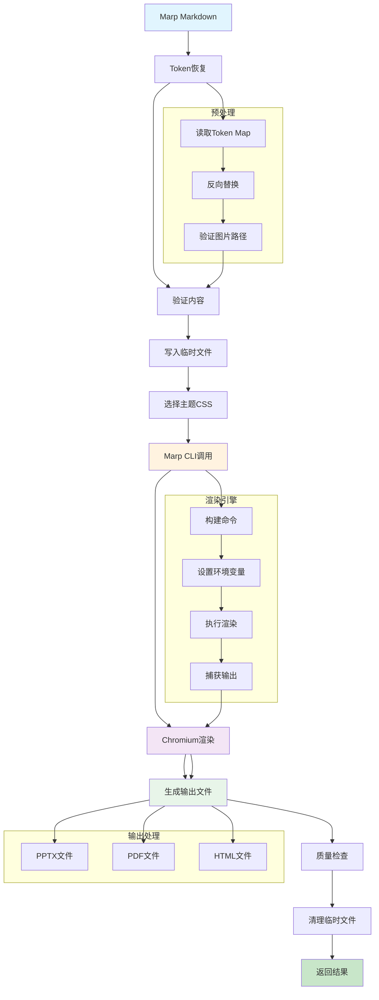
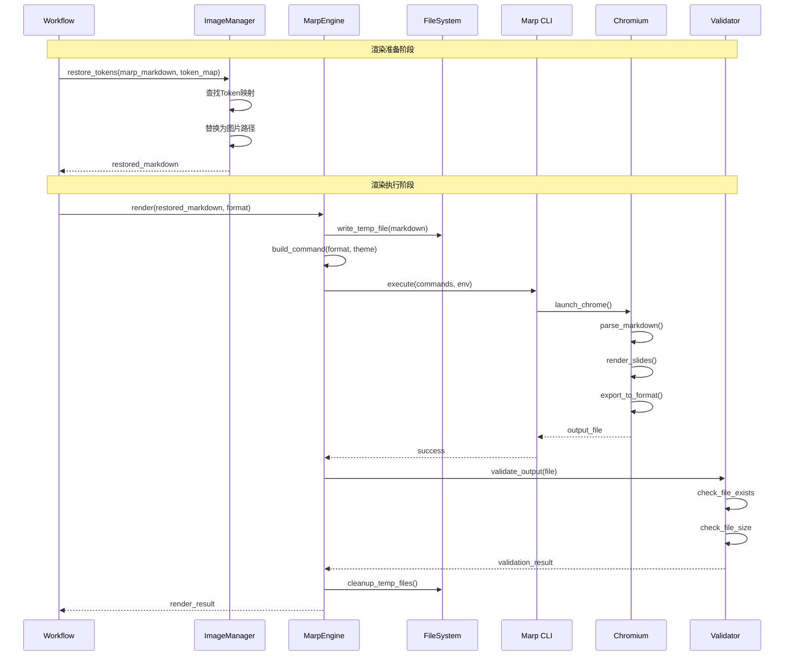
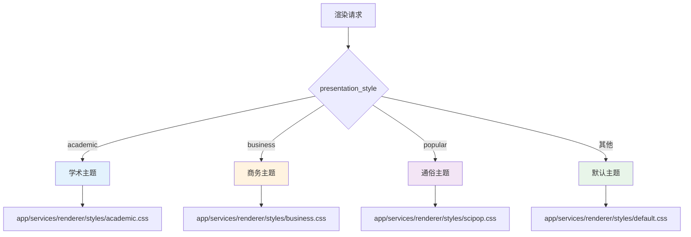
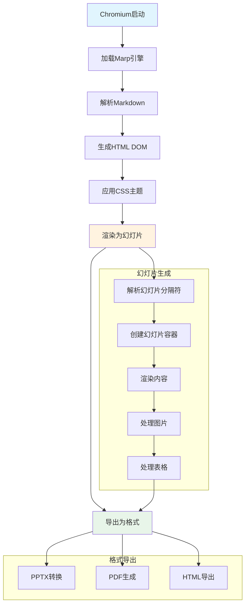
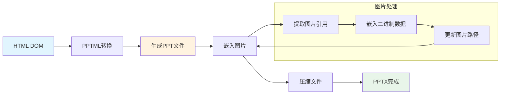
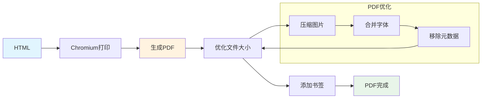
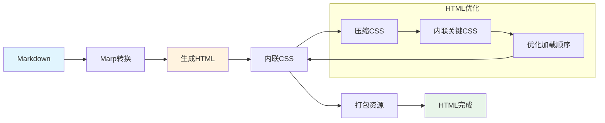
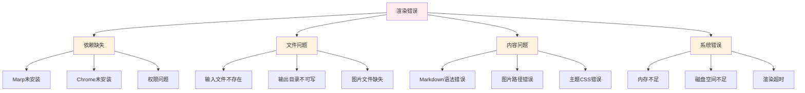
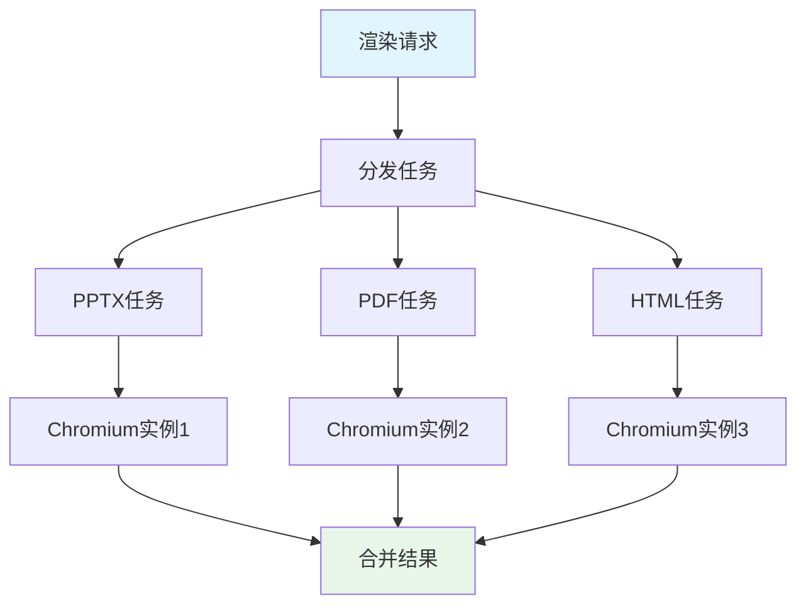

# 渲染数据流

## 概述
展示从Markdown到演示文稿输出的完整渲染流程。



## 详细渲染流程



## 预处理阶段

### 1. Token恢复
```python
def prepare_markdown_for_rendering(
    marp_markdown: str,
    image_token_map: dict,
    output_dir: Path
) -> tuple[Path, str]:
    """准备渲染用的Markdown"""
    # 1. 恢复Token
    if image_token_map:
        image_manager = ImageManager(output_dir.parent)
        restored_markdown = image_manager.restore_tokens_to_markdown_enhanced(
            tokenized_content=marp_markdown,
            token_map=image_token_map,
            output_format='marp'
        )
    else:
        restored_markdown = marp_markdown

    # 2. 验证图片路径
    validate_image_paths(restored_markdown)

    # 3. 写入临时文件
    temp_md = output_dir / f"presentation_{int(time.time())}.md"
    temp_md.write_text(restored_markdown, encoding='utf-8')

    return temp_md, restored_markdown

def validate_image_paths(markdown: str):
    """验证Markdown中的图片路径"""
    image_pattern = re.compile(r'!\[.*?\]\((.*?)\)')
    for match in image_pattern.finditer(markdown):
        img_path = match.group(1)
        if not Path(img_path).exists():
            logger.warning(f"Image not found: {img_path}")
            # 可以使用默认占位图
```

### 2. 主题选择


```python
def select_theme_css(presentation_style: str, project_root: Path) -> Path:
    """选择主题CSS"""
    theme_map = {
        "academic": "academic.css",
        "business": "business.css",
        "popular": "scipop.css",
    }

    theme_file = theme_map.get(presentation_style, "default.css")
    theme_path = project_root / "app" / "services" / "renderer" / "styles" / theme_file

    if not theme_path.exists():
        logger.warning(f"Theme {theme_file} not found, using default")
        theme_path = project_root / "app" / "services" / "renderer" / "styles" / "default.css"

    return theme_path
```

## 渲染引擎阶段

### Marp CLI调用
```python
class MarpEngine:
    """Marp渲染引擎"""

    def __init__(self, project_root: Path | None = None):
        self.project_root = project_root or Path.cwd()
        self._marp_bin = self._find_marp_binary()
        self._chrome_path = self._find_chrome_binary()

    def render(
        self,
        input_md: Path,
        output_path: Path,
        format: str = "pptx",
        theme_css: Path | None = None
    ) -> bool:
        """执行渲染"""
        # 1. 构建命令
        cmd = self._build_command(input_md, output_path, format, theme_css)

        # 2. 设置环境
        env = os.environ.copy()
        env["CHROME_PATH"] = self._chrome_path

        # 3. 执行渲染
        try:
            result = subprocess.run(
                cmd,
                env=env,
                check=True,
                capture_output=True,
                text=True,
                timeout=300
            )

            logger.info(f"Rendering completed: {output_path}")
            return True

        except subprocess.CalledProcessError as e:
            logger.error(f"Marp rendering failed: {e.stderr}")
            return False
        except subprocess.TimeoutExpired:
            logger.error("Rendering timeout")
            return False

    def _build_command(
        self,
        input_md: Path,
        output_path: Path,
        format: str,
        theme_css: Path | None
    ) -> list[str]:
        """构建Marp命令"""
        cmd = [
            str(self._marp_bin),
            str(input_md),
            "--output", str(output_path.with_suffix(f".{format}")),
        ]

        # 添加主题
        if theme_css:
            cmd.extend(["--theme-set", str(theme_css)])

        # 添加标志
        cmd.append("--allow-local-files")
        cmd.extend([f"--{format}"])

        return cmd
```

### Chromium渲染引擎


## 多格式输出

### 1. PPTX生成


### 2. PDF生成


### 3. HTML生成


### 多格式渲染代码
```python
def render_multiple_formats(
    input_md: Path,
    output_base: Path,
    formats: list[str],
    theme_css: Path
) -> dict[str, bool]:
    """多格式渲染"""
    results = {}

    for fmt in formats:
        output_path = output_base

        logger.info(f"Rendering {fmt.upper()}...")
        success = render(
            input_md=input_md,
            output_path=output_path,
            format=fmt,
            theme_css=theme_css
        )

        results[fmt] = success

        if success:
            logger.info(f"✅ {fmt.upper()} rendered successfully")
        else:
            logger.error(f"❌ {fmt.upper()} rendering failed")

    return results
```

## 错误处理

### 常见错误类型


### 错误处理代码
```python
def render_with_error_handling(
    input_md: Path,
    output_path: Path,
    format: str,
    theme_css: Path | None
) -> tuple[bool, str]:
    """带错误处理的渲染"""
    try:
        # 1. 检查依赖
        if not check_dependencies():
            return False, "Missing dependencies (Marp or Chrome)"

        # 2. 检查输入文件
        if not input_md.exists():
            return False, f"Input file not found: {input_md}"

        # 3. 检查输出目录
        output_path.parent.mkdir(parents=True, exist_ok=True)
        if not os.access(output_path.parent, os.W_OK):
            return False, f"Output directory not writable: {output_path.parent}"

        # 4. 执行渲染
        engine = MarpEngine()
        success = engine.render(input_md, output_path, format, theme_css)

        if success:
            # 5. 验证输出
            if not output_path.exists():
                return False, "Output file not generated"

            if output_path.stat().st_size == 0:
                return False, "Output file is empty"

            return True, "Success"

        else:
            return False, "Marp rendering failed"

    except FileNotFoundError as e:
        return False, f"File not found: {e}"
    except PermissionError as e:
        return False, f"Permission denied: {e}"
    except subprocess.TimeoutExpired:
        return False, "Rendering timeout (300s)"
    except Exception as e:
        logger.error(f"Rendering exception: {e}", exc_info=True)
        return False, f"Unexpected error: {e}"
```

## 性能优化

### 1. 并行渲染


```python
async def render_parallel(
    input_md: Path,
    output_base: Path,
    formats: list[str],
    theme_css: Path
) -> dict[str, bool]:
    """并行渲染多格式"""
    semaphore = asyncio.Semaphore(3)  # 限制并发数

    async def render_single(fmt: str):
        async with semaphore:
            output_path = output_base
            return await asyncio.to_thread(
                render,
                input_md,
                output_path,
                fmt,
                theme_css
            )

    tasks = [render_single(fmt) for fmt in formats]
    results = await asyncio.gather(*tasks)

    return {fmt: success for fmt, success in zip(formats, results)}
```

### 2. 缓存机制
```python
from functools import lru_cache

@lru_cache(maxsize=32)
def get_cached_render(
    content_hash: str,
    format: str,
    theme: str
) -> tuple[bool, str]:
    """缓存渲染结果"""
    # 检查缓存
    cache_key = f"{content_hash}_{format}_{theme}"
    cached_result = load_from_cache(cache_key)

    if cached_result:
        return cached_result

    # 执行渲染
    result = render_actual(content_hash, format, theme)

    # 保存到缓存
    save_to_cache(cache_key, result)

    return result
```

### 3. 增量渲染
```python
def should_incremental_render(
    current_md: str,
    cached_md: str,
    output_file: Path
) -> bool:
    """判断是否需要增量渲染"""
    # 检查内容是否变化
    if current_md != cached_md:
        return False

    # 检查输出文件是否存在且较新
    if output_file.exists():
        output_mtime = output_file.stat().st_mtime
        cache_mtime = get_cache_mtime(current_md)

        return output_mtime > cache_mtime

    return False
```

## 质量保证

### 1. 输出验证
```python
def validate_output(output_file: Path, format: str) -> tuple[bool, list[str]]:
    """验证输出文件质量"""
    errors = []

    # 检查文件存在
    if not output_file.exists():
        errors.append(f"Output file not found: {output_file}")
        return False, errors

    # 检查文件大小
    file_size = output_file.stat().st_size
    if file_size < 1024:  # 小于1KB
        errors.append(f"Output file too small: {file_size} bytes")

    # 格式特定检查
    if format == "pptx":
        errors.extend(validate_pptx(output_file))
    elif format == "pdf":
        errors.extend(validate_pdf(output_file))
    elif format == "html":
        errors.extend(validate_html(output_file))

    return len(errors) == 0, errors

def validate_pptx(file_path: Path) -> list[str]:
    """验证PPTX文件"""
    errors = []
    # 检查ZIP结构
    try:
        with zipfile.ZipFile(file_path, 'r') as zip_file:
            # 检查必需文件
            required_files = [
                '[Content_Types].xml',
                '_rels/.rels',
                'ppt/presentation.xml'
            ]
            for req_file in required_files:
                if req_file not in zip_file.namelist():
                    errors.append(f"Missing required file in PPTX: {req_file}")
    except zipfile.BadZipFile:
        errors.append("Invalid PPTX file (bad ZIP)")

    return errors
```

### 2. 视觉对比
```python
def compare_rendered_outputs(
    current_output: Path,
    baseline_output: Path,
    format: str
) -> dict[str, float]:
    """比较渲染输出质量"""
    metrics = {}

    if format == "pptx":
        metrics["slide_count"] = compare_slide_count(current_output, baseline_output)
        metrics["image_count"] = compare_image_count(current_output, baseline_output)
        metrics["file_size_ratio"] = compare_file_size(current_output, baseline_output)

    elif format == "pdf":
        metrics["page_count"] = compare_page_count(current_output, baseline_output)
        metrics["text_content"] = compare_text_content(current_output, baseline_output)

    return metrics
```

## 监控指标

| 指标 | 说明 | 计算方式 | 目标值 |
|------|------|----------|--------|
| 渲染成功率 | 成功渲染比例 | 成功数/总数 | > 95% |
| 平均渲染时间 | 渲染耗时 | Σ渲染时间/渲染次数 | < 30秒 |
| 输出文件大小 | 生成文件大小 | 文件字节数 | < 100MB |
| 图片完整率 | 图片显示比例 | 成功显示图片/总图片 | > 95% |
| 格式兼容性 | 输出格式正确性 | 正确格式文件/总数 | > 98% |
| 重试率 | 需要重试的比例 | 重试次数/总数 | < 5% |
| 并发性能 | 并行渲染效率 | 并行耗时/串行耗时 | < 0.5 |
