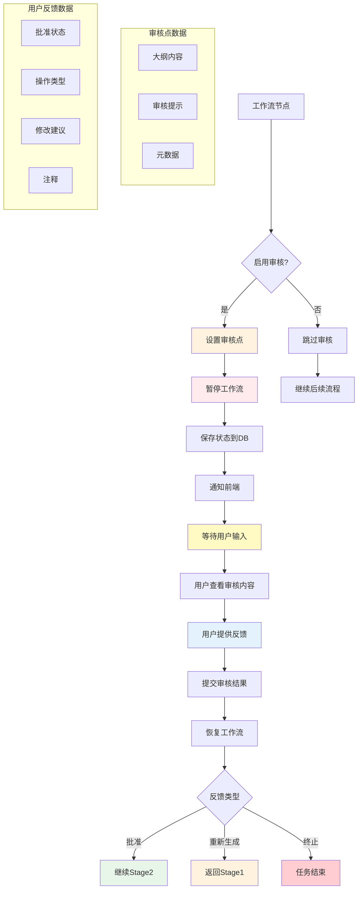
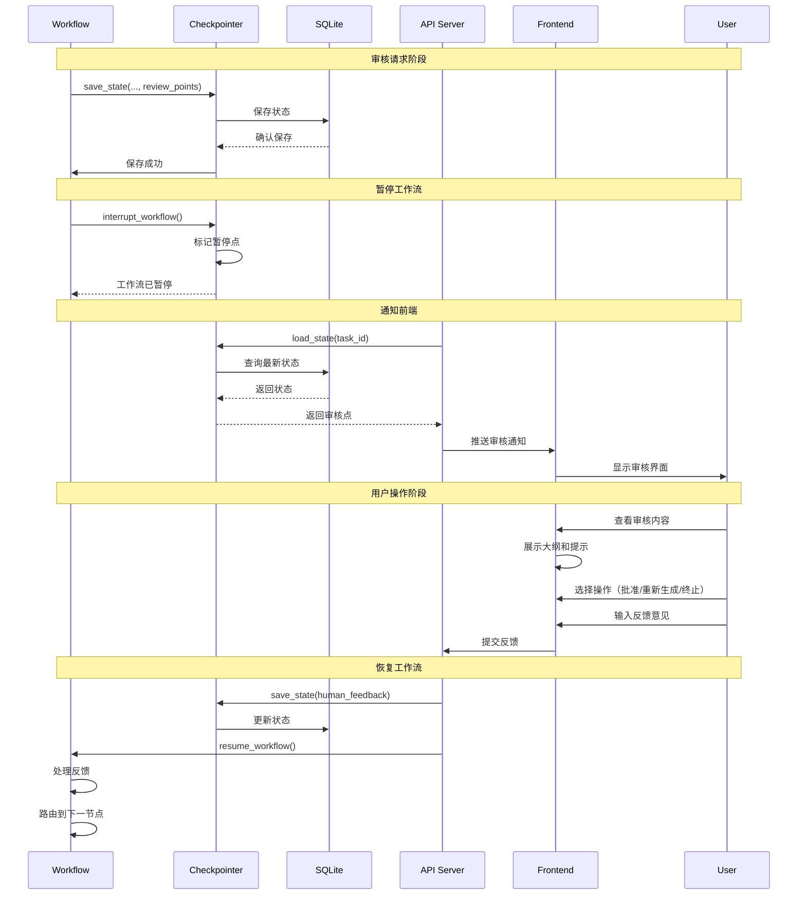
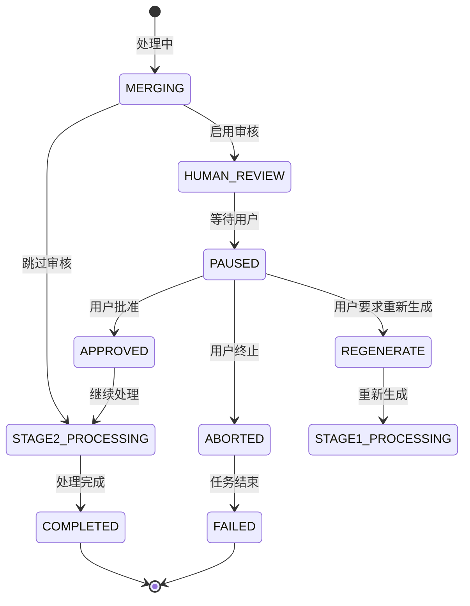

# 人机交互数据流

## 概述
展示HITL（Human-in-the-Loop）人机交互流程的完整数据流动。



## 详细交互流程



## 审核点设置

### 审核点数据结构
```python
@dataclass
class ReviewPoint:
    """审核点"""
    type: str          # 审核类型：outline, content, style
    node: str          # 触发节点：merge_outlines
    content: str       # 审核内容：大纲Markdown
    prompt: str        # 审核提示
    timestamp: str     # 创建时间
    metadata: dict     # 额外元数据

    def to_dict(self) -> dict:
        return {
            "type": self.type,
            "node": self.node,
            "content": self.content,
            "prompt": self.prompt,
            "timestamp": self.timestamp,
            "metadata": self.metadata,
        }

    @classmethod
    def from_dict(cls, data: dict) -> 'ReviewPoint':
        return cls(**data)
```

### 创建审核点
```python
def create_review_point(
    state: WorkflowState,
    review_type: str = "outline",
    node_name: str = "merge_outlines"
) -> ReviewPoint:
    """创建审核点"""
    # 获取审核内容
    if review_type == "outline":
        content = state.get("merged_outline", "")
        prompt = """请审核这个演示文稿大纲：

1. 结构是否清晰合理？
2. 内容是否完整？
3. 是否符合学术演示标准？

您可以：
- 点击"批准"继续生成
- 点击"重新生成"并提供修改建议
- 点击"终止"结束任务
"""
    else:
        content = state.get("marp_markdown", "")
        prompt = "请审核这个演示文稿内容"

    review_point = ReviewPoint(
        type=review_type,
        node=node_name,
        content=content,
        prompt=prompt,
        timestamp=datetime.now().isoformat(),
        metadata={
            "chunk_count": state.get("chunks_count", 0),
            "stage1_completed": state.get("stage1_completed", 0),
            "presentation_style": state.get("presentation_style"),
        }
    )

    return review_point
```

## 审核界面设计

### 前端审核组件
```typescript
interface ReviewPoint {
  type: string;
  node: string;
  content: string;
  prompt: string;
  timestamp: string;
  metadata: Record<string, any>;
}

interface HumanReviewProps {
  taskId: string;
  reviewPoint: ReviewPoint;
  onSubmit: (feedback: HumanFeedback) => void;
}

export const HumanReview: React.FC<HumanReviewProps> = ({
  taskId,
  reviewPoint,
  onSubmit
}) => {
  const [approved, setApproved] = useState(false);
  const [action, setAction] = useState<'approve' | 'regenerate' | 'abort'>('approve');
  const [comments, setComments] = useState('');

  const handleSubmit = () => {
    onSubmit({
      taskId,
      approved,
      action,
      comments,
      timestamp: new Date().toISOString()
    });
  };

  return (
    <div className="review-container">
      <h2>演示文稿审核</h2>

      {/* 审核内容展示 */}
      <div className="content-preview">
        <h3>审核内容</h3>
        <pre>{reviewPoint.content}</pre>
      </div>

      {/* 审核提示 */}
      <div className="review-prompt">
        <h3>审核提示</h3>
        <p>{reviewPoint.prompt}</p>
      </div>

      {/* 操作选择 */}
      <div className="action-selector">
        <label>
          <input
            type="radio"
            name="action"
            value="approve"
            checked={action === 'approve'}
            onChange={() => setAction('approve')}
          />
          ✅ 批准通过
        </label>

        <label>
          <input
            type="radio"
            name="action"
            value="regenerate"
            checked={action === 'regenerate'}
            onChange={() => setAction('regenerate')}
          />
          🔄 重新生成
        </label>

        <label>
          <input
            type="radio"
            name="action"
            value="abort"
            checked={action === 'abort'}
            onChange={() => setAction('abort')}
          />
          ⏹️ 终止任务
        </label>
      </div>

      {/* 反馈意见 */}
      <div className="feedback-form">
        <label>
          反馈意见（可选）：
          <textarea
            value={comments}
            onChange={(e) => setComments(e.target.value)}
            placeholder="请提供修改建议或意见..."
            rows={4}
          />
        </label>
      </div>

      {/* 提交按钮 */}
      <button onClick={handleSubmit}>
        提交审核
      </button>
    </div>
  );
};
```

## 反馈处理

### 反馈数据结构
```python
@dataclass
class HumanFeedback:
    """人工反馈"""
    task_id: str
    approved: bool
    action: str          # approve, regenerate, abort
    comments: str        # 用户意见
    modifications: dict  # 具体修改
    timestamp: str
    user_id: str         # 审核用户ID

    def to_dict(self) -> dict:
        return {
            "task_id": self.task_id,
            "approved": self.approved,
            "action": self.action,
            "comments": self.comments,
            "modifications": self.modifications,
            "timestamp": self.timestamp,
            "user_id": self.user_id,
        }
```

### 反馈提交API
```python
@router.post("/tasks/{task_id}/human-feedback")
async def submit_human_feedback(
    task_id: str,
    feedback: HumanFeedbackRequest,
    background_tasks: BackgroundTasks
):
    """提交人工审核反馈"""
    checkpointer = get_checkpointer()
    state = checkpointer.load_state(task_id)

    if not state:
        raise HTTPException(status_code=404, detail=f"Task not found: {task_id}")

    if state.get("status") != TaskStatus.HUMAN_REVIEW.value:
        raise HTTPException(
            status_code=400,
            detail=f"Task is not in review state. Current status: {state.get('status')}"
        )

    # 验证反馈
    if feedback.action not in ["approve", "regenerate", "abort"]:
        raise HTTPException(
            status_code=400,
            detail=f"Invalid action: {feedback.action}"
        )

    # 准备反馈数据
    feedback_dict = {
        "approved": feedback.approved,
        "action": feedback.action,
        "comments": feedback.comments,
        "modifications": feedback.modifications,
        "timestamp": datetime.now().isoformat(),
    }

    # 立即更新状态防止竞态
    if feedback.approved:
        new_status = TaskStatus.STAGE2_PROCESSING.value
        current_step = "审核通过，准备进入Stage 2"
    elif feedback.action == "regenerate":
        new_status = TaskStatus.STAGE1_PROCESSING.value
        current_step = "准备重新生成"
    elif feedback.action == "abort":
        new_status = TaskStatus.FAILED.value
        current_step = "任务被用户终止"
    else:
        new_status = TaskStatus.STAGE2_PROCESSING.value
        current_step = "处理中"

    state["status"] = new_status
    state["needs_human_review"] = False
    state["current_step"] = current_step
    state["human_feedback"] = feedback_dict
    state["updated_at"] = datetime.now().isoformat()

    checkpointer.save_state(task_id, state, "feedback_received")

    # 恢复工作流
    background_tasks.add_task(resume_workflow, task_id, feedback_dict)

    return {
        "status": "success",
        "message": "Feedback submitted, workflow resuming",
        "task_id": task_id,
    }
```

## 反馈处理逻辑

### 审核后路由
```python
def route_after_feedback(state: WorkflowState) -> Literal["stage1", "stage2", "end"]:
    """基于反馈路由"""
    feedback = state.get("human_feedback", {})
    action = feedback.get("action", "approve")
    approved = feedback.get("approved", False)

    if action == "approve" or approved:
        return "stage2"
    elif action == "regenerate":
        return "stage1"
    else:
        return "end"
```

### 反馈处理节点
```python
def node_process_feedback(state: WorkflowState) -> WorkflowState:
    """处理人工反馈"""
    feedback = state.get("human_feedback", {})

    if feedback.get("approved"):
        # 审核通过
        return {
            **state,
            "status": TaskStatus.STAGE2_PROCESSING.value,
            "approved": True,
            "needs_human_review": False,
            "review_points": [],
            "current_step": "审核通过，进入Stage 2",
            "progress_percentage": 60.0,
        }

    elif feedback.get("action") == "regenerate":
        # 重新生成
        return {
            **state,
            "status": TaskStatus.STAGE1_PROCESSING.value,
            "approved": False,
            "needs_human_review": False,
            "review_points": [],
            "current_chunk_index": 0,
            "stage1_results": [],
            "stage1_completed": 0,
            "user_modifications": feedback.get("comments", ""),
            "current_step": "根据反馈重新生成大纲",
            "progress_percentage": 20.0,
        }

    elif feedback.get("action") == "abort":
        # 终止任务
        return {
            **state,
            "status": TaskStatus.FAILED.value,
            "approved": False,
            "error_message": f"Task aborted by user. Reason: {feedback.get('comments', 'No reason')}",
            "current_step": "任务被用户终止",
        }

    else:
        # 未知操作
        return {
            **state,
            "status": TaskStatus.FAILED.value,
            "error_message": f"Unknown feedback action: {feedback.get('action')}",
        }
```

## 状态管理

### 审核状态流转


### 状态字段更新
```python
def update_state_for_review(state: WorkflowState, feedback: dict) -> WorkflowState:
    """更新审核相关状态"""
    updates = {
        "human_feedback": feedback,
        "updated_at": datetime.now().isoformat(),
    }

    # 添加执行日志
    log_entry = {
        "timestamp": datetime.now().isoformat(),
        "event": "human_feedback_received",
        "approved": feedback.get("approved"),
        "action": feedback.get("action"),
        "has_comments": bool(feedback.get("comments")),
    }
    updates["execution_log"] = state.get("execution_log", []) + [log_entry]

    return {**state, **updates}
```

## 审核历史

### 审核记录结构
```python
@dataclass
class ReviewRecord:
    """审核记录"""
    review_id: str
    task_id: str
    timestamp: str
    review_type: str
    content: str
    feedback: HumanFeedback
    processing_time: float  # 处理耗时（秒）
    user_id: str
    ip_address: str

    def to_dict(self) -> dict:
        return {
            "review_id": self.review_id,
            "task_id": self.task_id,
            "timestamp": self.timestamp,
            "review_type": self.review_type,
            "content": self.content,
            "feedback": self.feedback.to_dict(),
            "processing_time": self.processing_time,
            "user_id": self.user_id,
            "ip_address": self.ip_address,
        }
```

### 审核历史查询
```python
@router.get("/tasks/{task_id}/review-history")
async def get_review_history(task_id: str):
    """获取审核历史"""
    checkpointer = get_checkpointer()
    state = checkpointer.load_state(task_id)

    if not state:
        raise HTTPException(status_code=404, detail="Task not found")

    # 提取审核相关日志
    review_logs = [
        log for log in state.get("execution_log", [])
        if "review" in log.get("event", "").lower()
    ]

    return {
        "task_id": task_id,
        "review_logs": review_logs,
        "total_reviews": len(review_logs),
    }
```

## 通知机制

### WebSocket通知
```python
from fastapi import WebSocket

class NotificationManager:
    """通知管理器"""

    def __init__(self):
        self.connections: dict[str, WebSocket] = {}

    async def notify_review_required(self, task_id: str, review_point: ReviewPoint):
        """通知需要审核"""
        if task_id in self.connections:
            ws = self.connections[task_id]
            await ws.send_json({
                "type": "review_required",
                "task_id": task_id,
                "review_point": review_point.to_dict(),
            })

    async def notify_review_submitted(self, task_id: str, feedback: dict):
        """通知审核已提交"""
        if task_id in self.connections:
            ws = self.connections[task_id]
            await ws.send_json({
                "type": "review_submitted",
                "task_id": task_id,
                "feedback": feedback,
            })

# 使用示例
@app.websocket("/ws/{task_id}")
async def websocket_endpoint(websocket: WebSocket, task_id: str):
    await websocket.accept()
    notification_manager.connections[task_id] = websocket

    try:
        while True:
            await websocket.receive_text()
    except WebSocketDisconnect:
        del notification_manager.connections[task_id]
```

## 审核统计分析

### 审核指标
```python
@dataclass
class ReviewMetrics:
    """审核指标"""
    total_reviews: int = 0
    approved_count: int = 0
    regenerate_count: int = 0
    aborted_count: int = 0
    avg_review_time: float = 0.0
    approval_rate: float = 0.0

    def calculate_metrics(self, review_records: list[ReviewRecord]):
        """计算审核指标"""
        if not review_records:
            return

        self.total_reviews = len(review_records)
        self.approved_count = sum(1 for r in review_records if r.feedback.approved)
        self.regenerate_count = sum(1 for r in review_records if r.feedback.action == "regenerate")
        self.aborted_count = sum(1 for r in review_records if r.feedback.action == "abort")

        self.approval_rate = self.approved_count / self.total_reviews if self.total_reviews > 0 else 0

        total_time = sum(r.processing_time for r in review_records)
        self.avg_review_time = total_time / self.total_reviews if self.total_reviews > 0 else 0
```

### 审核报告
```python
def generate_review_report(task_id: str) -> dict:
    """生成审核报告"""
    checkpointer = get_checkpointer()
    state = checkpointer.load_state(task_id)

    review_logs = [
        log for log in state.get("execution_log", [])
        if "review" in log.get("event", "").lower()
    ]

    metrics = ReviewMetrics()
    metrics.calculate_metrics(review_logs)

    return {
        "task_id": task_id,
        "metrics": {
            "total_reviews": metrics.total_reviews,
            "approval_rate": f"{metrics.approval_rate:.2%}",
            "avg_review_time_seconds": f"{metrics.avg_review_time:.2f}",
            "approved": metrics.approved_count,
            "regenerated": metrics.regenerate_count,
            "aborted": metrics.aborted_count,
        },
        "timeline": review_logs,
    }
```

## 性能优化

### 1. 审核点缓存
```python
@lru_cache(maxsize=128)
def get_cached_review_point(task_id: str) -> Optional[ReviewPoint]:
    """缓存审核点"""
    # 从缓存获取
    pass
```

### 2. 异步通知
```python
async def notify_frontend_async(task_id: str, event: str, data: dict):
    """异步通知前端"""
    asyncio.create_task(notify_frontend(task_id, event, data))
```

### 3. 状态压缩
```python
def compress_state_for_review(state: WorkflowState) -> WorkflowState:
    """压缩审核状态"""
    # 只保留必要字段
    compressed = {
        "task_id": state["task_id"],
        "status": state["status"],
        "review_points": state.get("review_points", []),
        "execution_log": state.get("execution_log", [])[-10:],  # 只保留最近10条
    }
    return compressed
```

## 监控指标

| 指标 | 说明 | 计算方式 | 目标值 |
|------|------|----------|--------|
| 审核率 | 启用审核的任务比例 | 审核任务数/总任务数 | 70% |
| 审核通过率 | 审核通过比例 | 通过数/审核数 | > 80% |
| 平均审核时间 | 用户审核耗时 | Σ审核耗时/审核次数 | < 5分钟 |
| 重新生成率 | 重新生成比例 | 重新生成数/审核数 | < 20% |
| 终止率 | 审核终止比例 | 终止数/审核数 | < 5% |
| 审核响应时间 | 通知到用户延迟 | 平均响应延迟 | < 1秒 |
| 审核完成率 | 审核后任务完成比例 | 完成数/审核数 | > 90% |
