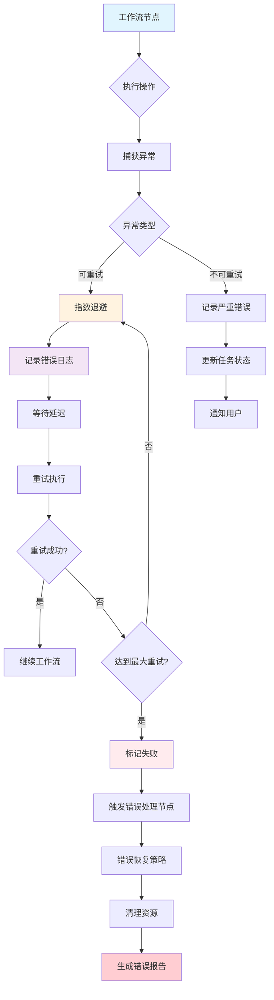
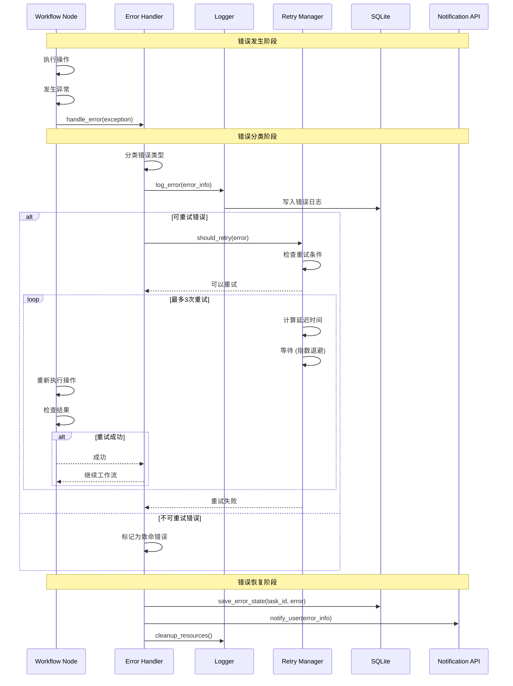
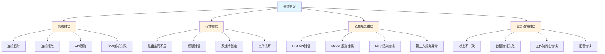
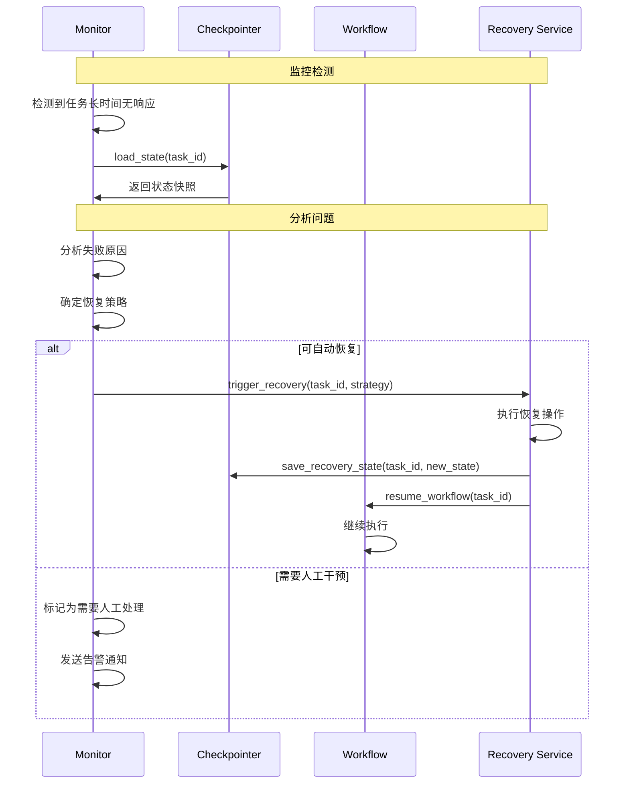

# 错误处理与重试数据流

## 概述
展示ScholarFlow系统中错误处理、重试机制和故障恢复的完整数据流。



## 详细错误处理流程



## 错误分类体系

### 1. 错误分类矩阵


### 2. 错误分类代码
```python
from enum import Enum
from typing import Optional, Type
import httpx

class ErrorType(Enum):
    """错误类型枚举"""
    NETWORK_ERROR = "network_error"
    STORAGE_ERROR = "storage_error"
    SERVICE_ERROR = "service_error"
    BUSINESS_ERROR = "business_error"
    VALIDATION_ERROR = "validation_error"
    SYSTEM_ERROR = "system_error"

class ErrorSeverity(Enum):
    """错误严重性"""
    LOW = "low"           # 可忽略，不影响流程
    MEDIUM = "medium"     # 需要重试
    HIGH = "high"         # 需要人工干预
    CRITICAL = "critical" # 任务终止

def classify_error(exception: Exception) -> tuple[ErrorType, ErrorSeverity, bool]:
    """分类错误并返回处理策略"""

    # 网络错误 - 通常可重试
    if isinstance(exception, (httpx.ConnectError, httpx.TimeoutException)):
        return ErrorType.NETWORK_ERROR, ErrorSeverity.MEDIUM, True

    if isinstance(exception, httpx.RemoteProtocolError):
        return ErrorType.NETWORK_ERROR, ErrorSeverity.MEDIUM, True

    # HTTP状态码错误
    if isinstance(exception, httpx.HTTPStatusError):
        status = exception.response.status_code

        # 4xx客户端错误 - 通常不可重试
        if 400 <= status < 500:
            if status in [429]:  # 限流 - 可重试
                return ErrorType.NETWORK_ERROR, ErrorSeverity.MEDIUM, True
            else:
                return ErrorType.BUSINESS_ERROR, ErrorSeverity.HIGH, False

        # 5xx服务端错误 - 可重试
        elif status >= 500:
            return ErrorType.SERVICE_ERROR, ErrorSeverity.MEDIUM, True

    # 存储错误
    if isinstance(exception, (PermissionError, OSError)):
        return ErrorType.STORAGE_ERROR, ErrorSeverity.HIGH, False

    # 业务逻辑错误
    if isinstance(exception, ValueError):
        return ErrorType.VALIDATION_ERROR, ErrorSeverity.HIGH, False

    # 系统错误
    if isinstance(exception, (MemoryError, SystemError)):
        return ErrorType.SYSTEM_ERROR, ErrorSeverity.CRITICAL, False

    # 未知错误 - 保守处理
    return ErrorType.SYSTEM_ERROR, ErrorSeverity.MEDIUM, True
```

## 重试策略实现

### 1. 指数退避算法
```python
import asyncio
import random
from functools import wraps

def retry(
    max_attempts: int = 3,
    base_delay: float = 1.0,
    max_delay: float = 60.0,
    exponential_base: float = 2.0,
    jitter: bool = True
):
    """重试装饰器"""
    def decorator(func):
        @wraps(func)
        async def wrapper(*args, **kwargs):
            last_exception = None

            for attempt in range(1, max_attempts + 1):
                try:
                    return await func(*args, **kwargs)

                except Exception as e:
                    last_exception = e

                    # 分类错误，判断是否可重试
                    error_type, severity, should_retry = classify_error(e)

                    if not should_retry:
                        logger.error(f"Non-retryable error in {func.__name__}: {e}")
                        raise

                    if attempt >= max_attempts:
                        logger.error(f"Max retries ({max_attempts}) exceeded for {func.__name__}")
                        raise

                    # 计算延迟时间（指数退避 + 抖动）
                    delay = min(
                        base_delay * (exponential_base ** (attempt - 1)),
                        max_delay
                    )

                    if jitter:
                        # 添加随机抖动，避免雪崩效应
                        jitter_range = delay * 0.1
                        delay = delay + random.uniform(-jitter_range, jitter_range)

                    logger.warning(
                        f"Attempt {attempt}/{max_attempts} failed for {func.__name__}. "
                        f"Retrying in {delay:.2f}s. Error: {e}"
                    )

                    await asyncio.sleep(delay)

            # 所有重试都失败了
            raise last_exception

        return wrapper
    return decorator

# 使用示例
@retry(max_attempts=3, base_delay=2.0)
async def call_llm_api(prompt: str):
    """调用LLM API，带重试"""
    async with httpx.AsyncClient() as client:
        response = await client.post(
            "https://api.example.com/v1/chat/completions",
            json={"prompt": prompt},
            timeout=10.0
        )
        response.raise_for_status()
        return response.json()
```

### 2. 重试条件判断
```python
def should_retry_error(
    error: Exception,
    attempt: int,
    max_attempts: int
) -> tuple[bool, str]:
    """判断是否应该重试错误"""

    # 检查重试次数
    if attempt >= max_attempts:
        return False, "Max attempts reached"

    # 获取错误分类
    error_type, severity, base_retry = classify_error(error)

    # 根据错误类型调整重试策略
    retry_strategies = {
        ErrorType.NETWORK_ERROR: {
            "max_attempts": 5,
            "base_delay": 1.0,
            "reason": "Network error, retryable"
        },
        ErrorType.SERVICE_ERROR: {
            "max_attempts": 3,
            "base_delay": 2.0,
            "reason": "Service error, retryable"
        },
        ErrorType.STORAGE_ERROR: {
            "max_attempts": 2,
            "base_delay": 5.0,
            "reason": "Storage error, limited retries"
        },
        ErrorType.VALIDATION_ERROR: {
            "max_attempts": 0,
            "base_delay": 0,
            "reason": "Validation error, not retryable"
        },
        ErrorType.BUSINESS_ERROR: {
            "max_attempts": 0,
            "base_delay": 0,
            "reason": "Business logic error, not retryable"
        },
        ErrorType.SYSTEM_ERROR: {
            "max_attempts": 1,
            "base_delay": 10.0,
            "reason": "System error, single retry"
        }
    }

    strategy = retry_strategies.get(error_type, {
        "max_attempts": 1,
        "base_delay": 1.0,
        "reason": "Unknown error type"
    })

    return attempt < strategy["max_attempts"], strategy["reason"]
```

## 错误处理节点

### 1. 错误处理工作流节点
```python
from app.graph.state import WorkflowState, TaskStatus

def node_error_handler(state: WorkflowState) -> WorkflowState:
    """错误处理节点"""
    error_info = state.get("last_error")
    task_id = state.get("task_id")

    if not error_info:
        logger.error("Error handler called without error info")
        return {
            **state,
            "status": TaskStatus.FAILED.value,
            "error_message": "Unknown error occurred",
        }

    error_type = error_info.get("type")
    error_message = error_info.get("message")
    severity = error_info.get("severity", "medium")

    # 记录错误
    logger.error(
        f"Task {task_id} failed with {error_type}: {error_message}"
    )

    # 根据错误严重性决定处理策略
    if severity == "critical":
        # 严重错误，终止任务
        return {
            **state,
            "status": TaskStatus.FAILED.value,
            "error_message": f"Critical error: {error_message}",
            "needs_manual_intervention": True,
            "failed_at": datetime.now().isoformat(),
        }

    elif severity == "high":
        # 高严重性错误，可能需要人工干预
        return {
            **state,
            "status": TaskStatus.FAILED.value,
            "error_message": f"High severity error: {error_message}",
            "can_retry": False,
            "failed_at": datetime.now().isoformat(),
        }

    else:
        # 中等严重性错误，尝试恢复
        return {
            **state,
            "status": TaskStatus.PENDING.value,  # 重置为待处理
            "error_message": f"Recoverable error: {error_message}",
            "retry_count": state.get("retry_count", 0) + 1,
            "last_recovery_attempt": datetime.now().isoformat(),
        }
```

### 2. 错误恢复策略
```python
def apply_error_recovery_strategy(
    state: WorkflowState,
    error_info: dict
) -> dict:
    """应用错误恢复策略"""

    error_type = error_info.get("type")
    context = error_info.get("context", {})

    recovery_strategies = {
        "llm_api_error": recover_from_llm_error,
        "pdf_parsing_error": recover_from_parsing_error,
        "rendering_error": recover_from_rendering_error,
        "storage_error": recover_from_storage_error,
    }

    recovery_func = recovery_strategies.get(error_type)

    if recovery_func:
        return recovery_func(state, context)
    else:
        # 默认恢复策略
        return default_recovery_strategy(state, error_info)

def recover_from_llm_error(state: dict, context: dict) -> dict:
    """LLM错误恢复策略"""
    # 1. 尝试切换LLM提供商
    if context.get("provider") == "deepseek":
        logger.info("Switching to OpenAI provider")
        return {
            **state,
            "llm_provider": "openai",
            "retry_reason": "Switched LLM provider",
        }

    # 2. 降低temperature
    current_temp = state.get("llm_temperature", 0.7)
    if current_temp > 0.3:
        logger.info(f"Reducing temperature from {current_temp} to 0.3")
        return {
            **state,
            "llm_temperature": 0.3,
            "retry_reason": "Reduced temperature",
        }

    # 3. 减少token数量
    current_tokens = state.get("max_tokens", 4000)
    if current_tokens > 2000:
        logger.info(f"Reducing max_tokens from {current_tokens} to 2000")
        return {
            **state,
            "max_tokens": 2000,
            "retry_reason": "Reduced token count",
        }

    return state

def recover_from_parsing_error(state: dict, context: dict) -> dict:
    """PDF解析错误恢复策略"""
    # 1. 尝试备用解析方法
    pdf_path = state.get("pdf_path")

    logger.info(f"Attempting alternate parsing for {pdf_path}")

    return {
        **state,
        "parsing_method": "alternate",
        "retry_reason": "Using alternate parsing method",
    }

def recover_from_rendering_error(state: dict, context: dict) -> dict:
    """渲染错误恢复策略"""
    # 1. 简化渲染参数
    return {
        **state,
        "render_quality": "draft",
        "retry_reason": "Reduced render quality",
    }

def default_recovery_strategy(state: dict, error_info: dict) -> dict:
    """默认恢复策略"""
    return {
        **state,
        "status": "pending",
        "retry_reason": "General recovery attempt",
        "retry_count": state.get("retry_count", 0) + 1,
    }
```

## 错误日志记录

### 1. 结构化错误日志
```python
from datetime import datetime
from typing import Any, Dict
import json
import traceback

class ErrorLogger:
    """错误日志记录器"""

    def __init__(self, log_file: str = "errors.log"):
        self.log_file = log_file

    def log_error(
        self,
        error: Exception,
        context: Dict[str, Any],
        task_id: str,
        node_name: str,
        retry_count: int = 0
    ):
        """记录结构化错误"""

        error_entry = {
            "timestamp": datetime.now().isoformat(),
            "task_id": task_id,
            "node": node_name,
            "error_type": type(error).__name__,
            "error_message": str(error),
            "error_traceback": traceback.format_exc(),
            "retry_count": retry_count,
            "context": context,
            "system_info": {
                "python_version": sys.version,
                "platform": sys.platform,
            }
        }

        # 写入日志文件
        with open(self.log_file, "a", encoding="utf-8") as f:
            f.write(json.dumps(error_entry, ensure_ascii=False) + "\n")

        # 同时输出到标准日志
        logger.error(
            f"Task {task_id} error in {node_name}: {error}\n"
            f"Context: {context}\n"
            f"Traceback: {traceback.format_exc()}"
        )

# 使用示例
error_logger = ErrorLogger()

try:
    result = await some_operation()
except Exception as e:
    error_logger.log_error(
        error=e,
        context={"param1": "value1", "param2": "value2"},
        task_id=state["task_id"],
        node_name="stage1_process",
        retry_count=state.get("retry_count", 0)
    )
    raise
```

### 2. 错误聚合分析
```python
def analyze_error_patterns(log_file: str) -> Dict[str, Any]:
    """分析错误模式"""

    error_counts = {}
    error_by_task = {}

    with open(log_file, "r", encoding="utf-8") as f:
        for line in f:
            entry = json.loads(line)

            error_type = entry["error_type"]
            task_id = entry["task_id"]

            # 统计错误类型
            error_counts[error_type] = error_counts.get(error_type, 0) + 1

            # 统计每任务的错误
            if task_id not in error_by_task:
                error_by_task[task_id] = []
            error_by_task[task_id].append(error_type)

    # 找出最频繁的错误
    top_errors = sorted(
        error_counts.items(),
        key=lambda x: x[1],
        reverse=True
    )[:5]

    # 找出错误最多的任务
    task_error_counts = {
        task: len(errors)
        for task, errors in error_by_task.items()
    }
    problem_tasks = sorted(
        task_error_counts.items(),
        key=lambda x: x[1],
        reverse=True
    )[:5]

    return {
        "total_errors": sum(error_counts.values()),
        "unique_error_types": len(error_counts),
        "top_errors": top_errors,
        "problem_tasks": problem_tasks,
        "error_distribution": error_counts,
    }
```

## 故障恢复机制

### 1. 自动恢复流程


### 2. 恢复服务实现
```python
class RecoveryService:
    """故障恢复服务"""

    def __init__(self, checkpointer):
        self.checkpointer = checkpointer
        self.logger = logging.getLogger(__name__)

    async def attempt_recovery(
        self,
        task_id: str,
        max_recovery_attempts: int = 3
    ) -> tuple[bool, str]:
        """尝试恢复任务"""

        for attempt in range(1, max_recovery_attempts + 1):
            try:
                # 1. 加载任务状态
                state = self.checkpointer.load_state(task_id)

                if not state:
                    return False, "Task not found"

                # 2. 分析失败原因
                error_info = state.get("last_error")
                if not error_info:
                    return False, "No error information available"

                # 3. 应用恢复策略
                recovered_state = await self._apply_recovery_strategy(
                    state, error_info, attempt
                )

                # 4. 保存恢复后的状态
                self.checkpointer.save_state(
                    task_id,
                    recovered_state,
                    "recovery_attempt"
                )

                # 5. 验证恢复
                if await self._verify_recovery(recovered_state):
                    self.logger.info(f"Task {task_id} recovered successfully on attempt {attempt}")
                    return True, f"Recovered on attempt {attempt}"

                self.logger.warning(
                    f"Recovery attempt {attempt} for task {task_id} failed verification"
                )

            except Exception as e:
                self.logger.error(
                    f"Recovery attempt {attempt} failed for task {task_id}: {e}"
                )

        return False, f"Failed to recover after {max_recovery_attempts} attempts"

    async def _apply_recovery_strategy(
        self,
        state: dict,
        error_info: dict,
        attempt: int
    ) -> dict:
        """应用恢复策略"""

        error_type = error_info.get("type")

        # 根据错误类型选择策略
        if error_type == "llm_api_error":
            return self._recover_llm_error(state, attempt)
        elif error_type == "pdf_parsing_error":
            return self._recover_parsing_error(state, attempt)
        elif error_type == "timeout_error":
            return self._recover_timeout_error(state, attempt)
        else:
            return self._(state, attempt)

    defrecover_general_error _recover_llm_error(self, state: dict, attempt: int) -> dict:
        """LLM错误恢复"""
        # 尝试切换模型或降低参数
        return {
            **state,
            "status": "pending",
            "llm_temperature": min(0.3, state.get("llm_temperature", 0.7)),
            "max_tokens": min(2000, state.get("max_tokens", 4000)),
            "recovery_attempt": attempt,
            "last_recovery": datetime.now().isoformat(),
        }

    def _recover_parsing_error(self, state: dict, attempt: int) -> dict:
        """解析错误恢复"""
        return {
            **state,
            "status": "pending",
            "parsing_method": "fallback",
            "recovery_attempt": attempt,
        }

    def _recover_timeout_error(self, state: dict, attempt: int) -> dict:
        """超时错误恢复"""
        return {
            **state,
            "status": "pending",
            "timeout_multiplier": min(3.0, 1.5 ** attempt),
            "recovery_attempt": attempt,
        }

    def _recover_general_error(self, state: dict, attempt: int) -> dict:
        """通用错误恢复"""
        return {
            **state,
            "status": "pending",
            "recovery_attempt": attempt,
        }

    async def _verify_recovery(self, state: dict) -> bool:
        """验证恢复是否成功"""
        # 检查状态是否有效
        if not state.get("task_id"):
            return False

        # 检查必要字段是否存在
        required_fields = ["status", "updated_at"]
        for field in required_fields:
            if field not in state:
                return False

        return True
```

## 错误监控指标

### 1. 错误率计算
```python
@dataclass
class ErrorMetrics:
    """错误监控指标"""
    total_tasks: int = 0
    failed_tasks: int = 0
    recovered_tasks: int = 0
    error_types: Dict[str, int] = field(default_factory=dict)

    @property
    def failure_rate(self) -> float:
        """错误率"""
        if self.total_tasks == 0:
            return 0.0
        return self.failed_tasks / self.total_tasks

    @property
    def recovery_rate(self) -> float:
        """恢复率"""
        if self.failed_tasks == 0:
            return 0.0
        return self.recovered_tasks / self.failed_tasks

def calculate_error_metrics(task_logs: list[dict]) -> ErrorMetrics:
    """计算错误指标"""

    metrics = ErrorMetrics()

    for log in task_logs:
        metrics.total_tasks += 1

        if log.get("status") == "failed":
            metrics.failed_tasks += 1

            error_type = log.get("last_error", {}).get("type", "unknown")
            metrics.error_types[error_type] = (
                metrics.error_types.get(error_type, 0) + 1
            )

        if log.get("recovered", False):
            metrics.recovered_tasks += 1

    return metrics
```

### 2. 错误告警
```python
class ErrorAlertManager:
    """错误告警管理器"""

    def __init__(self, config: dict):
        self.thresholds = config.get("error_thresholds", {})
        self.notification_channels = config.get("notification_channels", [])

    async def check_and_alert(
        self,
        metrics: ErrorMetrics,
        time_window: str = "1h"
    ):
        """检查错误率并发送告警"""

        alerts = []

        # 检查错误率阈值
        if metrics.failure_rate > self.thresholds.get("failure_rate", 0.1):
            alerts.append({
                "level": "critical",
                "message": f"Error rate {metrics.failure_rate:.2%} exceeds threshold",
                "metric": "failure_rate",
                "value": metrics.failure_rate,
            })

        # 检查特定错误类型
        for error_type, count in metrics.error_types.items():
            threshold = self.thresholds.get(f"{error_type}_count", 10)
            if count > threshold:
                alerts.append({
                    "level": "warning",
                    "message": f"{error_type} errors ({count}) exceed threshold ({threshold})",
                    "metric": error_type,
                    "value": count,
                })

        # 发送告警
        for alert in alerts:
            await self._send_alert(alert, time_window)

    async def _send_alert(self, alert: dict, time_window: str):
        """发送告警"""
        for channel in self.notification_channels:
            if channel["type"] == "email":
                await self._send_email_alert(alert, channel)
            elif channel["type"] == "webhook":
                await self._send_webhook_alert(alert, channel)
```

## 性能优化

### 1. 错误缓存
```python
from functools import lru_cache

@lru_cache(maxsize=128)
def get_cached_error_classification(error_hash: str) -> tuple:
    """缓存错误分类结果"""
    # 根据错误哈希获取分类
    pass

def get_error_hash(error: Exception, context: dict) -> str:
    """计算错误哈希"""
    error_str = f"{type(error).__name__}:{str(error)}:{json.dumps(context)}"
    return hashlib.md5(error_str.encode()).hexdigest()
```

### 2. 异步错误处理
```python
async def handle_error_async(error: Exception, context: dict):
    """异步错误处理"""

    # 并行执行日志记录、告警、恢复等操作
    tasks = [
        log_error_async(error, context),
        check_alert_conditions(error, context),
        attempt_immediate_recovery(error, context),
    ]

    await asyncio.gather(*tasks, return_exceptions=True)
```

## 监控指标

| 指标 | 说明 | 计算方式 | 目标值 |
|------|------|----------|--------|
| 任务错误率 | 失败任务比例 | 失败数/总数 | < 5% |
| 错误恢复率 | 成功恢复比例 | 恢复数/失败数 | > 70% |
| 平均重试次数 | 平均重试次数 | Σ重试次数/任务数 | < 2次 |
| 错误分类分布 | 各错误类型占比 | COUNT(error_type)/总数 | 均衡 |
| 恢复成功率 | 最终恢复比例 | 恢复成功数/总数 | > 60% |
| 错误响应时间 | 错误处理延迟 | 平均处理时间 | < 1秒 |
| 告警及时性 | 告警发送延迟 | 平均告警延迟 | < 5秒 |
