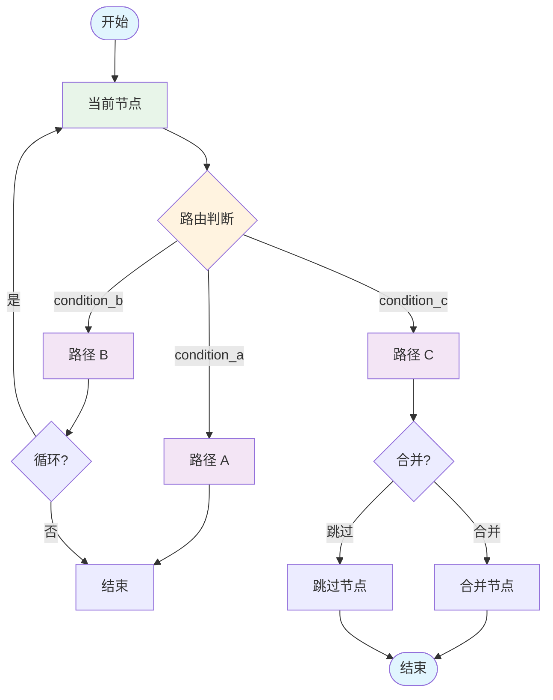
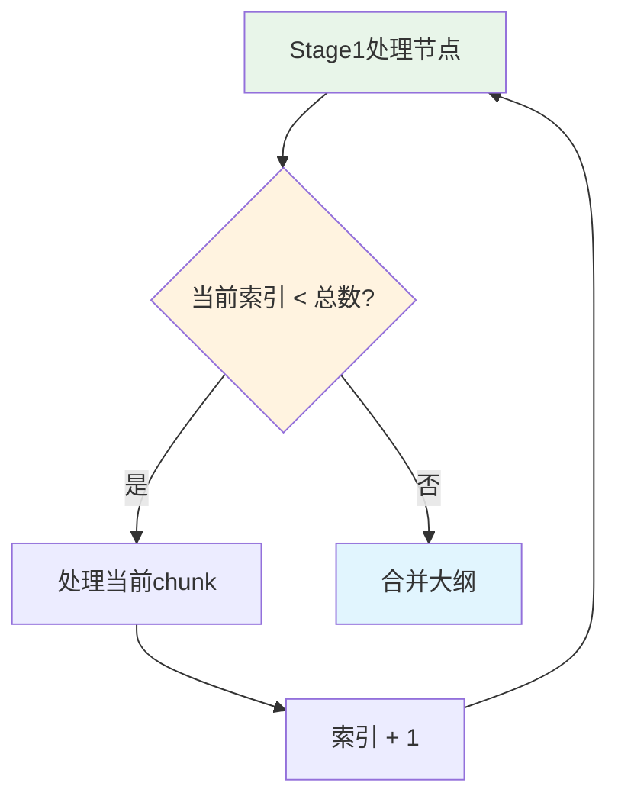
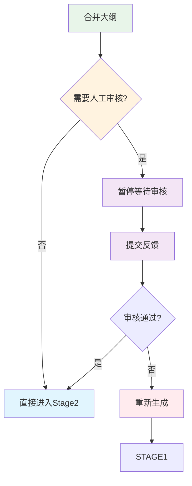
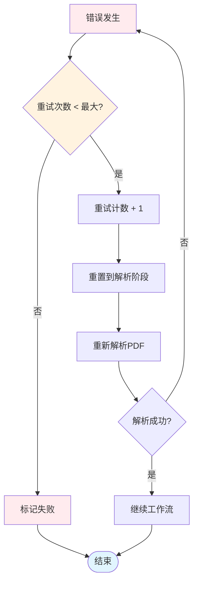

# 条件路由决策树

## Mermaid 图表



## ScholarFlow 实际路由决策

### 1. Stage1 循环路由



### 2. 合并后路由



### 3. 错误处理路由



## 路由函数实现

### 路由1: Stage1循环
```python
def route_after_stage1(state: WorkflowState) -> str:
    """Stage1处理后路由"""
    current_index = state.get("current_chunk_index", 0)
    total_chunks = state.get("chunks_count", 0)
    retry_count = state.get("retry_count", 0)

    # 检查是否需要重试
    if retry_count > 0 and current_index == 0:
        logger.info(f"重试Stage1，当前第 {current_index}/{total_chunks} 个chunk")
    else:
        logger.info(f"Stage1进度: {current_index}/{total_chunks}")

    # 决定路由
    if current_index < total_chunks:
        return "continue"  # 继续处理下一个chunk
    else:
        return "merge"     # 所有chunk处理完成，进入合并
```

### 路由2: 合并后路由
```python
def route_after_merge(state: WorkflowState) -> str:
    """合并大纲后路由"""
    needs_review = state.get("needs_human_review", False)
    enable_review = state.get("enable_human_review", True)

    # 决定是否需要人工审核
    if enable_review and needs_review:
        logger.info("进入人工审核阶段")
        return "human_review"
    else:
        logger.info("跳过人工审核，直接进入Stage2")
        return "stage2"
```

### 路由3: 反馈后路由
```python
def route_after_feedback(state: WorkflowState) -> str:
    """处理反馈后路由"""
    feedback = state.get("human_feedback", {})
    approved = feedback.get("approved", False)
    action = feedback.get("action", "continue")

    logger.info(f"收到反馈: approved={approved}, action={action}")

    if approved:
        logger.info("审核通过，继续处理")
        return "stage2"
    elif action == "regenerate":
        logger.info("要求重新生成，返回Stage1")
        return "stage1"
    else:
        logger.info("结束任务")
        return "end"
```

### 路由4: 错误处理路由
```python
def route_after_error(state: WorkflowState) -> str:
    """错误处理后路由"""
    retry_count = state.get("retry_count", 0)
    max_retries = state.get("max_retries", 3)
    error_message = state.get("error_message", "")

    logger.error(f"错误发生 (第{retry_count}次): {error_message}")

    if retry_count < max_retries:
        next_retry = retry_count + 1
        logger.warning(f"准备第 {next_retry} 次重试 (最多{max_retries}次)")
        return "retry"
    else:
        logger.error(f"超过最大重试次数({max_retries})，任务失败")
        return "end"
```

## 复杂路由示例

### 并行处理路由
```python
def route_parallel_processing(state: WorkflowState) -> str:
    """并行处理路由"""
    chunks = state.get("chunks", [])
    max_parallel = state.get("max_parallel_chunks", 5)
    current_batch = state.get("current_batch", 0)

    total_batches = (len(chunks) + max_parallel - 1) // max_parallel

    if current_batch < total_batches:
        logger.info(f"并行处理批次 {current_batch + 1}/{total_batches}")
        return "process_batch"
    else:
        logger.info("所有批次处理完成")
        return "merge_results"
```

### 动态路由
```python
def route_dynamic(state: WorkflowState) -> str:
    """动态路由决策"""
    # 基于多个条件决策
    conditions = {
        "has_error": state.get("error_message") is not None,
        "needs_review": state.get("needs_human_review", False),
        "is_large_file": state.get("file_size", 0) > 10 * 1024 * 1024,  # 10MB
        "is_complex": state.get("complexity_score", 0) > 0.8
    }

    # 优先级路由
    if conditions["has_error"]:
        return "handle_error"
    elif conditions["needs_review"]:
        return "human_review"
    elif conditions["is_large_file"]:
        return "chunk_optimization"
    elif conditions["is_complex"]:
        return "advanced_processing"
    else:
        return "standard_processing"
```

## 路由性能优化

### 缓存路由决策
```python
from functools import lru_cache

@lru_cache(maxsize=128)
def cached_route_decision(task_id: str, state_hash: str) -> str:
    """缓存路由决策结果"""
    # 从缓存加载状态
    state = load_cached_state(state_hash)

    # 执行路由逻辑
    return determine_route(state)
```

### 异步路由
```python
async def async_route_decision(state: WorkflowState) -> str:
    """异步路由决策"""
    # 并行检查多个条件
    tasks = [
        check_external_service(state),
        validate_data(state),
        fetch_user_preferences(state)
    ]

    results = await asyncio.gather(*tasks, return_exceptions=True)

    # 基于异步结果决策
    if all(results):
        return "continue"
    else:
        return "review"
```

## 路由测试

### 单元测试
```python
import pytest

def test_stage1_routing():
    """测试Stage1路由"""
    # 测试继续处理
    state1 = {"current_chunk_index": 2, "chunks_count": 5}
    assert route_after_stage1(state1) == "continue"

    # 测试合并
    state2 = {"current_chunk_index": 5, "chunks_count": 5}
    assert route_after_stage1(state2) == "merge"

def test_error_routing():
    """测试错误路由"""
    # 测试可以重试
    state1 = {"retry_count": 1, "max_retries": 3}
    assert route_after_error(state1) == "retry"

    # 测试超过最大重试
    state2 = {"retry_count": 3, "max_retries": 3}
    assert route_after_error(state2) == "end"
```

## 最佳实践

1. **清晰的路由逻辑**: 路由函数应该简单明了，易于理解
2. **日志记录**: 记录路由决策过程，便于调试
3. **优先级**: 定义清晰的路由优先级
4. **测试覆盖**: 为所有路由路径编写测试
5. **性能优化**: 缓存频繁的路由决策
6. **异常处理**: 优雅处理路由过程中的异常
