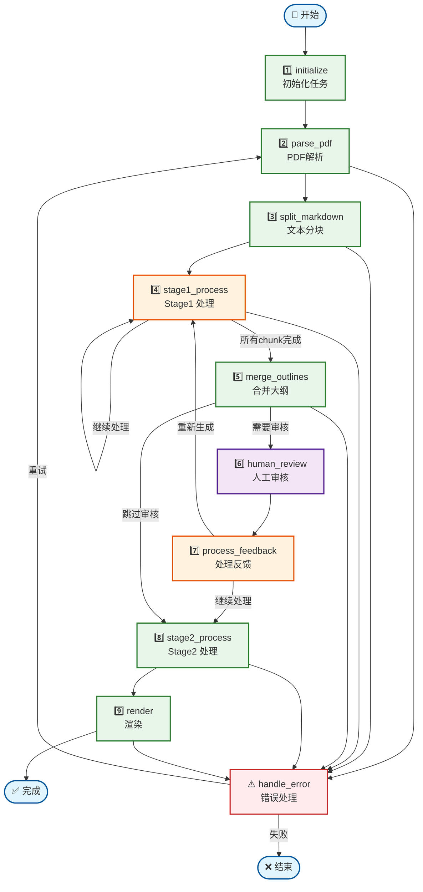

# LangGraph 完整工作流图

## Mermaid 图表



## 节点详细说明

### 1. initialize - 初始化节点

**职责**: 验证输入并创建初始状态

**输入**:
- task_id
- pdf_path
- presentation_style
- max_chars
- target_chunks

**处理逻辑**:
1. 验证 PDF 文件存在
2. 创建 WorkflowState
3. 初始化所有字段
4. 设置初始状态为 "initialized"

**输出状态**:
```python
{
    "status": "initialized",
    "progress_percentage": 10,
    "created_at": "2025-01-01T10:00:00"
}
```

### 2. parse_pdf - PDF解析节点

**职责**: 使用 MinerU 解析 PDF，提取 Markdown 和图片

**处理逻辑**:
1. 调用 MinerU API
2. 上传 PDF 文件
3. 轮询解析结果
4. 下载解析结果（Markdown + 图片）
5. **Token化图片引用**

**输出状态**:
```python
{
    "status": "pdf_parsed",
    "markdown_text": "...",
    "image_paths": ["images/..."],
    "tokenized_text": "...",
    "image_token_map": {...},
    "progress_percentage": 25
}
```

### 3. split_markdown - 文本分块节点

**职责**: 将 Markdown 文本分割为可处理的块

**处理逻辑**:
1. 解析 Markdown 结构（标题、段落）
2. 按语义分块
3. 控制块大小（max_chars）
4. 合并到目标数量（target_chunks）

**输出状态**:
```python
{
    "status": "text_split",
    "chunks": ["chunk1", "chunk2", ...],
    "chunks_count": 6,
    "progress_percentage": 40
}
```

### 4. stage1_process - Stage1处理节点

**职责**: 为每个文本块生成幻灯片大纲

**处理逻辑**:
1. 遍历 chunks
2. 并行调用 LLM 生成大纲
3. 每个块生成结构化大纲
4. 循环处理直到所有块完成

**输入状态更新**:
```python
{
    "current_chunk_index": 3,  # 推进索引
    "stage1_results": [...],   # 累积结果
}
```

**输出状态**:
```python
{
    "status": "stage1_completed",
    "stage1_results": [
        {"chunk_index": 0, "outline": "..."},
        {"chunk_index": 1, "outline": "..."},
        ...
    ],
    "progress_percentage": 65
}
```

### 5. merge_outlines - 合并大纲节点

**职责**: 合并所有 chunk 的大纲为统一结构

**处理逻辑**:
1. 接收所有 stage1_results
2. 按顺序合并大纲
3. 去重和优化结构
4. 生成统一大纲

**输出状态**:
```python
{
    "status": "outlines_merged",
    "merged_outline": "# 合并后的大纲\n...",
    "progress_percentage": 75
}
```

### 6. human_review - 人工审核节点

**职责**: 暂停工作流，等待人工审核

**处理逻辑**:
1. 设置 needs_human_review = true
2. **中断工作流执行**
3. 保存检查点
4. 等待外部调用 resume

**输出状态**:
```python
{
    "status": "human_review",
    "needs_human_review": true,
    "merged_outline": "...",
    "progress_percentage": 70
}
```

### 7. process_feedback - 处理反馈节点

**职责**: 处理人工反馈，决定后续路由

**处理逻辑**:
1. 接收 human_feedback
2. 解析反馈内容
3. 决定路由路径：
   - approved: 继续 Stage2
   - regenerate: 返回 Stage1
   - modifications: 应用修改

**输出状态**:
```python
{
    "status": "feedback_processed",
    "approved": true,
    "action": "continue",  # 或 "regenerate"
    "progress_percentage": 75
}
```

### 8. stage2_process - Stage2处理节点

**职责**: 将大纲转换为 Marp Markdown

**处理逻辑**:
1. 接收合并后的大纲
2. 调用 LLM 转换为 Marp 格式
3. 应用演示风格（academic/popular/business）
4. **恢复图片 token**

**输出状态**:
```python
{
    "status": "stage2_completed",
    "marp_markdown": "---<br>marp: true<br>---<br># 标题<br>...",
    "progress_percentage": 90
}
```

### 9. render - 渲染节点

**职责**: 使用 Marp CLI 生成最终演示文稿

**处理逻辑**:
1. 保存 Marp Markdown 到文件
2. 调用 Marp CLI 渲染
3. 生成 PPTX/PDF/HTML
4. 保存输出路径

**输出状态**:
```python
{
    "status": "completed",
    "output_path": "outputs/task-001.pptx",
    "output_format": "pptx",
    "progress_percentage": 100
}
```

### 10. handle_error - 错误处理节点

**职责**: 错误恢复和重试机制

**处理逻辑**:
1. 捕获节点错误
2. 检查重试次数
3. 如果可以重试 → 返回 parse_pdf
4. 如果超过最大重试 → 结束任务

**输出状态**:
```python
{
    "status": "failed",
    "error_message": "错误详情",
    "retry_count": 3
}
```

## 条件路由

### 路由1: Stage1循环
```python
def route_after_stage1(state):
    if state["current_chunk_index"] < state["chunks_count"]:
        return "continue"  # 继续处理
    else:
        return "merge"     # 合并大纲
```

### 路由2: 合并后路由
```python
def route_after_merge(state):
    if state.get("needs_human_review"):
        return "human_review"  # 需要审核
    else:
        return "stage2"        # 直接处理
```

### 路由3: 反馈后路由
```python
def route_after_feedback(state):
    if state.get("approved"):
        return "stage2"        # 审核通过
    else:
        return "stage1"        # 重新生成
```

### 路由4: 错误路由
```python
def route_after_error(state):
    if state.get("retry_count", 0) < state.get("max_retries", 3):
        return "retry"  # 可以重试
    else:
        return "end"    # 结束
```

## 执行流程

### 正常流程
```
开始 → 初始化 → PDF解析 → 文本分块 → Stage1处理(循环)
  ↓
合并大纲 → (人工审核) → Stage2处理 → 渲染 → 完成
```

### 错误流程
```
任意节点 → 错误处理 → 检查重试 → 重新解析 OR 结束
```

### 人工审核流程
```
合并大纲 → 审核暂停 → 提交反馈 → 继续处理 OR 重新生成
```

## 状态持久化

**保存时机**:
- 每个节点执行完成后
- 审核暂停前
- 错误发生前

**保存位置**:
- SQLite: `data/workflows/checkpoints.db`
- JSON: `data/workflows/intermediate/{task_id}/{task_id}.json`

**恢复机制**:
- 使用 thread_id 恢复状态
- 从中断点继续执行
- 保持状态一致性
